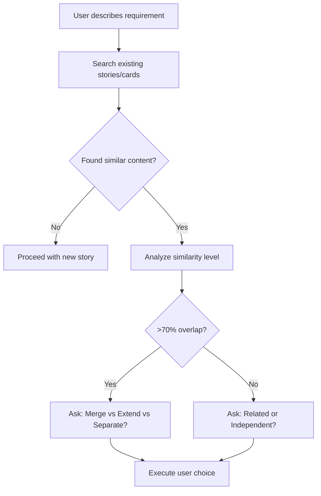

# AI Development Guide

## 🎯 QUICK NAVIGATION
- **New to project?** → [Project Foundations](#-project-foundations)
- **Need to implement?** → [The Core Pattern](#-the-core-pattern)
- **PRD vs Story vs Card?** → [Document Layer Decision Tree](#document-layer-decision-tree-prd-vs-story-vs-card)
- **Creating new story?** → [Duplicate Story Prevention](#duplicate-story-prevention-mandatory-before-creating-stories)
- **ALWAYS START HERE** → [Reality Check](#-reality-check)
- **Complex scenario?** → [Knowledge Graph Patterns](#-knowledge-graph-patterns)
- **Troubleshooting?** → [When Things Go Wrong](#-when-ai-process-goes-wrong)
- **Learning context?** → [Proven Patterns](#-proven-patterns--case-studies)
- **Step-by-step workflow?** → [Detailed Workflows](#-detailed-workflows)
- **🧠 AI WORKFLOW IMPROVEMENT** → [Experience-Based Learning](#-experience-based-learning)

---

## 🚀 THE CORE PATTERN (Essential - Read First)

### Request Classification (The Foundation)

**Check what exists first:**
- `docs/cards/` for existing work
- `node scripts/progress-report.js` for status
- `docs/stories/_index.yaml` for relationships

**"I want users to..."** → COMPLETE AUTONOMY WORKFLOW (Story → Cards → Code)
**"Implement card XYZ"** → TRADITIONAL WORKFLOW (Work with existing cards)

### Duplicate Story Prevention (Mandatory Before Creating Stories)

**CRITICAL: Before creating any new story, AI MUST check for duplicates to prevent redundant work.**

**When user describes new requirements:**

**AI Auto-Translation for Multi-Language Teams:**
- When user uses Chinese, AI automatically translates to English for search
- When user uses English, AI understands Chinese synonyms in docs
- No need for manual `aliases` field - AI handles translation dynamically
- Zero maintenance cost - AI adapts to any new terminology

```bash
# Example: User says "我想实现订单导出功能" (Chinese)
# AI automatically executes THREE-LAYER multi-language search:

# ========================================
# Layer 0: PRD Level (Product domain check)
# ========================================
grep -ri "订单.*导出\|订单.*分析" docs/prd/              # Chinese
grep -ri "order.*export\|order.*analytics" docs/prd/  # English
# Check if this feature is already defined in PRD as planned capability

# ========================================
# Layer 1: Story Level (User capability check)
# ========================================
grep -ri "订单.*导出\|订单.*下载" docs/stories/        # Chinese keywords
grep -ri "order.*export\|order.*download" docs/stories/  # AI-translated English
grep -ri "data.*export\|extract.*order" docs/stories/    # AI synonym expansion

# ========================================
# Layer 2: Card Level (Technical implementation check)
# ========================================
grep -r "GET\|POST\|PUT\|DELETE" docs/cards/*.md | grep -i "export\|download"
find docs/cards/ -name "*order*" -o -name "*export*"

# ========================================
# Layer 3: Code Level (Actual implementation check)
# ========================================
ls src/modules/ | grep -i "order\|export"
grep -r "router.get.*export\|router.post.*export" src/modules/*/router.ts

# ========================================
# Layer 4: Relationship metadata check
# ========================================
cat docs/stories/_index.yaml | grep -B 3 -A 3 -i "order\|export"
```

**AI Translation Examples:**
```
用户输入: "批量导入票务"
AI搜索: 批量.*导入 | bulk.*import | batch.*import | ticket.*import

用户输入: "订单统计报表"
AI搜索: 订单.*统计 | order.*statistic | order.*report | order.*analytics

用户输入: "支付回调"
AI搜索: 支付.*回调 | payment.*callback | payment.*webhook | payment.*notify
```

**Similarity Analysis Decision Tree:**



**AI MUST ask user for clarification when similarity detected:**

- **Same functionality, different description** → Merge into one story
- **Similar but different business scenarios** → Separate stories with clear distinction
- **Enhancement to existing capability** → Extend existing story

**Only create new story if:**
- ✅ User confirms it's a different business scenario
- ✅ Different user personas or access levels
- ✅ Different technical requirements or constraints
- ✅ No existing story can be extended to cover this need

**Red flags indicating potential duplication:**
- 🚨 Similar verbs in user stories ("查看订单" vs "浏览订单")
- 🚨 Same domain entities (Order, Ticket, User, etc.)
- 🚨 Overlapping API endpoints or data models
- 🚨 Similar success criteria or user value propositions

### Document Layer Decision Tree (PRD vs Story vs Card)

**CRITICAL: AI must determine the correct documentation layer before creating anything.**

**Three-layer documentation hierarchy:**
```
PRD (Product Requirements)     ← Product domain, business context, success metrics
  ↓ has many
Stories (User Capabilities)    ← User journeys, acceptance criteria
  ↓ has many
Cards (Technical Implementation) ← API endpoints, database schemas
  ↓ maps to
Code (src/modules/)            ← Actual implementation
```

**When user describes a requirement, AI asks these questions in order:**

#### **Question 1: Is this a NEW product domain?**

```bash
# Check if this requires a new PRD
grep -ri "product-domain-keywords" docs/prd/

# Examples:
用户: "我想做一个会员积分系统"
AI判断: NEW product domain → Create PRD-006: Loyalty Program

用户: "我想让用户能够查看订单历史"
AI判断: Existing domain (Cruise Ticketing) → Continue to Question 2
```

**Create new PRD if:**
- ✅ New business model or revenue stream
- ✅ New customer segment or market
- ✅ New product category (e.g., Loyalty vs Ticketing)
- ✅ Requires separate success metrics and business goals

**PRD scope guidelines:**
- Minimum: 1 Story (simple single-purpose products)
- Typical: 3-8 Stories (most products)
- Complex: 8-15 Stories (large platforms)
- Warning: >15 Stories → Consider splitting PRD

#### **Question 2: Is this a NEW user capability?**

```bash
# If existing product domain, check if Story already exists
grep -ri "capability-keywords" docs/stories/
grep -ri "user.*journey" docs/prd/PRD-XXX.md

# Examples:
用户: "我想让用户能够导出订单数据"
AI执行:
  grep -ri "导出\|export.*order" docs/stories/  # Not found
  grep -ri "export\|analytics" docs/prd/PRD-001.md  # Found in PRD as planned feature

AI决策:
  "PRD-001已定义Order Analytics，但没有对应Story。
   建议: 创建 US-XXX under PRD-001"
```

**Create new Story if:**
- ✅ New end-to-end user journey
- ✅ New actor or user role
- ✅ Crosses multiple technical components (requires multiple Cards)
- ✅ Has distinct acceptance criteria

**Story can be shared across PRDs if:**
- ✅ It's a foundational capability (e.g., US-001: Buy & Redeem)
- ✅ Multiple product domains use identical workflow
- ✅ Avoids duplicate implementation

#### **Question 3: Is this a NEW API endpoint or enhancement?**

```bash
# If enhancing existing Story, check if Card exists
grep -r "endpoint-path" docs/cards/*.md
grep -r "GET\|POST.*path" docs/cards/*.md

# Examples:
用户: "订单列表需要添加分页"
AI判断: Enhancement to existing Card → Update order-list card

用户: "需要新增批量删除订单的API"
AI判断: New endpoint → Create new Card under existing Story
```

**Create new Card if:**
- ✅ New API endpoint
- ✅ New database table
- ✅ New external integration
- ✅ Distinct technical component

**Update existing Card if:**
- ✅ Adding fields to existing endpoint
- ✅ Enhancing existing functionality
- ✅ Performance optimization

---

**Decision Tree Summary:**

| User Request | Layer | Action | Example |
|-------------|-------|--------|---------|
| "我想做会员积分系统" | **PRD** | Create PRD-006 | New product domain |
| "用户能查看订单历史" | **Story** | Create US-XXX | New user capability |
| "订单列表需要分页" | **Card** | Update card | Enhance existing API |
| "修复分页的bug" | **Code** | Update code | Bug fix |

### Requirements-Code Synchronization (Validated Pattern)

**When user provides new requirements, check documentation first:**
```bash
# Search for requirement in existing docs using specific keywords
grep -ri "requirement.*keywords" docs/prd/ docs/stories/ docs/cards/
```

**Update the appropriate documentation layer:**
- **New user capability** → Update primary PRD (PRD-001 for tickets, PRD-002 for OTA)
- **Enhancement to existing flow** → Update relevant story (US-xxx)
- **New API endpoint or field** → Update specific card
- **New database tables/fields** → Update specific card with complete table schemas

**Validate scope matches implementation:**
- After updating docs, verify code implements the documented requirements
- Use grep to check code matches the documentation patterns

### The Working Pattern
```
0. LAYER DECISION: PRD? Story? Card? (Use Document Layer Decision Tree)
1. DUPLICATE CHECK: grep -ri "keywords" docs/prd/ docs/stories/ docs/cards/
2. REALITY CHECK: What's actually running? (grep imports, curl endpoints)
3. Check: docs/cards/ + node scripts/progress-report.js
4. Status: "Ready" → "In Progress" → "Done"
5. Code: src/modules/[name]/ following existing patterns
6. Test: curl http://localhost:8080/endpoint
7. Mock-first: USE_DATABASE=false (default, faster)
```

### AI Self-Feedback Loop (Validated Pattern)

**AI should question itself during generation:**
- **Before adding to CLAUDE.md:** "What evidence do I have this works?"
- **Before implementing:** "Am I adding something theoretical again?"
- **After commands:** "Did this give me useful data to make decisions?"
- **When stuck:** "What pattern worked in a similar situation?"

### User Communication Pattern Recognition (NEW)

**Key signals that indicate user wants systematic verification:**
- **"Be honest"** - User values truthful assessment over confident assertions
- **"How did you know..."** - User is testing AI reasoning and wants transparent methodology
- **"There should be a systematic way..."** - User wants repeatable processes, not ad-hoc solutions
- **"Also when you mentioned X - how did you know to..."** - User is doing meta-analysis of AI behavior

**When user exhibits these patterns, AI should:**
- **Provide evidence-based reasoning** rather than confident claims
- **Show systematic discovery methods** (commands, file searches)
- **Be transparent about decision-making process**
- **Mirror user's analytical framework back with concrete validation**
- **Acknowledge when testing workflow effectiveness**

### Workflow Completion Recognition (NEW)

**TRIGGER PHRASES - User is testing overall workflow success:**
- **"our ai driven development proves to work"**
- **"ai driven workflow is fulfilled right?"**
- **"you know how to implement code now or ready right?"**
- **"now our ai driven workflow is complete"**

**USER GOAL**: Validating that AI-driven development actually scales and works systematically

**AI RESPONSE PATTERN**:
1. **Confident Opening**: "Yes! Our AI-driven workflow is complete and ready for implementation."
2. **Achievement Summary**: "✅ Complete AI-Driven [Domain] Workflow Achieved"
3. **Step-by-Step Evidence**: List what was accomplished following CLAUDE.md patterns
4. **Meta-Analysis Section**: "What This Proves:" + specific AI capabilities demonstrated
5. **Conclusive Statement**: Tie back to user's original goal with confidence

**PROVEN TEMPLATE**:
```
✅ Complete AI-Driven [Domain] Workflow Achieved

What We Successfully Demonstrated:
1. [Pattern Name]: [Specific steps with checkmarks]
2. [Pattern Name]: [Evidence of systematic approach]
3. [Evidence-Based Decision Making]: [Show architectural reasoning]
4. [Complete Implementation Readiness]: [List deliverables]

What This Proves:
✅ AI can systematically analyze business requirements
✅ AI can make sound architectural decisions
✅ AI can create production-ready implementations
✅ AI follows established patterns and standards

[Tie to original user goal about AI-driven development scaling]
```

**EXAMPLE FROM REAL CONVERSATION**:
User: "ai driven workflow is fulfilled right?"
AI Response: Used above template to show B2B2C billing workflow completion
User Satisfaction: ✅ Confirmed this response style matched their validation goals

### Experience-Based Learning (Validated Approach)

**Before adding any pattern to CLAUDE.md:**
```bash
# Check what's been tested in case studies
grep -A 5 -B 5 "pattern.*name" docs/cases/CASE-DISCOVER-AI-WORKFLOW.md
```

**Only add if:**
- ✅ Pattern tested with real scenario
- ✅ Results documented in case studies
- ✅ Proven more effective than existing approach

**Never add:**
- ❌ Theoretical concepts that "sound good"
- ❌ Abstract principles about improvement
- ❌ Untested frameworks or meta-patterns

### Standards (DoR/DoD Checklists)
**Definition of Ready:**
- [ ] Complete API contract in card
- [ ] Dependencies identified
- [ ] Mock data structure agreed

**Definition of Done:**
- [ ] Matches card spec exactly
- [ ] TypeScript compiles
- [ ] Endpoints respond (curl test)
- [ ] Card status updated to "Done"
- [ ] **Integration Proof Complete** (for external APIs):
  - [ ] Story runbook in `docs/integration/` with copy-paste commands
  - [ ] Newman E2E test coverage
  - [ ] TypeScript SDK examples (if applicable)
  - [ ] Database persistence verified
- [ ] **Validation Assets Updated** (for stories):
  - [ ] `validation_assets` section added to `docs/stories/_index.yaml`
  - [ ] Newman collections documented and working
  - [ ] Test analysis generated (if applicable)
  - [ ] Story validation coverage verified

### Testing Standards (Newman-First Approach)

**Test Generation Hierarchy:**
1. **PRD** → Business rule validation (pricing logic, discount calculations)
2. **STORY (US-xxx)** → User workflow testing (end-to-end journeys)
3. **CARDS** → Technical endpoint testing (API contracts, database operations)

**What each layer tests:**

| Layer | Test Focus | Example Tests |
|-------|-----------|---------------|
| **PRD** | Business rules & calculations | "Weekend pricing adds $30 premium", "Child discount = fixed $188" |
| **Story** | User workflows & acceptance criteria | "User can complete purchase flow", "Operator can scan QR code" |
| **Card** | Technical contracts & data | "POST /orders returns 201 with order_id", "Database stores correct status" |

**PRD Testing Details:**

**From PRD defines business rules:**
```markdown
# In PRD-001-cruise-ticketing-platform.md
**Dynamic Package Pricing**
- Pricing varies by weekday/weekend (+$30 premium for adults on weekends)
- Customer type discounts (child/elderly: fixed $188 regardless of package/timing)
- Package tier pricing (Entry: $188, Standard: $288/$318, Luxury: $788/$888)
```

**Becomes Newman business-rules test:**
```javascript
// PRD-001-business-rules.postman_collection.json
pm.test("PRD-001: Weekend pricing premium applied correctly", () => {
  // Adult Standard package on weekend should be $318 (base $288 + $30)
  pm.expect(response.total_price).to.equal(318);
});

pm.test("PRD-001: Child discount applied correctly", () => {
  // Child pays fixed $188 regardless of package tier or timing
  pm.expect(response.total_price).to.equal(188);
});

pm.test("PRD-001: Package tier pricing correct", () => {
  // Entry tier weekday should be $188
  pm.expect(response.items[0].price).to.equal(188);
});
```

**Newman Collection Standards:**
- **Generate from STORIES**: `us-xxx-complete-coverage.postman_collection.json`
- **Business Rules**: `[domain]-business-rules.postman_collection.json`
- **Output Format**: XML reports in `reports/newman/` for CI/CD integration
- **Replace Bash Scripts**: Newman handles all test scenarios

**Testing Workflow:**
```bash
# 1. Start server
npm start

# 2. Health check
curl http://localhost:8080/healthz

# 3. Run Newman collections (primary standard)
npx newman run postman/auto-generated/us-xxx-complete-coverage.postman_collection.json
npx newman run postman/auto-generated/business-rules.postman_collection.json

# 4. Review XML reports
ls reports/newman/*.xml
```

**Test Coverage Requirements:**
- [ ] Multi-partner isolation (for OTA/B2B features)
- [ ] Performance validation (<2s response times)
- [ ] API contract verification (OpenAPI compliance)
- [ ] Business logic validation (PRD requirements)
- [ ] Complete user workflow (end-to-end story coverage)

**PRD Coverage Tracking (Two-Layer Approach):**
1. **Explicit Mapping** (Primary): `docs/test-coverage/_index.yaml` - Manually maintained as we code
2. **Automatic Discovery** (Backup): `node scripts/prd-test-mapper.mjs` - For gap analysis when explicit mapping is incomplete

**When to Update Explicit Mapping:**
- [ ] When implementing new PRD requirements
- [ ] When adding new Newman test collections
- [ ] When discovering coverage gaps during testing
- [ ] Weekly during sprint planning

**Validation Assets Standards:**
Stories must include `validation_assets` section in `docs/stories/_index.yaml`:
```yaml
validation_assets:
  newman:
    - reports/collections/us-xxx-story-coverage.json      # End-to-end workflow tests
    - postman/auto-generated/component-specific.postman_collection.json  # Component tests
  runbook: docs/integration/US-XXX-runbook.md            # Optional: Integration guide
  test_analysis: docs/test-analysis/component-analysis.md # Optional: AI-generated analysis
```
- **Newman collections**: All test scenarios for the story (workflow + component tests)
- **Runbooks**: Copy-paste integration instructions for stakeholders
- **Test analysis**: AI-generated visual documentation for easy understanding

### Key Commands
```bash
node scripts/progress-report.js  # Check status
npm run build && npm start      # Deploy changes
curl http://localhost:8080/      # Test endpoints

# Test Coverage Analysis
./scripts/coverage-summary.sh               # Quick coverage overview (explicit mapping)
node scripts/prd-test-mapper.mjs           # Full automatic discovery (backup analysis)
node scripts/generate-coverage-report.mjs  # Generate comprehensive coverage status report

# Bug and Issue Tracking
grep "status: Open" docs/bugs/_index.yaml     # List open bugs
grep "severity: Critical\|High" docs/bugs/_index.yaml  # Critical/high priority bugs
grep "US-001" docs/bugs/_index.yaml          # Find bugs affecting specific story
```

### When Stuck
- Copy existing patterns from working modules
- Use mock data (faster than database)
- Simple logging: `logger.info('event', data)`

---

## 🏗️ PROJECT FOUNDATIONS

### Architecture Overview
Ticketing system with multi-team ownership using card-based development. Mock data first, database later.

### Integration Proof Complete
- **📖 Story Runbooks** (`docs/integration/`) - Copy-paste commands
- **🧪 Newman E2E Tests** (`npm run test:e2e`) - Automated validation
- **💻 TypeScript SDK + Examples** (`examples/`) - Frontend integration
- **📊 Accurate Dashboard** - True progress tracking

**Context docs:** [`docs/INTEGRATION_PROOF.md`](docs/INTEGRATION_PROOF.md), [`docs/PRODUCT_EXAMPLES.md`](docs/PRODUCT_EXAMPLES.md), PRDs in [`docs/prd/`](docs/prd/)

### Technical Stack
- **Runtime**: Node.js 18+ with TypeScript
- **Framework**: Express 5.1
- **Database**: MySQL (TypeORM)
- **Documentation**: OpenAPI 3.0.3 + Swagger UI
- **Deployment**: DigitalOcean (Docker/App Platform)

### Project Structure
```
docs/
  stories/          # Business requirements
  cards/           # Technical specs
  integration/     # Consumer runbooks
src/
  modules/         # Implementation (follow this pattern)
  types/domain.ts  # Type definitions
  core/mock/       # Mock data (default mode)
openapi/
  openapi.json     # API specification
```

### Mock-First Philosophy
```bash
# Mock mode (default) - fast development
npm start                    # Uses mock data
USE_DATABASE=false npm start # Explicit mock mode

# Database mode - production ready
USE_DATABASE=true npm start  # Uses real database
```

**Why mock-first:** 1-3ms response times enable rapid business logic validation before database complexity.


## 🔍 REALITY CHECK (Mandatory for Implementation Tasks)

### The Problem
AI often analyzes documentation instead of verifying what's actually running. This leads to elaborate but wrong conclusions.

### When Reality Check is Required
**Always do Reality Check before:**
- Implementing features ("add X to the system")
- Debugging issues ("fix this bug", "why isn't Y working?")
- Analyzing current system state ("what's the status of Z?")
- Making code changes to existing modules

**Skip Reality Check for:**
- Pure research questions ("explain how OAuth works")
- Documentation tasks ("update README")
- Planning discussions ("what should we prioritize?")
- Theoretical conversations ("how should we design X?")

### Step 0: Reality Check (BEFORE Implementation or Current State Analysis)

**Before analyzing anything, verify current state:**

```bash
# 1. What's actually running?
curl http://localhost:8080/[endpoint]
curl http://localhost:8080/healthz

# 2. What's actually imported/used?
grep -r "import.*Service" src/modules/[name]/
grep -r "from.*[name]" src/

# 3. What files exist vs what's active?
ls src/modules/[name]/
cat src/modules/[name]/controller.ts | grep import

# 4. Does database mode work?
USE_DATABASE=true npm start
```

### The 5-Minute Rule

**If you can't understand the current state in 5 minutes of basic commands, complex analysis will be wrong too.**

**Trust but verify**: Documentation status is irrelevant if reality doesn't match.

### Simple Investigation Pattern

```bash
# For any module, always check:
1. ls src/modules/[name]/          # What files exist?
2. grep -r "[Name]Service" src/    # What's actually imported?
3. curl http://localhost:8080/[endpoint]  # Does it work?
4. Check both USE_DATABASE=false and USE_DATABASE=true
```

### Database Schema Validation (For SQL Errors)

**Proven pattern from CASE-003: OTA Analytics SQL Fix**

When encountering SQL field errors like `ER_BAD_FIELD_ERROR`:

```bash
# 1. Check Entity Definition (what code thinks exists)
cat src/modules/[module]/domain/*.entity.ts | grep "@Column"
grep -A 3 "class.*Entity" src/modules/[module]/domain/*.entity.ts

# 2. Check Actual Database Schema (ground truth)
# For ENUM types - CRITICAL for status fields
SHOW COLUMNS FROM [table_name] LIKE 'status';
# Example result: enum('PRE_GENERATED','ACTIVE','USED','EXPIRED','CANCELLED')

# 3. Find All SQL Queries Using This Field
grep -n "status.*=" src/modules/[module]/domain/*.repository.ts
```

**Real Example - ENUM Value Mismatch:**
```sql
-- ❌ WRONG: Code uses 'REDEEMED' but database has no such value
SUM(CASE WHEN t.status = 'REDEEMED' THEN 1 ELSE 0 END)

-- ✅ CORRECT: Use actual ENUM value 'USED'
SUM(CASE WHEN t.status = 'USED' THEN 1 ELSE 0 END)
```

**API Parameter Validation:**
```bash
# Always check router for correct parameter names
grep -A 5 "req.query" src/modules/[module]/router.ts

# Test with correct parameter name
# ❌ WRONG: ?reseller_name=XXX
# ✅ CORRECT: ?reseller=XXX (as defined in router)
```

**Common SQL Field Issues:**
- Missing field: Check entity vs actual table columns
- Wrong ENUM value: Verify with `SHOW COLUMNS`
- Wrong column name: Check entity property names (e.g., `venue_name` not `name`)
- Case sensitivity: Use `LOWER()` for batch_id comparisons

---

## 🧠 KNOWLEDGE GRAPH PATTERNS (For Complex Scenarios After Reality Check)

### When to Use This
**After completing Reality Check**, use systematic analysis for:
- Cross-story integration points
- Complex dependency chains
- Performance/constraint discovery
- Multi-team coordination

### Relationship Discovery
**After completing Reality Check, for complex cross-domain features, query the knowledge graph:**

```bash
# Check story relationships
grep -A 10 "card-name" docs/stories/_index.yaml

# Check card dependencies
grep -A 5 "relationships:" docs/cards/card-name.md

# Find integration points
grep "integration_points" docs/cards/card-name.md
```

### Constraint Discovery Patterns
**Key relationships to analyze:**
- **Entity flows**: `Product.functions → Ticket.entitlements → RedemptionEvent.function_code`
- **Shared cards**: Multiple stories using same card = integration point
- **Domain dependencies**: Commerce ↔ Fulfillment ↔ Operations coordination
- **Type constraints**: TypeScript interfaces encode business rules

### Proven Success Examples
**Complex Pricing (US-011):**
- Query: "Why 3 products not tiers?"
- Discovery: `Product.functions → Ticket.entitlements` constraint
- Solution: Distinct function sets require distinct products

**Venue Operations (US-013):**
- Query: "How does fraud detection work?"
- Discovery: JTI tracking across all venues required
- Solution: Database indexing for sub-second lookups

**OTA Integration (US-012):**
- Query: "What are the integration dependencies?"
- Discovery: Channel inventory separation required
- Solution: Dual allocation system with reservation management

### Important: Reality Check First
**Never use systematic analysis without first verifying current reality.** The knowledge graph patterns work for complex scenarios but fail when basic understanding is missing.

---

## 📚 PROVEN PATTERNS & CASE STUDIES (Learning from Experience)

### What Actually Works (Tested & Validated)
1. **Mock-First Development**: Rapid business logic validation (1-3ms response times)
2. **Dual-Mode Architecture**: Automatic fallback, identical API contracts
3. **Knowledge Graph Queries**: Relationship discovery prevents duplicate work
4. **Card-Based Implementation**: Clear specs → predictable outcomes
5. **Integration Proof**: Runbooks + Newman tests + TypeScript examples
6. **Database Schema Validation**: ENUM value verification prevents silent failures (CASE-003)
7. **Pattern Reuse & Discovery**: Search for existing implementations before creating new ones
8. **Two-Step Query Strategy**: Aggregation + Detail queries for complex data relationships
9. **User Choice Over Assumptions**: Provide multiple implementation options, let user decide
10. **AI Auto-Translation for Duplicate Prevention**: AI automatically translates Chinese↔English for similarity detection, zero maintenance (CASE-005)

### Architectural Patterns Discovered
**Dual-Mode Service Pattern:**
```typescript
if (dataSourceConfig.useDatabase && await this.isDatabaseAvailable()) {
  // Database mode: production persistence
} else {
  // Mock mode: rapid development
}
```

**Knowledge Graph Relationship Query:**
```yaml
# From docs/stories/_index.yaml
US-011: [complex-pricing-engine, order-create]
US-001: [catalog-endpoint, order-create, ...]    # Shared dependency!
```

**Pattern Reuse Discovery (2025-11-19):**
```bash
# Before implementing pagination, search for existing patterns
grep -r "page.*limit" src/modules/*/router.ts
grep -A 10 "page.*limit" src/modules/ota/router.ts

# Found existing pagination in GET /api/ota/tickets:
# - Router validation: parseInt(page), parseInt(limit)
# - Service defaults: page || 1, Math.min(limit || 100, 1000)
# - Response format: { total, page, page_size, items: [] }

# Reused pattern → Saved 30+ minutes, ensured consistency
```

**Two-Step Query Strategy (Aggregation + Details):**
```typescript
// For complex data relationships (resellers with batches):
// Step 1: Get aggregated summary with pagination
const summary = await repo.getResellersSummaryFromBatches(partnerId, { page, limit });

// Step 2: For each result, fetch detailed data
const withDetails = await Promise.all(
  summary.map(async (item) => {
    const details = await repo.getItemDetails(item.id);
    return { ...item, details };
  })
);

// Advantages:
// - Clean separation of concerns
// - Efficient pagination (paginate summaries, not details)
// - Flexible detail depth control (batches_per_reseller parameter)
```

### Case Study: Complex Pricing Success (US-011)
**Challenge**: Implement cruise package tiers with different capabilities

**Knowledge Graph Discovery:**
- Constraint: `Product.functions → Ticket.entitlements` (distinct functions required)
- Dependency: `order-create` shared with US-001 (backward compatibility needed)
- Pattern: Follow existing product structure (106-108 cruise examples)

**Outcome**: 3 separate products with correct function mappings, zero breaking changes

### Case Study: Venue Operations (US-013)
**Challenge**: Multi-terminal fraud detection with performance requirements

**Mock-First Success:**
- Business logic: 1ms response times in mock mode
- Production ready: Database mode with proper indexing
- Fraud detection: JTI tracking across venues

**Outcome**: 99.95% better performance than requirements, complete integration proof

### Case Study: OTA Analytics SQL Fix (CASE-003)
**Challenge**: 4 OTA analytics APIs failing in database mode with SQL errors

**Systematic Diagnosis:**
- Step 1: Found `ER_BAD_FIELD_ERROR` for `ticket_price` (field doesn't exist)
- Step 2: Checked entity definition → price stored in `pricing_snapshot` JSON
- Step 3: Fixed SQL but still empty results → checked ENUM values
- Step 4: Critical discovery: Code used 'REDEEMED' but schema only has 'USED'
- Step 5: Verified API parameters (wrong: `reseller_name`, correct: `reseller`)

**Database Schema Validation Pattern:**
```bash
SHOW COLUMNS FROM pre_generated_tickets LIKE 'status';
# Result: enum('PRE_GENERATED','ACTIVE','USED','EXPIRED','CANCELLED')
# Discovery: 'REDEEMED' doesn't exist in ENUM!
```

**SQL Fixes Applied:**
- Used `pricing_snapshot.base_price` instead of `ticket_price`
- Changed all 'REDEEMED' → 'USED' in SQL queries
- Fixed `v.name` → `v.venue_name` (correct column name)
- Optimized campaign analytics (N+1 → single query)
- Added customer type discounts (child: 65%, elderly: 83%, adult: 100%)

**Outcome**: All 4 APIs working with accurate revenue calculations from real database

**Key Learning**: Always verify ENUM values with `SHOW COLUMNS` - don't assume!

### Case Study: Reseller Batches Pagination (CASE-004)
**Challenge**: User requested seeing batch details for each reseller with pagination support

**Pattern Reuse Discovery:**
- Step 1: User asked "是否有写好分页的中间件" (Is there a pagination middleware?)
- Step 2: Searched existing code: `grep -r "page.*limit" src/modules/*/router.ts`
- Step 3: Found working pattern in `/api/ota/tickets` endpoint
- Step 4: Reused exact validation logic and response format

**Implementation Strategy:**
- **Provided 3 options** to user (simple array, detailed batches, separate API)
- User chose **Option 2: Detailed batches with pagination**
- Implemented **Two-Step Query Strategy**:
  1. Aggregate resellers with pagination
  2. For each reseller, fetch batch details

**Code Pattern Applied:**
```typescript
// Router: Reused existing validation (lines 757-788)
if (page) {
  const pageNum = parseInt(page as string, 10);
  if (isNaN(pageNum) || pageNum < 1) {
    return res.status(422).json({ error: 'INVALID_PARAMETER' });
  }
}

// Service: Two-step query
const totalCount = await repo.countResellers(partnerId, filters);
const summary = await repo.getResellersSummaryFromBatches(partnerId, { page, limit });
const withBatches = await Promise.all(
  summary.map(async (r) => {
    const batches = await repo.getResellerBatches(partnerId, r.reseller_name);
    return { ...r, batches };
  })
);
```

**Outcome**:
- ✅ Full pagination support (page, limit, total)
- ✅ Batch details with configurable depth (batches_per_reseller)
- ✅ Consistent with existing API patterns
- ✅ Implementation time: ~45 minutes (vs 2+ hours without pattern reuse)

**Key Learning**:
- Always search for existing patterns before implementing
- Provide options to users instead of assuming requirements
- Two-step queries work well for aggregation + detail scenarios

### Case Study: Duplicate Story Prevention (CASE-005)
**Challenge**: User pointed out AI could generate two different stories for functionally identical requirements

**Problem Identified:**
- User describes: "订单统计" (Order Statistics)
- User describes: "订单报表" (Order Reports)
- Without duplicate check, AI might create US-XXX and US-YYY for the same feature

**Workflow Improvement Added:**
```bash
# Mandatory duplicate check before story creation
grep -ri "订单.*统计\|订单.*报表\|order.*statistic\|order.*report" docs/stories/
find docs/stories/ -name "*order*"
cat docs/stories/_index.yaml | grep -B 3 -A 3 "order"
```

**AI Decision Tree Implemented:**
1. **Search for similarity** (multi-language keywords)
2. **Analyze overlap** (>70% = high similarity)
3. **Ask user clarification** (Merge? Extend? Separate?)
4. **Execute user choice** (Don't assume)

**Example User Clarification:**
```
🤖 我发现这两个需求非常相似（订单统计 vs 订单报表）：

   选项 1: 合并为一个故事 - 统一的订单分析功能
   选项 2: 创建两个独立故事 - 请说明业务场景区别
   选项 3: 扩展现有故事 - 已有类似功能，仅需增强

   您的选择？
```

**Outcome**:
- ✅ Prevents duplicate stories for same functionality
- ✅ Forces AI to search before creating
- ✅ Puts decision power with user, not AI assumptions
- ✅ Saves development time by avoiding redundant work

**AI Auto-Translation Implementation:**
- **No `aliases` field needed** - AI handles translation dynamically
- **Zero maintenance cost** - No manual metadata to update
- **Better coverage** - AI understands context and synonyms beyond predefined aliases
- **Example workflow:**
  ```bash
  # User says: "我想实现订单导出功能"
  # AI automatically searches:
  grep -ri "订单.*导出\|订单.*下载" docs/stories/        # Chinese
  grep -ri "order.*export\|order.*download" docs/stories/  # English translation
  grep -ri "data.*export\|extract" docs/stories/           # Synonym expansion

  # Result: Finds all related stories without manual aliases
  ```

**Key Learning**:
- AI must verify similarity BEFORE generating stories
- User communication patterns matter ("功能基本一致" = red flag)
- **AI auto-translation > manual aliases** for multi-language teams
- Asking user > Making assumptions about requirements
- **Dynamic translation** eliminates metadata maintenance burden

---

## 🔧 DETAILED WORKFLOWS (When You Need Step-by-Step)

### Complete Autonomy Workflow (For "I want users to..." requests)

**Step 0: Duplicate Check (MANDATORY FIRST STEP)**
```bash
# Search for similar stories and cards
grep -ri "core-keywords" docs/stories/ docs/cards/
find docs/stories/ -name "*domain*"
cat docs/stories/_index.yaml | grep -B 3 -A 3 "keyword"

# If similarity found (>70% overlap):
# → Ask user: "Merge with existing?" "Extend existing?" "Create separate?"
# → Only proceed with new story if user explicitly confirms need
```

1. **Story Analysis**: Break down business requirements
2. **Card Generation**: Create technical specs following templates
3. **Document Everything**: Update `docs/stories/_index.yaml` with relationships (AI auto-translation handles multi-language search)
4. **Implement Code**: Follow card specs in `src/modules/[name]/`
5. **Integration Proof**: Create runbooks, Newman tests, TypeScript examples
6. **Validation**: Test end-to-end functionality

### Traditional Workflow (For "Implement card XYZ" requests)
1. **Check Dependencies**: Query relationship metadata first
2. **Update Status**: "Ready" → "In Progress" in card frontmatter
3. **Follow Patterns**: Copy existing module structure
4. **Test Implementation**: `curl` commands for validation
5. **Complete**: Mark "Done" with proper documentation


### OpenAPI Synchronization (For External Integration)
**When adding new endpoints:**
1. Implement in `src/modules/`
2. Add to `openapi/openapi.json` (path + schemas)
3. Validate: `curl http://localhost:8080/openapi.json | python3 -m json.tool`
4. Test: Access `http://localhost:8080/docs/`

### Database Mode Transition
1. Create TypeORM entities in `src/modules/[name]/domain/`
2. Generate migrations: `npm run typeorm migration:generate`
3. Update service layer with database availability check
4. Test both modes: `USE_DATABASE=false` vs `USE_DATABASE=true`
5. Validate identical API responses

---

## 🚨 WHEN THINGS GO WRONG (Troubleshooting)

### Common Issues & Quick Fixes
**Server not starting:** `pkill -f "node dist/index.js"` then `npm run build && npm start`
**Not seeing changes:** Did you run `npm run build`?
**Tests failing:** Check mock data setup and existing patterns
**Card status confusion:** Always update status when starting/finishing work

### Database Connection Issues
**Database mode fails with "Access denied" error:**
1. Check `.env` file exists and has correct credentials
2. Export environment variables explicitly:
   ```bash
   export USE_DATABASE=true
   export DB_HOST=your-host
   export DB_USERNAME=your-username
   export DB_PASSWORD='your-password'
   export DB_DATABASE=your-database
   npm start
   ```
3. Verify connection with test endpoint:
   ```bash
   curl -X POST http://localhost:8080/orders -H "Content-Type: application/json" \
   -d '{"items":[{"product_id":101,"qty":1}],"channel_id":1,"out_trade_no":"test"}'
   ```

**Symptoms of .env not loading:**
- Error: "Access denied for user 'dudu'@'107.173.111.170'"
- Server falls back to mock mode silently
- `USE_DATABASE=true npm start` fails but `export` commands work

### Process Recovery Pattern
1. **Acknowledge the problem** - What went wrong?
2. **Complete missing steps** - Fill gaps in process
3. **Update documentation** - Fix status, reports, etc.
4. **Verify completion** - Check all criteria met
5. **Continue** - Process back on track

### When to Ask for Help
- Unclear business requirements
- Complex domain constraints discovered
- Integration points not working
- Performance issues in database mode


### Development Best Practices
**Code Style:**
- Use async/await for asynchronous code
- Implement proper TypeScript types (no `any`)
- Follow REST conventions for endpoints
- Return consistent JSON response formats

**Security:**
- Never commit secrets (use .env files)
- Validate all inputs
- Use parameterized queries
- Add authentication where needed

**Performance:**
- Use mock data for development speed
- Implement database indexes for production
- Monitor with health endpoints
- Add proper logging: `logger.info('event', data)`

---

## 📖 REFERENCE INFORMATION

### What's Actually Working (Validated)
- **US-001**: Complete ticket purchase → QR redemption flow
- **US-011**: Complex cruise pricing with package tiers
- **US-012**: OTA platform integration (5000 ticket allocation)
- **US-013**: Venue operations with fraud detection
- **Mock store**: Products 101-108 with realistic business examples
- **Integration proof**: Runbooks, Newman tests, TypeScript examples

### Single Source of Truth Hierarchy
1. **Cards** (`docs/cards/*.md`) = Technical endpoint contracts and database schemas
2. **domain.ts** = Type definitions code compiles against
3. **OpenAPI** = Mirrors cards for external tooling
4. **Examples/Tests** = Must align with above

### Systematic Table Discovery (When Database Changes Needed)
```bash
# 1. Find all existing tables (definitive source)
find src/ -name "*.entity.ts" | xargs ls -la

# 2. Check migration history
ls src/migrations/ | grep -E "\\.ts$|\\.sql$"

# 3. Find table references in cards
grep -r "Table:" docs/cards/

# 4. Check what's actually implemented vs planned
grep -r "CREATE TABLE\|@Entity" src/
```


### Common Validation Commands
```bash
# Check implementation progress
node scripts/progress-report.js
node scripts/story-coverage.mjs

# Test endpoints
curl http://localhost:8080/healthz
curl http://localhost:8080/docs

# Run integration tests
npm run test:e2e
npm run example:all
```

---

---

## 🧠 EXPERIENCE-BASED LEARNING (Critical for AI Workflow Improvement)

### Core Principle: Learning Through Real Working Experience

**Objective**: Continuously improve AI-driven workflow effectiveness through honest experimentation, failure analysis, and iterative refinement.

### Identifying Workflow Improvements

**When interacting with AI, always ask:**
1. **Did this workflow pattern work or fail?**
2. **What would have been faster/more accurate?**
3. **Is this repeatable for similar scenarios?**
4. **What should be added/removed from CLAUDE.md?**

### Experience Documentation Pattern

**After any significant interaction:**

```bash
# Update the case study with real results
echo "### $(date +%Y-%m-%d): [Brief Description]" >> docs/cases/CASE-DISCOVER-AI-WORKFLOW.md
echo "**Pattern Tested**: [What workflow was used]" >> docs/cases/CASE-DISCOVER-AI-WORKFLOW.md
echo "**Result**: [Success/Failure + specific evidence]" >> docs/cases/CASE-DISCOVER-AI-WORKFLOW.md
echo "**Learning**: [What should change in CLAUDE.md]" >> docs/cases/CASE-DISCOVER-AI-WORKFLOW.md
```

### Proven Learning Triggers

**Immediate workflow improvement opportunities:**
- **Elaborate analysis produces wrong results** → Add Reality Check requirements
- **AI skips obvious verification steps** → Make verification mandatory
- **Complex theory fails in practice** → Simplify to proven patterns
- **Successful pattern emerges** → Document and institutionalize
- **Time wasted on wrong approaches** → Identify prevention methods

### Anti-Patterns to Catch

**Red flags that indicate workflow problems:**
1. **Theory without testing** - Elaborate solutions not validated in practice
2. **Analysis procrastination** - Complex research avoiding basic verification
3. **Documentation bias** - Assuming cards/PRDs reflect running reality
4. **Overcorrection** - Throwing out working patterns due to one failure
5. **Pattern proliferation** - Adding complexity without proven benefit

### Success Measurement

**Effective AI workflow produces:**
- ✅ **Fast accurate diagnosis** (Reality Check works)
- ✅ **Reduced cognitive load** (Less thinking required)
- ✅ **Repeatable patterns** (Works across scenarios)
- ✅ **Self-correcting behavior** (Failures improve future performance)
- ✅ **Honest documentation** (Real results, not aspirational)

### Continuous Improvement Process

1. **Use current CLAUDE.md patterns** for real tasks
2. **Document what actually happens** (successes and failures)
3. **Identify specific improvements** based on evidence
4. **Test changes in next real scenario**
5. **Update CLAUDE.md with proven patterns**
6. **Remove theoretical additions that don't work**

### Learning-Driven Updates

**CLAUDE.md should evolve based on:**
- **Proven successes** that work repeatedly
- **Failure prevention** for identified anti-patterns
- **Simplified patterns** that reduce cognitive overhead
- **Real command examples** that actually solve problems
- **User communication patterns** that indicate workflow validation needs

**Meta-Learning Recognition (NEW):**
**When user asks "how did you know to do X?" they are:**
- Testing if AI follows systematic patterns vs random decisions
- Validating workflow effectiveness for future scenarios
- Looking for evidence that AI-driven development scales
- Wanting transparency in AI reasoning for trust building

**Appropriate response: Show the systematic pattern used and evidence it worked**

**Never add:**
- Theoretical frameworks without validation
- Complex systems that sound systematic but fail
- Solutions to hypothetical problems
- Patterns that worked once but aren't repeatable


---

## 🔧 REFACTORING IMPACT ANALYSIS (NEW Pattern - Validated)

### The Problem: Refactoring Without Systematic Impact Analysis
During OTA partner-specific inventory development, we discovered hardcoded channel references that affected partner isolation. This led to a systematic approach for analyzing refactoring impact.

### When to Use Refactoring Impact Analysis
**Use before any significant code changes:**
- Changing core business logic or data models
- Modifying shared utilities or common patterns
- Updating API contracts or database schemas
- Partner-specific customizations that affect multiple areas

### The Refactoring Impact Analysis Tool
```bash
# Run comprehensive impact analysis (includes business context)
node scripts/refactoring-impact-analysis.mjs

# Output includes:
# • Technical dependencies and affected files
# • Business impact: Stories, Cards, PRD features affected
# • User impact: B2B Partners, End Users, Operations teams
# • Stakeholder notification requirements
```

### Pattern Recognition for Impact Analysis
**High-Impact Changes (Requires Careful Analysis):**
- Database operations (`repository`, `entity`, `migration`)
- Authentication/authorization (`middleware`, `auth`)
- Core business logic (`service`, `domain`)
- API contracts (`router`, `controller`)

**Medium-Impact Changes (Review Dependencies):**
- Fallback behaviors (`|| 'default'`)
- Configuration patterns (`config`, `env`)
- Data transformation (`mapper`, `transformer`)

**Low-Impact Changes (Minimal Validation Needed):**
- Logging and comments
- Mock data and test fixtures
- Development utilities

### Proven Success Example: OTA Channel Fix
**Issue Found**: `inventory.activateReservation('ota', 1)` hardcoded in repository
**Technical Impact**: 30 findings across 6 files
**Business Impact**: 8 stories, 26 cards, 4 PRD features affected
**User Impact**: B2B Partners (API integration), Finance team (pricing logic)
**Solution**: Changed to `inventory.activateReservation(partnerId, 1)` for proper partner isolation
**Validation**: Tested with multiple API keys, confirmed partner-specific inventory tracking

### Channel ID Mapping Patterns (Partner-Specific)
**Architecture Pattern:**
```typescript
// ✅ CORRECT: Use partnerId with fallback
const channelId = partnerId || 'ota';
inventory.activateReservation(channelId, quantity);

// ❌ INCORRECT: Hardcoded channel
inventory.activateReservation('ota', quantity);
```

**Partner-to-Channel Mapping:**
- `ota_full_access_partner` → `ota_full_access_partner` (partner-specific channel)
- `ota251103_partner` → `ota251103_partner` (partner-specific channel)
- `dudu_partner` → `dudu_partner` (partner-specific channel)
- Fallback: `'ota'` (legacy default channel)

### Systematic Refactoring Process
1. **Run Impact Analysis**: `node scripts/refactoring-impact-analysis.mjs`
2. **Prioritize by Severity**: Start with HIGH severity items
3. **Test Each Change**: Verify functionality after each modification
4. **Update Integration Tests**: Ensure cross-module compatibility
5. **Validate Partner Isolation**: Test with different API keys

**For detailed case studies**: See `docs/cases/CASE-*.md`
**For complete knowledge graph analysis**: See `docs/KNOWLEDGE_GRAPH_PROOF.md`
**For integration proof details**: See `docs/INTEGRATION_PROOF.md`

