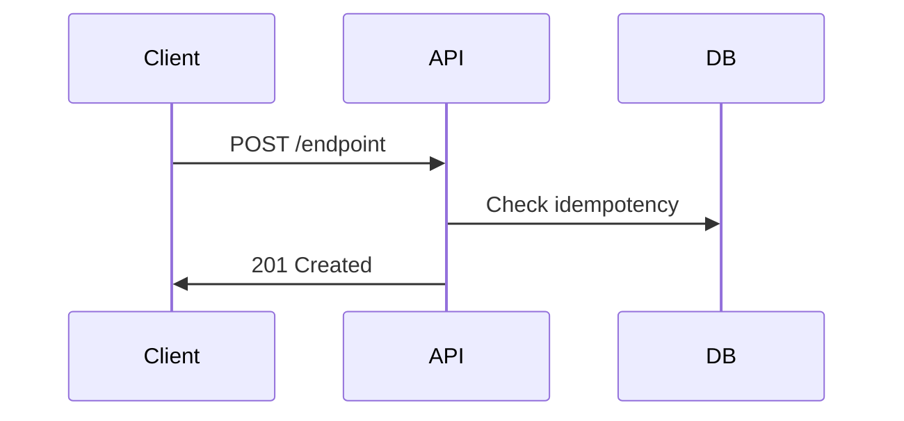

# DoD Alignment Strategy

## Current State vs Target State

### What We Have (MVP DoD)
- Rapid prototyping with mock data
- Working endpoints with basic testing
- Idempotent operations
- Structured logging

### What Production Needs (DoD v0.3)
- OpenAPI 3.0.3 specification
- Database migrations
- Automated testing with reports
- Comprehensive error handling
- Full observability

## Improvement Plan

### Phase 1: Enhance Current Features (Quick Wins)

#### 1. Add OpenAPI Specifications
```yaml
# For each completed endpoint, add to /openapi/openapi.json:
paths:
  /orders:
    post:
      operationId: createOrder
      parameters:
        - name: Idempotency-Key
          in: header
          required: true
      requestBody:
        content:
          application/json:
            schema:
              $ref: '#/components/schemas/CreateOrderRequest'
            examples:
              success:
                value: {...}
              error:
                value: {...}
```

#### 2. Create Migration Stubs
```sql
-- /db/migrations/0002_orders.sql
CREATE TABLE IF NOT EXISTS orders (
  id INT PRIMARY KEY AUTO_INCREMENT,
  user_id INT NOT NULL,
  out_trade_no VARCHAR(255) NOT NULL,
  status ENUM('PENDING_PAYMENT', 'PAID', 'CANCELLED') NOT NULL,
  -- ... matches mock data structure
  UNIQUE KEY uk_user_trade (user_id, out_trade_no)
);
```

#### 3. Add Postman Collections
```json
// /postman/collections/orders.json
{
  "name": "Orders API",
  "item": [{
    "name": "Create Order - Happy Path",
    "request": {
      "method": "POST",
      "header": [
        {"key": "Idempotency-Key", "value": "{{$guid}}"}
      ],
      "url": "{{baseUrl}}/orders"
    },
    "test": "pm.test('Status 201', () => pm.response.to.have.status(201));"
  }]
}
```

### Phase 2: Definition of Ready Implementation

#### Enhanced Card Template
```markdown
---
card: "Feature Name"
status: "Ready"
dor_checklist:
  - [ ] Mermaid sequence diagram
  - [ ] OpenAPI path defined
  - [ ] Postman request created
  - [ ] Migration file created
  - [ ] Idempotency rule defined
  - [ ] Observability events listed
  - [ ] Acceptance criteria (Given/When/Then)
---

## Mermaid Sequence


## Acceptance Criteria
**Given** a valid request
**When** the endpoint is called
**Then** return 201 with resource
```

### Phase 3: Automated Testing

#### Newman Integration
```bash
# Add to package.json scripts:
"test:api": "newman run postman/collections/*.json -e postman/env.json --reporters cli,json --reporter-json-export reports/newman/latest.json"

# Run after implementation:
npm run test:api
```

#### Negative Test Cases
```javascript
// Add to Postman tests:
pm.test('409 on duplicate', () => {
  // Send same request twice
  pm.expect(pm.response.code).to.equal(409);
});

pm.test('422 on invalid product', () => {
  // Send non-existent product_id
  pm.expect(pm.response.code).to.equal(422);
});
```

## Workflow Evolution

### Current (Fast MVP)
```
Card → Code → Build → Curl → Done
```

### Target (Production Ready)
```
DoR Check → Card → OpenAPI → Migration → Code → Build → Postman → Newman → Done
```

### Hybrid Approach (Best of Both)
```
1. Rapid prototype with mock (current approach)
2. Once working, backfill:
   - OpenAPI spec
   - Migration files
   - Postman tests
3. Run Newman for report
4. Update card with full DoD
```

## Metrics to Track

### Development Speed
- Current: 20 min/feature (with mock)
- With full DoD: ~45-60 min/feature
- Value: Higher quality, less rework

### Quality Metrics
| Metric | Current | Target |
|--------|---------|---------|
| Test Coverage | Manual only | 80% automated |
| Error Cases | Basic | Comprehensive |
| Documentation | Minimal | Full OpenAPI |
| Regression Risk | Medium | Low |

## Action Items

### Immediate (This Week)
1. [ ] Add OpenAPI specs for completed endpoints
2. [ ] Create migration files for existing features
3. [ ] Set up Postman collection structure
4. [ ] Document error codes in central catalog

### Short Term (Next Sprint)
1. [ ] Integrate Newman into workflow
2. [ ] Add negative test cases
3. [ ] Create DoR template
4. [ ] Update cards with missing fields

### Long Term (Next Month)
1. [ ] Automate DoD checklist validation
2. [ ] CI/CD integration
3. [ ] Database migration runner
4. [ ] Full observability stack

## The Verdict

### Is Our Workflow Working?
**YES** - for rapid MVP development
- ✅ Fast iteration (20 min/feature)
- ✅ Immediate feedback
- ✅ Low complexity

### Can It Scale to Production?
**PARTIALLY** - needs enhancement
- ⚠️ Missing automated tests
- ⚠️ No database migrations
- ⚠️ Incomplete documentation

### The Path Forward
1. **Keep the speed** of current workflow for prototyping
2. **Add the rigor** of DoD v0.3 for production features
3. **Use progressive enhancement** - start simple, layer quality

## Success Metrics

### We've Succeeded When:
- [ ] All "Done" cards pass DoD v0.3 checklist
- [ ] Newman reports exist for all endpoints
- [ ] OpenAPI spec validates in Swagger UI
- [ ] Database migrations match mock structure
- [ ] New features follow DoR → DoD flow

### We Maintain Speed When:
- [ ] Mock-first development continues
- [ ] Synchronous patterns for MVP
- [ ] Rapid feedback via curl
- [ ] Progressive documentation

## Conclusion

Our workflow **works** but needs **maturation**. The foundation is solid:
- Card-based development ✅
- Mock data approach ✅
- Rapid iteration ✅

The improvements needed are **additive**, not replacements:
- Add OpenAPI after code works
- Add migrations after logic proven
- Add Newman after manual tests pass

This is **evolutionary**, not revolutionary.