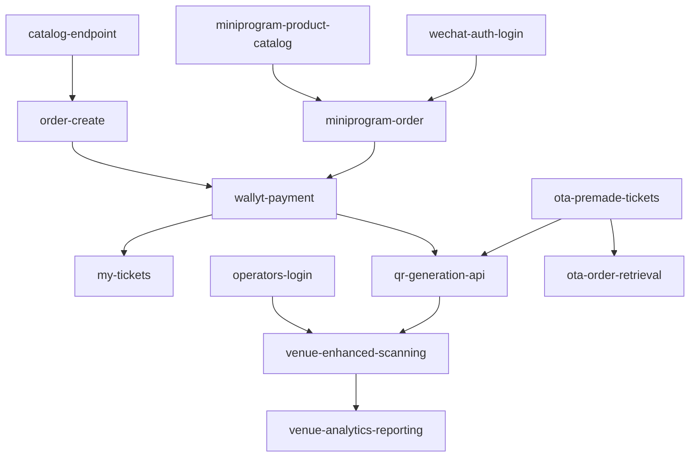

# Inter-card Dependencies

> 最后更新: 2025-12-31



## 主要流程说明

### 购票流程 (US-001)
```
catalog-endpoint → order-create → wallyt-payment → my-tickets + qr-generation-api
```

### 核销流程 (US-002)
```
operators-login + qr-generation-api → venue-enhanced-scanning
```

### 小程序流程 (US-010A)
```
miniprogram-product-catalog → miniprogram-order → wallyt-payment
```

### OTA 流程 (US-012)
```
ota-premade-tickets → qr-generation-api → venue-enhanced-scanning
```

## 废弃卡片映射

| 废弃卡片 | 替代卡片 |
|---------|---------|
| payment-webhook | wallyt-payment |
| tickets-issuance | wallyt-payment (已合并) |
| qr-token | qr-generation-api |
| tickets-scan | venue-enhanced-scanning |
| validators-sessions | operators-login |
| reports-redemptions | venue-enhanced-scanning (/venue/redemptions) |
| merchant-redemption-console | venue-enhanced-scanning |
| notification-orchestrator | (未实现，已移除) |
