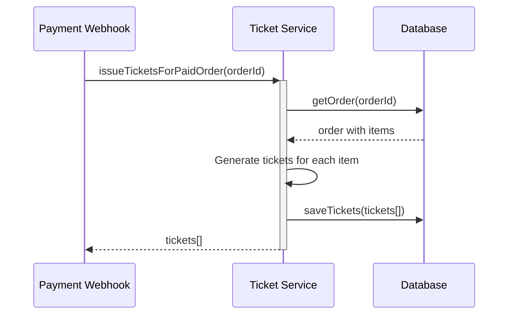
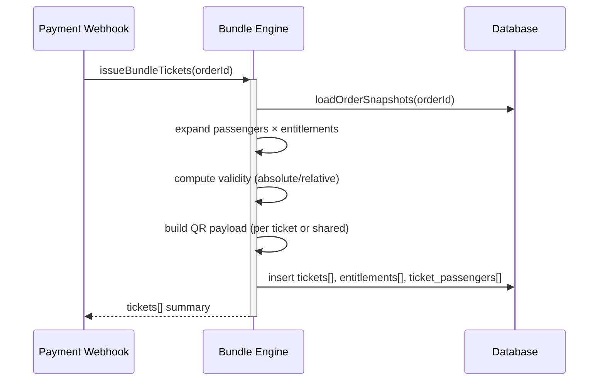

# Payment webhook — Dev Notes

> ⚠️ **DEPRECATED**: 此 Card 描述的是旧版 Mock 支付回调实现。
> 生产环境已迁移至 Wallyt 集成，请参考 [`wallyt-payment.md`](./wallyt-payment.md)。
> - 新端点: `POST /payments/wallyt/notify`
> - 测试环境: 使用 `POST /miniprogram/orders/:id/simulate-payment`

## Purpose
Receive payment notification from payment gateway and synchronously issue tickets.

## Contract
- `POST /payments/notify` — webhook from payment provider

## Request
```json
{
  "order_id": 12345,
  "payment_status": "SUCCESS",
  "paid_at": "2025-01-01T12:00:00Z",
  "signature": "abc123"
}
```

## Rules
1) Validate signature (mock validation for now)
2) Find order by ID
3) Check order status is PENDING
4) Update order status to PAID with paid_at timestamp
5) Commit inventory (reserved → sold)
6) **Synchronously call ticket issuance module**
7) Return 200 OK

## Invariants
- Idempotent: Multiple calls with same order_id return same result
- Only PENDING orders can be marked as PAID
- Inventory must be committed atomically with order update

## Error Cases
- Invalid signature → 401
- Order not found → 404
- Order already paid → 200 (idempotent)
- Ticket issuance fails → 500 (rollback order status)

## Observability
- Log `payment.webhook.received` with order_id
- Log `payment.webhook.success` or `payment.webhook.failed`
- Metric `payment.webhook.count`

## Acceptance — Given / When / Then

### 正常流程

#### AC-1: 支付成功 - 订单状态更新
- **Given** 订单 order_id=123 存在且 status='PENDING'
- **When** `POST /payments/notify` `{ order_id: 123, payment_status: "SUCCESS", paid_at: "...", signature: "valid" }`
- **Then** 返回 200 OK
- **And** 订单 status 变为 'PAID'
- **And** 订单 paid_at 被记录

#### AC-2: 支付成功 - 库存确认
- **Given** 订单包含 product_id=101, qty=2
- **When** 支付成功通知处理完成
- **Then** `products.reserved` 减少 2
- **And** `products.sold` 增加 2

#### AC-3: 支付成功 - 同步出票
- **Given** 订单 order_id=123 支付成功
- **When** webhook 处理完成
- **Then** 同步创建票券（tickets 表有新记录）
- **And** 票券数量 = 订单 qty

#### AC-4: 幂等性 - 重复支付通知
- **Given** 订单 order_id=123 已经是 'PAID' 状态
- **When** 再次 `POST /payments/notify` 相同 order_id
- **Then** 返回 200 OK（幂等）
- **And** 不重复创建票券

### 异常流程

#### AC-5: 无效签名
- **Given** signature 字段无效或缺失
- **When** `POST /payments/notify`
- **Then** 返回 401，`{ error: "INVALID_SIGNATURE" }`
- **And** 订单状态不变

#### AC-6: 订单不存在
- **Given** order_id=99999 不存在
- **When** `POST /payments/notify` `{ order_id: 99999, ... }`
- **Then** 返回 404，`{ error: "ORDER_NOT_FOUND" }`

#### AC-7: 订单非 PENDING 状态
- **Given** 订单 status='CANCELLED'
- **When** `POST /payments/notify`
- **Then** 返回 400/409，`{ error: "INVALID_ORDER_STATUS" }`

#### AC-8: 出票失败回滚
- **Given** 出票模块返回错误
- **When** 支付通知处理中
- **Then** 返回 500
- **And** 订单状态回滚（不变为 PAID）
- **And** 库存不提交

### 边界情况

#### AC-9: 支付失败通知
- **Given** 订单 order_id=123 存在且 status='PENDING'
- **When** `POST /payments/notify` `{ payment_status: "FAILED" }`
- **Then** 返回 200 OK
- **And** 订单状态可更新为 'CANCELLED' 或保持 'PENDING'
- **And** 释放预留库存

#### AC-10: 并发支付通知
- **Given** 两个相同 order_id 的支付通知同时到达
- **When** 并发处理
- **Then** 只有一个成功更新订单状态
- **And** 另一个返回幂等响应

---

## 出票逻辑 (原 tickets-issuance)

> 本节内容合并自 `tickets-issuance` Card，描述支付成功后的同步出票服务。

### Service Interface

```typescript
interface TicketService {
  issueTicketsForPaidOrder(orderId: number): Promise<Ticket[]>
}
```

### 出票流程



### Ticket Schema

```yaml
Ticket:
  type: object
  properties:
    ticket_code:
      type: string
      description: Unique ticket identifier (TKT-{orderId}-{itemIndex}-{ticketIndex})
    order_id:
      type: integer
    user_id:
      type: integer
    product_id:
      type: integer
    status:
      type: string
      enum: [valid, used, void]
    valid_from:
      type: string
      format: date-time
    valid_until:
      type: string
      format: date-time
    issued_at:
      type: string
      format: date-time
    functions:
      type: array
      description: Entitlements included with this ticket
```

### 出票规则

1. Begin transaction
2. Load order with FOR UPDATE lock
3. Verify order status is PAID (throw if not)
4. Check if tickets already exist (idempotency)
5. For each order item:
   - Load product details and functions
   - Create qty number of individual tickets
   - Generate unique ticket code
   - Set validity dates from product config
   - Copy product functions as entitlements
6. Save all tickets atomically
7. Commit transaction
8. Return created tickets

### 出票不变量

- Only PAID orders can have tickets issued
- Ticket codes must be globally unique
- One ticket per quantity unit (qty=2 → 2 tickets)
- Idempotent: same orderId returns same tickets

### 出票验收标准

#### AC-TKT-1: 基础出票
- **Given** 订单 order_id=123 状态为 PAID，包含 2x Transport Pass
- **When** `issueTicketsForPaidOrder(123)` 被调用
- **Then** 创建 2 张独立票券，每张有唯一 ticket_code
- **And** 每张票券包含产品定义的权益

#### AC-TKT-2: 出票幂等性
- **Given** 订单 order_id=123 已完成出票
- **When** 再次调用 `issueTicketsForPaidOrder(123)`
- **Then** 返回相同的票券（不创建重复）

#### AC-TKT-3: 订单未支付时拒绝出票
- **Given** 订单 order_id=456 状态为 PENDING
- **When** 尝试出票
- **Then** 抛出错误，不创建任何票券

---

## 套票发券引擎 (原 bundle-ticket-engine)

> 本节内容合并自 `bundle-ticket-engine` Card，描述多人套票的权益展开逻辑。

### Service Interface

```typescript
interface BundleEngine {
  issueBundleTickets(orderId: string): Promise<TicketPayload[]>
}
```

### 套票发券流程



### 套票权益展开逻辑

1. 启动事务，读取订单、乘客、权益快照
2. 根据模板展开 entitlement matrix（乘客 × 权益）
3. 为每条记录生成 ticket row
4. 写入 `tickets`、`ticket_entitlements`、`ticket_passengers` 表
5. 记录 `issued_ticket_batches`（防重）
6. 提交事务

### 套票不变量

- 每位乘客 × 每项权益至少生成 1 张票券
- 共享权益以订单维度生成（passenger_ref=shared）
- 有效期根据模板配置计算，不能早于支付时间
- 通过 `issued_ticket_batches` 确保幂等性

### 套票验收标准

#### AC-BDL-1: 多乘客多权益发券
- **Given** 含三名乘客两项权益的订单
- **When** 发券
- **Then** 生成 6 张个人票 + 共享权益票

#### AC-BDL-2: 发券幂等性
- **Given** 重试同一订单
- **Then** 返回已有批次且不重复写入

#### AC-BDL-3: 实名票券
- **Given** 模板标记实名
- **Then** 票券记录包含乘客实名哈希

#### AC-BDL-4: 有效期计算
- **Given** 模板配置支付后 7 天有效期
- **Then** valid_end 正确计算并晚于支付时间

---

## Migration Files

| Migration | Purpose |
|-----------|---------|
| `db/migrations/0005_tickets_table.sql` | 基础票券表 |
| `db/migrations/0012_ticket_entitlements.sql` | 套票权益扩展表 |