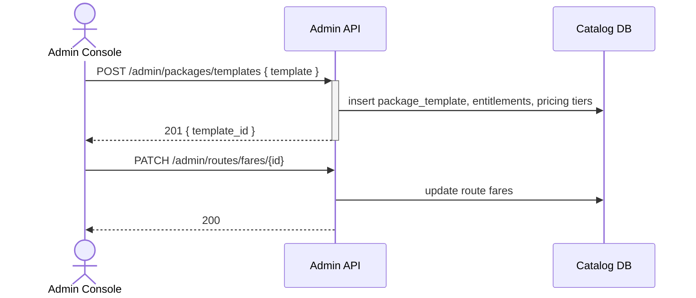

## Status & Telemetry
- Status: In Progress — 首批交付锁定模板与线路票价接口
- Readiness: prototype（提供后台配置 API）
- Spec Paths: /admin/packages/templates, /admin/packages/templates/{templateId}/versions, /admin/routes/fares/{routeCode}, /admin/routes/fares/{routeCode}/history, /admin/routes/fares/{routeCode}/restore
- Migrations: db/migrations/0015_admin_package_tables.sql
- Newman: 已执行 • reports/newman/admin-package-config.json
- Last Update: 2025-10-28T12:05:50+08:00

### Scope 注记
- `/admin/merchants` 与 `/admin/promotions` 拆分至后续迭代，保持单一职责；待新增卡片或依赖确认后再纳入本卡验收。

## 0) Prerequisites
- Admin 身份认证与 RBAC 中间件可用。
- travel-search-hub 依赖模板与线路配置数据。
- seat-lock-service 使用的库存结构需与后台配置联动。
- Promotion/merchant 数据模型部分可能已存在，需要差异分析（本迭代仅记录为依赖，不纳入交付范围）。

## 1) API Sequence (Context)


## 2) Contract (OAS 3.0.3)
```yaml
paths:
  /admin/packages/templates:
    post:
      tags: [Admin]
      summary: Create or update package template with entitlements
      requestBody:
        required: true
        content:
          application/json:
            schema:
              $ref: '#/components/schemas/PackageTemplateUpsert'
      responses:
        "201":
          description: Template created
        "200":
          description: Template updated (idempotent)
        "409":
          description: Template version conflict
  /admin/packages/templates/{templateId}/versions:
    get:
      tags: [Admin]
      summary: List template version history
      parameters:
        - in: path
          name: templateId
          required: true
          schema:
            type: string
      responses:
        "200":
          description: Version history returned
        "404":
          description: Template not found
  /admin/routes/fares/{routeCode}:
    put:
      tags: [Admin]
      summary: Upsert route fare table per passenger type
      parameters:
        - in: path
          name: routeCode
          required: true
          schema:
            type: string
      requestBody:
        required: true
        content:
          application/json:
            schema:
              $ref: '#/components/schemas/RouteFareUpsert'
      responses:
        "200":
          description: Updated (idempotent supported)
  /admin/routes/fares/{routeCode}/history:
    get:
      tags: [Admin]
      summary: Retrieve route fare revision history
      parameters:
        - in: path
          name: routeCode
          required: true
          schema:
            type: string
      responses:
        "200":
          description: History returned
        "404":
          description: Route not found
  /admin/routes/fares/{routeCode}/restore:
    post:
      tags: [Admin]
      summary: Restore previous route fare revision
      parameters:
        - in: path
          name: routeCode
          required: true
          schema:
            type: string
      responses:
        "200":
          description: Previous revision restored
        "409":
          description: No previous revision available
        "404":
          description: Route not found
# 后续交付将补充 /admin/merchants 与 /admin/promotions 合同片段。
```

## 3) Invariants
- 套票模板采用版本化：`template_id` + `version`，任何更新生成新版本并保持旧记录历史。
- 每项权益必须明确核销渠道、实名需求、有效期策略。
- 阶梯定价需覆盖成人/儿童/长者差异，至少包含成人。
- 路线票价更新需保持锁座与售卖价格一致；若配置失败必须回滚至上一个有效版本。

## 4) Validations, Idempotency & Concurrency
- 使用 `client_token` 或模板名称+版本确保幂等；重复提交返回同一版本。
- 权益数量为正整数；有效期类型需在允许列表（absolute/relative）。
- 路线票价更新需校验不与有效订单冲突（可写审计并延迟生效）。
- RBAC：仅管理员角色可访问，记录审计。

## 5) Rules & Writes (TX)
1. 创建模板时开启事务：写主表 `package_templates`、子表 `template_entitlements`、`template_pricing_tiers`。
2. 路线票价采用 UPSERT，更新 `routes`/`fares` 表并刷新缓存。
3. 商家入驻事务逻辑在后续迭代实现（记录依赖，当前交付不覆盖）。
4. 商家与促销写路径留待后续卡片；本迭代仅确保模板与线路票价事务完整性。

## 6) Data Impact & Transactions
- 新增表：`package_templates`, `template_entitlements`, `template_pricing_tiers`。
- 现有 `routes` 表新增字段：`blackout_dates JSON`, `seat_lock_minutes`。
- 后续若实现商家/促销，将补充 `merchants`、`promotion_rules` 等扩展（记录依赖，未在本迭代交付）。
- 所有写操作需记录到 `admin_audit_logs`（若未存在则新增）。

## 7) Observability
- Metrics：`admin.templates.created`, `admin.routes.updated`（促销指标待相关卡片上线后补齐）。
- Logs：记录管理员操作人、版本号、失败原因。
- Audit：所有变更写入 `admin_audit_logs`，可按日期检索。

## 8) Acceptance — Given / When / Then
- Given 管理员提交新模板，When POST 模板，Then 返回 201 并创建版本记录。
- Given 更新模板，When POST 同名模板不同 versionToken，Then 创建新版本且旧版本保留。
- Given 更新路线票价，When PUT fares，Then travel-search-hub 在下一次查询使用新价格。
- Given 路线票价配置失败，When POST /admin/routes/fares/{routeCode}/restore，Then API 返回 200 并记录审计日志。

## 9) Postman Coverage
- 模板创建/更新成功、模板冲突（重复名称/版本）、模板字段校验失败。
- 路线票价 upsert 成功、缺少 fares/routeCode 失败、锁定分钟数默认值校验。
- 模板版本历史查询（存在/不存在的 templateId）。
- 路线票价历史查询与回滚成功；无历史时回滚返回 409。
- Postman Collection：`test-flows/admin-package-config.postman.json`。
- 商家入驻、促销配置场景暂停，待相关卡片恢复后新增覆盖。
