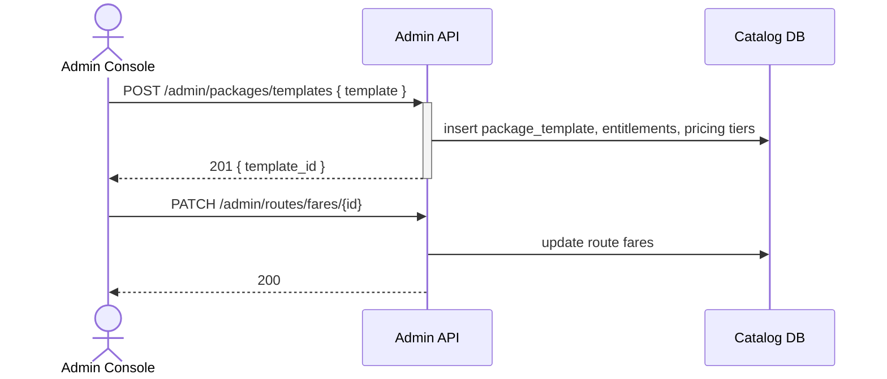

## Status & Telemetry
- Status: Ready
- Readiness: prototype（提供后台配置 API）
- Spec Paths: /admin/packages/templates, /admin/routes/fares, /admin/merchants, /admin/promotions
- Migrations: db/migrations/0015_admin_package_tables.sql
- Newman: 待实现 • reports/newman/admin-package-config.json
- Last Update: 2025-10-24T18:28:44+08:00

## 0) Prerequisites
- Admin 身份认证与 RBAC 中间件可用。
- travel-search-hub 依赖模板与线路配置数据。
- seat-lock-service 使用的库存结构需与后台配置联动。
- Promotion/merchant 数据模型部分可能已存在，需要差异分析。

## 1) API Sequence (Context)


## 2) Contract (OAS 3.0.3)
```yaml
paths:
  /admin/packages/templates:
    post:
      tags: [Admin]
      summary: Create or update package template with entitlements
      requestBody:
        required: true
        content:
          application/json:
            schema:
              $ref: '#/components/schemas/PackageTemplateUpsert'
      responses:
        "201":
          description: Template created
        "200":
          description: Template updated (idempotent key)
        "409":
          description: Template version conflict
  /admin/routes/fares:
    put:
      tags: [Admin]
      summary: Upsert route fare table per passenger type
      requestBody:
        required: true
        content:
          application/json:
            schema:
              type: object
              properties:
                route_id:
                  type: string
                fares:
                  type: array
                  items:
                    $ref: '#/components/schemas/FareTier'
      responses:
        "200":
          description: Updated
  /admin/merchants:
    post:
      tags: [Admin]
      summary: Onboard merchant and locations
      requestBody:
        required: true
        content:
          application/json:
            schema:
              $ref: '#/components/schemas/MerchantOnboard'
      responses:
        "201":
          description: Merchant created
  /admin/promotions:
    post:
      tags: [Admin]
      summary: Configure promotion rules applicable to bundles
      requestBody:
        required: true
        content:
          application/json:
            schema:
              $ref: '#/components/schemas/PromotionRule'
      responses:
        "201":
          description: Promotion created
```

## 3) Invariants
- 套票模板采用版本化：`template_id` + `version`，任何更新生成新版本并保持旧记录历史。
- 每项权益必须明确核销渠道、实名需求、有效期策略。
- 阶梯定价需覆盖成人/儿童/长者差异，至少包含成人。
- 商家启用后方可关联至核销端；禁用商家禁用其所有 location。

## 4) Validations, Idempotency & Concurrency
- 使用 `client_token` 或模板名称+版本确保幂等；重复提交返回同一版本。
- 权益数量为正整数；有效期类型需在允许列表（absolute/relative）。
- 路线票价更新需校验不与有效订单冲突（可写审计并延迟生效）。
- RBAC：仅管理员角色可访问，记录审计。

## 5) Rules & Writes (TX)
1. 创建模板时开启事务：写主表 `package_templates`、子表 `template_entitlements`、`template_pricing_tiers`。
2. 路线票价采用 UPSERT，更新 `routes`/`fares` 表并刷新缓存。
3. 商家入驻同时写 `merchants`、`merchant_locations`、初始运营状态。
4. 促销配置写 `promotions`、`promotion_rules`，并通知 travel-search-hub 刷新缓存。

## 6) Data Impact & Transactions
- 新增表：`package_templates`, `template_entitlements`, `template_pricing_tiers`, `promotion_rules`。
- 现有 `routes` 表新增字段：`blackout_dates JSON`, `seat_lock_minutes`。
- `merchants` 表增加 `status`, `contact_info`。
- 所有写操作需记录到 `admin_audit_logs`（若未存在则新增）。

## 7) Observability
- Metrics：`admin.templates.created`, `admin.routes.updated`, `admin.promotions.active`。
- Logs：记录管理员操作人、版本号、失败原因。
- Audit：所有变更写入 `admin_audit_logs`，可按日期检索。

## 8) Acceptance — Given / When / Then
- Given 管理员提交新模板，When POST 模板，Then 返回 201 并创建版本记录。
- Given 更新模板，When POST 同名模板不同 versionToken，Then 创建新版本且旧版本保留。
- Given 更新路线票价，When PUT fares，Then travel-search-hub 在下一次查询使用新价格。
- Given 禁用商家，When PATCH merchant status，Then 核销接口拒绝该商家请求。

## 9) Postman Coverage
- 模板创建/更新、模板冲突、路线票价 upsert、商家入驻、促销配置成功与无效参数场景。
