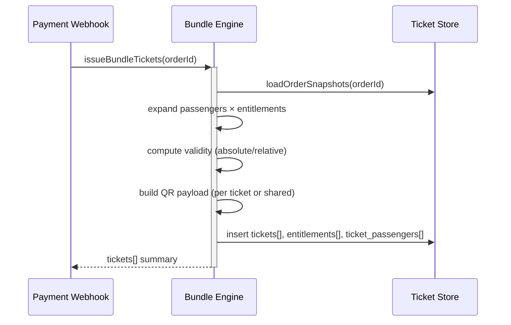

## Status & Telemetry
- Status: Done
- Readiness: mvp（发券逻辑覆盖多人套票权益）
- Spec Paths: 内部 service（扩展 tickets-issuance）
- Migrations: db/migrations/0012_ticket_entitlements.sql
- Newman: 待实现 • reports/newman/bundle-ticket-engine.json
- Last Update: 2025-10-24T18:28:44+08:00

## 0) Prerequisites
- order-create-idempotent 已记录 `passengerSnapshot` 与 `ticketBundleSnapshot`。
- 套票模板（admin-package-config）提供权益定义、实名需求、有效期策略。
- wechat-payment-session + payment-webhook 确保订单状态准确。
- QR token 加密密钥与 tickets-issuance 现有实现可复用。

## 1) API Sequence (Context)


## 2) Contract (OAS 3.0.3)
```yaml
# TypeScript service interface
components:
  schemas:
    TicketPayload:
      type: object
      properties:
        ticket_id:
          type: string
        order_id:
          type: string
        entitlement_code:
          type: string
        passenger_ref:
          type: string
        status:
          type: string
          enum: [usable, used, refunded, changing, changed, expired]
        qr_payload:
          type: string
        valid_start:
          type: string
          format: date-time
        valid_end:
          type: string
          format: date-time
```

## 3) Invariants
- 每位乘客 × 每项权益至少生成 1 张票券；共享权益以订单维度生成且 `passenger_ref=shared`。
- 有效期根据模板配置（固定日期或支付后 X 天）计算，不能早于支付时间。
- 权益快照与最终票券必须对齐（数量、实名标志、退改策略）。
- QR payload 使用一次性 token，过期后需刷新（交由 ticket-lifecycle-daemon 处理）。

## 4) Validations, Idempotency & Concurrency
- 通过 `issued_ticket_batches` 表确保同订单只发行一次（order_id UNIQUE）。
- 验证乘客数量与快照一致；异常抛出并保持订单为 `paid`（需人工处理）。
- 支持重试：检测已存在 tickets 列表则不重复插入，返回现有数据。
- 生成二维码时使用加盐 HMAC 并记录版本。

## 5) Rules & Writes (TX)
1. 启动事务，读取订单、乘客、权益快照。
2. 根据模板展开 entitlement matrix。
3. 为每条记录生成 ticket row（含 entitlement_id、passenger_ref）。
4. 写入 `tickets`、`ticket_entitlements`、`ticket_passengers` 表。
5. 记录 `issued_ticket_batches`（order_id、issued_at、checksum）。
6. 提交事务并返回摘要供通知模块使用。

## 6) Data Impact & Transactions
- 新增表：
  - `ticket_entitlements`（ticket_id, entitlement_code, attributes JSON）。
  - `ticket_passengers`（ticket_id, passenger_name, passenger_type, doc_type/number hash）。
  - `issued_ticket_batches`（order_id PK, issued_at, checksum, version）。
- 扩展 `tickets` 表字段：`entitlement_code`, `valid_start`, `valid_end`, `qr_version`。
- 所有写入在单事务中完成。

## 7) Observability
- Logs：`ticket.issue.success|failure`，包含 order_id、counts。
- Metrics：`tickets.issued.count`, `tickets.issued.duration`。
- Audit：记录 checksum 以便对账；失败场景开启告警。

## 8) Acceptance — Given / When / Then
- Given 含三名乘客两项权益的订单，When 发券，Then 生成 6 张个人票 + 共享权益票并返回明细。
- Given 重试同一订单，Then 返回已有批次且不重复写入。
- Given 模板标记实名，Then 票券记录包含乘客实名哈希。
- Given 模板配置支付后 7 天有效期，Then valid_end 正确计算并晚于支付时间。

## 9) Postman Coverage
- 集成测试通过内部 service hook：多乘客、多权益、共享权益、重试、异常（缺乘客）。
