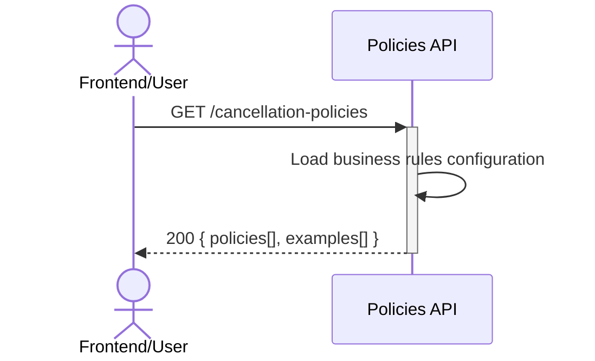

## Status & Telemetry
- Status: Ready
- Readiness: mvp
- Spec Paths: /cancellation-policies
- Migrations: N/A (configuration-based)
- Newman: 0/0 • reports/newman/cancellation-policies.json
- Last Update: 2025-10-20T16:30:00+0800

## 0) Prerequisites
- Service up; `/healthz` → 200
- Business rules configuration available
- Integration with ticket-cancellation card

## 1) API Sequence (Context)


## 2) Contract (OAS 3.0.3 fragment)
```yaml
paths:
  /cancellation-policies:
    get:
      tags: [Policies]
      summary: Get cancellation policies and refund rules
      description: Returns business rules for ticket cancellation and refund calculation
      responses:
        "200":
          description: Cancellation policies
          content:
            application/json:
              schema:
                type: object
                properties:
                  policies:
                    type: array
                    items:
                      type: object
                      properties:
                        rule_type:
                          type: string
                          enum: [redemption_based, time_based, product_based]
                        description:
                          type: string
                        refund_percentage:
                          type: number
                          format: decimal
                          minimum: 0
                          maximum: 1
                        conditions:
                          type: object
                  examples:
                    type: array
                    items:
                      type: object
                      properties:
                        scenario:
                          type: string
                        ticket_status:
                          type: string
                        redemptions_used:
                          type: integer
                        total_redemptions:
                          type: integer
                        refund_percentage:
                          type: number
                        explanation:
                          type: string
```

## 3) Invariants
- Refund percentage always between 0 and 1
- Rules are applied in priority order (redemption-based > time-based > product-based)
- No refund possible for fully redeemed tickets
- Policies are consistent across all cancellation scenarios

## 4) Validations, Idempotency & Concurrency
- No input validation required (GET endpoint, no parameters)
- Response is cacheable (policies change infrequently)
- No concurrency concerns (read-only configuration)

## 5) Rules & Reads
**Business Rules (Configuration):**
1) **Redemption-based rules** (highest priority):
   - 0% used: 100% refund
   - 1-50% used: 50% refund
   - 51-99% used: 25% refund
   - 100% used: 0% refund

2) **Status-based rules**:
   - ACTIVE: Follow redemption rules
   - PARTIALLY_REDEEMED: Follow redemption rules
   - REDEEMED: 0% refund
   - EXPIRED: 0% refund
   - VOID: Already cancelled

3) **Product-based rules** (future extension):
   - Special event tickets: Different refund schedule
   - Season passes: Pro-rated refunds

**Implementation:**
1) Load configuration from environment/config file
2) Format into API response structure
3) Include practical examples for frontend guidance

## 6) Data Impact & Transactions
- No database changes required
- Configuration stored in application settings
- Future: Could be moved to database table for dynamic updates

## 7) Observability
- Log `policies.requested {user_agent, ip}`
- Metric `policies.requests.count`

## 8) Acceptance — Given / When / Then
**Given** the policies endpoint is called
**When** GET /cancellation-policies
**Then** returns current business rules with examples

**Given** policies are requested by frontend
**When** user is considering cancellation
**Then** clear examples show expected refund amount

## 9) Postman Coverage
```js
// Basic policies retrieval
pm.test('Policies endpoint returns 200', () => {
  pm.response.to.have.status(200);
  const resp = pm.response.json();
  pm.expect(resp.policies).to.be.an('array');
  pm.expect(resp.examples).to.be.an('array');
});

// Validate policy structure
pm.test('Policies have required fields', () => {
  const resp = pm.response.json();
  resp.policies.forEach(policy => {
    pm.expect(policy.rule_type).to.be.a('string');
    pm.expect(policy.refund_percentage).to.be.a('number');
    pm.expect(policy.refund_percentage).to.be.within(0, 1);
  });
});

// Example scenarios validation
pm.test('Examples include practical scenarios', () => {
  const resp = pm.response.json();
  pm.expect(resp.examples.length).to.be.at.least(3);
  resp.examples.forEach(example => {
    pm.expect(example.scenario).to.be.a('string');
    pm.expect(example.refund_percentage).to.be.a('number');
  });
});
```