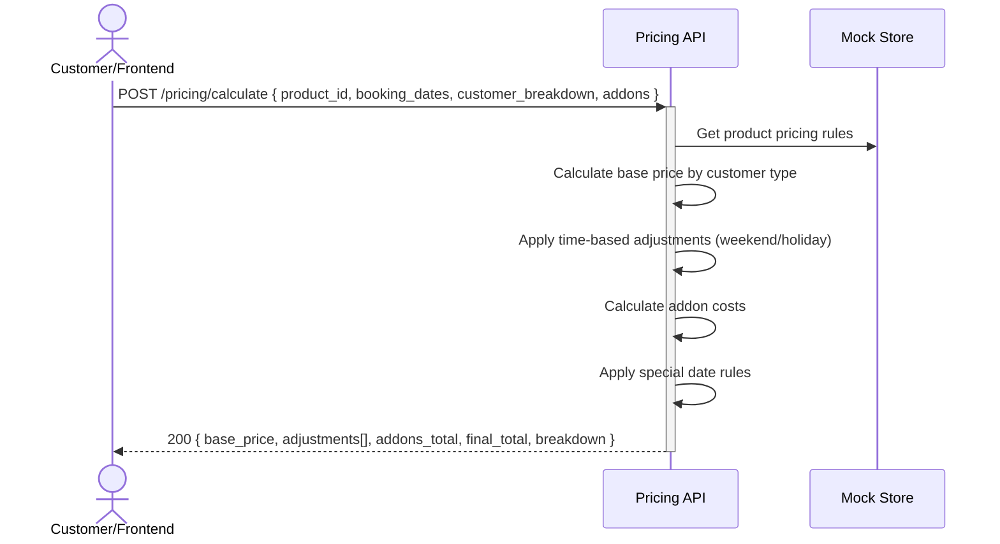

# Complex multi-variable pricing calculation engine — Dev Notes

## Status & Telemetry
- Status: Ready
- Readiness: mvp
- Spec Paths: /pricing/calculate, /pricing/rules/{product_id}
- Migrations: db/migrations/0010_complex_pricing.sql
- Newman: 0/0 • reports/newman/complex-pricing-engine.json
- Last Update: 2025-10-26T10:30:00+0800

## 0) Prerequisites
- Product catalog endpoint exists (catalog-endpoint card)
- Basic product structure in mockStore
- Domain types support for pricing structures
- Date/time utilities for day type calculation (weekday/weekend/holiday)

## 1) API Sequence (Context)


## 2) Contract (OAS 3.0.3)
```yaml
paths:
  /pricing/calculate:
    post:
      tags: [PricingEngine]
      summary: Calculate total price for complex booking
      description: Calculates pricing based on multiple variables - dates, customer types, package tiers, add-ons
      requestBody:
        required: true
        content:
          application/json:
            schema:
              type: object
              required: [product_id, booking_dates, customer_breakdown]
              properties:
                product_id:
                  type: integer
                  description: Product to price
                booking_dates:
                  type: array
                  items:
                    type: string
                    format: date
                  description: Dates for usage/booking
                customer_breakdown:
                  type: array
                  items:
                    type: object
                    properties:
                      customer_type:
                        type: string
                        enum: [adult, child, elderly]
                      count:
                        type: integer
                        minimum: 1
                addons:
                  type: array
                  items:
                    type: object
                    properties:
                      addon_id:
                        type: string
                      quantity:
                        type: integer
                package_tier:
                  type: string
                  enum: [premium, pet, deluxe_tea_set]
                  description: Optional package tier override
      responses:
        "200":
          description: Pricing calculation successful
          content:
            application/json:
              schema:
                type: object
                properties:
                  base_price:
                    type: number
                    format: decimal
                  adjustments:
                    type: array
                    items:
                      type: object
                      properties:
                        rule_type:
                          type: string
                        description:
                          type: string
                        amount:
                          type: number
                  addons_total:
                    type: number
                    format: decimal
                  final_total:
                    type: number
                    format: decimal
                  breakdown:
                    type: object
                    properties:
                      per_customer_costs:
                        type: array
                      addon_details:
                        type: array
                      tax_info:
                        type: object
        "400":
          description: Invalid request parameters
        "404":
          description: Product not found or pricing not available
        "422":
          description: Invalid date range or customer breakdown

  /pricing/rules/{product_id}:
    get:
      tags: [PricingEngine]
      summary: Get pricing rules for product
      description: Returns all pricing rules, tiers, and add-on options for a product
      parameters:
        - name: product_id
          in: path
          required: true
          schema:
            type: integer
      responses:
        "200":
          description: Pricing rules retrieved
          content:
            application/json:
              schema:
                type: object
                properties:
                  base_prices:
                    type: object
                  time_rules:
                    type: array
                  customer_rules:
                    type: array
                  special_dates:
                    type: array
                  package_tiers:
                    type: array
                  available_addons:
                    type: array
```

## 3) Invariants
- Base pricing must always be defined for each customer type
- Time-based adjustments are additive to base price
- Special date pricing overrides regular time-based rules
- Add-on pricing is always calculated independently
- Final total must equal base + adjustments + addons
- Price calculation must be deterministic (same inputs = same output)

## 4) Validations, Idempotency & Concurrency
- Validate product_id exists and has complex pricing enabled
- Validate booking_dates are valid future dates
- Validate customer_breakdown has valid types and positive counts
- Validate addon_ids exist in catalog
- Calculation is stateless and idempotent
- No concurrency issues as this is read-only calculation

## 5) Rules & Writes (TX)
**Pricing Calculation Logic:**
1) Load product pricing configuration from mockStore
2) Determine day types for each booking_date (weekday/weekend/holiday/special)
3) For each customer type in breakdown:
   - Get base price for customer type and day type
   - Apply time-based adjustments
   - Apply package tier modifiers if specified
4) Calculate add-on costs (addon_id * quantity * unit_price)
5) Apply any special date overrides
6) Sum all components for final total
7) Build detailed breakdown object
8) Return comprehensive pricing response

**No database writes - purely calculation service**

## 6) Data Impact & Transactions
**Migration:** `db/migrations/0010_complex_pricing.sql`
- Extend mockStore with complex pricing structures
- Add pricing_rules to Product type in domain.ts
- Create PricingRule, PricingAdjustment, CustomerBreakdown interfaces
- Add special_dates calendar data structure

**New domain types needed:**
```typescript
export interface PricingStructure {
  base_price: number;
  pricing_rules: PricingRule[];
  package_tiers?: PackageTier[];
  addon_products?: AddonProduct[];
}

export interface PricingRule {
  rule_type: 'time_based' | 'customer_type' | 'special_date' | 'package_tier';
  conditions: any;
  price_modifier: { type: 'fixed' | 'percentage' | 'absolute'; value: number; };
}

export interface PricingCalculationRequest {
  product_id: number;
  booking_dates: string[];
  customer_breakdown: CustomerBreakdown[];
  addons?: AddonSelection[];
  package_tier?: string;
}

export interface PricingCalculationResponse {
  base_price: number;
  adjustments: PricingAdjustment[];
  addons_total: number;
  final_total: number;
  breakdown: PricingBreakdown;
}
```

## 7) Observability
- Log `pricing.calculation.requested {product_id, customer_count, addon_count}`
- Log `pricing.calculation.completed {final_total, calculation_time_ms}`
- Log `pricing.rules.loaded {product_id, rules_count}`
- Log `pricing.special_date.applied {date, rule_type, adjustment}`
- Metric `pricing.calculations.count`
- Metric `pricing.calculations.avg_time_ms`
- Metric `pricing.addon.selection.count` by addon type

## 8) Acceptance — Given / When / Then

**Given** a product with complex pricing (weekday $288, weekend $318, child/elderly $188)
**When** calculating price for 2 adults on weekend dates
**Then** return base_price: 636, adjustments: [], final_total: 636

**Given** a booking includes add-on token Plan A ($100/10 tokens)
**When** calculating with 2 Plan A add-ons
**Then** addons_total: 200, final_total includes addon cost

**Given** booking date is special event (31/12/2025)
**When** calculating price
**Then** apply special date pricing rules (待定 pricing)

**Given** mixed customer types (1 adult, 2 children) on weekday
**When** calculating price
**Then** breakdown shows per-customer pricing: adult $288, children $188 each

## 9) Postman Coverage
- Happy path: Calculate complex pricing with multiple variables
- Customer types: Test all combinations (adult/child/elderly)
- Time periods: Weekday vs weekend vs special date pricing
- Add-ons: Various addon combinations and quantities
- Package tiers: Premium, Pet Plan, Deluxe Tea Set pricing
- Edge cases: Invalid product_id → 404, invalid dates → 422
- Performance: Measure calculation time for complex scenarios