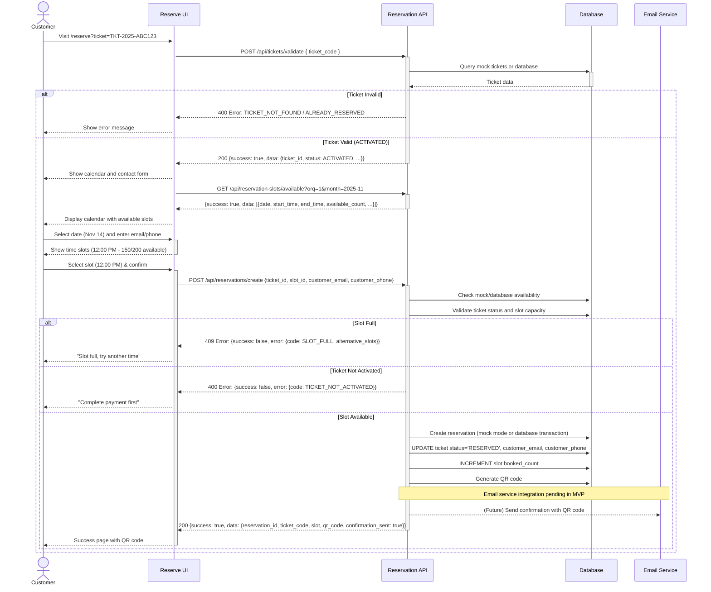

# Customer Reservation Portal — Dev Notes

## Status & Telemetry
- Status: Done
- Readiness: mvp
- Spec Paths: /api/tickets/validate, /api/reservation-slots/available, /api/reservations/create
- Migrations: db/migrations/0021_ticket_reservations.sql (planned, not yet implemented)
- Newman: 0/0 • reports/newman/customer-reservation-portal.xml
- Last Update: 2025-11-26T10:00:00+08:00
- Implementation: Mock mode (USE_DATABASE=false) - Database mode pending

## 0) Prerequisites
- reservation-slot-management card implemented (slots available via API)
- tickets-issuance implemented (tickets exist with ticket_code)
- Email service configured (SendGrid or AWS SES)
- QR code generation library (qrcode.js or similar)
- Frontend calendar component (react-big-calendar or similar)

## 1) API Sequence (Context)


## 2) Contract (OAS 3.0.3)
```yaml
paths:
  /api/tickets/validate:
    post:
      tags: ["Customer Reservation"]
      summary: Validate ticket code before reservation
      description: |
        Check if ticket exists, is activated, and has no existing reservation.
        First step in customer reservation flow.
      requestBody:
        required: true
        content:
          application/json:
            schema:
              type: object
              required: [ticket_code]
              properties:
                ticket_code:
                  type: string
                  example: "TKT-2025-ABC123-DEF456"
                  description: "Unique ticket identifier"
      responses:
        200:
          description: Ticket is valid and can be reserved
          content:
            application/json:
              schema:
                type: object
                properties:
                  success:
                    type: boolean
                    example: true
                  data:
                    type: object
                    properties:
                      ticket_id:
                        type: integer
                        example: 123
                      ticket_code:
                        type: string
                        example: "TKT-2025-ABC123-DEF456"
                      status:
                        type: string
                        enum: [ACTIVATED]
                        example: "ACTIVATED"
                      product_id:
                        type: integer
                        example: 5
                      order_id:
                        type: integer
                        example: 456
        400:
          description: Invalid ticket or validation error
          content:
            application/json:
              schema:
                type: object
                properties:
                  success:
                    type: boolean
                    example: false
                  error:
                    type: object
                    properties:
                      code:
                        type: string
                        enum: [TICKET_NOT_FOUND, TICKET_ALREADY_RESERVED, TICKET_NOT_ACTIVATED, TICKET_EXPIRED]
                        example: "TICKET_ALREADY_RESERVED"
                      message:
                        type: string
                        example: "This ticket is already reserved for 2025-11-20"
                      reserved_date:
                        type: string
                        format: date
                        nullable: true
                        example: "2025-11-20"

  /api/reservation-slots/available:
    get:
      tags: ["Customer Reservation"]
      summary: Get available reservation slots
      description: |
        Returns list of available reservation slots grouped by date.
        Requires organization ID (orq) query parameter.
      parameters:
        - name: orq
          in: query
          required: true
          schema:
            type: integer
            example: 1
          description: "Organization ID"
        - name: month
          in: query
          required: false
          schema:
            type: string
            example: "2025-11"
          description: "Month filter in YYYY-MM format. Defaults to current month."
      responses:
        200:
          description: Available slots returned
          content:
            application/json:
              schema:
                type: object
                properties:
                  success:
                    type: boolean
                    example: true
                  data:
                    type: array
                    items:
                      type: object
                      properties:
                        id:
                          type: integer
                          example: 1
                        date:
                          type: string
                          format: date
                          example: "2025-11-14"
                        start_time:
                          type: string
                          format: time
                          example: "12:00:00"
                        end_time:
                          type: string
                          format: time
                          example: "14:00:00"
                        total_capacity:
                          type: integer
                          example: 200
                        booked_count:
                          type: integer
                          example: 150
                        available_count:
                          type: integer
                          example: 50
                        status:
                          type: string
                          enum: [ACTIVE, FULL, CLOSED]
                          example: "ACTIVE"
                        capacity_status:
                          type: string
                          enum: [AVAILABLE, LIMITED, FULL]
                          example: "LIMITED"
                  metadata:
                    type: object
                    properties:
                      month:
                        type: string
                        example: "2025-11"
                      total_slots:
                        type: integer
                        example: 30
        400:
          description: Missing or invalid organization ID
          content:
            application/json:
              schema:
                type: object
                properties:
                  success:
                    type: boolean
                    example: false
                  error:
                    type: object
                    properties:
                      code:
                        type: string
                        example: "INVALID_REQUEST"
                      message:
                        type: string
                        example: "orq (organization ID) is required"

  /api/reservations/create:
    post:
      tags: ["Customer Reservation"]
      summary: Create reservation for ticket
      description: |
        Reserve ticket for specific date/time slot.
        Transaction-safe with capacity enforcement via row-level locking.
      requestBody:
        required: true
        content:
          application/json:
            schema:
              type: object
              required: [ticket_id, slot_id, customer_email, customer_phone]
              properties:
                ticket_id:
                  type: integer
                  example: 123
                slot_id:
                  type: integer
                  example: 10
                  description: "ID from reservation_slots table"
                customer_email:
                  type: string
                  format: email
                  example: "john@example.com"
                customer_phone:
                  type: string
                  format: E.164
                  example: "+12025551234"
      responses:
        200:
          description: Reservation created successfully
          content:
            application/json:
              schema:
                type: object
                properties:
                  success:
                    type: boolean
                    example: true
                  data:
                    type: object
                    properties:
                      reservation_id:
                        type: integer
                        example: 789
                      ticket_code:
                        type: string
                        example: "TKT-2025-ABC123-DEF456"
                      slot:
                        type: object
                        properties:
                          date:
                            type: string
                            format: date
                            example: "2025-11-14"
                          start_time:
                            type: string
                            format: time
                            example: "12:00:00"
                          end_time:
                            type: string
                            format: time
                            example: "14:00:00"
                      confirmation_sent:
                        type: boolean
                        example: true
                        description: "Email confirmation sent"
                      qr_code:
                        type: string
                        example: "data:image/png;base64,QR_CODE_FOR_TKT-2025-ABC123-DEF456"
                        description: "Base64-encoded QR code image (mock data in MVP)"
        400:
          description: Validation error (missing fields, ticket not activated)
        409:
          description: Conflict - slot full or ticket already reserved
          content:
            application/json:
              schema:
                type: object
                properties:
                  success:
                    type: boolean
                    example: false
                  error:
                    type: object
                    properties:
                      code:
                        type: string
                        enum: [SLOT_FULL, TICKET_ALREADY_RESERVED]
                        example: "SLOT_FULL"
                      message:
                        type: string
                        example: "This time slot is full. Please select another time."
                      alternative_slots:
                        type: array
                        description: "Suggested alternative slots"
                        items:
                          type: object
                          properties:
                            slot_id:
                              type: integer
                              example: 11
                            date:
                              type: string
                              format: date
                              example: "2025-11-14"
                            start_time:
                              type: string
                              format: time
                              example: "14:00:00"
                            available_count:
                              type: integer
                              example: 180
```

## 3) Invariants
- Tickets must have status=ACTIVATED to be reserved
- One ticket can have only one reservation (enforced by UNIQUE constraint on ticket_id)
- Slot capacity cannot exceed total_capacity (transaction-safe check)
- Email format: RFC 5322 validation
- Phone format: E.164 international format (e.g., +12025551234)
- Reservation creation is atomic (all-or-nothing via transaction)
- QR code generated from ticket_code (not reservation_id)

## 4) Validations, Idempotency & Concurrency

**Input Validation:**
```javascript
// Ticket validation
- ticket_code: non-empty string, valid format (TKT-YYYY-XXXXXX-XXXXXX)
- ticket exists in database
- ticket.status === 'ACTIVATED'
- ticket has no existing reservation (JOIN ticket_reservations)

// Contact validation
- email: RFC 5322 format (use library: validator.isEmail)
- phone: E.164 format (starts with +, 10-15 digits)

// Reservation creation
- ticket_id: exists and status='ACTIVATED'
- slot_id: exists and status='ACTIVE'
- customer_email: valid email
- customer_phone: valid phone
```

**Concurrency Control:**
```sql
-- Prevent race condition on slot capacity
BEGIN TRANSACTION;
  SELECT booked_count, total_capacity, status
  FROM reservation_slots
  WHERE id = ?
  FOR UPDATE;  -- Row-level lock

  -- Check capacity
  IF booked_count >= total_capacity THEN
    ROLLBACK;
    RETURN ERROR;
  END IF;

  -- Proceed with reservation
  INSERT INTO ticket_reservations (...);
  UPDATE tickets SET status='RESERVED', reserved_at=NOW(), customer_email=?, customer_phone=?;
  UPDATE reservation_slots SET booked_count = booked_count + 1;

  -- Auto-update slot status to FULL if at capacity
  IF booked_count + 1 >= total_capacity THEN
    UPDATE reservation_slots SET status='FULL' WHERE id=?;
  END IF;
COMMIT;
```

**Idempotency:**
- Validating same ticket multiple times: Returns same result (safe retry)
- Creating reservation for already-reserved ticket: Returns 409 CONFLICT
- Email confirmation failures: Queue for retry, don't fail transaction

**Error Handling:**
- 400: Invalid ticket_code format, invalid email/phone format
- 404: Ticket not found, slot not found
- 409: Ticket already reserved, slot full
- 500: Database error, email service error (log and retry)

## 5) Rules & Writes (TX)

**POST /api/tickets/validate**:
```
1) Parse request body: {ticket_code}
2) Validate ticket_code format (regex: TKT-\d{4}-[A-Z0-9]{6}-[A-Z0-9]{6})
3) Extract organization context (orq) from request headers or auth
4) Query database:
   SELECT t.id, t.ticket_code, t.status, t.product_id, t.order_id, r.id as reservation_id
   FROM tickets t
   LEFT JOIN ticket_reservations r ON t.id = r.ticket_id AND r.status='RESERVED'
   WHERE t.ticket_code = ? AND t.orq = ?
5) Check ticket exists:
   - IF NOT found → Return 400 {code: TICKET_NOT_FOUND}
6) Check ticket status:
   - IF status = 'PENDING_PAYMENT' → Return 400 {code: TICKET_NOT_ACTIVATED, message: "Complete payment first"}
   - IF status = 'EXPIRED' → Return 400 {code: TICKET_EXPIRED}
   - IF status = 'VERIFIED' → Return 400 {code: TICKET_ALREADY_USED}
   - IF status = 'RESERVED' → Return 409 {code: TICKET_ALREADY_RESERVED, reserved_date: ...}
   - IF status = 'ACTIVATED' → Proceed to step 7
7) Return success: {success: true, data: {ticket_id, ticket_code, status, product_id, order_id}}
```

**POST /api/reservations/create**:
```
1) Parse request body: {ticket_id, slot_id, customer_email, customer_phone}
2) Validate inputs (format checks)

3) BEGIN TRANSACTION
4) Lock and query slot:
   SELECT id, date, start_time, end_time, total_capacity, booked_count, status, orq
   FROM reservation_slots
   WHERE id = ?
   FOR UPDATE;

5) Validate slot:
   - IF NOT found → ROLLBACK, Return 404 {error: "Slot not found"}
   - IF status = 'CLOSED' → ROLLBACK, Return 409 {error: "Slot closed"}
   - IF status = 'FULL' → ROLLBACK, Return 409 {code: SLOT_FULL}

6) Check capacity:
   - IF booked_count >= total_capacity:
     - ROLLBACK
     - Query alternative slots (same date, or ±1 day)
     - Return 409 {code: SLOT_FULL, alternative_slots: [...]}

7) Query and lock ticket:
   SELECT id, ticket_code, status, orq
   FROM tickets
   WHERE id = ?
   FOR UPDATE;

8) Validate ticket:
   - IF NOT found → ROLLBACK, Return 404 {error: "Ticket not found"}
   - IF status != 'ACTIVATED' → ROLLBACK, Return 409 {code: "TICKET_NOT_ACTIVATED"}
   - IF orq != slot.orq → ROLLBACK, Return 403 {error: "Organization mismatch"}

9) Check if ticket already has reservation:
   SELECT id FROM ticket_reservations WHERE ticket_id = ? AND status='RESERVED'
   - IF exists → ROLLBACK, Return 409 {code: TICKET_ALREADY_RESERVED}

10) Create reservation:
    INSERT INTO ticket_reservations
      (ticket_id, slot_id, customer_email, customer_phone, reserved_at, status, orq)
    VALUES (?, ?, ?, ?, NOW(), 'RESERVED', ?);

11) Update ticket:
    UPDATE tickets
    SET status = 'RESERVED',
        reserved_at = NOW(),
        customer_email = ?,
        customer_phone = ?
    WHERE id = ?;

12) Increment slot booking count:
    UPDATE reservation_slots
    SET booked_count = booked_count + 1
    WHERE id = ?;

13) Check if slot now full:
    IF (booked_count + 1) >= total_capacity THEN
      UPDATE reservation_slots SET status = 'FULL' WHERE id = ?;
    END IF;

14) COMMIT TRANSACTION

15) Generate QR code:
    - Use qrcode library: QRCode.toDataURL(ticket_code)
    - Returns base64 data URL: "data:image/png;base64,..."

16) Send confirmation email (async, don't block response):
    - Queue email job with: customer_email, ticket_code, slot_date, slot_time, qr_code
    - If queue fails, log error but don't fail request

17) Log event: {event: 'reservation.created', ticket_id, slot_id, customer_email}

18) Return success:
    {
      success: true,
      data: {
        reservation_id: ...,
        ticket_code: ...,
        slot: {date, start_time, end_time},
        confirmation_sent: true,
        qr_code: "data:image/png;base64,..."
      }
    }
```

## 6) Data Impact & Transactions

**Migration: db/migrations/0021_ticket_reservations.sql**

```sql
-- Update tickets table to add reservation-related fields
ALTER TABLE tickets
  ADD COLUMN status ENUM('PENDING_PAYMENT', 'ACTIVATED', 'RESERVED', 'VERIFIED', 'EXPIRED')
    DEFAULT 'PENDING_PAYMENT' AFTER order_id,
  ADD COLUMN customer_email VARCHAR(255) NULL AFTER product_id,
  ADD COLUMN customer_phone VARCHAR(20) NULL AFTER customer_email,
  ADD COLUMN reserved_at TIMESTAMP NULL AFTER activated_at,
  ADD COLUMN verified_at TIMESTAMP NULL AFTER reserved_at,
  ADD COLUMN verified_by INT NULL COMMENT 'Operator user ID' AFTER verified_at,
  ADD COLUMN qr_code TEXT NULL COMMENT 'Base64 QR code image' AFTER verified_by,
  ADD INDEX idx_status (status),
  ADD INDEX idx_customer_email (customer_email);

-- Backfill existing tickets to ACTIVATED status
UPDATE tickets
SET status = 'ACTIVATED', activated_at = created_at
WHERE status IS NULL;

-- Create ticket_reservations table
CREATE TABLE ticket_reservations (
  id INT AUTO_INCREMENT PRIMARY KEY,
  ticket_id INT NOT NULL COMMENT 'Foreign key to tickets',
  slot_id INT NOT NULL COMMENT 'Foreign key to reservation_slots',
  customer_email VARCHAR(255) NOT NULL,
  customer_phone VARCHAR(20) NOT NULL,
  reserved_at TIMESTAMP DEFAULT CURRENT_TIMESTAMP,
  status ENUM('RESERVED', 'CANCELLED', 'VERIFIED') DEFAULT 'RESERVED',
  orq INT NOT NULL COMMENT 'Organization ID',
  created_at TIMESTAMP DEFAULT CURRENT_TIMESTAMP,
  updated_at TIMESTAMP DEFAULT CURRENT_TIMESTAMP ON UPDATE CURRENT_TIMESTAMP,
  INDEX idx_ticket_id (ticket_id),
  INDEX idx_slot_id (slot_id),
  INDEX idx_orq (orq),
  INDEX idx_customer_email (customer_email),
  UNIQUE KEY unique_ticket_reservation (ticket_id),
  FOREIGN KEY (ticket_id) REFERENCES tickets(id) ON DELETE CASCADE,
  FOREIGN KEY (slot_id) REFERENCES reservation_slots(id)
) ENGINE=InnoDB DEFAULT CHARSET=utf8mb4 COMMENT='One-to-one: ticket → reservation';
```

**Table Updates:**

**tickets (modified):**
- `status`: Lifecycle state (PENDING_PAYMENT → ACTIVATED → RESERVED → VERIFIED)
- `customer_email`, `customer_phone`: Contact info collected during reservation
- `reserved_at`: Timestamp when reservation created
- `verified_at`, `verified_by`: Verification metadata (set by operator)
- `qr_code`: Optional base64 QR code image storage

**ticket_reservations (new):**
- `ticket_id`: UNIQUE constraint ensures one reservation per ticket
- `slot_id`: Links to reservation_slots
- `customer_email`, `customer_phone`: Duplicate of ticket fields for query performance
- `status`: RESERVED (active), CANCELLED (future), VERIFIED (operator scanned)

**Cascade Behavior:**
- DELETE ticket → CASCADE deletes reservation
- UPDATE reservation_slots capacity → No cascade (managed by application)

## 7) Observability

**Logging Events:**
- `ticket.validation.requested` - {ticket_code, result: valid|invalid}
- `ticket.validation.failed` - {ticket_code, reason: TICKET_NOT_FOUND|ALREADY_RESERVED|...}
- `contact.verification.requested` - {ticket_id, email, phone}
- `contact.verification.failed` - {ticket_id, validation_errors}
- `reservation.creation.started` - {ticket_id, slot_id}
- `reservation.creation.success` - {reservation_id, ticket_id, slot_id, slot_date}
- `reservation.creation.failed` - {ticket_id, slot_id, reason: SLOT_FULL|TICKET_ALREADY_RESERVED}
- `email.confirmation.sent` - {reservation_id, customer_email}
- `email.confirmation.failed` - {reservation_id, customer_email, error}

**Metrics:**
- `ticket.validation.count` - Counter by result (valid, invalid) and reason
- `ticket.validation.latency` - P50/P95/P99 response times
- `reservation.creation.count` - Counter by result (success, slot_full, already_reserved)
- `reservation.creation.latency` - P50/P95/P99 response times (target: <1s)
- `reservation.conversion.rate` - % of validated tickets that create reservations
- `slot.full.rate` - % of reservation attempts that hit SLOT_FULL error
- `email.confirmation.success.rate` - % of emails sent successfully

**Alerts:**
- High validation failure rate (>20% in 15 min) - possible bot attack or UX issue
- High SLOT_FULL rate (>15% in 1 hour) - capacity shortage
- Reservation creation latency >2s P95 - database performance issue
- Email confirmation failures >5% - email service degradation
- Transaction rollback rate >5% - concurrency or database issues

**Dashboard Metrics:**
- Reservation funnel: Validated tickets → Contact verified → Reservations created
- Top failure reasons (pie chart)
- Reservation rate over time (line chart)
- Average time to complete reservation (histogram)

## 8) Acceptance — Given / When / Then

**Given** a customer has ticket code TKT-2025-ABC123 with status ACTIVATED
**When** they POST /api/tickets/validate with {ticket_code: "TKT-2025-ABC123"}
**Then** API returns 200 with {success: true, data: {ticket_id, ticket_code, status: "ACTIVATED", product_id, order_id}}

**Given** a ticket with status RESERVED
**When** customer tries to validate it
**Then** API returns 400 with {success: false, error: {code: "TICKET_ALREADY_RESERVED", message, reserved_date}}

**Given** a customer requests available slots
**When** they GET /api/reservation-slots/available?orq=1&month=2025-11
**Then** API returns 200 with {success: true, data: [{id, date, start_time, end_time, total_capacity, booked_count, available_count, status, capacity_status}], metadata: {month, total_slots}}

**Given** a customer selects slot with 150/200 bookings
**When** they POST /api/reservations/create with {ticket_id, slot_id, customer_email, customer_phone}
**Then** reservation is created, slot booked_count becomes 151, ticket status becomes RESERVED, response returns 200 with reservation details and QR code

**Given** 2 customers try to reserve the last slot simultaneously (mock mode simulation)
**When** both POST /api/reservations/create at the same time
**Then** first request succeeds (200), second request fails (409 SLOT_FULL) with alternative_slots

**Given** a reservation is created successfully
**When** response is returned
**Then** response includes {success: true, data: {reservation_id, ticket_code, slot: {date, start_time, end_time}, confirmation_sent: true, qr_code: "data:image/png;base64,..."}}

**Given** a slot reaches 200/200 capacity
**When** reservation increments booked_count to 200
**Then** slot status auto-updates to FULL

**Given** a customer tries to reserve already-reserved ticket
**When** they POST /api/reservations/create
**Then** API returns 400 with {success: false, error: {code: "TICKET_NOT_ACTIVATED"}}

## 9) Postman Coverage

**Happy Path Tests:**
- Validate ACTIVATED ticket → 200 with ticket details
- Get available slots with valid orq → 200 with slots grouped by date
- Create reservation with available slot → 200 with reservation_id and QR code
- Check slot booked_count incremented after reservation
- Check ticket status changed to RESERVED
- Verify QR code generated

**Validation Error Tests:**
- Validate invalid ticket code → 400 TICKET_NOT_FOUND
- Validate PENDING_PAYMENT ticket → 400 TICKET_NOT_ACTIVATED
- Validate RESERVED ticket → 400 TICKET_ALREADY_RESERVED (with reserved_date)
- Get available slots without orq → 400 INVALID_REQUEST
- Create reservation without required fields → 400 INVALID_REQUEST

**Conflict Tests:**
- Reserve ticket for FULL slot → 409 SLOT_FULL with alternative_slots
- Reserve already-reserved ticket → 409 TICKET_ALREADY_RESERVED
- Reserve with non-existent slot_id → 404 Slot not found

**Concurrency Tests:**
- Simultaneous reservations for last slot → One succeeds, others get SLOT_FULL
- Simultaneous reservations for same ticket → One succeeds, others get ALREADY_RESERVED

**Performance Tests:**
- Ticket validation response time <300ms (P95)
- Reservation creation response time <1s (P95)
- Load test: 100 concurrent reservations for different slots

**Integration Tests:**
- Full flow: Validate ticket → Get available slots → Create reservation → Verify QR code generated
- Verify alternative_slots returned when slot full
- Verify mock transaction logic on capacity check failure

**Edge Cases:**
- Create reservation at exact moment slot becomes full (simulated in mock mode)
- Validate ticket immediately after reservation created elsewhere
- Get available slots with different orq values (organization isolation)
