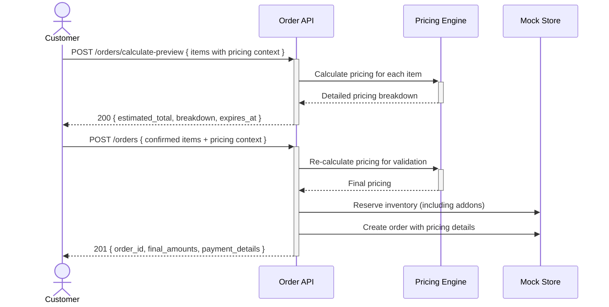

# Enhanced order creation with complex pricing integration — Dev Notes

## Status & Telemetry
- Status: Ready
- Readiness: mvp
- Spec Paths: /orders, /orders/calculate-preview
- Migrations: db/migrations/0011_enhanced_orders.sql
- Newman: 0/0 • reports/newman/enhanced-order-creation.json
- Last Update: 2025-10-26T10:35:00+0800

## 0) Prerequisites
- complex-pricing-engine card implemented
- Basic order creation functionality exists
- Payment processing supports complex pricing
- Inventory management for add-on products

## 1) API Sequence (Context)


## 2) Contract (OAS 3.0.3)
```yaml
paths:
  /orders/calculate-preview:
    post:
      tags: [OrderManagement]
      summary: Preview order pricing before commitment
      description: Calculates total pricing and breakdown without creating order
      requestBody:
        required: true
        content:
          application/json:
            schema:
              type: object
              properties:
                items:
                  type: array
                  items:
                    type: object
                    required: [product_id, quantity, pricing_context]
                    properties:
                      product_id:
                        type: integer
                      quantity:
                        type: integer
                        minimum: 1
                      pricing_context:
                        type: object
                        required: [booking_dates, customer_breakdown]
                        properties:
                          booking_dates:
                            type: array
                            items:
                              type: string
                              format: date
                          customer_breakdown:
                            type: array
                            items:
                              $ref: '#/components/schemas/CustomerBreakdown'
                          package_tier:
                            type: string
                            enum: [premium, pet, deluxe_tea_set]
                          addons:
                            type: array
                            items:
                              $ref: '#/components/schemas/AddonSelection'
                channel_id:
                  type: integer
                  description: Sales channel identifier
      responses:
        "200":
          description: Pricing preview calculated
          content:
            application/json:
              schema:
                type: object
                properties:
                  estimated_total:
                    type: number
                    format: decimal
                  items_breakdown:
                    type: array
                    items:
                      type: object
                      properties:
                        product_id:
                          type: integer
                        item_total:
                          type: number
                        pricing_details:
                          $ref: '#/components/schemas/PricingCalculationResponse'
                  expires_at:
                    type: string
                    format: date-time
                    description: When this pricing quote expires
                  quote_id:
                    type: string
                    description: Reference for price guarantee

  /orders:
    post:
      tags: [OrderManagement]
      summary: Create order with complex pricing
      description: Enhanced order creation supporting complex pricing calculations
      requestBody:
        required: true
        content:
          application/json:
            schema:
              type: object
              required: [user_id, items, channel_id, out_trade_no]
              properties:
                user_id:
                  type: integer
                items:
                  type: array
                  items:
                    type: object
                    required: [product_id, quantity, pricing_context]
                    properties:
                      product_id:
                        type: integer
                      quantity:
                        type: integer
                      pricing_context:
                        $ref: '#/components/schemas/PricingContext'
                channel_id:
                  type: integer
                out_trade_no:
                  type: string
                  description: Idempotency key
                quote_id:
                  type: string
                  description: Optional price quote reference
      responses:
        "201":
          description: Order created successfully
          content:
            application/json:
              schema:
                type: object
                properties:
                  order_id:
                    type: integer
                  status:
                    type: string
                    enum: [CREATED]
                  amounts:
                    type: object
                    properties:
                      subtotal:
                        type: number
                      addons_total:
                        type: number
                      pricing_adjustments:
                        type: array
                        items:
                          $ref: '#/components/schemas/PricingAdjustment'
                      total:
                        type: number
                  created_at:
                    type: string
                    format: date-time
                  payment_url:
                    type: string
                    description: Payment gateway URL
        "400":
          description: Invalid request - pricing calculation failed
        "409":
          description: Idempotency conflict - order already exists
        "422":
          description: Inventory unavailable or pricing validation failed

components:
  schemas:
    PricingContext:
      type: object
      required: [booking_dates, customer_breakdown]
      properties:
        booking_dates:
          type: array
          items:
            type: string
            format: date
        customer_breakdown:
          type: array
          items:
            $ref: '#/components/schemas/CustomerBreakdown'
        package_tier:
          type: string
          enum: [premium, pet, deluxe_tea_set]
        addons:
          type: array
          items:
            $ref: '#/components/schemas/AddonSelection'

    CustomerBreakdown:
      type: object
      required: [customer_type, count]
      properties:
        customer_type:
          type: string
          enum: [adult, child, elderly]
        count:
          type: integer
          minimum: 1

    AddonSelection:
      type: object
      required: [addon_id, quantity]
      properties:
        addon_id:
          type: string
        quantity:
          type: integer
          minimum: 1
```

## 3) Invariants
- Order total must match sum of individual item pricing calculations
- Pricing context must be validated before order creation
- Inventory must be available for all products and add-ons
- Add-on quantities must not exceed available inventory
- Customer breakdown totals must match item quantities
- Booking dates must be valid and in the future
- Order amounts must include detailed pricing breakdown

## 4) Validations, Idempotency & Concurrency
- Validate all items have valid product_ids with complex pricing
- Validate pricing_context completeness and consistency
- Re-calculate pricing during order creation to prevent race conditions
- Check inventory availability atomically with order creation
- Use out_trade_no for idempotency (return existing order if duplicate)
- Validate quote_id hasn't expired if provided
- Prevent double-booking of limited inventory items

## 5) Rules & Writes (TX)
**Order Preview Flow:**
1) Validate request structure and required fields
2) For each item: call complex-pricing-engine with pricing_context
3) Calculate total across all items and add-ons
4) Generate quote_id with expiration time (15 minutes)
5) Return pricing breakdown without creating order

**Order Creation Flow:**
1) Begin transaction
2) Validate idempotency (check existing order by user_id + out_trade_no)
3) Re-calculate pricing for all items (pricing may have changed)
4) Reserve inventory for products and add-ons (with rollback on failure)
5) Create order record with detailed pricing breakdown
6) Update inventory committed counts
7) Trigger payment processing setup
8) Commit transaction
9) Return order details with payment URL

## 6) Data Impact & Transactions
**Migration:** `db/migrations/0011_enhanced_orders.sql`
- Extend Order type in domain.ts with enhanced amounts structure
- Add pricing_breakdown field to store calculation details
- Add customer_context to order_items for audit trail
- Extend OrderItemRequest with pricing_context

**Enhanced domain types:**
```typescript
export interface OrderItemRequest {
  product_id: number;
  qty: number;
  pricing_context: {
    booking_dates: ISODate[];
    customer_breakdown: CustomerBreakdown[];
    package_tier?: string;
    addons?: AddonSelection[];
  };
}

export interface Order {
  // ... existing fields
  amounts: {
    subtotal: number;
    addons_total: number;
    pricing_adjustments: PricingAdjustment[];
    discount: number;
    total: number;
  };
  pricing_breakdown?: {
    calculation_timestamp: ISODate;
    per_item_details: ItemPricingDetail[];
    quote_id?: string;
  };
}
```

## 7) Observability
- Log `order.preview.requested {items_count, total_customers}`
- Log `order.preview.calculated {estimated_total, quote_id}`
- Log `order.creation.started {user_id, out_trade_no, items_count}`
- Log `order.pricing.recalculated {order_id, price_difference}`
- Log `order.inventory.reserved {product_ids, addon_ids}`
- Log `order.creation.completed {order_id, final_total}`
- Metric `orders.complex_pricing.count`
- Metric `orders.pricing_preview.count`
- Metric `orders.addon.attachment_rate` by addon type

## 8) Acceptance — Given / When / Then

**Given** a customer wants to preview pricing for complex booking
**When** they POST to `/orders/calculate-preview` with full pricing context
**Then** receive detailed breakdown and 15-minute price quote

**Given** customer proceeds with order using valid quote_id
**When** they POST to `/orders` within quote expiration
**Then** order created with guaranteed pricing from quote

**Given** inventory runs low during order creation
**When** attempting to create order with unavailable add-ons
**Then** return 422 with specific inventory unavailability details

**Given** pricing rules change between preview and order creation
**When** creating order without quote_id
**Then** use current pricing and log price difference if significant

## 9) Postman Coverage
- Happy path: Preview → Create order flow with complex pricing
- Pricing validation: Create order with mismatched pricing context
- Inventory management: Attempt order with insufficient addon inventory
- Idempotency: Duplicate order creation with same out_trade_no
- Quote expiration: Use expired quote_id → recalculate pricing
- Edge cases: Invalid booking dates, customer breakdown mismatches
- Performance: Measure order creation time with complex pricing
- Add-on scenarios: Various addon combinations and package tiers