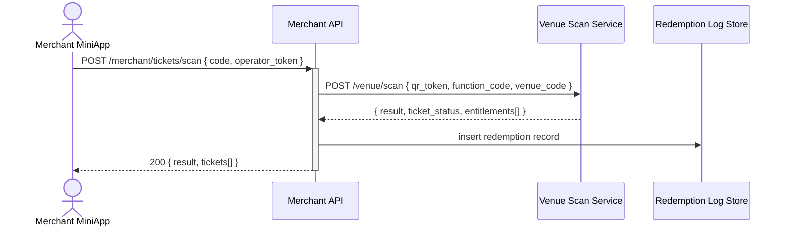

## Status & Telemetry
- Status: Ready
- Readiness: mvp（商家扫码端）
- Spec Paths: /merchant/tickets/scan, /merchant/orders/{orderId}, /merchant/redemptions
- Migrations: db/migrations/0014_merchant_redemptions.sql
- Newman: 待实现 • reports/newman/merchant-redemption-console.json
- Last Update: 2025-10-24T18:28:44+08:00

## 0) Prerequisites
- operators-login 已提供核销员认证（JWT token）。
- venue-enhanced-scanning 卡片提供票券验证与状态写入逻辑（替代已废弃的 tickets-scan）。
- notification-orchestrator 负责核销成功通知。
- 商家账号、门店数据来自 admin-package-config。

> **Note**: `validators-sessions` 已废弃。核销员认证现在通过 JWT token 直接进行。

## 1) API Sequence (Context)


## 2) Contract (OAS 3.0.3)
```yaml
paths:
  /merchant/tickets/scan:
    post:
      tags: [Merchant]
      summary: Scan order or ticket QR and redeem items
      requestBody:
        required: true
        content:
          application/json:
            schema:
              type: object
              required: [code, session_id]
              properties:
                code:
                  type: string
                  description: QR token or order code
                session_id:
                  type: string
                location_id:
                  type: string
      responses:
        "200":
          description: Redemption result
          content:
            application/json:
              schema:
                type: object
                properties:
                  result:
                    type: string
                    enum: [success, partial, reject]
                  tickets:
                    type: array
                    items:
                      $ref: '#/components/schemas/MerchantTicket'
        "401":
          description: Session invalid or expired
        "409":
          description: Ticket not redeemable
  /merchant/orders/{orderId}:
    get:
      tags: [Merchant]
      summary: View order-level entitlements grouped by passenger
      parameters:
        - name: orderId
          in: path
          required: true
          schema:
            type: string
      responses:
        "200":
          description: Order entitlement summary
          content:
            application/json:
              schema:
                type: object
                properties:
                  order_id:
                    type: string
                  passengers:
                    type: array
                    items:
                      $ref: '#/components/schemas/PassengerEntitlements'
  /merchant/redemptions:
    get:
      tags: [Merchant]
      summary: List redemption history for reconciliation
      parameters:
        - name: date
          in: query
          required: false
          schema:
            type: string
            format: date
        - name: cursor
          in: query
          schema:
            type: string
      responses:
        "200":
          description: Redemption history
          content:
            application/json:
              schema:
                type: object
                properties:
                  items:
                    type: array
                    items:
                      $ref: '#/components/schemas/RedemptionLog'
                  next_cursor:
                    type: string
```

## 3) Invariants
- 核销员仅能操作与自身 `merchant_id` 关联的票券。
- 每次核销写入 `merchant_redemptions` 日志，包含操作人、地点、时间、entitlement。
- 支持部分核销：一次扫码只改变所选票券状态。
- QR token 验证由 venue-enhanced-scanning 负责，商家 API 不直接解析。

## 4) Validations, Idempotency & Concurrency
- 校验 `session_id`、`location_id` 与商家绑定关系。
- 防止重复核销：调用 venue/scan 时若返回 ALREADY_REDEEMED 状态 -> 显示已核销。
- 日志写入使用 (ticket_id, redemption_event_id) 唯一键保证幂等。
- Redemption 列表分页使用游标，确保对账稳定。

## 5) Rules & Writes (TX)
1. 验证商家 JWT token、门店权限。
2. 调用核心 `/venue/scan`，传递核销员上下文和 venue_code。
3. 对返回的每个核销成功的票券写日志（事务内批量插入）。
4. 触发通知 orchestrator；失败时记录重试队列。
5. 返回核销结果给前端。

## 6) Data Impact & Transactions
- 新建表 `merchant_redemptions`：id, merchant_id, operator_id, ticket_id, order_id, location_id, redeemed_at, result, meta。
- 新建表 `merchant_locations`（若未存在）存储核销点。
- 添加索引 `(merchant_id, redeemed_at DESC)`，支持分页。

## 7) Observability
- Metrics：`merchant.scan.success`, `merchant.scan.reject`, `merchant.scan.partial`。
- Logs：失败原因、权限拒绝、tickets-scan 错误。
- Audit：保留日志至少 365 天，用于结算。

## 8) Acceptance — Given / When / Then
- Given 有效票券，When 商家扫码核销，Then 返回 success 并记录日志。
- Given 他商票券，When 核销，Then 403/401。
- Given 已核销票券，When 再次扫码，Then 返回已核销提醒，不重复写日志。
- Given 查询历史，When 提供日期，Then 返回该日核销记录及 next_cursor。

## 9) Postman Coverage
- 核销成功、核销拒绝、权限不足、重复扫码、对账列表分页。
