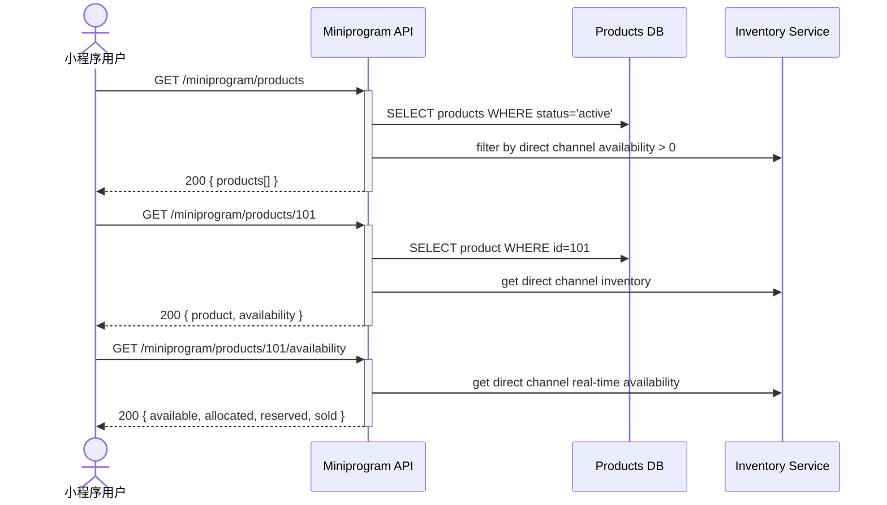

## Status & Telemetry
- Status: Ready for implementation
- Readiness: mvp（小程序商品展示）
- Spec Paths: /miniprogram/products, /miniprogram/products/:id
- Migrations: None（复用现有 products 和 product_inventory 表）
- Newman: 待实现 • reports/newman/miniprogram-product-catalog.json
- Last Update: 2025-11-21T17:00:00+08:00

## 0) Prerequisites
- catalog-endpoint 已实现（提供商品数据）
- product_inventory 表中已配置 `direct` channel 分配
- products 表中商品状态为 `active`
- 小程序用户通过微信 OAuth 登录（wechat-auth-login）

## 1) API Sequence (Context)


## 2) Contract (OAS 3.0.3)
```yaml
paths:
  /miniprogram/products:
    get:
      tags: [Miniprogram - Products]
      summary: 获取小程序商品列表（仅展示 direct channel 有库存的商品）
      parameters:
        - name: category
          in: query
          required: false
          schema:
            type: string
          description: "商品分类过滤"
        - name: page
          in: query
          schema:
            type: integer
            default: 1
        - name: limit
          in: query
          schema:
            type: integer
            default: 20
            maximum: 100
      responses:
        "200":
          description: 商品列表
          content:
            application/json:
              schema:
                type: object
                properties:
                  total:
                    type: integer
                    description: "总商品数"
                  page:
                    type: integer
                  page_size:
                    type: integer
                  products:
                    type: array
                    items:
                      type: object
                      properties:
                        id:
                          type: integer
                          example: 101
                        sku:
                          type: string
                          example: "PASS-3IN1"
                        name:
                          type: string
                          example: "3-in-1 Transport Pass"
                        description:
                          type: string
                        category:
                          type: string
                        base_price:
                          type: number
                          example: 288.00
                        weekend_premium:
                          type: number
                          example: 30.00
                        customer_discounts:
                          type: object
                          description: "乘客类型折扣"
                        entitlements:
                          type: array
                          items:
                            type: object
                            properties:
                              type:
                                type: string
                              description:
                                type: string
                        functions:
                          type: array
                          description: "商品包含的功能/权益"
                          items:
                            type: object
                            properties:
                              function_code:
                                type: string
                              label:
                                type: string
                              quantity:
                                type: integer
                        availability:
                          type: object
                          properties:
                            available:
                              type: integer
                              description: "direct channel 可售数量"
                            allocated:
                              type: integer
                            status:
                              type: string
                              enum: [in_stock, low_stock, out_of_stock]
                        sale_period:
                          type: object
                          properties:
                            start_at:
                              type: string
                              format: date-time
                            end_at:
                              type: string
                              format: date-time
                        status:
                          type: string
                          enum: [active, inactive]

  /miniprogram/products/{productId}:
    get:
      tags: [Miniprogram - Products]
      summary: 获取商品详情
      parameters:
        - name: productId
          in: path
          required: true
          schema:
            type: integer
      responses:
        "200":
          description: 商品详情
          content:
            application/json:
              schema:
                type: object
                properties:
                  id:
                    type: integer
                  sku:
                    type: string
                  name:
                    type: string
                  description:
                    type: string
                  category:
                    type: string
                  base_price:
                    type: number
                  weekend_premium:
                    type: number
                  customer_discounts:
                    type: object
                  entitlements:
                    type: array
                  functions:
                    type: array
                  availability:
                    type: object
                    properties:
                      channel:
                        type: string
                        default: "direct"
                      available:
                        type: integer
                      allocated:
                        type: integer
                      reserved:
                        type: integer
                      sold:
                        type: integer
                      status:
                        type: string
                  sale_period:
                    type: object
                  status:
                    type: string
                  images:
                    type: array
                    items:
                      type: string
                      format: uri
                  terms_and_conditions:
                    type: string
        "404":
          description: 商品不存在或不在 direct channel 销售

  /miniprogram/products/{productId}/availability:
    get:
      tags: [Miniprogram - Products]
      summary: 实时查询商品库存
      parameters:
        - name: productId
          in: path
          required: true
          schema:
            type: integer
        - name: quantity
          in: query
          required: false
          schema:
            type: integer
            default: 1
          description: "查询指定数量是否可售"
      responses:
        "200":
          description: 库存信息
          content:
            application/json:
              schema:
                type: object
                properties:
                  product_id:
                    type: integer
                  channel:
                    type: string
                    default: "direct"
                  available:
                    type: integer
                  allocated:
                    type: integer
                  reserved:
                    type: integer
                  sold:
                    type: integer
                  is_available:
                    type: boolean
                    description: "指定数量是否可售"
                  requested_quantity:
                    type: integer
                  status:
                    type: string
                    enum: [in_stock, low_stock, out_of_stock]
                  last_updated:
                    type: string
                    format: date-time
        "404":
          description: 商品不存在
```

## 3) Invariants
- 只展示 `status='active'` 的商品
- 只展示 `direct` channel 有库存分配（allocated > 0）的商品
- 可售数量 = allocated - reserved - sold（必须 > 0 才展示）
- 商品价格为基础价格，实际购买价格由 complex-pricing-engine 计算
- sale_period 范围外的商品不展示（如果设置了 sale_start_at 和 sale_end_at）

## 4) Validations, Idempotency & Concurrency
- productId 必须是有效的整数
- page 和 limit 参数范围验证（limit 最大 100）
- category 过滤时验证分类有效性
- 库存查询时加共享锁防止脏读
- 返回的 availability 数据为查询时刻的快照（非实时锁定）
- 实际下单时需要通过 seat-lock-service 锁定库存

## 5) Rules & Reads

### 商品列表查询流程
1. 查询 products 表（status='active'）
2. JOIN product_inventory 表
3. 过滤 channel_allocations.direct.allocated > 0
4. 计算 available = allocated - reserved - sold
5. 过滤 available > 0 的商品
6. 检查 sale_period（如果设置）
7. 按分类、价格、销量等排序
8. 分页返回

### 商品详情查询流程
1. 查询 products 表（id = productId）
2. 验证 status='active'
3. 查询 product_inventory.channel_allocations['direct']
4. 计算 available = allocated - reserved - sold
5. 如果 available <= 0，返回 404 或标记为 out_of_stock
6. 返回完整商品信息

### 库存状态判断
```typescript
if (available > 10) {
  status = 'in_stock';
} else if (available > 0 && available <= 10) {
  status = 'low_stock';
} else {
  status = 'out_of_stock';
}
```

## 6) Data Impact & Transactions
- 无数据写入（只读操作）
- 复用现有 `products` 和 `product_inventory` 表
- 查询时使用共享锁（SELECT ... LOCK IN SHARE MODE）防止并发问题
- 库存数据为快照，不保证下单时仍然可售

## 7) Observability
- Metrics:
  - `miniprogram.products.list.count` - 商品列表查询次数
  - `miniprogram.products.detail.count` - 商品详情查询次数
  - `miniprogram.products.list.latency` - 查询延迟
  - `miniprogram.products.out_of_stock.count` - 缺货商品访问次数
- Logs:
  - 记录商品查询（product_id, user_id, channel='direct'）
  - 记录缺货商品访问（用于补货决策）
  - 记录异常查询（invalid productId, etc.）
- Traces:
  - 对商品列表查询添加 `product_list_query` span
  - 对库存计算添加 `inventory_calculation` span

## 8) Acceptance — Given / When / Then
- Given 商品 101 在 direct channel 有 1000 库存，When 查询商品列表，Then 商品 101 出现在列表中
- Given 商品 102 在 direct channel 库存为 0，When 查询商品列表，Then 商品 102 不出现在列表中
- Given 商品 103 status='inactive'，When 查询商品列表，Then 商品 103 不出现在列表中
- Given 商品 104 在 direct channel 可售 5 个，When 查询详情，Then availability.status='low_stock'
- Given 商品 105 不存在，When 查询详情，Then 返回 404
- Given 商品 106 有 sale_end_at 已过期，When 查询商品列表，Then 商品 106 不出现
- Given 请求 quantity=5，商品可售 3 个，When 查询 availability，Then is_available=false

## 9) Postman Coverage
- 场景：查询商品列表（成功、分页、分类过滤）
- 场景：查询商品详情（成功、商品不存在、库存为 0）
- 场景：查询库存可用性（充足、不足、缺货）
- 场景：验证只展示 direct channel 商品
- 场景：验证 sale_period 过滤
- 场景：验证库存状态判断（in_stock, low_stock, out_of_stock）

## Integration Points
- **catalog-endpoint** 提供商品基础数据
- **product-inventory** 提供 direct channel 库存数据
- **complex-pricing-engine** 提供价格计算（下单时使用）
- **wechat-auth-login** 提供用户身份认证
- **order-create** 后续下单流程使用商品数据

## Business Rules
- **小程序专属库存**：只展示 direct channel 分配的商品
- **实时库存展示**：available 数量实时计算，但不锁定
- **缺货自动隐藏**：available <= 0 的商品不在列表展示
- **低库存提示**：available <= 10 显示 "low_stock" 状态
- **价格展示**：显示基础价格，实际价格在下单时动态计算
- **销售期限控制**：超出 sale_period 的商品自动隐藏

## Notes
- 此 API 为只读操作，不涉及库存锁定
- 实际下单时需调用 order-create 并通过 seat-lock-service 锁定库存
- 商品图片和详细描述需要从 products 表的 JSON 字段读取
- 支持后续扩展：推荐商品、热门商品、搜索功能等
- direct channel 是小程序专用，与 OTA channel 完全隔离
