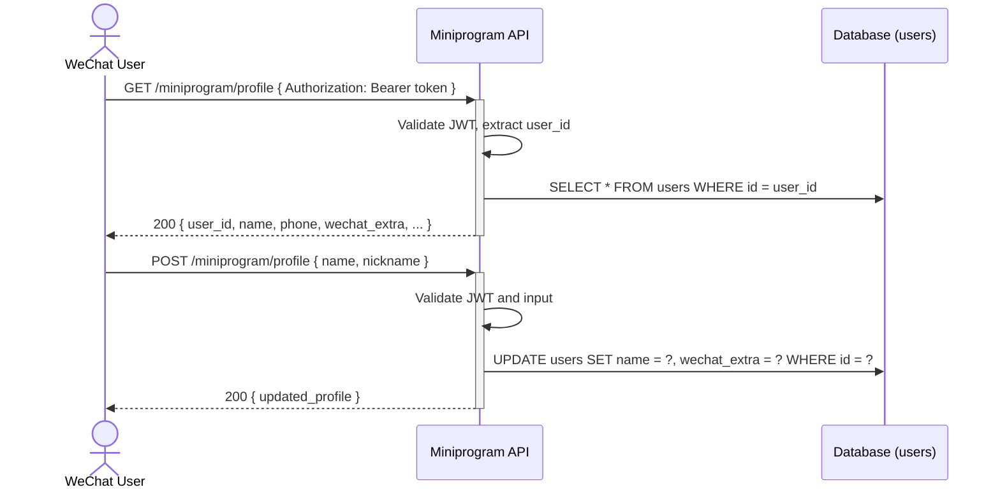

# Miniprogram User Profile Management — Dev Notes

## Status & Telemetry
- Status: In Progress
- Readiness: mvp
- Spec Paths: /miniprogram/profile
- Migrations: None (uses existing users table)
- Last Update: 2025-12-11

## 0) Prerequisites
- User authentication system (JWT via /auth/wechat/login)
- User entity exists in database (users table)
- miniprogram module available

## 1) API Sequence (Context)


## 2) Contract (OAS 3.0.3)
```yaml
paths:
  /miniprogram/profile:
    get:
      tags: [MiniprogramProfile]
      summary: Get current user's profile
      description: Retrieve authenticated WeChat user's profile data
      security:
        - BearerAuth: []
      responses:
        "200":
          description: Profile retrieved successfully
          content:
            application/json:
              schema:
                $ref: '#/components/schemas/MiniprogramUserProfile'
        "401":
          description: Unauthorized - invalid or missing token

    post:
      tags: [MiniprogramProfile]
      summary: Update user profile
      description: Update authenticated user's profile (partial update supported)
      security:
        - BearerAuth: []
      requestBody:
        required: true
        content:
          application/json:
            schema:
              type: object
              properties:
                name:
                  type: string
                  minLength: 1
                  maxLength: 50
                  description: Display name
                nickname:
                  type: string
                  maxLength: 50
                  description: WeChat nickname (stored in wechat_extra)
      responses:
        "200":
          description: Profile updated successfully
          content:
            application/json:
              schema:
                $ref: '#/components/schemas/MiniprogramUserProfile'
        "400":
          description: Bad request - invalid input
        "401":
          description: Unauthorized - invalid or missing token
        "422":
          description: Validation failed

components:
  schemas:
    MiniprogramUserProfile:
      type: object
      properties:
        user_id:
          type: integer
        name:
          type: string
        nickname:
          type: string
          description: From wechat_extra.nickname
        phone:
          type: string
          description: Bound phone number
        updated_at:
          type: string
          format: date-time
```

## 3) Invariants
- Only authenticated users can access/update their own profile
- Profile updates only affect allowed fields (name, nickname)
- Phone binding uses separate endpoint (/auth/wechat/phone)

## 4) Validations
- name: 1-50 characters, trimmed
- nickname: 0-50 characters, trimmed
- JWT token must be valid and not expired

## 5) Rules & Writes (TX)
**GET /miniprogram/profile:**
1) Validate JWT token, extract user_id
2) Query user from database
3) Transform to response format (exclude sensitive fields)

**POST /miniprogram/profile:**
1) Validate JWT token, extract user_id
2) Validate input fields
3) Load user record
4) Update allowed fields:
   - name → users.name
   - nickname → users.wechat_extra.nickname
5) Save and return updated profile

## 6) Data Impact
- No new tables required
- Uses existing `users` table
- Updates `name` and `wechat_extra` JSON fields

## 7) Observability
- Log `miniprogram.profile.get.success {user_id}`
- Log `miniprogram.profile.update.success {user_id, fields_changed}`
- Log `miniprogram.profile.update.error {user_id, error}`

## 8) Acceptance — Given / When / Then
**Given** an authenticated miniprogram user
**When** they GET `/miniprogram/profile`
**Then** their profile information is returned

**Given** an authenticated user wants to update their name
**When** they POST `/miniprogram/profile` with { name: "新名字" }
**Then** their name is updated and new profile is returned

**Given** an unauthenticated request
**When** they access `/miniprogram/profile`
**Then** 401 Unauthorized is returned

## 9) Postman Coverage
- Happy path: GET profile returns user data
- Happy path: POST profile updates name
- Happy path: POST profile updates nickname
- Validation: POST with empty name → 422
- Security: Access without token → 401
