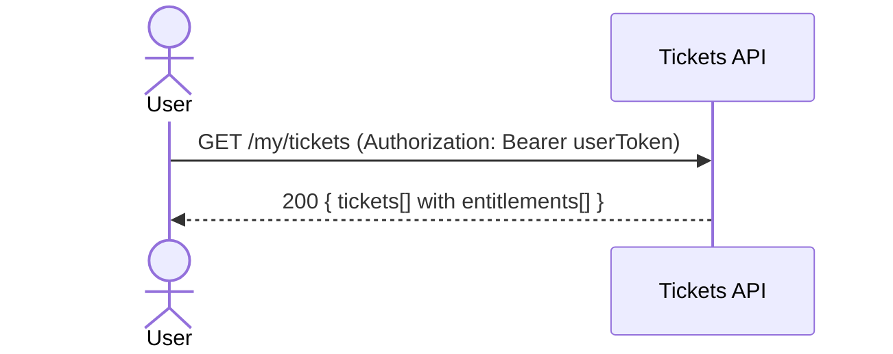

## Status & Telemetry
- Status: Ready
- Readiness: prototype
- Spec Paths: /my/tickets
- Migrations: N/A
- Newman: 0/0 • reports/newman/my-tickets.json
- Last Update: 2025-10-20T09:56:51+0800

## 0) Prerequisites
- Service up; `/healthz` → 200.
- Tickets issuance exists and writes `tickets` with `entitlements`.
- User auth available to resolve `user_id` (mock JWT ok).

## 1) API Sequence (Context)


## 2) Contract (OAS 3.0.3 fragment)
```yaml
paths:
  /my/tickets:
    get:
      tags: [Tickets]
      summary: List buyer's tickets
      security: [{ bearerAuth: [] }]
      responses:
        "200":
          description: OK
          content:
            application/json:
              schema:
                type: object
                properties:
                  tickets:
                    type: array
                    items:
                      $ref: '#/components/schemas/Ticket'
```

## 3) Invariants
- Only tickets for the authenticated user are returned.
- Include `entitlements[function_code,label,remaining_uses]`.

## 4) Validations, Idempotency & Concurrency
- Auth required; no idempotency for GET.
- Stable sort by `created_at DESC` or `id DESC`.

## 5) Rules & Reads
1) Resolve `user_id` from JWT.  
2) Read tickets for `user_id`; join entitlements.  
3) Map into `TicketListResponse` and return 200.

## 6) Data Impact
- Read-only.

## 7) Observability
- Log `tickets.list {count}`; metric `tickets.list.count`.

## 8) Acceptance — Given / When / Then
**Given** user has at least one assigned ticket with entitlements.  
**When** `GET /my/tickets`.  
**Then** `200` with `tickets[].entitlements.length >= 1`.

## 9) Postman Coverage
```js
pm.test('200', ()=> pm.response.to.have.status(200));
const j = pm.response.json();
pm.expect(j.tickets.length).to.be.at.least(1);
pm.expect(j.tickets[0].entitlements.length).to.be.at.least(1);
```