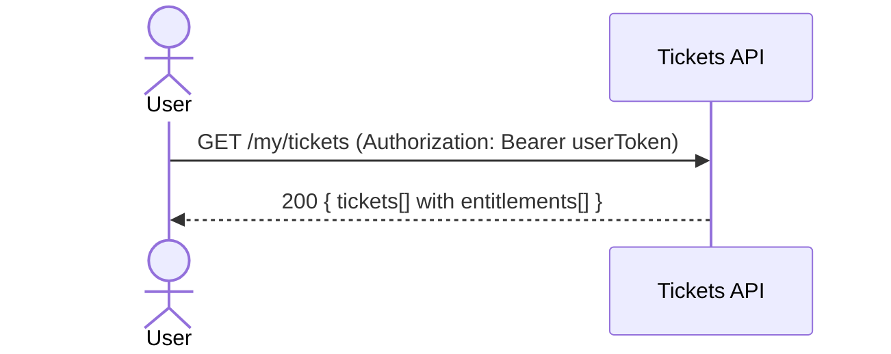

## Status & Telemetry
- Status: Ready
- Readiness: prototype
- Spec Paths: /my/tickets
- Migrations: N/A
- Newman: 0/0 • reports/newman/my-tickets.json
- Last Update: 2025-10-20T09:56:51+0800

## 0) Prerequisites
- Service up; `/healthz` → 200.
- Tickets issuance exists and writes `tickets` with `entitlements`.
- User auth available to resolve `user_id` (mock JWT ok).

## 1) API Sequence (Context)


## 2) Contract (OAS 3.0.3 fragment)
```yaml
paths:
  /my/tickets:
    get:
      tags: [Tickets]
      summary: List buyer's tickets
      security: [{ bearerAuth: [] }]
      responses:
        "200":
          description: OK
          content:
            application/json:
              schema:
                type: object
                properties:
                  tickets:
                    type: array
                    items:
                      $ref: '#/components/schemas/Ticket'
```

## 3) Invariants
- Only tickets for the authenticated user are returned.
- Include `entitlements[function_code,label,remaining_uses]`.

## 4) Validations, Idempotency & Concurrency
- Auth required; no idempotency for GET.
- Stable sort by `created_at DESC` or `id DESC`.

## 5) Rules & Reads
1) Resolve `user_id` from JWT.  
2) Read tickets for `user_id`; join entitlements.  
3) Map into `TicketListResponse` and return 200.

## 6) Data Impact
- Read-only.

## 7) Observability
- Log `tickets.list {count}`; metric `tickets.list.count`.

## 8) Acceptance — Given / When / Then

### 正常流程

#### AC-1: 获取用户票券列表
- **Given** 用户 user123 已认证，拥有 2 张票券
- **When** `GET /my/tickets` (Authorization: Bearer user123)
- **Then** 返回 200，`tickets.length = 2`
- **And** 每张票券包含 `ticket_code`, `status`, `entitlements[]`

#### AC-2: 票券包含完整权益信息
- **Given** 用户拥有票券，该票券有 3 个权益 (bus, ferry, mrt)
- **When** `GET /my/tickets`
- **Then** 票券的 `entitlements[]` 包含 3 项
- **And** 每项包含 `function_code`, `label`, `remaining_uses`

#### AC-3: 票券按时间排序
- **Given** 用户有多张票券，创建时间不同
- **When** `GET /my/tickets`
- **Then** 票券按 `created_at DESC` 排序（最新的在前）

### 异常流程

#### AC-4: 未认证请求
- **Given** 请求不包含 Authorization header
- **When** `GET /my/tickets`
- **Then** 返回 401，`{ error: "UNAUTHORIZED" }`

#### AC-5: 无效 token
- **Given** Authorization header 包含无效或过期的 token
- **When** `GET /my/tickets`
- **Then** 返回 401，`{ error: "INVALID_TOKEN" }`

#### AC-6: 用户无票券
- **Given** 用户已认证但没有任何票券
- **When** `GET /my/tickets`
- **Then** 返回 200，`{ tickets: [] }` 空数组

### 边界情况

#### AC-7: 大量票券
- **Given** 用户拥有 100 张票券
- **When** `GET /my/tickets`
- **Then** 返回 200，所有票券正确返回
- **And** 响应时间 < 2 秒

#### AC-8: 部分权益已使用
- **Given** 票券的某些权益 remaining_uses = 0
- **When** `GET /my/tickets`
- **Then** 返回所有权益（包括已用完的）
- **And** remaining_uses 准确反映剩余次数

## 9) Postman Coverage
```js
pm.test('200', ()=> pm.response.to.have.status(200));
const j = pm.response.json();
pm.expect(j.tickets.length).to.be.at.least(1);
pm.expect(j.tickets[0].entitlements.length).to.be.at.least(1);
```