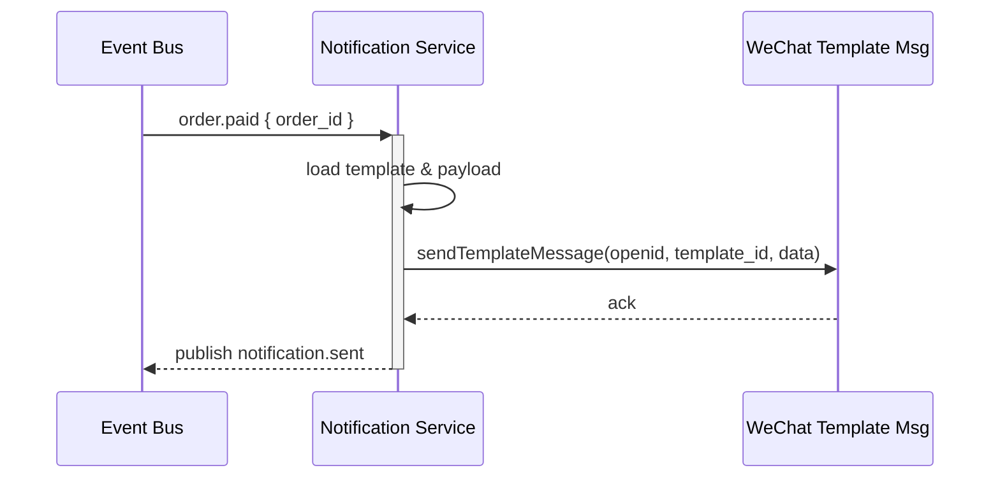

## Status & Telemetry
- Status: Ready
- Readiness: prototype（统一通知）
- Spec Paths: /notifications/preview, /notifications/templates
- Migrations: db/migrations/0016_notification_templates.sql
- Newman: 待实现 • reports/newman/notification-orchestrator.json
- Last Update: 2025-10-24T18:28:44+08:00

## 0) Prerequisites
- Event bus发布：payment-webhook、ticket-lifecycle-daemon、merchant-redemption-console。
- 微信模板消息密钥配置可用；可扩展 SMS 通道但默认关闭。
- 消息重试队列（如 Redis Stream / RabbitMQ DLQ）可用。

## 1) API Sequence (Context)


## 2) Contract (OAS 3.0.3)
```yaml
paths:
  /notifications/templates:
    post:
      tags: [Notifications]
      summary: Upsert notification templates and channel config
      requestBody:
        required: true
        content:
          application/json:
            schema:
              type: object
              required: [event, channel, template_id]
              properties:
                event:
                  type: string
                  enum: [order.paid, order.cancelled, ticket.refunded, ticket.expired, ticket.redeemed]
                channel:
                  type: string
                  enum: [wechat]
                template_id:
                  type: string
                enabled:
                  type: boolean
                  default: true
                payload_schema:
                  type: object
    get:
      tags: [Notifications]
      summary: List configured notification templates
      responses:
        "200":
          description: Templates
  /notifications/preview:
    post:
      tags: [Notifications]
      summary: Render notification payload for QA
      requestBody:
        required: true
        content:
          application/json:
            schema:
              type: object
              required: [event, data]
              properties:
                event:
                  type: string
                data:
                  type: object
      responses:
        "200":
          description: Rendered payload
```

## 3) Invariants
- 仅启用的模板会发送；禁用时事件仍记录但不推送。
- 每次发送必须记录 send_id、event、channel、状态、重试次数。
- 重试策略指数退避，最多 5 次；仍失败写入 DLQ 并告警。
- 支持多语言：模板存储 language 字段，旅客 locale 未命中 fallback zh-CN。

## 4) Validations, Idempotency & Concurrency
- 通过 `(event, order_id, ticket_id?, channel)` 唯一键确保相同事件不重复推送（尤其核销/退改）。
- 校验 payload 数据满足模板 schema；缺字段则记录失败并拒绝发送。
- 消费事件时使用幂等 token；重复事件返回 success 且不重发。
- 发送调用微信接口需校验返回码，失败进入重试队列。

## 5) Rules & Writes (TX)
1. 监听事件队列 `order.paid`, `order.cancelled`, `ticket.refunded`, `ticket.redeemed`, `ticket.expired`。
2. 根据用户 openid、模板配置组装 payload。
3. 调用微信模板消息 API；记录发送日志 `notification_events`。
4. 发送成功发布 `notification.sent` 事件；失败写重试/告警。

## 6) Data Impact & Transactions
- 新表 `notification_templates`（event, channel, language, template_id, enabled, payload_schema JSON）。
- 新表 `notification_events`（id, event, entity_id, channel, status, attempts, last_error, sent_at）。
- 新表 `notification_locks`（event, entity_id, channel）确保幂等。

## 7) Observability
- Metrics：`notifications.sent.success`, `notifications.sent.failure`, `notifications.retry.count`。
- Logs：记录请求参数、返回码、错误堆栈。
- Alerts：连续失败 >3 次或 DLQ 累积超阈值触发。

## 8) Acceptance — Given / When / Then
- Given 支付成功事件，When orchestrator 收到 order.paid，Then 向旅客发送支付成功通知。
- Given 模板禁用，When 事件触发，Then 不发送但记录 skipped。
- Given 微信接口失败两次，When 第三次成功，Then attempts=3 且状态 success。
- Given 重复事件，When 已存在锁记录，Then 不重复发送。

## 9) Postman Coverage
- 模板创建、模板列表、预览渲染；事件驱动在集成测试覆盖（成功、失败、重试、禁用、重复）。
