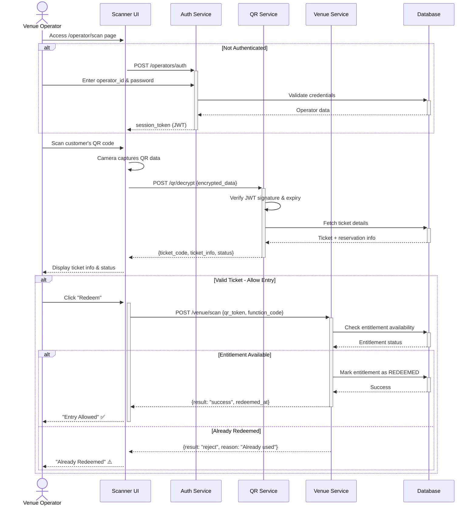
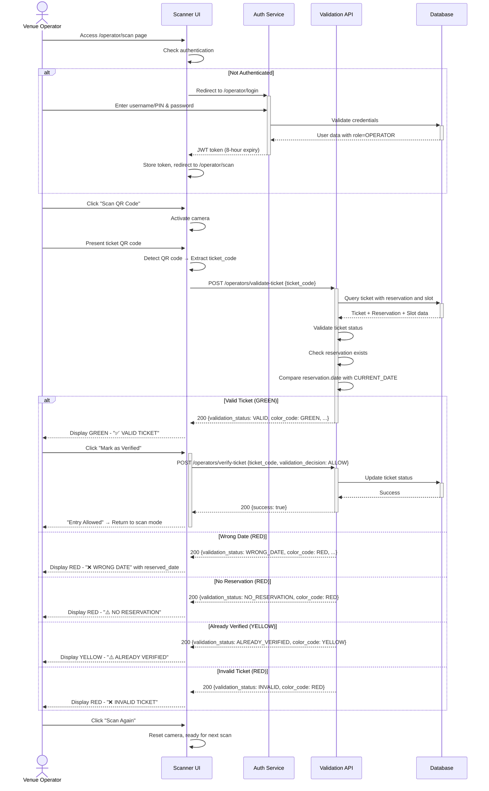

# Operator Validation Scanner — Dev Notes

## Status & Telemetry
- Status: Ready
- Readiness: mvp
- **Primary Paths (Production)**: /operators/auth, /qr/decrypt, /venue/scan
- **Legacy Paths (Display Only)**: /operators/validate-ticket, /operators/verify-ticket
- Migrations: db/migrations/0022_operator_validation.sql
- Newman: 79/79 • reports/newman/prd-007-e2e.xml
- Last Update: 2025-12-16T12:00:00+08:00

## 0) Prerequisites
- customer-reservation-portal implemented (reservations exist)
- operators-login implemented or simple operator auth available
- QR scanner library integrated (html5-qrcode or react-qr-reader)
- Camera access permissions configured
- tickets, ticket_reservations, reservation_slots tables exist

## 1) Primary API Sequence (Production)



### Primary API Endpoints

| Step | Endpoint | Purpose |
|------|----------|---------|
| 1 | `POST /operators/auth` | Operator login, returns session_token |
| 2 | `POST /qr/decrypt` | Decrypt QR code, returns ticket info |
| 3 | `POST /venue/scan` | Redeem ticket entitlement |

---

## 2) Legacy API Sequence (Display Validation Only)

> **Note**: This flow is for display validation (GREEN/YELLOW/RED) only.
> For actual ticket redemption in production, use the Primary API Sequence above.



### Legacy API Endpoints

| Step | Endpoint | Purpose |
|------|----------|---------|
| 1 | `POST /operators/auth` | Operator login |
| 2 | `POST /operators/validate-ticket` | Check ticket status (GREEN/YELLOW/RED) |
| 3 | `POST /operators/verify-ticket` | Record operator decision |

---

## 3) Contract (OAS 3.0.3)
```yaml
paths:
  /api/operator/login:
    post:
      tags: ["Operator Authentication"]
      summary: Authenticate venue operator
      description: |
        Simple authentication for operators.
        Returns JWT token with 8-hour expiration.
        Alternative: Use existing multi-org auth with OPERATOR role.
      requestBody:
        required: true
        content:
          application/json:
            schema:
              type: object
              required: [username, password]
              properties:
                username:
                  type: string
                  example: "operator01"
                  description: "Operator username or PIN"
                password:
                  type: string
                  format: password
                  example: "secure_password"
                venue_id:
                  type: integer
                  nullable: true
                  example: 1
                  description: "Optional venue assignment"
      responses:
        200:
          description: Authentication successful
          content:
            application/json:
              schema:
                type: object
                properties:
                  success:
                    type: boolean
                    example: true
                  data:
                    type: object
                    properties:
                      token:
                        type: string
                        example: "eyJhbGciOiJIUzI1NiIsInR5cCI6IkpXVCJ9..."
                        description: "JWT token for subsequent requests"
                      operator_id:
                        type: integer
                        example: 5
                      operator_name:
                        type: string
                        example: "Jane Smith"
                      role:
                        type: string
                        example: "OPERATOR"
                      venue_id:
                        type: integer
                        nullable: true
                        example: 1
                      expires_at:
                        type: string
                        format: date-time
                        example: "2025-11-14T18:30:00Z"
        401:
          description: Invalid credentials
          content:
            application/json:
              schema:
                type: object
                properties:
                  success:
                    type: boolean
                    example: false
                  error:
                    type: object
                    properties:
                      code:
                        type: string
                        example: "INVALID_CREDENTIALS"
                      message:
                        type: string
                        example: "Invalid username or password"
        429:
          description: Too many failed attempts (rate limiting)

  /api/operator/validate-ticket:
    post:
      tags: ["Operator Scanning"]
      summary: Validate ticket for venue entry
      description: |
        Check ticket status, reservation, and date matching.
        Returns color-coded validation result for operator display.
        Does NOT modify ticket status (use verify-ticket for that).
      security:
        - BearerAuth: []
      requestBody:
        required: true
        content:
          application/json:
            schema:
              type: object
              required: [ticket_code]
              properties:
                ticket_code:
                  type: string
                  example: "TKT-2025-ABC123-DEF456"
                  description: "Extracted from QR code or manual entry"
      responses:
        200:
          description: Validation completed (check validation_status for result)
          content:
            application/json:
              schema:
                type: object
                properties:
                  success:
                    type: boolean
                    example: true
                  data:
                    type: object
                    properties:
                      ticket_id:
                        type: integer
                        example: 123
                      ticket_code:
                        type: string
                        example: "TKT-2025-ABC123-DEF456"
                      status:
                        type: string
                        enum: [PENDING_PAYMENT, ACTIVATED, RESERVED, VERIFIED, EXPIRED]
                        example: "RESERVED"
                      customer_email:
                        type: string
                        example: "john@example.com"
                      customer_phone:
                        type: string
                        example: "+12025551234"
                      reservation:
                        type: object
                        nullable: true
                        properties:
                          reservation_id:
                            type: integer
                            example: 789
                          date:
                            type: string
                            format: date
                            example: "2025-11-14"
                          start_time:
                            type: string
                            format: time
                            example: "12:00:00"
                          end_time:
                            type: string
                            format: time
                            example: "14:00:00"
                          is_today:
                            type: boolean
                            example: true
                            description: "Whether reservation date matches current date"
                      validation_status:
                        type: string
                        enum: [VALID, INVALID, WRONG_DATE, NO_RESERVATION, ALREADY_VERIFIED]
                        example: "VALID"
                        description: "Validation result code"
                      color_code:
                        type: string
                        enum: [GREEN, RED, YELLOW]
                        example: "GREEN"
                        description: "UI color indicator"
                      reason:
                        type: string
                        nullable: true
                        example: null
                        description: "Human-readable reason if validation failed"
                      operator_action:
                        type: string
                        enum: [allow_entry, deny_entry, warning]
                        example: "allow_entry"
                      verified_info:
                        type: object
                        nullable: true
                        description: "Present if ticket already verified"
                        properties:
                          verified_at:
                            type: string
                            format: date-time
                            example: "2025-11-14T09:30:00Z"
                          verified_by:
                            type: integer
                            example: 5
                          operator_name:
                            type: string
                            example: "Jane Smith"
                      current_date:
                        type: string
                        format: date
                        example: "2025-11-14"
                        description: "Server's current date for reference"
        401:
          description: Unauthorized - invalid or missing operator token
        404:
          description: Ticket not found (returns as validation_status=INVALID)

  /api/operator/verify-ticket:
    post:
      tags: ["Operator Scanning"]
      summary: Mark ticket as verified (allow entry)
      description: |
        Updates ticket status to VERIFIED.
        Records verification timestamp and operator ID.
        Should only be called after validate-ticket returns VALID.
      security:
        - BearerAuth: []
      requestBody:
        required: true
        content:
          application/json:
            schema:
              type: object
              required: [ticket_id, operator_id]
              properties:
                ticket_id:
                  type: integer
                  example: 123
                operator_id:
                  type: integer
                  example: 5
                  description: "ID of operator performing verification"
      responses:
        200:
          description: Ticket verified successfully
          content:
            application/json:
              schema:
                type: object
                properties:
                  success:
                    type: boolean
                    example: true
                  data:
                    type: object
                    properties:
                      ticket_id:
                        type: integer
                        example: 123
                      ticket_code:
                        type: string
                        example: "TKT-2025-ABC123-DEF456"
                      status:
                        type: string
                        enum: [VERIFIED]
                        example: "VERIFIED"
                      verified_at:
                        type: string
                        format: date-time
                        example: "2025-11-14T10:30:00Z"
                      verified_by:
                        type: integer
                        example: 5
                      operator_name:
                        type: string
                        example: "Jane Smith"
        400:
          description: Invalid request or ticket not in RESERVED status
        401:
          description: Unauthorized
        404:
          description: Ticket not found
        409:
          description: Ticket already verified (idempotent - returns existing verification)

components:
  securitySchemes:
    BearerAuth:
      type: http
      scheme: bearer
      bearerFormat: JWT
```

## 4) Invariants
- Only operators with valid JWT tokens can access validation APIs
- Validation checks run in specific order: status → reservation → date
- GREEN result requires: status=RESERVED AND has_reservation AND date_matches
- RED result triggers entry denial with specific reason
- YELLOW result indicates warning (already verified) but allows operator discretion
- Verification is one-way: RESERVED → VERIFIED (cannot un-verify)
- Verification records operator_id for audit trail
- Tickets can be scanned multiple times (idempotent verification)

## 5) Validations, Idempotency & Concurrency

**Validation Logic (Sequential Checks):**
```javascript
validateTicket(ticket, reservation, currentDate) {
  // Check 1: Ticket exists
  if (!ticket) {
    return {status: 'INVALID', color: 'RED', reason: 'Ticket not found'};
  }

  // Check 2: Ticket status
  if (ticket.status === 'PENDING_PAYMENT') {
    return {status: 'INVALID', color: 'RED', reason: 'Payment not completed'};
  }
  if (ticket.status === 'EXPIRED') {
    return {status: 'INVALID', color: 'RED', reason: 'Ticket expired'};
  }
  if (ticket.status === 'VERIFIED') {
    return {
      status: 'ALREADY_VERIFIED',
      color: 'YELLOW',
      reason: `Already verified at ${ticket.verified_at}`,
      verified_info: {verified_at, verified_by, operator_name}
    };
  }
  if (ticket.status === 'ACTIVATED') {
    return {status: 'NO_RESERVATION', color: 'RED', reason: 'No reservation made'};
  }

  // Check 3: Has reservation
  if (!reservation || reservation.status !== 'RESERVED') {
    return {status: 'NO_RESERVATION', color: 'RED', reason: 'No active reservation'};
  }

  // Check 4: Date matching
  if (reservation.date !== currentDate) {
    return {
      status: 'WRONG_DATE',
      color: 'RED',
      reason: `Reserved for ${reservation.date}, not today (${currentDate})`,
      reserved_date: reservation.date
    };
  }

  // All checks passed
  return {
    status: 'VALID',
    color: 'GREEN',
    reason: null,
    operator_action: 'allow_entry'
  };
}
```

**Idempotency:**
- Validating same ticket multiple times: Returns same result (safe retry)
- Verifying already-verified ticket: Returns 409 with existing verification details
- Multiple simultaneous scans of same ticket: Transaction ensures one VERIFIED update

**Concurrency:**
- Use row-level locking when updating ticket to VERIFIED
- Prevent race condition if multiple operators scan same ticket simultaneously

**Error Handling:**
- 401: Invalid/expired JWT token → Redirect to login
- 404: Ticket not found → Return validation_status=INVALID
- 409: Already verified → Return warning with timestamp
- 500: Database error → Log and show generic error to operator

## 6) Rules & Writes (TX)

**POST /api/operator/login**:
```
1) Parse request body: {username, password, venue_id}
2) Query operator user:
   SELECT id, username, password_hash, name, role, venue_id
   FROM users
   WHERE username = ? AND role = 'OPERATOR'
3) Validate credentials:
   - IF NOT found → Return 401 INVALID_CREDENTIALS
   - IF password doesn't match hash → Return 401 INVALID_CREDENTIALS
   - IF account locked (failed attempts) → Return 429 TOO_MANY_ATTEMPTS
4) Generate JWT token:
   - Payload: {operator_id, username, role: 'OPERATOR', venue_id}
   - Expiry: 8 hours from now
   - Sign with secret key
5) Update last_login timestamp
6) Reset failed login attempts counter
7) Return success: {token, operator_id, operator_name, role, venue_id, expires_at}
```

**POST /api/operator/validate-ticket**:
```
1) Authenticate operator via JWT token (middleware)
2) Extract operator_id from token
3) Parse request body: {ticket_code}
4) Get current date: currentDate = DATE(NOW())

5) Query ticket with reservation and slot (single JOIN query):
   SELECT t.id, t.ticket_code, t.status, t.customer_email, t.customer_phone,
          t.verified_at, t.verified_by,
          r.id as reservation_id, r.status as reservation_status,
          s.date as slot_date, s.start_time, s.end_time,
          u.name as verified_by_name
   FROM tickets t
   LEFT JOIN ticket_reservations r ON t.id = r.ticket_id AND r.status IN ('RESERVED', 'VERIFIED')
   LEFT JOIN reservation_slots s ON r.slot_id = s.id
   LEFT JOIN users u ON t.verified_by = u.id
   WHERE t.ticket_code = ?

6) Run validation logic (see Validation Logic section above):
   - Check ticket exists
   - Check status (PENDING_PAYMENT, EXPIRED, VERIFIED, ACTIVATED, RESERVED)
   - Check has reservation
   - Check date matches

7) Build response based on validation result:
   - validation_status: VALID | INVALID | WRONG_DATE | NO_RESERVATION | ALREADY_VERIFIED
   - color_code: GREEN | RED | YELLOW
   - reason: Human-readable message (if not valid)
   - operator_action: allow_entry | deny_entry | warning
   - reservation: {date, start_time, end_time, is_today}
   - verified_info: {verified_at, verified_by, operator_name} (if already verified)
   - current_date: Server's current date for reference

8) Log validation event:
   {event: 'ticket.validated', ticket_id, operator_id, validation_status, color_code}

9) Return 200 with full validation details
```

**POST /api/operator/verify-ticket**:
```
1) Authenticate operator via JWT token (middleware)
2) Parse request body: {ticket_id, operator_id}
3) Validate operator_id matches token (or has permission)

4) BEGIN TRANSACTION
5) Lock and query ticket:
   SELECT id, ticket_code, status, orq
   FROM tickets
   WHERE id = ?
   FOR UPDATE;

6) Validate ticket:
   - IF NOT found → ROLLBACK, Return 404 {error: "Ticket not found"}
   - IF status = 'VERIFIED':
     - ROLLBACK (no changes needed)
     - Query existing verification: SELECT verified_at, verified_by FROM tickets WHERE id=?
     - Return 409 {error: "Already verified", data: {verified_at, verified_by}}
   - IF status != 'RESERVED':
     - ROLLBACK
     - Return 400 {error: "Ticket must be RESERVED to verify"}

7) Update ticket to VERIFIED:
   UPDATE tickets
   SET status = 'VERIFIED',
       verified_at = NOW(),
       verified_by = ?
   WHERE id = ?;

8) Update reservation to VERIFIED:
   UPDATE ticket_reservations
   SET status = 'VERIFIED'
   WHERE ticket_id = ?;

9) COMMIT TRANSACTION

10) Query operator name for response:
    SELECT name FROM users WHERE id = ?

11) Log verification event:
    {event: 'ticket.verified', ticket_id, operator_id, verified_at}

12) Return success:
    {
      success: true,
      data: {
        ticket_id,
        ticket_code,
        status: 'VERIFIED',
        verified_at: NOW(),
        verified_by: operator_id,
        operator_name: ...
      }
    }
```

## 7) Data Impact & Transactions

**Migration: db/migrations/0022_operator_validation.sql**

```sql
-- Ensure tickets table has verification fields (may already exist from previous migration)
-- This is defensive in case migrations run out of order
ALTER TABLE tickets
  ADD COLUMN IF NOT EXISTS verified_at TIMESTAMP NULL,
  ADD COLUMN IF NOT EXISTS verified_by INT NULL COMMENT 'Operator user ID';

-- Add index for operator queries
ALTER TABLE tickets
  ADD INDEX IF NOT EXISTS idx_verified_by (verified_by);

-- Ensure users table supports operator role
-- (May already exist, this is defensive)
ALTER TABLE users
  MODIFY COLUMN role ENUM('ADMIN', 'CUSTOMER', 'OPERATOR') DEFAULT 'CUSTOMER';

-- Add failed login tracking for rate limiting
ALTER TABLE users
  ADD COLUMN IF NOT EXISTS failed_login_attempts INT DEFAULT 0,
  ADD COLUMN IF NOT EXISTS last_failed_login TIMESTAMP NULL,
  ADD COLUMN IF NOT EXISTS account_locked_until TIMESTAMP NULL;

-- Create operator sessions table (optional for tracking active sessions)
CREATE TABLE IF NOT EXISTS operator_sessions (
  id INT AUTO_INCREMENT PRIMARY KEY,
  operator_id INT NOT NULL,
  token_hash VARCHAR(64) NOT NULL COMMENT 'SHA256 hash of JWT for revocation',
  venue_id INT NULL,
  device_info TEXT COMMENT 'User agent, IP, etc.',
  created_at TIMESTAMP DEFAULT CURRENT_TIMESTAMP,
  expires_at TIMESTAMP NOT NULL,
  revoked_at TIMESTAMP NULL,
  INDEX idx_operator_id (operator_id),
  INDEX idx_token_hash (token_hash),
  INDEX idx_expires_at (expires_at),
  FOREIGN KEY (operator_id) REFERENCES users(id) ON DELETE CASCADE
) ENGINE=InnoDB DEFAULT CHARSET=utf8mb4;
```

**Table Updates:**

**tickets:**
- `verified_at`: Timestamp when operator scanned ticket
- `verified_by`: Foreign key to users.id (operator who verified)

**users:**
- `role`: Add 'OPERATOR' enum value
- `failed_login_attempts`: Counter for rate limiting
- `last_failed_login`: Timestamp of last failed login
- `account_locked_until`: Temporary lock until this time

**operator_sessions (new, optional):**
- Tracks active operator sessions for security/auditing
- Enables token revocation if needed
- Stores device info for security alerts

## 8) Observability

**Logging Events:**
- `operator.login.success` - {operator_id, venue_id, device_info}
- `operator.login.failed` - {username, reason: INVALID_CREDENTIALS|ACCOUNT_LOCKED}
- `ticket.validation.requested` - {ticket_code, operator_id}
- `ticket.validation.result` - {ticket_id, operator_id, validation_status, color_code}
- `ticket.verified` - {ticket_id, operator_id, verified_at}
- `ticket.verification.failed` - {ticket_id, operator_id, reason}

**Metrics:**
- `operator.login.count` - Counter by result (success, invalid_credentials, account_locked)
- `operator.active_sessions.count` - Gauge of currently logged-in operators
- `ticket.validation.count` - Counter by validation_status (VALID, WRONG_DATE, NO_RESERVATION, etc.)
- `ticket.validation.latency` - P50/P95/P99 response times (target: <500ms)
- `ticket.verification.count` - Counter of successful verifications
- `ticket.validation.color_distribution` - Gauge by color_code (GREEN, RED, YELLOW)

**Alerts:**
- High validation denial rate (>20% RED in 15 min) - possible system issue or customer confusion
- Operator login failures spike (>5 failures in 5 min) - possible brute force attack
- Validation API latency >1s P95 - database performance issue
- High ALREADY_VERIFIED rate - possible duplicate scanning or UX issue

**Dashboard Metrics:**
- Real-time validation rate (scans per minute)
- Validation result distribution (pie chart: GREEN/RED/YELLOW)
- Top denial reasons (bar chart: WRONG_DATE, NO_RESERVATION, etc.)
- Operator activity (scans per operator)
- Average time per validation (histogram)

## 9) Acceptance — Given / When / Then

**Given** operator logs in with valid credentials
**When** they POST /api/operator/login
**Then** API returns JWT token valid for 8 hours

**Given** operator with valid token scans ticket with status RESERVED and correct date
**When** they POST /api/operator/validate-ticket
**Then** API returns validation_status=VALID, color_code=GREEN

**Given** ticket is RESERVED for Nov 20
**When** operator scans on Nov 14
**Then** API returns validation_status=WRONG_DATE, color_code=RED with reason

**Given** ticket is ACTIVATED but has no reservation
**When** operator scans
**Then** API returns validation_status=NO_RESERVATION, color_code=RED

**Given** ticket was already verified at 09:30 AM
**When** operator scans again at 10:00 AM
**Then** API returns validation_status=ALREADY_VERIFIED, color_code=YELLOW with verified_at

**Given** operator sees GREEN validation result
**When** they POST /api/operator/verify-ticket
**Then** ticket status becomes VERIFIED, verified_at recorded, verified_by set

**Given** ticket already verified
**When** operator tries to verify again
**Then** API returns 409 with existing verification details (idempotent)

**Given** 2 operators scan same ticket simultaneously
**When** both call verify-ticket at same time
**Then** first succeeds (200), second gets 409 ALREADY_VERIFIED

## 10) Postman Coverage

**Authentication Tests:**
- Operator login with valid credentials → 200 with JWT token
- Operator login with invalid password → 401 INVALID_CREDENTIALS
- Operator login with non-existent username → 401
- Access validation API without token → 401 Unauthorized
- Access validation API with expired token → 401

**Validation Happy Path:**
- Scan RESERVED ticket on correct date → GREEN (VALID)
- Scan and verify ticket → Status becomes VERIFIED
- Scan already-verified ticket → YELLOW (warning)

**Validation Error Scenarios:**
- Scan ticket with WRONG_DATE → RED with reserved_date shown
- Scan ACTIVATED ticket without reservation → RED (NO_RESERVATION)
- Scan PENDING_PAYMENT ticket → RED (INVALID)
- Scan EXPIRED ticket → RED (INVALID)
- Scan non-existent ticket code → RED (INVALID)

**Verification Tests:**
- Verify RESERVED ticket → 200 success, status=VERIFIED
- Verify already-verified ticket → 409 with existing verification
- Verify ACTIVATED ticket (not reserved) → 400 Bad Request
- Verify with invalid ticket_id → 404 Not Found

**Concurrency Tests:**
- 2 operators scan same ticket simultaneously → Both see validation result
- 2 operators verify same ticket simultaneously → One succeeds, one gets 409

**Performance Tests:**
- Validation response time <500ms (P95)
- Verification response time <1s (P95)
- Load test: 100 concurrent validations

**Integration Tests:**
- Full flow: Login → Scan valid ticket → Verify → Check ticket status
- Scan ticket reserved for different date → Verify denial
- Scan ticket without reservation → Verify denial
- Scan after hours (date changed) → Verify date validation

**Security Tests:**
- JWT token expiry after 8 hours
- Rate limiting on failed login attempts
- Operator cannot verify tickets from different organization (orq check)
- Token revocation (if operator_sessions implemented)

**Edge Cases:**
- Scan at midnight (date boundary) - verify date comparison works
- Scan ticket immediately after reservation created elsewhere
- Verify ticket with missing operator_name in database
- Scan with malformed ticket_code → Graceful error handling
