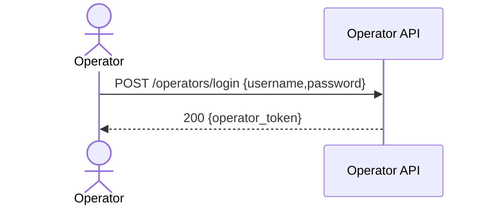

## Status & Telemetry
- Status: Ready
- Readiness: production
- Spec Paths: /operators/login
- Migrations: N/A
- Newman: 0/0 • reports/newman/operators-login.json
- Last Update: 2025-10-20T00:12:44+0800

## 0) Prerequisites
- Operators store exists (mock or DB) with `{username, password_hash, operator_id, roles[]}`.
- JWT secret `OPERATOR_JWT_SECRET` in env.

## 1) API Sequence (Context)


## 2) Contract (OAS 3.0.3 fragment)
```yaml
paths:
  /operators/login:
    post:
      tags: [Operators]
      summary: Operator login (get operator_token)
      requestBody:
        required: true
        content:
          application/json:
            schema:
              type: object
              required: [username, password]
              properties:
                username: { type: string }
                password: { type: string, format: password }
      responses:
        "200":
          description: OK
          content:
            application/json:
              schema:
                type: object
                properties:
                  operator_token: { type: string }
        "401":
          description: invalid credentials
```

## 3) Invariants
- Credentials must match stored operator.
- Token encodes `sub=operator_id`, `roles`, `iat`, `exp`.

## 4) Validations, Idempotency & Concurrency
- 401 on bad creds; simple rate-limit optional.
- No idempotency concerns.

## 5) Rules & Writes
1) Lookup operator by `username`.  
2) Verify password (bcrypt).  
3) Issue JWT (HS256) with `exp` (e.g., 24h).  
4) Return `{operator_token}`.

## 6) Data Impact
- Read-only (operators table or mock).

## 7) Observability
- Log `operators.login {operator_id}` on success; `operators.login.fail` on fail.  
- Metric `operators.login.count`.

## 8) Acceptance — Given / When / Then

### 正常流程

#### AC-1: 操作员登录成功
- **Given** 操作员 `alice` 存在，密码为 `secret123`
- **When** `POST /operators/login` `{ username: "alice", password: "secret123" }`
- **Then** 返回 200，`{ operator_token: "..." }`
- **And** token 解码后包含 `sub`（operator_id）和 `roles`

#### AC-2: Token 包含正确信息
- **Given** 操作员 alice 有角色 `["scanner", "reporter"]`
- **When** 登录成功
- **Then** token payload 包含 `{ sub: "alice_id", roles: ["scanner", "reporter"], exp: ... }`

### 异常流程

#### AC-3: 密码错误
- **Given** 操作员 `alice` 存在
- **When** `POST /operators/login` `{ username: "alice", password: "wrong" }`
- **Then** 返回 401，`{ error: "INVALID_CREDENTIALS" }`

#### AC-4: 用户名不存在
- **Given** 操作员 `unknown` 不存在
- **When** `POST /operators/login` `{ username: "unknown", password: "any" }`
- **Then** 返回 401，`{ error: "INVALID_CREDENTIALS" }`
- **Note** 不应暴露用户名是否存在

#### AC-5: 缺少必填字段
- **Given** 请求缺少 username 或 password
- **When** `POST /operators/login` `{ username: "alice" }`
- **Then** 返回 400，`{ error: "VALIDATION_ERROR" }`

### 边界情况

#### AC-6: 账户被禁用
- **Given** 操作员 `bob` 存在但 status='disabled'
- **When** `POST /operators/login` `{ username: "bob", password: "correct" }`
- **Then** 返回 401/403，`{ error: "ACCOUNT_DISABLED" }`

#### AC-7: 并发登录
- **Given** 同一操作员同时发起多个登录请求
- **When** 并发 `POST /operators/login`
- **Then** 所有请求正常返回 token（允许多设备登录）

#### AC-8: Token 过期时间
- **Given** 登录成功
- **When** 检查 token 的 exp 字段
- **Then** 过期时间为当前时间 + 24 小时（或配置值）

## 9) Postman Coverage
```js
pm.test('200', ()=> pm.response.to.have.status(200));
const j = pm.response.json();
pm.expect(j).to.have.property('operator_token');
```