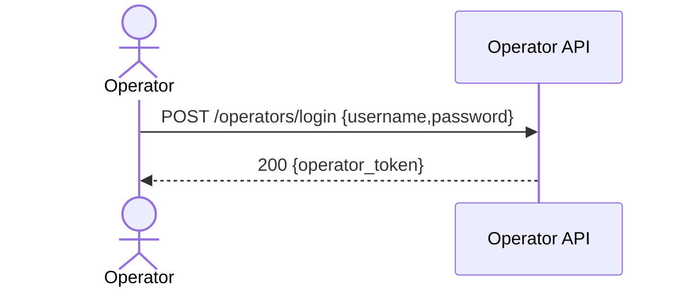

## Status & Telemetry
- Status: Ready
- Readiness: production
- Spec Paths: /operators/login
- Migrations: N/A
- Newman: 0/0 • reports/newman/operators-login.json
- Last Update: 2025-10-20T00:12:44+0800

## 0) Prerequisites
- Operators store exists (mock or DB) with `{username, password_hash, operator_id, roles[]}`.
- JWT secret `OPERATOR_JWT_SECRET` in env.

## 1) API Sequence (Context)


## 2) Contract (OAS 3.0.3 fragment)
```yaml
paths:
  /operators/login:
    post:
      tags: [Operators]
      summary: Operator login (get operator_token)
      requestBody:
        required: true
        content:
          application/json:
            schema:
              type: object
              required: [username, password]
              properties:
                username: { type: string }
                password: { type: string, format: password }
      responses:
        "200":
          description: OK
          content:
            application/json:
              schema:
                type: object
                properties:
                  operator_token: { type: string }
        "401":
          description: invalid credentials
```

## 3) Invariants
- Credentials must match stored operator.
- Token encodes `sub=operator_id`, `roles`, `iat`, `exp`.

## 4) Validations, Idempotency & Concurrency
- 401 on bad creds; simple rate-limit optional.
- No idempotency concerns.

## 5) Rules & Writes
1) Lookup operator by `username`.  
2) Verify password (bcrypt).  
3) Issue JWT (HS256) with `exp` (e.g., 24h).  
4) Return `{operator_token}`.

## 6) Data Impact
- Read-only (operators table or mock).

## 7) Observability
- Log `operators.login {operator_id}` on success; `operators.login.fail` on fail.  
- Metric `operators.login.count`.

## 8) Acceptance — Given / When / Then
**Given** operator `alice` with password `secret123`.  
**When** `POST /operators/login {username:"alice", password:"secret123"}`.  
**Then** `200 {operator_token}`; token decodes with `sub` and `roles`.  
**And** a wrong password returns `401`.

## 9) Postman Coverage
```js
pm.test('200', ()=> pm.response.to.have.status(200));
const j = pm.response.json();
pm.expect(j).to.have.property('operator_token');
```