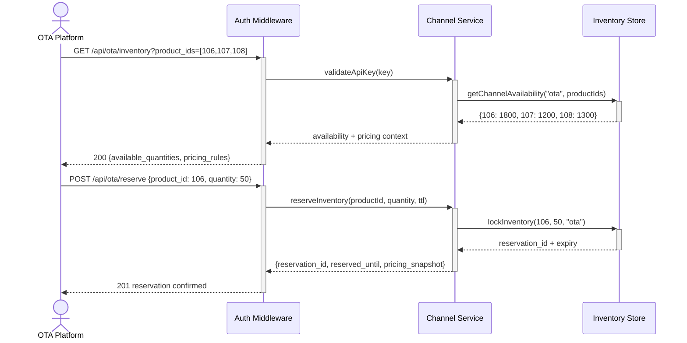

# OTA Channel Management - Inventory Allocation and Reservation — Dev Notes

## Status & Telemetry
- Status: Ready
- Readiness: mvp
- Spec Paths: /api/ota/inventory, /api/ota/reserve
- Migrations: db/migrations/0010_channel_inventory.sql, 0011_channel_reservations.sql
- Newman: Ready for implementation • reports/newman/ota-channel-management.json
- Last Update: 2025-11-03T14:30:00+08:00

## 0) Prerequisites
- catalog-endpoint card implemented (product availability data)
- order-create card implemented (inventory management patterns)
- ota-authentication-middleware card implemented (API security)
- Product inventory tracking system functional
- Mock data store supports channel-specific inventory operations

## 1) API Sequence (Context)


## 2) Contract (OAS 3.0.3)
```yaml
paths:
  /api/ota/inventory:
    get:
      tags: ["OTA Integration"]
      summary: Get real-time package availability for OTA channel
      security:
        - ApiKeyAuth: []
      parameters:
        - name: product_ids
          in: query
          description: Comma-separated list of product IDs to check
          schema:
            type: string
            example: "106,107,108"
        - name: date_range
          in: query
          description: Optional date range for availability check
          schema:
            type: string
            example: "2025-11-15,2025-12-15"
      responses:
        200:
          description: Current availability for requested products
          content:
            application/json:
              schema:
                type: object
                properties:
                  available_quantities:
                    type: object
                    description: Product ID to available quantity mapping
                    example:
                      "106": 1800
                      "107": 1200
                      "108": 1300
                  pricing_context:
                    type: object
                    properties:
                      base_prices:
                        type: object
                        example:
                          "106": {"weekday": 288, "weekend": 318}
                      customer_types:
                        type: array
                        items:
                          type: string
                        example: ["adult", "child", "elderly"]
                      special_dates:
                        type: object
                        example:
                          "2025-12-31": {"multiplier": 1.5}
                      customer_discounts:
                        type: object
                        description: Product-specific customer type discounts
                        example:
                          "106": {"child": 100, "elderly": 50, "student": 50}
                          "107": {"child": 150, "family": 100, "elderly": 75}
                          "108": {"vip": 200, "elderly": 100}
        401:
          description: Invalid or missing API key
        403:
          description: Insufficient permissions
        422:
          description: Invalid product IDs or date range

  /api/ota/reserve:
    post:
      tags: ["OTA Integration"]
      summary: Reserve package inventory for OTA sales
      security:
        - ApiKeyAuth: []
      requestBody:
        required: true
        content:
          application/json:
            schema:
              type: object
              required: [product_id, quantity]
              properties:
                product_id:
                  type: integer
                  description: Package product ID to reserve
                  example: 106
                quantity:
                  type: integer
                  minimum: 1
                  maximum: 100
                  description: Number of package units to reserve
                  example: 50
                reservation_expires_at:
                  type: string
                  format: date-time
                  description: Optional custom expiry (default 24h)
                  example: "2025-11-04T14:30:00+08:00"
      responses:
        201:
          description: Inventory successfully reserved
          content:
            application/json:
              schema:
                type: object
                properties:
                  reservation_id:
                    type: string
                    description: Unique reservation identifier
                    example: "res_67890"
                  reserved_until:
                    type: string
                    format: date-time
                    description: Reservation expiry timestamp
                    example: "2025-11-04T14:30:00+08:00"
                  pricing_snapshot:
                    type: object
                    description: Current pricing for reserved packages
                    properties:
                      base_price:
                        type: number
                        example: 288.00
                      weekend_premium:
                        type: number
                        example: 30.00
                      customer_discounts:
                        type: object
                        example:
                          "child": 100.00
                          "elderly": 100.00
        400:
          description: Invalid request data
        401:
          description: Invalid or missing API key
        403:
          description: Insufficient permissions
        409:
          description: Insufficient inventory available
        422:
          description: Validation failed

components:
  schemas:
    ChannelReservation:
      type: object
      properties:
        reservation_id:
          type: string
          description: Unique reservation identifier
        product_id:
          type: integer
          description: Package product being reserved
        channel_id:
          type: string
          description: Sales channel (e.g., "ota")
        quantity:
          type: integer
          description: Number of units reserved
        status:
          type: string
          enum: [active, expired, activated, cancelled]
          description: Current reservation status
        expires_at:
          type: string
          format: date-time
          description: When reservation expires
        created_at:
          type: string
          format: date-time
          description: When reservation was created

  securitySchemes:
    ApiKeyAuth:
      type: apiKey
      in: header
      name: X-API-Key
```

## 3) Invariants
- OTA inventory pool is separate from direct sales inventory
- Total allocated inventory (OTA + direct) never exceeds product sellable_cap
- Reservations automatically expire after 24 hours if not activated
- Channel inventory allocations must sum to product sellable_cap
- Only authenticated OTA partners can access reservation endpoints
- Reservation quantities must be available in OTA channel allocation

## 4) Validations, Idempotency & Concurrency
- Validate product exists and has OTA allocation configured
- Check requested quantity against available OTA inventory
- Use database row locking for inventory updates to prevent overselling
- Implement reservation expiry cleanup job for unused reservations
- Rate limiting prevents excessive reservation attempts
- Idempotent reservation creation (same request returns same reservation_id)

## 5) Rules & Writes (TX)
**Channel Inventory Allocation Setup:**
1) Initialize channel allocations for Products 106-108:
   - Product 106: 2000 units allocated to "ota" channel
   - Product 107: 1500 units allocated to "ota" channel
   - Product 108: 1500 units allocated to "ota" channel
2) Update existing inventory tracking to support channel separation
3) Maintain real-time sync between channel allocations and reservations

**GET /api/ota/inventory:**
1) Authenticate API key and validate permissions
2) Parse and validate product_ids parameter
3) Query channel-specific availability for each product
4) Calculate available inventory (allocated - reserved - sold)
5) Fetch current pricing context from complex pricing engine
6) Return availability and pricing information

**POST /api/ota/reserve:**
1) Begin transaction with row-level locking
2) Authenticate and authorize OTA partner
3) Validate product_id exists and has OTA allocation
4) Check requested quantity against available OTA inventory
5) Create reservation record with unique ID and expiry
6) Update channel inventory (increment reserved_count)
7) Calculate current pricing snapshot for reservation
8) Commit transaction
9) Log reservation creation event
10) Return reservation details with expiry information

## 6) Data Impact & Transactions
**Migration 0010_channel_inventory.sql:**
```sql
-- Add channel-specific inventory tracking
ALTER TABLE product_inventory ADD COLUMN channel_allocations JSON DEFAULT '{}';

-- Initialize OTA allocations for cruise packages
UPDATE product_inventory SET channel_allocations = JSON_OBJECT(
    'direct', JSON_OBJECT('allocated', sellable_cap - CASE
        WHEN product_id = 106 THEN 2000
        WHEN product_id = 107 THEN 1500
        WHEN product_id = 108 THEN 1500
        ELSE 0 END),
    'ota', JSON_OBJECT('allocated', CASE
        WHEN product_id = 106 THEN 2000
        WHEN product_id = 107 THEN 1500
        WHEN product_id = 108 THEN 1500
        ELSE 0 END, 'reserved', 0, 'sold', 0)
) WHERE product_id IN (106, 107, 108);

-- Add indexes for performance
CREATE INDEX idx_product_inventory_channel ON product_inventory (product_id, (JSON_EXTRACT(channel_allocations, '$.ota.allocated')));
```

**Migration 0011_channel_reservations.sql:**
```sql
-- Create reservation tracking table
CREATE TABLE channel_reservations (
    reservation_id VARCHAR(50) PRIMARY KEY,
    product_id INT NOT NULL,
    channel_id VARCHAR(20) NOT NULL DEFAULT 'ota',
    quantity INT NOT NULL,
    status ENUM('active', 'expired', 'activated', 'cancelled') DEFAULT 'active',
    expires_at TIMESTAMP NOT NULL,
    created_at TIMESTAMP DEFAULT CURRENT_TIMESTAMP,
    activated_at TIMESTAMP NULL,
    order_id INT NULL,

    INDEX idx_reservations_status (status, expires_at),
    INDEX idx_reservations_product (product_id, channel_id),
    INDEX idx_reservations_expiry (expires_at, status),

    FOREIGN KEY (product_id) REFERENCES products(id) ON DELETE CASCADE,
    FOREIGN KEY (order_id) REFERENCES orders(id) ON DELETE SET NULL
);

-- Create cleanup job for expired reservations
DELIMITER //
CREATE EVENT cleanup_expired_reservations
ON SCHEDULE EVERY 1 HOUR
DO
BEGIN
    UPDATE channel_reservations
    SET status = 'expired'
    WHERE status = 'active' AND expires_at < NOW();

    -- Release inventory from expired reservations
    UPDATE product_inventory pi
    JOIN (
        SELECT product_id, SUM(quantity) as expired_qty
        FROM channel_reservations
        WHERE status = 'expired' AND activated_at IS NULL
        GROUP BY product_id
    ) cr ON pi.product_id = cr.product_id
    SET pi.channel_allocations = JSON_SET(
        pi.channel_allocations,
        '$.ota.reserved',
        JSON_EXTRACT(pi.channel_allocations, '$.ota.reserved') - cr.expired_qty
    );
END//
DELIMITER ;
```

## 7) Observability
- Log `ota.inventory.requested` with `{product_ids, partner_id, available_quantities}`
- Log `ota.reservation.created` with `{reservation_id, product_id, quantity, expires_at}`
- Log `ota.reservation.expired` with `{reservation_id, product_id, quantity}`
- Log `ota.inventory.insufficient` with `{product_id, requested, available}`
- Metric `ota.reservations.active.count` - Total active reservations
- Metric `ota.inventory.utilization.percent` - OTA allocation usage
- Alert on reservation expiry rate >10% or inventory conflicts

## 8) Acceptance — Given / When / Then
**Given** an authenticated OTA partner with valid API key
**When** GET /api/ota/inventory is called with product_ids "106,107,108"
**Then** returns current available quantities for each product in OTA channel allocation

**Given** Product 106 has 1800 units available in OTA allocation
**When** POST /api/ota/reserve with product_id=106, quantity=50
**Then** creates reservation with unique ID, reduces available by 50, sets 24h expiry

**Given** an active reservation for 50 units of Product 106
**When** another reservation request for 1800 units (exceeding remaining availability)
**Then** returns 409 Conflict with clear availability information

**Given** a reservation that expires after 24 hours
**When** cleanup job runs
**Then** reservation status changes to 'expired' and inventory is released back to OTA pool

**Given** invalid or missing API key
**When** any OTA endpoint is called
**Then** returns 401 Unauthorized with proper authentication guidance

## 9) Test Requirements (Copy-Paste Ready)

### Individual Endpoint Tests
- [ ] `curl -H "X-API-Key: ota_test_key_12345" http://localhost:8080/api/ota/inventory` → 200 response
- [ ] Response contains `available_quantities` field with Product 106 ~800 units
- [ ] Response time < 2 seconds
- [ ] `curl -X POST http://localhost:8080/api/ota/reserve -H "X-API-Key: ota_test_key_12345" -d '{"product_id":106,"quantity":5}'` → 201 response
- [ ] Returns `reservation_id` and `expires_at` fields
- [ ] Invalid API key → 401 error
- [ ] Overselling attempt (quantity > available) → 409 error

### API Sequence Tests (E2E Flow)
- [ ] **State Change Validation**: Before → Reserve → After inventory decreases correctly
- [ ] **Reservation Lifecycle**: Reserve → Check inventory reduced → Expiry → Inventory restored
- [ ] **Multi-Partner Isolation**: Partner A reservation doesn't affect Partner B inventory view

### Newman Report
- [ ] newman_report: `reports/newman/us-012-ota-integration-e2e.xml` passes all tests

## 10) E2E Runbook (Copy-Paste Commands)

```bash
#!/bin/bash
# OTA Channel Management - End-to-End Flow Test
# Copy-paste this entire block to validate the complete flow

echo "=== OTA Channel Management E2E Test ==="

# Step 1: Get initial inventory state
echo "Step 1: Check initial inventory"
INITIAL=$(curl -s -H "X-API-Key: ota_test_key_12345" \
  http://localhost:8080/api/ota/inventory | jq '.available_quantities["106"]')
echo "Initial Product 106 units: $INITIAL"

# Step 2: Create reservation
echo "Step 2: Create reservation for 5 units"
RESERVE_RESPONSE=$(curl -s -X POST http://localhost:8080/api/ota/reserve \
  -H "X-API-Key: ota_test_key_12345" \
  -H "Content-Type: application/json" \
  -d '{"product_id":106,"quantity":5}')
RESERVATION_ID=$(echo $RESERVE_RESPONSE | jq -r '.reservation_id')
echo "Reservation created: $RESERVATION_ID"

# Step 3: Verify inventory decrease
echo "Step 3: Verify inventory decreased"
AFTER_RESERVE=$(curl -s -H "X-API-Key: ota_test_key_12345" \
  http://localhost:8080/api/ota/inventory | jq '.available_quantities["106"]')
echo "After reserve: $AFTER_RESERVE"
DIFFERENCE=$((INITIAL - AFTER_RESERVE))
if [ $DIFFERENCE -eq 5 ]; then
  echo "✅ Inventory correctly decreased by 5"
else
  echo "❌ Inventory decrease failed. Expected: 5, Got: $DIFFERENCE"
fi

# Step 4: Test partner isolation
echo "Step 4: Test partner isolation"
PARTNER_B_VIEW=$(curl -s -H "X-API-Key: ota251103_key_67890" \
  http://localhost:8080/api/ota/inventory | jq '.available_quantities["106"]')
if [ $PARTNER_B_VIEW -eq $AFTER_RESERVE ]; then
  echo "✅ Partner isolation working - both partners see same inventory"
else
  echo "❌ Partner isolation failed"
fi

# Step 5: Test overselling prevention
echo "Step 5: Test overselling prevention"
OVERSELL_RESPONSE=$(curl -s -w "%{http_code}" -X POST http://localhost:8080/api/ota/reserve \
  -H "X-API-Key: ota_test_key_12345" \
  -H "Content-Type: application/json" \
  -d "{\"product_id\":106,\"quantity\":$((AFTER_RESERVE + 1))}")
HTTP_CODE=${OVERSELL_RESPONSE: -3}
if [ $HTTP_CODE -eq 409 ]; then
  echo "✅ Overselling prevention working"
else
  echo "❌ Overselling prevention failed. Expected: 409, Got: $HTTP_CODE"
fi

echo "=== E2E Test Complete ==="
```

## 11) Postman Coverage
- All individual endpoint tests from Test Requirements section
- Complete E2E flow validation script
- Error boundary testing (auth, overselling, invalid data)
- Performance validation (response times)
- Multi-partner isolation verification