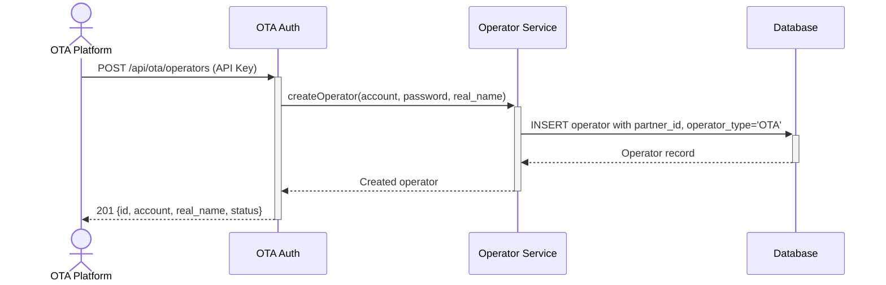

# OTA Operator Management - Dev Notes

## Status & Telemetry
- Status: Draft
- Readiness: mvp
- Spec Paths: /api/ota/operators, /api/ota/operators/:id
- Migrations: src/migrations/028-add-ota-operator-fields.ts
- Newman: Pending
- Last Update: 2025-12-29

## 0) Prerequisites
- operators-login card implemented (operator authentication)
- OTA authentication middleware with `operators` permission
- Database with operators table

## 1) Database Changes

### operators table additions
```sql
ALTER TABLE `operators`
  ADD COLUMN `partner_id` VARCHAR(50) NULL AFTER `merchant_id`,
  ADD COLUMN `operator_type` ENUM('INTERNAL', 'OTA') NOT NULL DEFAULT 'INTERNAL' AFTER `status`,
  ADD INDEX `idx_partner_id` (`partner_id`);
```

| Column | Type | Description |
|--------|------|-------------|
| partner_id | VARCHAR(50) | OTA partner identifier (null for INTERNAL) |
| operator_type | ENUM | INTERNAL or OTA |

## 2) API Sequence (Context)


## 3) Contract (OAS 3.0.3)
```yaml
paths:
  /api/ota/operators:
    post:
      tags: ["OTA Integration"]
      summary: Create operator for OTA platform
      security:
        - ApiKeyAuth: []
      requestBody:
        required: true
        content:
          application/json:
            schema:
              type: object
              required: [account, password, real_name]
              properties:
                account:
                  type: string
                  minLength: 4
                  maxLength: 50
                  example: "operator001"
                password:
                  type: string
                  minLength: 6
                  example: "securepass123"
                real_name:
                  type: string
                  maxLength: 100
                  example: "Zhang San"
      responses:
        201:
          description: Operator created
          content:
            application/json:
              schema:
                type: object
                properties:
                  id:
                    type: integer
                  account:
                    type: string
                  real_name:
                    type: string
                  status:
                    type: string
                    enum: [ACTIVE, DISABLED]
                  operator_type:
                    type: string
                    enum: [OTA]
                  created_at:
                    type: string
                    format: date-time
        400:
          description: Validation error
        409:
          description: Account already exists

    get:
      tags: ["OTA Integration"]
      summary: List operators for OTA platform
      security:
        - ApiKeyAuth: []
      parameters:
        - name: status
          in: query
          schema:
            type: string
            enum: [ACTIVE, DISABLED]
        - name: page
          in: query
          schema:
            type: integer
            default: 1
        - name: limit
          in: query
          schema:
            type: integer
            default: 20
      responses:
        200:
          description: Operator list
          content:
            application/json:
              schema:
                type: object
                properties:
                  data:
                    type: array
                    items:
                      $ref: '#/components/schemas/Operator'
                  total:
                    type: integer
                  page:
                    type: integer
                  limit:
                    type: integer

  /api/ota/operators/{id}:
    get:
      tags: ["OTA Integration"]
      summary: Get operator details
      security:
        - ApiKeyAuth: []
      parameters:
        - name: id
          in: path
          required: true
          schema:
            type: integer
      responses:
        200:
          description: Operator details
        404:
          description: Operator not found or not owned by this OTA

    patch:
      tags: ["OTA Integration"]
      summary: Update operator
      security:
        - ApiKeyAuth: []
      parameters:
        - name: id
          in: path
          required: true
          schema:
            type: integer
      requestBody:
        content:
          application/json:
            schema:
              type: object
              properties:
                real_name:
                  type: string
                password:
                  type: string
                  minLength: 6
      responses:
        200:
          description: Operator updated
        404:
          description: Operator not found or not owned by this OTA

    delete:
      tags: ["OTA Integration"]
      summary: Disable operator
      description: Sets operator status to DISABLED (soft delete)
      security:
        - ApiKeyAuth: []
      parameters:
        - name: id
          in: path
          required: true
          schema:
            type: integer
      responses:
        200:
          description: Operator disabled
          content:
            application/json:
              schema:
                type: object
                properties:
                  message:
                    type: string
                    example: "Operator disabled"
        404:
          description: Operator not found or not owned by this OTA

components:
  schemas:
    Operator:
      type: object
      properties:
        id:
          type: integer
        account:
          type: string
        real_name:
          type: string
        status:
          type: string
          enum: [ACTIVE, DISABLED]
        operator_type:
          type: string
          enum: [INTERNAL, OTA]
        created_at:
          type: string
          format: date-time
        updated_at:
          type: string
          format: date-time
```

## 4) Related API Modifications

### POST /operators/login Enhancement
- If operator is OTA type, include `partner_id` in JWT payload
- Existing response structure unchanged

### GET /venue Enhancement
- Add JWT token filtering for operator's `partner_id`
- If operator has `partner_id`, filter venues by that partner

### POST /qr/decrypt Enhancement
- If operator is OTA type, validate ticket's `partner_id` matches operator's
- Return error if mismatch

### POST /venue/scan Enhancement
- If operator is OTA type, validate ticket's `partner_id` matches operator's
- Return RED status if mismatch (unauthorized to redeem)

## 5) Implementation Files

| File | Action | Description |
|------|--------|-------------|
| `src/migrations/028-add-ota-operator-fields.ts` | Create | Add partner_id, operator_type to operators |
| `src/models/operator.entity.ts` | Modify | Add new fields |
| `src/middlewares/otaAuth.ts` | Modify | Add `operators` permission |
| `src/modules/ota/services/operator.service.ts` | Create | Operator CRUD service |
| `src/modules/ota/router.ts` | Modify | Add operator routes |
| `src/modules/operators/service.ts` | Modify | Include partner_id in login |
| `src/modules/venue/router.ts` | Modify | Add JWT partner filtering |
| `src/modules/qr-generation/router.ts` | Modify | Add OTA scope check |

## 6) Security Considerations

- OTA can only access operators with matching `partner_id`
- Password hashed with bcrypt before storage
- JWT contains `partner_id` for scope enforcement
- Cross-OTA access blocked at service layer

## 7) Acceptance Criteria

- [ ] OTA can create operators via API
- [ ] OTA can list only their own operators
- [ ] OTA can update/disable their operators
- [ ] Operator login returns JWT with partner_id
- [ ] Venue list filtered by operator's partner_id
- [ ] QR decrypt validates OTA scope
- [ ] Venue scan validates OTA scope
