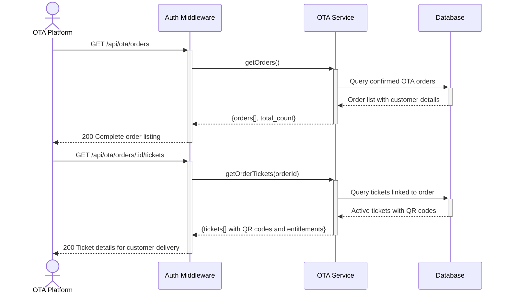

# OTA Order and Ticket Retrieval — Dev Notes

## Status & Telemetry
- Status: Done
- Readiness: mvp
- Spec Paths: /api/ota/orders, /api/ota/orders/:id/tickets
- Migrations: db/migrations/0013_ota_orders.sql
- Newman: Tested • reports/newman/ota-order-retrieval.xml
- Last Update: 2025-11-04T16:50:00+08:00

## 0) Prerequisites
- ota-premade-tickets card implemented (ticket activation creates orders)
- ota-reservation-management card implemented (activation flow)
- OTA order creation from ticket activation
- QR code generation and storage system

## 1) API Sequence (Context)


## 2) Contract (OAS 3.0.3)
```yaml
paths:
  /api/ota/orders:
    get:
      tags: ["OTA Integration"]
      summary: List all confirmed OTA orders
      security:
        - ApiKeyAuth: []
      parameters:
        - name: limit
          in: query
          schema:
            type: integer
            default: 50
            maximum: 100
          description: Maximum number of orders to return
        - name: offset
          in: query
          schema:
            type: integer
            default: 0
          description: Number of orders to skip
        - name: status
          in: query
          schema:
            type: string
            enum: [confirmed, completed, cancelled]
          description: Filter by order status
      responses:
        200:
          description: Orders retrieved successfully
          content:
            application/json:
              schema:
                type: object
                properties:
                  orders:
                    type: array
                    items:
                      type: object
                      properties:
                        order_id:
                          type: string
                          example: "ORD-1762273241549"
                        product_id:
                          type: integer
                          example: 106
                        customer_name:
                          type: string
                          example: "Maria Garcia"
                        customer_email:
                          type: string
                          example: "maria.garcia@example.com"
                        total_amount:
                          type: string
                          example: "382.00"
                        status:
                          type: string
                          enum: [confirmed, completed, cancelled]
                        created_at:
                          type: string
                          format: date-time
                        confirmation_code:
                          type: string
                          example: "CONF-1762273241549"
                  total_count:
                    type: integer
                    example: 2

  /api/ota/orders/{id}/tickets:
    get:
      tags: ["OTA Integration"]
      summary: Get QR codes and ticket details for order
      security:
        - ApiKeyAuth: []
      parameters:
        - name: id
          in: path
          required: true
          schema:
            type: string
            example: "ORD-1762273241549"
          description: Order ID to retrieve tickets for
      responses:
        200:
          description: Tickets retrieved successfully
          content:
            application/json:
              schema:
                type: object
                properties:
                  tickets:
                    type: array
                    items:
                      type: object
                      properties:
                        ticket_code:
                          type: string
                          example: "CRUISE-2025-FERRY-1762273144582"
                        qr_code:
                          type: string
                          description: Base64 encoded QR code for scanning
                          example: "data:image/png;base64,eyJ0aWNrZXRfaWQiOjE3NjI..."
                        entitlements:
                          type: array
                          items:
                            type: object
                            properties:
                              function_code:
                                type: string
                                example: "ferry"
                              remaining_uses:
                                type: integer
                                example: 1
                        status:
                          type: string
                          enum: [ACTIVE, REDEEMED, EXPIRED]
                          example: "ACTIVE"
        404:
          description: Order not found
        403:
          description: Access denied to order
```

## 3) Invariants
- Only confirmed orders are accessible via API
- Tickets must be in ACTIVE status to include QR codes
- QR codes contain encrypted ticket validation data
- Entitlements reflect current usage state
- Order access is restricted to creating OTA partner
- Customer data privacy must be maintained

## 4) Validations, Idempotency & Concurrency
- Validate order belongs to requesting OTA partner
- Ensure QR codes are only provided for active tickets
- Rate limiting on order listing to prevent abuse
- Ticket status validation before QR code generation
- Customer data access logging for audit trails
- Pagination limits to prevent large data dumps

## 5) Rules & Writes (TX)
**GET /api/ota/orders:**
1) Authenticate OTA partner
2) Apply pagination and filtering parameters
3) Query orders created by this partner
4) Include customer details and order status
5) Return paginated results with total count
6) Log access for audit purposes

**GET /api/ota/orders/:id/tickets:**
1) Authenticate and validate order access
2) Verify order belongs to requesting partner
3) Query all tickets linked to the order
4) Include QR codes only for ACTIVE tickets
5) Provide current entitlement status
6) Log ticket access for security audit

## 6) Data Impact & Transactions
**Read Operations:**
- ota_orders: Customer details, order status, amounts
- tickets (channel='ota'): QR codes, entitlements, status
- Join operations: Order → Tickets relationships

**Access Patterns:**
- Partner-scoped order queries
- Order-to-tickets associations
- Status-filtered ticket retrieval

## 7) Observability
- Log `ota.orders.listed` with `{partner_id, count, filters}`
- Log `ota.tickets.accessed` with `{order_id, ticket_count, partner_id}`
- Metric `ota.orders.daily.count` - Daily order creation rate
- Metric `ota.tickets.qr_access.rate` - QR code access frequency
- Alert on unusual access patterns or bulk data requests

## 8) Acceptance — Given / When / Then
**Given** confirmed OTA orders exist for partner
**When** GET /api/ota/orders is called
**Then** returns paginated order list with customer details and status

**Given** a specific order ID with active tickets
**When** GET /api/ota/orders/:id/tickets is called
**Then** returns tickets with QR codes and current entitlements

**Given** an order that doesn't belong to requesting partner
**When** GET /api/ota/orders/:id/tickets is attempted
**Then** returns 403 Forbidden with access denied message

**Given** an order with expired or redeemed tickets
**When** tickets are requested
**Then** returns tickets but QR codes reflect current status appropriately

**Given** pagination parameters (limit=10, offset=20)
**When** GET /api/ota/orders is called
**Then** returns exactly 10 orders starting from the 21st record

## 9) Postman Coverage
- Order listing: Test pagination, filtering, and access controls
- Ticket retrieval: Test QR code generation and entitlement accuracy
- Access validation: Test cross-partner order access restrictions
- Status filtering: Test order status and ticket status filtering
- Performance: Test large order sets and pagination efficiency
- Security: Test unauthorized access attempts and data exposure