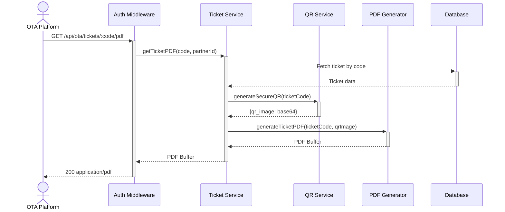

# OTA Ticket PDF Export — Dev Notes

## 0) Prerequisites
- ota-premade-tickets card implemented (ticket management)
- qr-generation-api card implemented (QR code generation)
- PDFKit library installed

## 1) API Sequence (Context)


## 2) Contract (OAS 3.0.3)
```yaml
paths:
  /api/ota/tickets/{code}/pdf:
    get:
      tags: ["OTA Integration"]
      summary: Export ticket as PDF
      description: |
        Generates a PDF document for a single ticket containing:
        - Title: [ E-Ticket ]
        - Ticket code
        - QR code
      security:
        - ApiKeyAuth: []
      parameters:
        - name: code
          in: path
          required: true
          schema:
            type: string
          description: Ticket code
          example: "BATCH-20251218-partner-ABC123"
      responses:
        200:
          description: PDF generated successfully
          content:
            application/pdf:
              schema:
                type: string
                format: binary
          headers:
            Content-Disposition:
              schema:
                type: string
              example: 'attachment; filename="BATCH-20251218-partner-ABC123.pdf"'
            Content-Type:
              schema:
                type: string
              example: 'application/pdf'
        403:
          description: Unauthorized - ticket not owned by partner
          content:
            application/json:
              schema:
                type: object
                properties:
                  code:
                    type: string
                    example: "UNAUTHORIZED"
                  message:
                    type: string
                    example: "Ticket does not belong to this partner"
        404:
          description: Ticket not found
          content:
            application/json:
              schema:
                type: object
                properties:
                  code:
                    type: string
                    example: "TICKET_NOT_FOUND"
                  message:
                    type: string
                    example: "Ticket not found"

  /api/ota/batches/{id}/pdf:
    get:
      tags: ["OTA Integration"]
      summary: Export all tickets in a batch as a single PDF
      description: |
        Generates a PDF document containing all tickets in a batch.
        Each ticket occupies one page.
      security:
        - ApiKeyAuth: []
      parameters:
        - name: id
          in: path
          required: true
          schema:
            type: string
          description: Batch ID
          example: "BATCH-20251218-partner-ABC123"
      responses:
        200:
          description: PDF generated successfully
          content:
            application/pdf:
              schema:
                type: string
                format: binary
          headers:
            Content-Disposition:
              schema:
                type: string
              example: 'attachment; filename="BATCH-20251218-partner-ABC123.pdf"'
        403:
          description: Unauthorized - batch not owned by partner
        404:
          description: Batch not found
```

## 3) Invariants
- Only OTA partners can export their own tickets
- PDF contains: title [ E-Ticket ], Ticket Code, QR code
- Supports PRE_GENERATED and ACTIVATED status tickets

## 4) Validations
- Validate ticket_code exists
- Validate ticket belongs to authenticated partner
- Validate ticket status (PRE_GENERATED or ACTIVATED)

## 5) Data Impact & Transactions
- **Read-only operation** - No database writes
- Fetches ticket from pre_generated_tickets table

## 6) Observability
- Log `ota.pdf.export.request` with `{ticket_code, partner_id}`
- Log `ota.pdf.export.success` with `{ticket_code, pdf_size_bytes}`
- Log `ota.pdf.export.error` with `{ticket_code, error_code}`

## 7) Acceptance — Given / When / Then

**Given** authenticated OTA partner with valid API key
**When** GET /api/ota/tickets/{own_ticket_code}/pdf
**Then** returns 200 with PDF binary content

**Given** authenticated OTA partner
**When** GET /api/ota/tickets/{other_partner_ticket}/pdf
**Then** returns 403 UNAUTHORIZED

**Given** non-existent ticket code
**When** GET /api/ota/tickets/{invalid_code}/pdf
**Then** returns 404 TICKET_NOT_FOUND

## 8) Testing & Validation

### Test Scenarios

**Valid PDF Export:**
```bash
curl -X GET http://localhost:8080/api/ota/tickets/BATCH-xxx/pdf \
  -H "X-API-Key: ota_full_access_key_99999" \
  -o ticket.pdf

# Expected: PDF file downloaded
```

**Unauthorized Access:**
```bash
curl -X GET http://localhost:8080/api/ota/tickets/OTHER-PARTNER-xxx/pdf \
  -H "X-API-Key: ota_full_access_key_99999"

# Expected: 403 {"code": "UNAUTHORIZED", "message": "..."}
```

## 9) PDF Layout

```
+---------------------------+
|       [ E-Ticket ]        |  ← Title (bold)
+---------------------------+
|                           |
|   Ticket Code: DT-xxxx    |  ← Ticket code
|                           |
|      +-------------+      |
|      |   QR Code   |      |  ← QR code
|      +-------------+      |
|                           |
+---------------------------+
```
