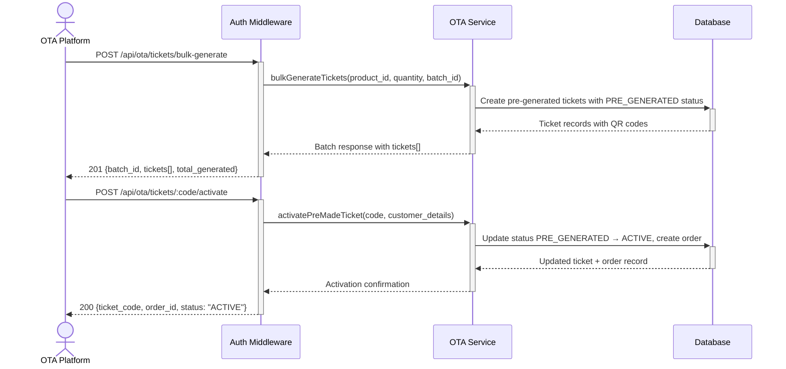

# OTA Pre-made Ticket Management — Dev Notes

## Status & Telemetry
- Status: Done
- Readiness: mvp
- Spec Paths: /api/ota/tickets/bulk-generate, /api/ota/tickets/:code/activate
- Migrations: db/migrations/0012_pre_generated_tickets.sql
- Newman: Tested • reports/newman/ota-premade-tickets.xml
- Last Update: 2025-11-12T13:00:00+08:00 (Added: qr_code in tickets list response)

## 0) Prerequisites
- ota-channel-management card implemented (inventory management)
- order-create card implemented (order creation patterns)
- Product catalog with function definitions available
- Database with pre_generated_tickets table

**QR Code Generation:**
- Pre-generated tickets receive static QR codes during bulk generation (for display purposes)
- For actual redemption, use `qr-generation-api` card to generate secure, time-limited encrypted QR codes
- See [qr-generation-api.md](qr-generation-api.md) for on-demand QR generation with configurable expiry

## 1) API Sequence (Context)


## 2) Contract (OAS 3.0.3)
```yaml
paths:
  /api/ota/tickets:
    get:
      tags: ["OTA Integration"]
      summary: List pre-made tickets with optional filters
      security:
        - ApiKeyAuth: []
      parameters:
        - name: status
          in: query
          required: false
          schema:
            type: string
            enum: [PRE_GENERATED, ACTIVE, USED, EXPIRED, CANCELLED]
          description: Filter by ticket status
          example: PRE_GENERATED
        - name: batch_id
          in: query
          required: false
          schema:
            type: string
          description: Filter by batch ID
          example: "BATCH-20251105-001"
        - name: created_after
          in: query
          required: false
          schema:
            type: string
            format: date-time
          description: Filter tickets created after this date (ISO 8601)
          example: "2025-11-01T00:00:00Z"
        - name: created_before
          in: query
          required: false
          schema:
            type: string
            format: date-time
          description: Filter tickets created before this date (ISO 8601)
          example: "2025-12-31T23:59:59Z"
        - name: page
          in: query
          required: false
          schema:
            type: integer
            minimum: 1
            default: 1
          description: Page number
          example: 1
        - name: limit
          in: query
          required: false
          schema:
            type: integer
            minimum: 1
            maximum: 1000
            default: 100
          description: Results per page (max 1000)
          example: 100
      responses:
        200:
          description: Ticket list retrieved successfully
          content:
            application/json:
              schema:
                type: object
                properties:
                  tickets:
                    type: array
                    items:
                      type: object
                      properties:
                        ticket_code:
                          type: string
                          example: "CRUISE-2025-FERRY-1762330663284"
                        status:
                          type: string
                          enum: [PRE_GENERATED, ACTIVE, USED, EXPIRED, CANCELLED]
                          description: |
                            Ticket lifecycle status:
                            - PRE_GENERATED: Newly generated, not yet activated
                            - ACTIVE: Activated by customer, ready for redemption
                            - USED: All entitlements fully consumed (automatic)
                            - EXPIRED: Past valid date
                            - CANCELLED: Manually cancelled by partner
                        batch_id:
                          type: string
                          example: "BATCH-20251105-001"
                        product_id:
                          type: integer
                          example: 106
                        created_at:
                          type: string
                          format: date-time
                        activated_at:
                          type: string
                          format: date-time
                          nullable: true
                        order_id:
                          type: string
                          nullable: true
                        customer_name:
                          type: string
                          nullable: true
                        customer_email:
                          type: string
                          nullable: true
                        qr_code:
                          type: string
                          format: base64
                          description: Base64-encoded QR code image (data URI format)
                          example: "data:image/png;base64,iVBORw0KGgoAAAANSUhEUgAA..."
                  total_count:
                    type: integer
                    example: 100
                  page:
                    type: integer
                    example: 1
                  page_size:
                    type: integer
                    example: 100
        422:
          description: Invalid query parameters
          content:
            application/json:
              schema:
                type: object
                properties:
                  error:
                    type: string
                    example: "INVALID_PARAMETER"
                  message:
                    type: string
                    example: "page must be a positive integer"

  /api/ota/tickets/bulk-generate:
    post:
      tags: ["OTA Integration"]
      summary: Generate pre-made tickets for OTA sales
      security:
        - ApiKeyAuth: []
      requestBody:
        required: true
        content:
          application/json:
            schema:
              type: object
              required: [product_id, quantity, batch_id]
              properties:
                product_id:
                  type: integer
                  description: Package product ID
                  example: 106
                quantity:
                  type: integer
                  minimum: 1
                  maximum: 100
                  description: Number of pre-made tickets to generate
                  example: 50
                batch_id:
                  type: string
                  description: Batch identifier for tracking
                  example: "BATCH_2025_Q1_001"
                distribution_mode:
                  type: string
                  enum: [direct_sale, reseller_batch]
                  description: Distribution strategy for batch
                  default: direct_sale
                  example: "reseller_batch"
                reseller_metadata:
                  type: object
                  description: Required for reseller_batch mode
                  properties:
                    intended_reseller:
                      type: string
                      description: Reseller company/partner name
                      example: "Travel Agency ABC"
                    batch_purpose:
                      type: string
                      description: Purpose of this reseller batch
                      example: "Q1 2025 Spring Campaign"
                    distribution_notes:
                      type: string
                      description: Additional distribution information
                      example: "For regional cruise promotion"
      responses:
        201:
          description: Pre-made tickets successfully generated
          content:
            application/json:
              schema:
                type: object
                properties:
                  batch_id:
                    type: string
                    example: "BATCH_2025_Q1_001"
                  distribution_mode:
                    type: string
                    example: "reseller_batch"
                  reseller_metadata:
                    type: object
                    properties:
                      intended_reseller:
                        type: string
                        example: "Travel Agency ABC"
                      batch_purpose:
                        type: string
                        example: "Q1 2025 Spring Campaign"
                  expires_at:
                    type: string
                    format: date-time
                    description: Batch expiry (extended for reseller_batch)
                  pricing_snapshot:
                    type: object
                    description: Locked pricing captured at generation time
                    properties:
                      base_price:
                        type: number
                        example: 288
                      customer_type_pricing:
                        type: array
                        items:
                          type: object
                          properties:
                            customer_type:
                              type: string
                              enum: [adult, child, elderly]
                            unit_price:
                              type: number
                            discount_applied:
                              type: number
                      currency:
                        type: string
                        example: "HKD"
                      captured_at:
                        type: string
                        format: date-time
                  tickets:
                    type: array
                    items:
                      type: object
                      properties:
                        ticket_code:
                          type: string
                          example: "CRUISE-2025-FERRY-1762274285982"
                        qr_code:
                          type: string
                          description: Base64 encoded QR code
                        status:
                          type: string
                          enum: [PRE_GENERATED]
                        entitlements:
                          type: array
                          items:
                            type: object
                            properties:
                              function_code:
                                type: string
                              remaining_uses:
                                type: integer
                  total_generated:
                    type: integer
                    example: 50

  /api/ota/tickets/{code}/activate:
    post:
      tags: ["OTA Integration"]
      summary: Activate pre-made ticket with customer details
      security:
        - ApiKeyAuth: []
      parameters:
        - name: code
          in: path
          required: true
          schema:
            type: string
            example: "CRUISE-2025-FERRY-1762274285982"
      requestBody:
        required: true
        content:
          application/json:
            schema:
              type: object
              required: [customer_details, customer_type, payment_reference]
              properties:
                customer_details:
                  type: object
                  required: [name, email, phone]
                  properties:
                    name:
                      type: string
                      example: "John Smith"
                    email:
                      type: string
                      format: email
                      example: "john.smith@example.com"
                    phone:
                      type: string
                      example: "+1234567890"
                customer_type:
                  type: string
                  enum: [adult, child, elderly]
                  description: Customer type for pricing (determines final ticket price)
                  example: "adult"
                visit_date:
                  type: string
                  format: date
                  description: "Intended visit date (YYYY-MM-DD) - OPTIONAL. Used for weekend pricing calculation. If provided and is a weekend (Saturday/Sunday), weekend_premium will be added to the base price."
                  example: "2025-11-23"
                payment_reference:
                  type: string
                  description: OTA payment transaction reference
                  example: "PAY-OTA-2025-001"
      responses:
        200:
          description: Ticket successfully activated
          content:
            application/json:
              schema:
                type: object
                properties:
                  ticket_code:
                    type: string
                    example: "CRUISE-2025-FERRY-1762274285982"
                  order_id:
                    type: string
                    example: "ORD-1762274304824"
                  customer_name:
                    type: string
                    example: "John Smith"
                  customer_type:
                    type: string
                    enum: [adult, child, elderly]
                    example: "adult"
                  ticket_price:
                    type: number
                    description: "Final ticket price (includes weekend premium if applicable)"
                    example: 318
                  currency:
                    type: string
                    example: "HKD"
                  status:
                    type: string
                    enum: [ACTIVE]
                  activated_at:
                    type: string
                    format: date-time
        400:
          description: Invalid request data
        404:
          description: Ticket not found or already activated
        409:
          description: Ticket already activated
```

## 3) Invariants
- Pre-made tickets start with status PRE_GENERATED
- Only PRE_GENERATED tickets can be activated
- Activation creates corresponding OTA order record with correct product_id and partner_id
- Each ticket can only be activated once
- Customer details must include name, email, and phone
- Customer type (adult/child/elderly) is required for pricing determination
- Payment reference is required for audit trail
- **Order amount must match customer_type pricing from batch pricing_snapshot**
- **NEW (2025-11-17)**: Weekend pricing support - If `visit_date` is provided and is a weekend (Saturday/Sunday), `weekend_premium` from batch pricing_snapshot is added to the base price
- **NEW (2025-11-17)**: visit_date is optional but recommended for accurate pricing - recorded in ticket.raw field for audit purposes
- **NEW (2025-11-17)**: Weekend is defined as Saturday (day=6) or Sunday (day=0) based on JavaScript Date.getDay()
- **NEW**: Reseller batches have extended expiry periods (configurable)
- **NEW**: Reseller metadata is preserved through activation chain
- **NEW**: Distribution mode cannot be changed after batch creation
- **NEW**: Customer discounts in products table are stored as absolute amounts (e.g., child: 150 means HKD 150 off)
- Ticket list queries are partner-isolated (only show tickets owned by requesting partner)
- Pagination limit cannot exceed 1000 tickets per request
- Page number must be positive integer (minimum 1)

## 4) Validations, Idempotency & Concurrency
- Validate product exists and has available inventory
- Check batch_id uniqueness for tracking
- Ensure ticket_code uniqueness across all tickets
- Atomic activation prevents double-activation
- Customer detail validation (email format, phone format)
- Payment reference validation and storage

## 5) Rules & Writes (TX)
**POST /api/ota/tickets/bulk-generate:**
1) Begin transaction
2) Validate product_id exists and has inventory
3) Generate unique ticket codes and QR codes
4) Create pre_generated_tickets records with PRE_GENERATED status
5) Populate entitlements based on product functions
6) Commit transaction
7) Return batch summary with all ticket details

**POST /api/ota/tickets/:code/activate:**
1) Begin transaction with row locking
2) Find ticket by code with status PRE_GENERATED (with partner_id isolation)
3) Retrieve batch record to access pricing_snapshot
4) Find pricing for requested customer_type from batch pricing_snapshot
5) Validate customer details completeness
6) Create OTA order record with:
   - Correct product_id from ticket
   - Partner_id from authenticated partner
   - Total_amount from customer_type pricing in batch snapshot
   - Customer details and payment reference
7) Update ticket status to ACTIVE and link to order
8) Set activated_at timestamp
9) Commit transaction
10) Log activation event for audit

## 6) Data Impact & Transactions

**NEW Table: ota_ticket_batches** *(Batch-level metadata and pricing)*
- batch_id (Primary Key, VARCHAR(100))
- partner_id (VARCHAR(50), for multi-partner isolation)
- product_id (INT, Foreign Key to products)
- total_quantity (INT, number of tickets in batch)
- distribution_mode (ENUM: 'direct_sale', 'reseller_batch')
- pricing_snapshot (JSON: locked pricing captured at generation)
  - base_price, customer_type_pricing[], weekend_premium, currency
  - captured_at, valid_until timestamps
  - special_date_multiplier for pricing context
- reseller_metadata (JSON, nullable: intended_reseller, batch_purpose, margin_guidance)
- created_at, expires_at (extended for reseller_batch mode)
- status (ENUM: 'active', 'expired', 'cancelled')
- tickets_generated (INT, tracking counter)
- tickets_activated (INT, tracking counter)

**Table: pre_generated_tickets** *(Simplified, references batch)*
- ticket_id (Primary Key, Generated)
- ticket_code (Unique, Format: CRUISE-YYYY-TYPE-{timestamp})
- batch_id (Foreign Key to ota_ticket_batches)
- partner_id (VARCHAR(50), for partner isolation)
- product_id (Foreign Key to products)
- qr_code (Base64 encoded data)
- status (ENUM: 'PRE_GENERATED', 'ACTIVE', 'USED', 'EXPIRED', 'CANCELLED')
  - PRE_GENERATED: Newly generated, not yet activated
  - ACTIVE: Activated by customer, ready for redemption
  - USED: All entitlements fully consumed (automatic via venue scanning)
  - EXPIRED: Past valid date
  - CANCELLED: Manually cancelled by partner
- entitlements (JSON array: [{function_code, remaining_uses}, ...])
- customer_name, customer_email, customer_phone (NULL until activation)
- order_id (Foreign Key, NULL until activation)
- payment_reference (VARCHAR(100), for audit trail)
- created_at, activated_at

**Table: ota_orders** *(Existing)*
- order_id (Primary Key, VARCHAR(50), Format: ORD-{timestamp})
- product_id (INT, Foreign Key to products)
- channel_id (INT, default: 2 for OTA channel)
- partner_id (VARCHAR(50), for partner isolation and multi-tenant support)
- customer_name (VARCHAR(255), customer full name)
- customer_email (VARCHAR(255), customer email address)
- customer_phone (VARCHAR(20), nullable, customer phone number)
- payment_reference (VARCHAR(100), OTA payment transaction ID for audit trail)
- total_amount (DECIMAL(10,2), order total amount based on customer_type pricing)
- status (ENUM: 'pending', 'confirmed', 'cancelled', 'refunded', default: 'confirmed')
- confirmation_code (VARCHAR(50), order confirmation code)
- created_at, updated_at (Timestamps)

## 7) Observability
- Log `ota.tickets.bulk_generated` with `{batch_id, product_id, quantity}`
- Log `ota.tickets.activated` with `{ticket_code, order_id, customer_email}`
- Metric `ota.tickets.pre_generated.count` - Total unused tickets
- Metric `ota.tickets.activation.rate` - Daily activation rate
- Alert on high unused ticket counts or low activation rates

## 8) Acceptance — Given / When / Then
**Given** authenticated OTA partner with inventory:read permission
**When** GET /api/ota/tickets with optional filters (status, batch_id, dates, pagination)
**Then** returns paginated list of tickets matching filters with total count

**Given** authenticated OTA partner with tickets:bulk-generate permission
**When** POST /api/ota/tickets/bulk-generate with valid product_id and quantity
**Then** creates specified number of PRE_GENERATED tickets with unique codes and QR codes

**Given** a PRE_GENERATED ticket exists
**When** POST /api/ota/tickets/{code}/activate with complete customer details
**Then** ticket status changes to ACTIVE, order record created, activated_at timestamp set

**Given** an already ACTIVE ticket
**When** attempting to activate again
**Then** returns 409 Conflict with clear error message

**Given** an ACTIVE OTA ticket with multiple entitlements
**When** all entitlements are redeemed at venue (all remaining_uses = 0)
**Then** ticket status automatically changes to USED (via venue scanning system)

**Given** invalid customer details (missing phone)
**When** activation attempt
**Then** returns 400 Bad Request with validation details

**Given** invalid pagination parameters (page=0 or negative limit)
**When** GET /api/ota/tickets with invalid params
**Then** returns 422 Unprocessable Entity with clear validation error

**Given** pre-generated tickets with pricing_snapshot
**When** activating with different customer_types (adult, child, elderly)
**Then** order total_amount matches customer_type pricing from batch snapshot

**Given** tickets from batch with custom special_pricing
**When** activating any ticket from that batch
**Then** order uses locked-in special_pricing, not current product pricing

## 9) Testing & Validation

### Valid API Keys & Permissions
```bash
# Available test API keys (from src/middlewares/otaAuth.ts)
# ota_test_key_12345 - permissions: ['tickets:bulk-generate', 'tickets:activate']
# ota_full_access_key_99999 - permissions: ['tickets:bulk-generate', 'tickets:activate'] + others
```

### Concrete Test Examples

**✅ Valid Bulk Generation Request:**
```bash
curl -X POST http://localhost:8080/api/ota/tickets/bulk-generate \
-H "Content-Type: application/json" \
-H "X-API-Key: ota_test_key_12345" \
-d '{
  "batch_id": "TEST_BATCH_001",
  "partner_id": "test_partner",
  "product_id": 106,
  "quantity": 5,
  "distribution_mode": "reseller_batch",
  "reseller_metadata": {
    "intended_reseller": "Test Travel Agency",
    "commission_rate": 0.15,
    "markup_percentage": 0.25,
    "payment_terms": "net_30",
    "auto_invoice": true,
    "billing_contact": "billing@testagency.com"
  },
  "batch_metadata": {
    "campaign_type": "flash_sale",
    "campaign_name": "Test Campaign",
    "promotion_code": "TEST2024",
    "target_demographic": "test_users",
    "geographic_focus": "Test Region"
  }
}'

# Expected Response: 201 with batch_id, tickets[], total_generated: 5
```

**✅ Valid Activation Request (Weekday - No Premium):**
```bash
# Use ticket_code from bulk generation response
curl -X POST http://localhost:8080/api/ota/tickets/{TICKET_CODE}/activate \
-H "Content-Type: application/json" \
-H "X-API-Key: ota_test_key_12345" \
-d '{
  "customer_details": {
    "name": "John Smith",
    "email": "john.smith@example.com",
    "phone": "+1234567890"
  },
  "customer_type": "adult",
  "visit_date": "2025-11-19",
  "payment_reference": "PAY-TEST-001"
}'

# Expected Response: 200 with ticket_code, order_id, status: "ACTIVE", ticket_price: 288 (base price)
```

**✅ Valid Activation Request (Weekend - With Premium):**
```bash
# Same ticket activation but for weekend visit
curl -X POST http://localhost:8080/api/ota/tickets/{TICKET_CODE_2}/activate \
-H "Content-Type: application/json" \
-H "X-API-Key: ota_test_key_12345" \
-d '{
  "customer_details": {
    "name": "Jane Doe",
    "email": "jane.doe@example.com",
    "phone": "+1234567891"
  },
  "customer_type": "adult",
  "visit_date": "2025-11-23",
  "payment_reference": "PAY-TEST-002"
}'

# Expected Response: 200 with ticket_code, order_id, status: "ACTIVE", ticket_price: 318 (288 + 30 weekend premium)
```

**✅ Valid Activation Request (No visit_date - Uses Base Price):**
```bash
# Activation without visit_date (backward compatible)
curl -X POST http://localhost:8080/api/ota/tickets/{TICKET_CODE_3}/activate \
-H "Content-Type: application/json" \
-H "X-API-Key: ota_test_key_12345" \
-d '{
  "customer_details": {
    "name": "Bob Wilson",
    "email": "bob.wilson@example.com",
    "phone": "+1234567892"
  },
  "customer_type": "child",
  "payment_reference": "PAY-TEST-003"
}'

# Expected Response: 200 with ticket_code, order_id, status: "ACTIVE", ticket_price: 188 (child base price)
```

### Error Case Validation

**❌ Missing API Key:**
```bash
curl -X POST http://localhost:8080/api/ota/tickets/bulk-generate \
-H "Content-Type: application/json" \
-d '{"batch_id": "TEST", "product_id": 106, "quantity": 1}'

# Expected: 401 {"error": "API_KEY_REQUIRED"}
```

**❌ Missing intended_reseller for reseller_batch:**
```bash
curl -X POST http://localhost:8080/api/ota/tickets/bulk-generate \
-H "Content-Type: application/json" \
-H "X-API-Key: ota_test_key_12345" \
-d '{
  "batch_id": "TEST_BATCH_002",
  "product_id": 106,
  "quantity": 1,
  "distribution_mode": "reseller_batch",
  "reseller_metadata": {
    "commission_rate": 0.15
  }
}'

# Expected: 400 {"error": "INVALID_REQUEST", "message": "reseller_metadata.intended_reseller is required for reseller_batch mode"}
```

### Database Verification Commands

**Check batch persistence:**
```bash
# Database mode (USE_DATABASE=true)
mysql -h $DB_HOST -u $DB_USERNAME -p$DB_PASSWORD $DB_DATABASE \
-e "SELECT batch_id, partner_id, total_quantity, tickets_generated, status FROM ota_ticket_batches WHERE batch_id = 'TEST_BATCH_001';"

# Expected: 1 row with matching data
```

**Verify mock vs database behavior:**
```bash
# Mock mode: export USE_DATABASE=false && npm start
# Database mode: export USE_DATABASE=true && npm start
# Compare response formats and database persistence
```

### AI Workflow Validation Checklist

- [ ] **Reality Check**: Can curl the endpoint successfully
- [ ] **Database Mode**: Data persists in ota_ticket_batches table
- [ ] **Mock Mode**: No database persistence, predictable ticket IDs
- [ ] **API Contract**: Response matches OpenAPI specification
- [ ] **Error Handling**: Proper 4xx responses for invalid inputs
- [ ] **Authentication**: API key validation works
- [ ] **Business Logic**: Pricing snapshots, reseller metadata preserved
- [ ] **Pricing Accuracy**: Order amounts match customer_type pricing from batch snapshot
- [ ] **Partner Isolation**: Orders include correct partner_id and product_id
- [ ] **Discount Calculation**: Customer discounts applied as absolute amounts (not percentages)
- [ ] **Concurrent Safety**: No duplicate batch_ids or ticket_codes