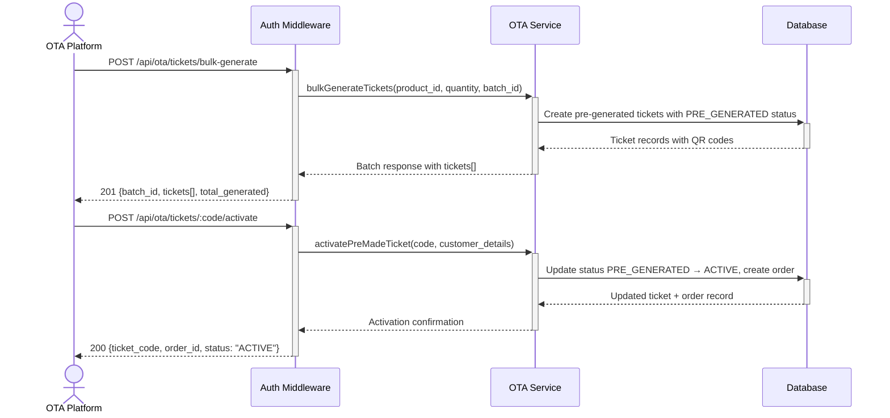

# OTA Pre-made Ticket Management — Dev Notes

## Status & Telemetry
- Status: Done
- Readiness: mvp
- Spec Paths: /api/ota/tickets/bulk-generate, /api/ota/tickets/:code/activate
- Migrations: db/migrations/0012_pre_generated_tickets.sql
- Newman: Tested • reports/newman/ota-premade-tickets.xml
- Last Update: 2025-11-04T16:40:00+08:00

## 0) Prerequisites
- ota-channel-management card implemented (inventory management)
- order-create card implemented (order creation patterns)
- Product catalog with function definitions available
- Database with pre_generated_tickets table

## 1) API Sequence (Context)


## 2) Contract (OAS 3.0.3)
```yaml
paths:
  /api/ota/tickets/bulk-generate:
    post:
      tags: ["OTA Integration"]
      summary: Generate pre-made tickets for OTA sales
      security:
        - ApiKeyAuth: []
      requestBody:
        required: true
        content:
          application/json:
            schema:
              type: object
              required: [product_id, quantity, batch_id]
              properties:
                product_id:
                  type: integer
                  description: Package product ID
                  example: 106
                quantity:
                  type: integer
                  minimum: 1
                  maximum: 100
                  description: Number of pre-made tickets to generate
                  example: 50
                batch_id:
                  type: string
                  description: Batch identifier for tracking
                  example: "BATCH_2025_Q1_001"
      responses:
        201:
          description: Pre-made tickets successfully generated
          content:
            application/json:
              schema:
                type: object
                properties:
                  batch_id:
                    type: string
                    example: "BATCH_2025_Q1_001"
                  tickets:
                    type: array
                    items:
                      type: object
                      properties:
                        ticket_code:
                          type: string
                          example: "CRUISE-2025-FERRY-1762274285982"
                        qr_code:
                          type: string
                          description: Base64 encoded QR code
                        status:
                          type: string
                          enum: [PRE_GENERATED]
                        entitlements:
                          type: array
                          items:
                            type: object
                            properties:
                              function_code:
                                type: string
                              remaining_uses:
                                type: integer
                  total_generated:
                    type: integer
                    example: 50

  /api/ota/tickets/{code}/activate:
    post:
      tags: ["OTA Integration"]
      summary: Activate pre-made ticket with customer details
      security:
        - ApiKeyAuth: []
      parameters:
        - name: code
          in: path
          required: true
          schema:
            type: string
            example: "CRUISE-2025-FERRY-1762274285982"
      requestBody:
        required: true
        content:
          application/json:
            schema:
              type: object
              required: [customer_details, payment_reference]
              properties:
                customer_details:
                  type: object
                  required: [name, email, phone]
                  properties:
                    name:
                      type: string
                      example: "John Smith"
                    email:
                      type: string
                      format: email
                      example: "john.smith@example.com"
                    phone:
                      type: string
                      example: "+1234567890"
                payment_reference:
                  type: string
                  description: OTA payment transaction reference
                  example: "PAY-OTA-2025-001"
      responses:
        200:
          description: Ticket successfully activated
          content:
            application/json:
              schema:
                type: object
                properties:
                  ticket_code:
                    type: string
                    example: "CRUISE-2025-FERRY-1762274285982"
                  order_id:
                    type: string
                    example: "ORD-1762274304824"
                  customer_name:
                    type: string
                    example: "John Smith"
                  status:
                    type: string
                    enum: [ACTIVE]
                  activated_at:
                    type: string
                    format: date-time
        400:
          description: Invalid request data
        404:
          description: Ticket not found or already activated
        409:
          description: Ticket already activated
```

## 3) Invariants
- Pre-made tickets start with status PRE_GENERATED
- Only PRE_GENERATED tickets can be activated
- Activation creates corresponding OTA order record
- Each ticket can only be activated once
- Customer details must include name, email, and phone
- Payment reference is required for audit trail

## 4) Validations, Idempotency & Concurrency
- Validate product exists and has available inventory
- Check batch_id uniqueness for tracking
- Ensure ticket_code uniqueness across all tickets
- Atomic activation prevents double-activation
- Customer detail validation (email format, phone format)
- Payment reference validation and storage

## 5) Rules & Writes (TX)
**POST /api/ota/tickets/bulk-generate:**
1) Begin transaction
2) Validate product_id exists and has inventory
3) Generate unique ticket codes and QR codes
4) Create pre_generated_tickets records with PRE_GENERATED status
5) Populate entitlements based on product functions
6) Commit transaction
7) Return batch summary with all ticket details

**POST /api/ota/tickets/:code/activate:**
1) Begin transaction with row locking
2) Find ticket by code with status PRE_GENERATED
3) Validate customer details completeness
4) Create OTA order record with customer details
5) Update ticket status to ACTIVE and link to order
6) Set activated_at timestamp
7) Commit transaction
8) Log activation event for audit

## 6) Data Impact & Transactions
**Table: pre_generated_tickets**
- ticket_id (Primary Key, Generated)
- ticket_code (Unique, Format: CRUISE-YYYY-TYPE-{timestamp})
- product_id (Foreign Key to products)
- batch_id (For OTA tracking)
- qr_code (Base64 encoded data)
- status (PRE_GENERATED → ACTIVE)
- entitlements (JSON array)
- created_at, activated_at
- order_id (Foreign Key, NULL until activation)

**Table: ota_orders**
- order_id (Primary Key, Format: ORD-{timestamp})
- customer_name, customer_email, customer_phone
- payment_reference (OTA transaction ID)
- total_amount, status, created_at

## 7) Observability
- Log `ota.tickets.bulk_generated` with `{batch_id, product_id, quantity}`
- Log `ota.tickets.activated` with `{ticket_code, order_id, customer_email}`
- Metric `ota.tickets.pre_generated.count` - Total unused tickets
- Metric `ota.tickets.activation.rate` - Daily activation rate
- Alert on high unused ticket counts or low activation rates

## 8) Acceptance — Given / When / Then
**Given** authenticated OTA partner with tickets:bulk-generate permission
**When** POST /api/ota/tickets/bulk-generate with valid product_id and quantity
**Then** creates specified number of PRE_GENERATED tickets with unique codes and QR codes

**Given** a PRE_GENERATED ticket exists
**When** POST /api/ota/tickets/{code}/activate with complete customer details
**Then** ticket status changes to ACTIVE, order record created, activated_at timestamp set

**Given** an already ACTIVE ticket
**When** attempting to activate again
**Then** returns 409 Conflict with clear error message

**Given** invalid customer details (missing phone)
**When** activation attempt
**Then** returns 400 Bad Request with validation details

## 9) Postman Coverage
- Bulk generation: Test various quantities and batch tracking
- Activation flow: Test complete customer onboarding
- Error cases: Test double activation, invalid tickets, incomplete data
- Permissions: Test API key permission requirements
- Database verification: Check status transitions and order creation