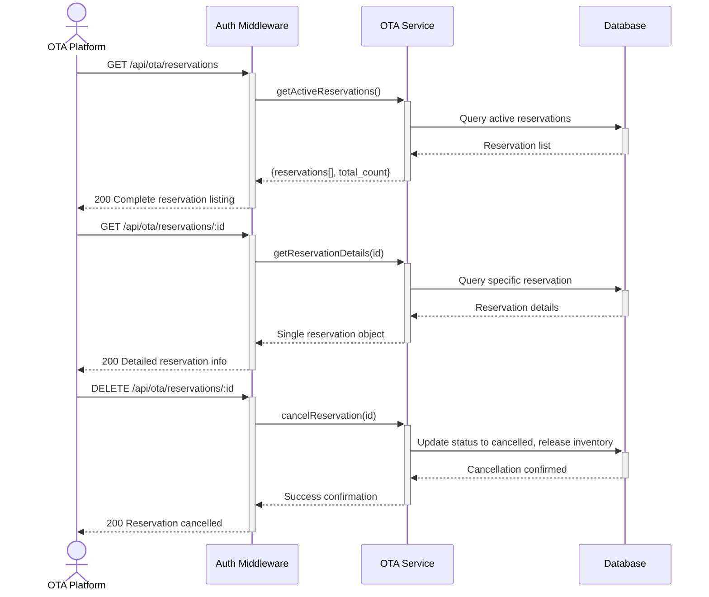

# OTA Reservation Management — Dev Notes

## Status & Telemetry
- Status: Done
- Readiness: mvp
- Spec Paths: /api/ota/reservations/*, /api/ota/reservations/:id/*
- Migrations: db/migrations/0011_channel_reservations.sql
- Newman: Tested • reports/newman/ota-reservation-management.xml
- Last Update: 2025-11-04T16:45:00+08:00

## 0) Prerequisites
- ota-channel-management card implemented (basic reservation creation)
- Product inventory system operational
- Channel allocation system configured
- Authentication middleware with permission system

## 1) API Sequence (Context)


## 2) Contract (OAS 3.0.3)
```yaml
paths:
  /api/ota/reservations:
    get:
      tags: ["OTA Integration"]
      summary: List all active reservations for monitoring
      security:
        - ApiKeyAuth: []
      responses:
        200:
          description: Active reservations retrieved
          content:
            application/json:
              schema:
                type: object
                properties:
                  reservations:
                    type: array
                    items:
                      $ref: '#/components/schemas/ChannelReservation'
                  total_count:
                    type: integer

  /api/ota/reservations/{id}:
    get:
      tags: ["OTA Integration"]
      summary: Get specific reservation details
      security:
        - ApiKeyAuth: []
      parameters:
        - name: id
          in: path
          required: true
          schema:
            type: string
            example: "res_mhksku1s_lj1nqt"
      responses:
        200:
          description: Reservation details
          content:
            application/json:
              schema:
                $ref: '#/components/schemas/ChannelReservation'
        404:
          description: Reservation not found
    delete:
      tags: ["OTA Integration"]
      summary: Cancel reservation and release inventory
      security:
        - ApiKeyAuth: []
      parameters:
        - name: id
          in: path
          required: true
          schema:
            type: string
      responses:
        200:
          description: Reservation cancelled successfully
        404:
          description: Reservation not found
        409:
          description: Reservation cannot be cancelled (already activated)

  /api/ota/reservations/{id}/activate:
    post:
      tags: ["OTA Integration"]
      summary: Convert reservation to confirmed order
      security:
        - ApiKeyAuth: []
      parameters:
        - name: id
          in: path
          required: true
          schema:
            type: string
      requestBody:
        required: true
        content:
          application/json:
            schema:
              type: object
              required: [customer_name, customer_email]
              properties:
                customer_name:
                  type: string
                  example: "Maria Garcia"
                customer_email:
                  type: string
                  format: email
                  example: "maria@example.com"
      responses:
        200:
          description: Reservation activated to order
          content:
            application/json:
              schema:
                type: object
                properties:
                  order_id:
                    type: string
                  reservation_id:
                    type: string
                  status:
                    type: string
                    enum: [activated]
        403:
          description: Insufficient permissions for activation
        404:
          description: Reservation not found
        409:
          description: Reservation expired or already activated

  /api/ota/reservations/cleanup:
    post:
      tags: ["OTA Integration"]
      summary: Manually trigger cleanup of expired reservations
      security:
        - ApiKeyAuth: []
      responses:
        200:
          description: Cleanup completed
          content:
            application/json:
              schema:
                type: object
                properties:
                  message:
                    type: string
                    example: "Cleanup completed"
                  expired_reservations:
                    type: integer
                    example: 3

components:
  schemas:
    ChannelReservation:
      type: object
      properties:
        reservation_id:
          type: string
          example: "res_mhksku1s_lj1nqt"
        product_id:
          type: integer
          example: 106
        quantity:
          type: integer
          example: 5
        status:
          type: string
          enum: [active, expired, activated, cancelled]
        expires_at:
          type: string
          format: date-time
          example: "2025-11-05T16:37:14.000Z"
        created_at:
          type: string
          format: date-time
          example: "2025-11-04T08:37:14.759Z"
        order_id:
          type: integer
          nullable: true
          description: "Set when reservation is activated"
```

## 3) Invariants
- Active reservations must have expires_at > current_time
- Only active reservations can be cancelled or activated
- Cancelled reservations release inventory back to OTA pool
- Activated reservations create corresponding order records
- Expired reservations are automatically cleaned up
- Reservation status transitions: active → (expired|activated|cancelled)

## 4) Validations, Idempotency & Concurrency
- Concurrent cancellation protection with row locking
- Expiry validation before activation attempts
- Inventory release must be atomic with status change
- Permission validation for activation operations
- Rate limiting on cleanup operations
- Prevent double-activation of same reservation

## 5) Rules & Writes (TX)
**GET /api/ota/reservations:**
1) Authenticate API key
2) Query all active reservations for the partner
3) Return paginated results with total count
4) Include reservation details and expiry status

**GET /api/ota/reservations/:id:**
1) Authenticate and validate reservation access
2) Query specific reservation by ID
3) Return detailed reservation information
4) Include current status and expiry information

**DELETE /api/ota/reservations/:id:**
1) Begin transaction with row locking
2) Verify reservation exists and is cancellable
3) Update status to 'cancelled'
4) Release reserved inventory back to OTA pool
5) Log cancellation event
6) Commit transaction

**POST /api/ota/reservations/cleanup:**
1) Find all expired active reservations
2) Batch update status to 'expired'
3) Release associated inventory
4) Return count of cleaned reservations

## 6) Data Impact & Transactions
**Table Updates:**
- channel_reservations: Status transitions, order_id linking
- product_inventory: Channel allocation adjustments
- Audit logs: Reservation lifecycle events

**Status Flow:**
- active → cancelled (manual cancellation)
- active → activated (converted to order)
- active → expired (automatic cleanup)

## 7) Observability
- Log `ota.reservation.listed` with `{partner_id, count}`
- Log `ota.reservation.cancelled` with `{reservation_id, quantity_released}`
- Log `ota.reservation.cleanup` with `{expired_count, inventory_released}`
- Metric `ota.reservations.active.count` - Current active reservations
- Metric `ota.reservations.expiry.rate` - Daily expiration rate
- Alert on high cancellation rates or cleanup failures

## 8) Acceptance — Given / When / Then
**Given** active reservations exist for OTA partner
**When** GET /api/ota/reservations is called
**Then** returns complete list with reservation details and total count

**Given** a specific active reservation ID
**When** GET /api/ota/reservations/:id is called
**Then** returns detailed reservation information including expiry status

**Given** an active reservation
**When** DELETE /api/ota/reservations/:id is called
**Then** reservation status changes to cancelled and inventory is released

**Given** expired reservations exist in the system
**When** POST /api/ota/reservations/cleanup is called
**Then** expired reservations are marked as expired and inventory is released

**Given** insufficient permissions for activation
**When** POST /api/ota/reservations/:id/activate is attempted
**Then** returns 403 Forbidden with permission error

## 9) Postman Coverage
- List reservations: Test pagination and filtering
- Get reservation: Test valid and invalid reservation IDs
- Cancel reservation: Test cancellation and inventory release
- Activation: Test permission-based access control
- Cleanup: Test batch expiry processing
- Concurrency: Test simultaneous operations on same reservation