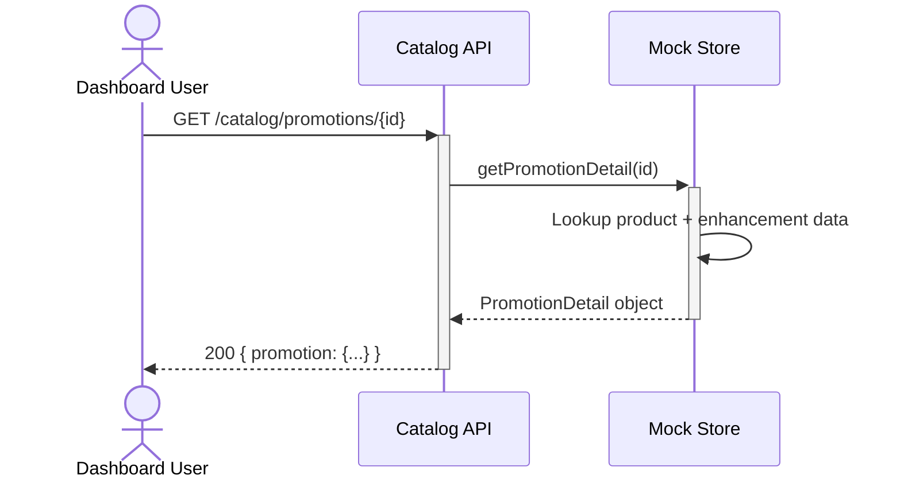

# Promotion detail endpoint for enhanced product information — Dev Notes

## Status & Telemetry
- Status: Done
- Readiness: prototype
- Spec Paths: /catalog/promotions/{id}
- Migrations: None (uses existing mock data with enhancements)
- Newman: 0/0 • reports/newman/promotion-detail-endpoint.json
- Last Update: 2025-10-21T11:56:00+08:00

## 0) Prerequisites
- Existing catalog module and mock store infrastructure
- Enhanced mock data with promotion details (description, features, images)
- Domain types for PromotionDetail and PromotionDetailResponse

## 1) API Sequence (Context)


## 2) Contract (OAS 3.0.3)
```yaml
paths:
  /catalog/promotions/{id}:
    get:
      tags: [Catalog]
      summary: Get detailed promotion information
      description: Returns enhanced product details including description, pricing, features, inventory, and marketing content
      parameters:
        - name: id
          in: path
          required: true
          schema:
            type: integer
            minimum: 1
          description: Product ID to get promotion details for
      responses:
        "200":
          description: Promotion details retrieved successfully
          content:
            application/json:
              schema:
                type: object
                properties:
                  promotion:
                    $ref: '#/components/schemas/PromotionDetail'
        "400":
          description: Invalid product ID format
          content:
            application/json:
              schema:
                $ref: '#/components/schemas/Error'
        "404":
          description: Promotion not found
          content:
            application/json:
              schema:
                $ref: '#/components/schemas/Error'
        "500":
          description: Internal server error
          content:
            application/json:
              schema:
                $ref: '#/components/schemas/Error'

components:
  schemas:
    PromotionDetail:
      type: object
      properties:
        id:
          type: integer
        sku:
          type: string
        name:
          type: string
        description:
          type: string
        unit_price:
          type: number
          format: decimal
        status:
          type: string
          enum: [draft, active, archived]
        sale_start_at:
          type: string
          format: date-time
          nullable: true
        sale_end_at:
          type: string
          format: date-time
          nullable: true
        functions:
          type: array
          items:
            $ref: '#/components/schemas/FunctionSpec'
        inventory:
          type: object
          properties:
            sellable_cap:
              type: integer
            reserved_count:
              type: integer
            sold_count:
              type: integer
            available:
              type: integer
        features:
          type: array
          items:
            type: string
        images:
          type: array
          items:
            type: string
            format: uri
```

## 3) Invariants
- Product ID must be a positive integer
- Only returns products that exist in the system (active or inactive)
- Available inventory is always calculated as: sellable_cap - reserved_count - sold_count
- Features array includes descriptive marketing points
- Images array contains valid URLs to promotional images

## 4) Validations, Idempotency & Concurrency
- Validate product ID is numeric and positive (400 if invalid)
- Return 404 for non-existent products
- Read-only operation, no concurrency concerns
- Idempotent: same request always returns same data
- Handle both active and archived products gracefully

## 5) Rules & Writes (TX)
1) Parse and validate product ID from path parameter
2) Call mockStore.getPromotionDetail(id) to get enhanced product data
3) Return 404 if product or promotion data not found
4) Calculate real-time inventory availability
5) Return structured response with promotion details
6) Log promotion detail access for analytics

## 6) Data Impact & Transactions
**No Database Changes Required**
- Uses existing product data structure in mock store
- Enhanced with additional promotion-specific data (description, features, images)
- Leverages existing inventory tracking in mock store
- No migrations needed as this is mock data enhancement

## 7) Observability
- Log `promotion.detail` with `{product_id, sku, status}` on successful requests
- Log `promotion.not_found` with `{product_id}` for 404 cases
- Log `promotion.detail.error` with `{error}` for server errors
- Metrics: `promotion.detail.count` and `promotion.detail.latency_ms`

## 8) Acceptance — Given / When / Then

**Given** a valid product ID (101-104) exists in the system
**When** user requests GET /catalog/promotions/{id}
**Then** detailed promotion information is returned with description, features, pricing, and inventory

**Given** an invalid product ID format (e.g., 'abc')
**When** user requests GET /catalog/promotions/abc
**Then** 400 Bad Request is returned with "Product ID must be a valid number"

**Given** a non-existent product ID (e.g., 999)
**When** user requests GET /catalog/promotions/999
**Then** 404 Not Found is returned with "Promotion not found"

**Given** an archived product (ID 105)
**When** user requests GET /catalog/promotions/105
**Then** promotion details are returned including status: "archived" and appropriate messaging

## 9) Postman Coverage
- Happy path: GET /catalog/promotions/101 → 200 with transport pass details
- Happy path: GET /catalog/promotions/104 → 200 with theme park details
- Edge case: GET /catalog/promotions/999 → 404 promotion not found
- Edge case: GET /catalog/promotions/invalid → 400 invalid product ID
- Business case: GET /catalog/promotions/105 → 200 archived product with appropriate status

## Implementation Notes
- **Extends existing catalog module**: Added to src/modules/catalog/router.ts
- **Enhanced mock store**: Added getPromotionDetail() method with rich data
- **New domain types**: Added PromotionDetail and PromotionDetailResponse to domain.ts
- **Consistent error handling**: Follows existing API error response patterns
- **Frontend ready**: Provides all data needed for rich dashboard detail views