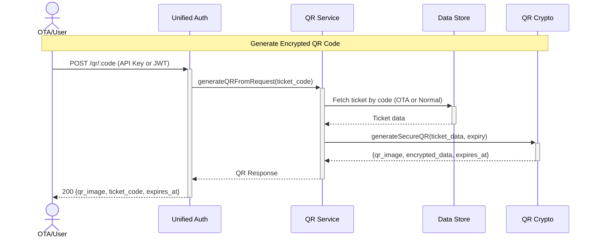

# Unified QR Code Generation API — Dev Notes

## Status & Telemetry
- Status: Done
- Readiness: mvp
- Spec Paths: /qr/:code, /qr/:code/info, /qr/decrypt
- Migrations: src/migrations/007-add-raw-field-to-tickets.ts
- Integration Guide: docs/OTA_QR_CODE_GUIDE.md
- Last Update: 2025-11-14T21:00:00+08:00 (Enhanced /:code/info with Operator JWT support, unified ticket info API)

## 0) Prerequisites
- Unified authentication middleware (OTA API Key + User JWT + Operator JWT)
- QR encryption utilities (AES-256-GCM + HMAC-SHA256)
- Tickets exist in system (OTA pre-generated or normal tickets)
- Environment variables: QR_ENCRYPTION_KEY, QR_SIGNING_SECRET

## 1) API Sequence (Context)


## 1.5) Endpoint Purpose Classification

### 查询端点（不消耗权益）Viewing/Query Endpoints (NO Redemption)

这些端点提供票券信息但**不会消耗权益entitlements**：

- **POST /qr/decrypt** - 解密二维码并返回完整票券信息（不核销）
  - **用途**: 操作员在核销前预览完整票券信息
  - **使用场景**: 扫描QR后一次性获取所有信息（无需再调用其他接口）
  - **返回**: JSON格式包含 JTI、ticket_code、过期信息 + **完整票券详情**（customer_info, entitlements, product_info）
  - **增强日期**: 2025-11-17（合并了GET /qr/:code/info功能）

- **GET /qr/:code/info** - 查询票券详细信息（不核销）
  - **用途**: 获取完整票券信息包括顾客信息
  - **使用场景**: 前端显示票券详情、顾客类型、权益明细
  - **返回**: JSON格式包含 customer_info、entitlements、product_info

### 核销端点（消耗权益）Redemption Endpoint (Consumes Entitlements)

- **POST /venue/scan** - 实际核销使用 encrypted_data
  - **用途**: 核销特定功能并减少剩余使用次数
  - **使用场景**: 操作员在场馆扫描二维码授予访问/服务
  - **返回**: 更新后的权益及剩余使用次数
  - **参考**: [venue-enhanced-scanning](venue-enhanced-scanning.md)

### OTA核销流程（正确流程）

```
1. POST /qr/:code → 生成加密QR，返回 encrypted_data
2. [可选] POST /qr/decrypt → 预览票券信息（不核销）
3. POST /venue/scan → 使用 encrypted_data 作为 qr_token 实际核销
```

## 2) Contract (OAS 3.0.3)
```yaml
paths:
  /qr/{code}:
    post:
      tags: ["QR Code Generation"]
      summary: Generate secure encrypted QR code for ticket
      description: |
        Generates time-limited encrypted QR code for both OTA and normal tickets.
        Returns encrypted data for use with venue scanning API.
      security:
        - ApiKeyAuth: []  # For OTA partners
        - BearerAuth: []  # For normal users
      parameters:
        - name: code
          in: path
          required: true
          schema:
            type: string
          description: Ticket code
          example: "CRUISE-2025-FERRY-1762330663284"
      requestBody:
        required: false
        content:
          application/json:
            schema:
              type: object
              properties:
                expiry_minutes:
                  type: integer
                  minimum: 1
                  maximum: 1440
                  default: 30
                  description: QR code expiry time in minutes
                  example: 60
      responses:
        200:
          description: QR code generated successfully
          content:
            application/json:
              schema:
                type: object
                properties:
                  success:
                    type: boolean
                    example: true
                  qr_image:
                    type: string
                    description: Base64 encoded PNG image
                    example: "data:image/png;base64,iVBORw0KGgo..."
                  encrypted_data:
                    type: string
                    description: Encrypted data for venue scanning API
                    example: "iv:ciphertext:authTag:signature"
                  ticket_code:
                    type: string
                    example: "CRUISE-2025-FERRY-1762330663284"
                  expires_at:
                    type: string
                    format: date-time
                    example: "2025-11-12T15:30:00.000Z"
                  valid_for_seconds:
                    type: integer
                    example: 1800
                  issued_at:
                    type: string
                    format: date-time
                  note:
                    type: string
                    description: Usage instructions
        400:
          description: Invalid request parameters
          content:
            application/json:
              schema:
                type: object
                properties:
                  error:
                    type: string
                    example: "INVALID_TICKET_CODE"
                  message:
                    type: string
                    example: "Ticket code must be at least 3 characters"
        401:
          description: Authentication required
          content:
            application/json:
              schema:
                type: object
                properties:
                  error:
                    type: string
                    example: "UNAUTHORIZED"
        403:
          description: Access forbidden
          content:
            application/json:
              schema:
                type: object
                properties:
                  error:
                    type: string
                    example: "TICKET_TYPE_MISMATCH"
                  message:
                    type: string
        404:
          description: Ticket not found
          content:
            application/json:
              schema:
                type: object
                properties:
                  error:
                    type: string
                    example: "TICKET_NOT_FOUND"
        409:
          description: Ticket status invalid
          content:
            application/json:
              schema:
                type: object
                properties:
                  error:
                    type: string
                    example: "INVALID_STATUS"
        500:
          description: Server error
          content:
            application/json:
              schema:
                type: object
                properties:
                  error:
                    type: string
                    example: "CONFIGURATION_ERROR"

  /qr/{code}/info:
    get:
      tags: ["QR Code Generation"]
      summary: Get ticket information with entitlements (unified for all roles)
      description: |
        Returns ticket status, entitlements, and QR generation availability without generating QR code.

        **Supported Authentication:**
        - **OTA Partners**: API Key authentication (x-api-key header)
        - **Normal Users**: User JWT (Authorization: Bearer <user_token>)
        - **Operators**: Operator JWT (Authorization: Bearer <operator_token>)

        **Use Cases:**
        - Check ticket status before generating QR (Users/OTA)
        - View remaining entitlements and product info (All roles)
        - Verify ownership of ticket (Users/OTA)
        - Operator ticket verification at gates (Operators)

        **Access Control:**
        - Users can only view their own tickets
        - OTA partners can only view tickets they issued
        - Operators can view ANY ticket (for gate operations)

        **Replaced**: GET /tickets/{code}/info (deprecated, removed in this version)
      security:
        - ApiKeyAuth: []  # For OTA partners
        - BearerAuth: []  # For normal users AND operators
      parameters:
        - name: code
          in: path
          required: true
          schema:
            type: string
          description: Ticket code
          example: "CRUISE-2025-FERRY-1762329306017"
      responses:
        200:
          description: Ticket information retrieved successfully
          content:
            application/json:
              schema:
                type: object
                properties:
                  success:
                    type: boolean
                    example: true
                  ticket_code:
                    type: string
                    example: "CRUISE-2025-FERRY-1762329306017"
                  ticket_type:
                    type: string
                    enum: [OTA, NORMAL]
                    description: Ticket origin type
                    example: "OTA"
                  status:
                    type: string
                    enum: [PRE_GENERATED, ACTIVE, USED, EXPIRED, CANCELLED, active, partially_redeemed, void]
                    description: Current ticket status
                    example: "ACTIVE"
                  entitlements:
                    type: array
                    description: Array of all entitlements (including used ones) with complete information
                    items:
                      type: object
                      properties:
                        function_code:
                          type: string
                          example: "ferry"
                        function_name:
                          type: string
                          description: Human-readable function name
                          example: "轮渡往返"
                        remaining_uses:
                          type: integer
                          description: Number of uses remaining
                          example: 1
                        total_uses:
                          type: integer
                          description: Total number of uses allocated
                          example: 2
                    example:
                      - function_code: "ferry"
                        function_name: "轮渡往返"
                        remaining_uses: 1
                        total_uses: 2
                      - function_code: "gift"
                        function_name: "伴手礼兑换"
                        remaining_uses: 1
                        total_uses: 1
                      - function_code: "tokens"
                        function_name: "游戏币领取"
                        remaining_uses: 0
                        total_uses: 1
                  can_generate_qr:
                    type: boolean
                    description: Whether QR code can be generated for this ticket
                    example: true
                  product_info:
                    type: object
                    description: Product information
                    properties:
                      id:
                        type: integer
                        example: 106
                      name:
                        type: string
                        example: "Premium Cruise Package"
                  product_id:
                    type: integer
                    description: (Deprecated, use product_info.id)
                    example: 106
                  order_id:
                    type: string
                    nullable: true
                    example: null
                  batch_id:
                    type: string
                    nullable: true
                    example: "DUDU_FINAL_DB_TEST"
                  partner_id:
                    type: string
                    nullable: true
                    example: "dudu_partner"
        403:
          description: Unauthorized access to ticket
          content:
            application/json:
              schema:
                type: object
                properties:
                  success:
                    type: boolean
                    example: false
                  error:
                    type: string
                    example: "UNAUTHORIZED"
                  message:
                    type: string
                    example: "You do not have permission to access this ticket"
        404:
          description: Ticket not found
          content:
            application/json:
              schema:
                type: object
                properties:
                  success:
                    type: boolean
                    example: false
                  error:
                    type: string
                    example: "TICKET_NOT_FOUND"
                  message:
                    type: string
                    example: "Ticket not found"

  /qr/decrypt:
    post:
      tags: ["QR Code Generation"]
      summary: Decrypt and verify QR code without redemption
      description: |
        Decrypts encrypted QR token and returns ticket information without performing redemption.
        Used by frontend applications to validate QR codes before showing to operators.

        This endpoint supports the optimized QR data structure containing only:
        - jti (unique ID for replay prevention)
        - ticket_code (for ticket lookup)
        - expires_at (QR expiration time)
        - version (format version)
      requestBody:
        required: true
        content:
          application/json:
            schema:
              type: object
              required:
                - encrypted_data
              properties:
                encrypted_data:
                  type: string
                  description: Encrypted QR token string (format: iv:encrypted:authTag:signature)
                  example: "a1b2c3d4e5f6:1a2b3c4d5e6f7a8b9c0d:e1f2a3b4c5d6e7f8a9b0c1d2e3f4:a1b2c3d4e5f6a7b8"
      responses:
        200:
          description: QR code decrypted successfully
          content:
            application/json:
              schema:
                type: object
                properties:
                  jti:
                    type: string
                    format: uuid
                    description: Unique JWT ID for replay prevention
                    example: "550e8400-e29b-41d4-a716-446655440000"
                  ticket_code:
                    type: string
                    description: Ticket code to lookup full ticket details
                    example: "CRUISE-2025-FERRY-1762330663284"
                  expires_at:
                    type: string
                    format: date-time
                    description: QR code expiration time
                    example: "2025-11-13T20:00:00.000Z"
                  version:
                    type: integer
                    description: QR data format version
                    example: 1
                  is_expired:
                    type: boolean
                    description: Whether QR code has expired
                    example: false
                  remaining_seconds:
                    type: integer
                    description: Seconds until expiration (negative if expired)
                    example: 1800
        400:
          description: Invalid request
          content:
            application/json:
              schema:
                type: object
                properties:
                  error:
                    type: string
                    example: "INVALID_REQUEST"
                  message:
                    type: string
                    example: "encrypted_data (string) is required"
        401:
          description: QR validation failed
          content:
            application/json:
              schema:
                type: object
                properties:
                  error:
                    type: string
                    enum: ["QR_SIGNATURE_INVALID", "QR_DECRYPTION_FAILED", "QR_INVALID_FORMAT"]
                    example: "QR_SIGNATURE_INVALID"
                  message:
                    type: string
                    example: "QR code has been tampered with"
        500:
          description: Server error
          content:
            application/json:
              schema:
                type: object
                properties:
                  error:
                    type: string
                    example: "DECRYPT_ERROR"
                  message:
                    type: string
                    example: "Failed to decrypt QR code"
```

## 3) Invariants
- **QR codes expire** after configurable time (ticket type dependent)
  - **Important**: QR code expiry is distinct from ticket validity
  - **OTA tickets (CRUISE-*, BATCH-*, FERRY-*, OTA-*)**:
    - QR expiry: **100 years (permanent)** - 52,560,000 minutes
    - Ticket usability determined by ticket status (PRE_GENERATED, ACTIVE, USED, etc.)
    - QR code remains valid indefinitely for partner distribution
  - **Normal tickets (direct sales)**:
    - QR expiry: Temporary security token (default 30 minutes)
    - Configurable range: 1-1440 minutes
  - **Ticket validity**: Permanent after activation (no automatic expiry)
  - Expired QR codes can be regenerated on-demand for same ticket
- Encrypted QR contains: ticket_code, product_id, status, owner_id, expiry
- OTA partners can only generate QR for their own tickets
- Normal users can only generate QR for their purchased tickets
- Same ticket can generate multiple QR codes (each with unique expiry)
- Ticket type detection:
  - OTA tickets: CRUISE-*, BATCH-*, FERRY-*, OTA-*
  - Normal tickets: All other patterns

## 4) Validations, Idempotency & Concurrency
- Validate ticket_code format (minimum 3 characters)
- Validate expiry_minutes range (1-1440)
- Authentication validation (API Key or JWT)
- Ticket ownership validation (partner_id or user_id)
- Ticket status validation (must be PRE_GENERATED or ACTIVE)
- Ticket type vs auth type matching (OTA tickets require OTA auth)
- Idempotent: Multiple requests generate different QR codes (different nonce/expiry)
- No database writes (read-only operation)

## 5) Rules & Writes (TX)
**POST /qr/:code:**
1) Authenticate request (unified auth middleware)
2) Detect ticket type from code pattern
3) Fetch ticket from appropriate data source:
   - OTA tickets: mockDataStore.preGeneratedTickets or OTA repository
   - Normal tickets: mockDataStore.tickets or Tickets repository
4) Validate ticket ownership:
   - OTA: ticket.partner_id === authenticated partner_id
   - User: ticket.user_id === authenticated user_id
5) Validate ticket status (PRE_GENERATED or ACTIVE only)
6) Generate encrypted QR using qr-crypto utility:
   - AES-256-GCM encryption
   - HMAC-SHA256 signature
   - Unique nonce per generation
7) Return QR response with expiry information
8) Log generation event for audit

## 6) Data Impact & Transactions

**Table: tickets** *(Modified)*
- Added field: `raw` (TEXT, nullable)
- Purpose: Store original ticket data for QR generation
- Migration: 007-add-raw-field-to-tickets.ts
- No database writes during QR generation (read-only)

**No New Tables Required**
- QR generation is stateless
- No persistence of QR codes or tokens
- Each generation creates ephemeral encrypted token

## 7) Observability
- Log `qr.generation.request` with `{ticket_code, auth_type, expiry_minutes}`
- Log `qr.generation.success` with `{ticket_code, valid_for_seconds}`
- Log `qr.generation.error` with `{ticket_code, error_code, error_message}`
- Metric `qr.generation.count` - Total QR codes generated
- Metric `qr.generation.by_auth` - Count by OTA/User
- Alert on high QR generation errors (>5% error rate)
- Alert on QR decryption failures (possible attack)

## 8) Acceptance — Given / When / Then

**Given** authenticated OTA partner with valid API key
**When** POST /qr/{ota_ticket_code}
**Then** returns 200 with encrypted QR image and expiry details

**Given** authenticated user with purchased ticket
**When** POST /qr/{normal_ticket_code}
**Then** returns 200 with encrypted QR image

**Given** OTA partner attempts to access normal ticket
**When** POST /qr/{normal_ticket_code}
**Then** returns 403 TICKET_TYPE_MISMATCH

**Given** user attempts to access OTA ticket
**When** POST /qr/{ota_ticket_code}
**Then** returns 403 UNAUTHORIZED

**Given** custom expiry time (60 minutes)
**When** POST /qr/{ticket_code} with body {expiry_minutes: 60}
**Then** returns QR with valid_for_seconds=3600

## 9) Testing & Validation

### Test API Keys
```bash
# Available test credentials
OTA_FULL_ACCESS="ota_full_access_key_99999"
OTA_LIMITED_ACCESS="ota_limited_key_88888"
```

### Test Scenarios

**✅ Valid OTA QR Generation:**
```bash
curl -X POST http://localhost:8080/qr/CRUISE-2025-FERRY-123 \
  -H "X-API-Key: ota_full_access_key_99999" \
  -H "Content-Type: application/json"

# Expected: 200 with qr_image (Base64 PNG)
```

**✅ Valid User QR Generation:**
```bash
curl -X POST http://localhost:8080/qr/TKT-001-123 \
  -H "Authorization: Bearer ${JWT_TOKEN}" \
  -H "Content-Type: application/json"

# Expected: 200 with qr_image
```

**✅ Custom Expiry Time:**
```bash
curl -X POST http://localhost:8080/qr/CRUISE-2025-FERRY-123 \
  -H "X-API-Key: ota_full_access_key_99999" \
  -H "Content-Type: application/json" \
  -d '{"expiry_minutes": 120}'

# Expected: 200 with valid_for_seconds=7200
```

**❌ Invalid Ticket Code:**
```bash
curl -X POST http://localhost:8080/qr/AB \
  -H "X-API-Key: ota_full_access_key_99999"

# Expected: 400 INVALID_TICKET_CODE
```

**❌ Missing Authentication:**
```bash
curl -X POST http://localhost:8080/qr/CRUISE-2025-FERRY-123

# Expected: 401 UNAUTHORIZED
```

**❌ OTA accessing normal ticket:**
```bash
curl -X POST http://localhost:8080/qr/TKT-001-123 \
  -H "X-API-Key: ota_full_access_key_99999"

# Expected: 403 TICKET_TYPE_MISMATCH
```

### Database Mode Testing
```bash
# Mock mode (default)
USE_DATABASE=false npm start

# Database mode
USE_DATABASE=true npm start

# Verify both modes produce consistent QR codes
```

## 10) Security Considerations

### Encryption Details
- **Algorithm**: AES-256-GCM (Authenticated Encryption)
- **Key Management**: Environment variable QR_ENCRYPTION_KEY (32 bytes)
- **Signature**: HMAC-SHA256 with QR_SIGNING_SECRET
- **Nonce**: Unique random IV per QR generation (12 bytes)
- **Token Format**: `{nonce}.{ciphertext}.{auth_tag}.{hmac}`

### Attack Prevention
- **Replay Attacks**: Prevented by expiry timestamp in encrypted payload
- **Tampering**: Detected by HMAC signature verification
- **Brute Force**: Rate limiting on QR generation endpoints
- **Token Leakage**: Short expiry times (default 30 minutes)
- **Cross-Partner Access**: Validated by partner_id/user_id matching

## 11) Integration Points

### Unified Auth Middleware
```typescript
// src/middlewares/unified-auth.ts
// Supports both OTA API Key and User JWT
router.post('/:code', unifiedAuth(), async (req, res) => {
  // req.authType = 'USER' | 'OTA_PARTNER'
  // req.userId or req.partnerId populated
});
```

### QR Crypto Utility
```typescript
// src/utils/qr-crypto.ts
export interface EncryptedQRResult {
  qr_image: string;        // Base64 PNG
  encrypted_data: string;  // For URL-based QR
  ticket_code: string;
  expires_at: string;
}

generateSecureQR(ticketData, expiryMinutes): Promise<EncryptedQRResult>
decryptAndVerifyQR(encryptedToken): Promise<DecryptedData>
```

### Data Source Integration
```typescript
// Unified ticket fetching
if (ticketType === 'OTA') {
  // From OTA pre-generated tickets
  ticket = mockDataStore.preGeneratedTickets.get(ticketCode);
} else {
  // From normal tickets
  ticket = mockDataStore.getTicketByCode(ticketCode);
}
```

## 12) Differences from qr-token Card

| Feature | qr-token (Old) | qr-generation-api (New) |
|---------|---------------|------------------------|
| **Endpoint** | `/tickets/{code}/qr-token` | `/qr/{code}` |
| **Authentication** | User JWT only | Unified (OTA + User) |
| **Output Format** | JWT string | Base64 PNG image |
| **Encryption** | HS256 JWT | AES-256-GCM + HMAC |
| **Expiry** | Fixed 60 seconds | Configurable 1-1440 minutes |
| **QR Types** | Single type | encrypted |
| **OTA Support** | No | Yes |
| **Use Case** | Simple token | Production-ready QR |

## 13) Migration Path

**For existing qr-token users:**
- Old endpoint `/tickets/{code}/qr-token` remains functional
- New endpoint `/qr/{code}` provides enhanced features
- No breaking changes to existing integrations
- Recommended migration for production use

**Enhancement benefits:**
- More secure encryption (AES vs JWT)
- Longer configurable expiry
- Direct image output (no QR generation needed client-side)
- OTA partner integration

## 14) Future Enhancements

**Planned features:**
- [ ] QR code analytics dashboard
- [ ] Dynamic QR code styling (logos, colors)
- [ ] Multi-language support in verify page
- [ ] QR code revocation mechanism
- [ ] Batch QR generation endpoint
- [ ] PDF ticket generation with embedded QR
