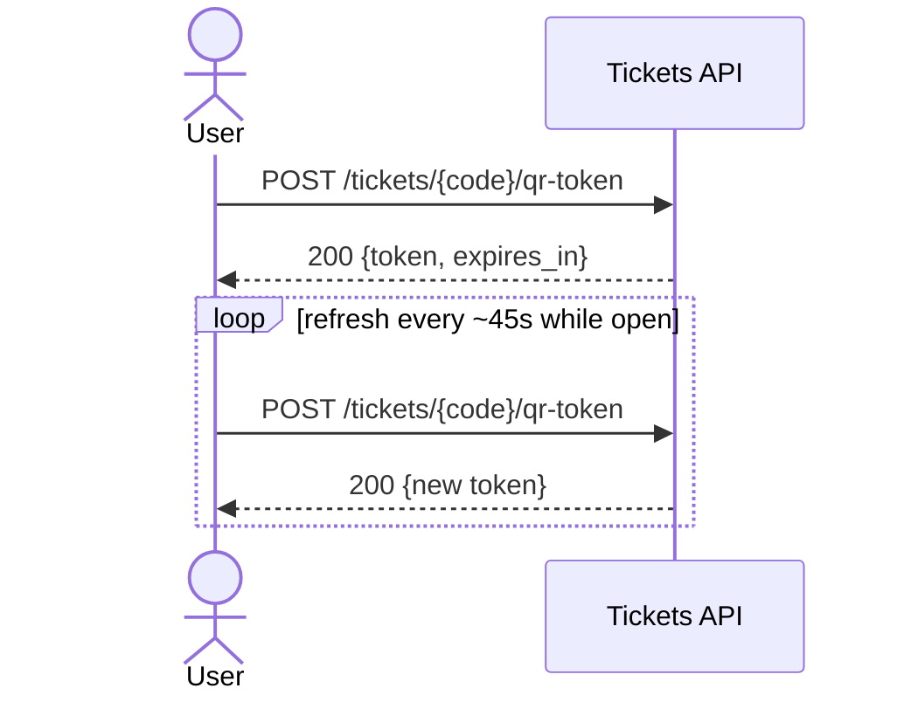

## Status & Telemetry
- Status: Ready
- Readiness: prototype
- Spec Paths: /tickets/{code}/qr-token
- Migrations: N/A
- Newman: 0/0 • reports/newman/qr-token.json
- Last Update: 2025-10-20T09:56:51+0800

## 0) Prerequisites
- Buyer can view tickets; ticket belongs to user.
- `QR_SIGNER_SECRET` available in env (HS256).

## 1) API Sequence (Context)


## 2) Contract (OAS 3.0.3)
```yaml
paths:
  /tickets/{code}/qr-token:
    post:
      tags: [Tickets]
      summary: Create a short-lived signed token for scanning
      security: [{ bearerAuth: [] }]
      parameters:
        - in: path
          name: code
          required: true
          schema: { type: string }
      responses:
        "200":
          description: OK
          content:
            application/json:
              schema:
                $ref: '#/components/schemas/QRTokenResponse'
```

## 3) Invariants
- Token TTL ≤ 60s.  
- Payload includes `tid` or `ticket_code` hash and `jti` (nonce).

## 4) Validations
- Auth required; ticket must belong to user and not be `void/expired`.

## 5) Rules & Writes
1) Validate ownership and status.  
2) Build JWT payload: `{ tid, code_hash, exp: now+60, jti: random }` (HS256).  
3) Return `{ token, expires_in: 60 }`.

## 6) Data Impact
- None (read-only).

## 7) Observability
- Log `qr.issue {ticket_id}`; metric `qr.issue.count`.

## 8) Acceptance
**Given** user has a ticket. **When** POST `/tickets/{code}/qr-token`. **Then** `200` and a parseable JWT with `exp` within 60–120s.

## 9) Postman Coverage
```js
pm.test('200', ()=> pm.response.to.have.status(200));
const t = pm.response.json().token;
pm.expect(typeof t).to.eql('string');
```