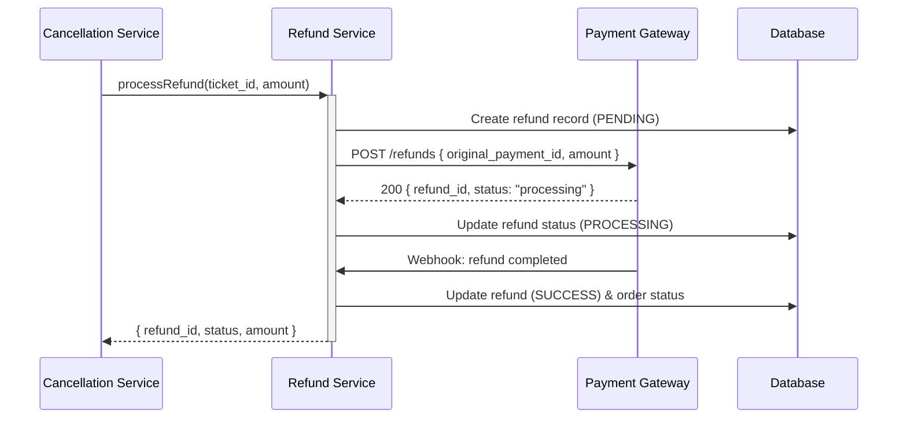

## Status & Telemetry
- Status: Ready
- Readiness: mvp
- Spec Paths: /payments/refund ~~, /my/refunds~~
- Migrations: db/migrations/0009_refunds_table.sql
- Newman: 0/0 • reports/newman/refund-processing.json
- Last Update: 2025-10-20T16:30:00+0800

## 0) Prerequisites
- wallyt-payment card implemented (order and payment data)
- Payment gateway refund API integration
- ticket-cancellation card for triggering refunds
- Order status management (PAID → REFUNDED/PARTIALLY_REFUNDED)

## 1) API Sequence (Context)


## 2) Contract (OAS 3.0.3 fragment)
```yaml
paths:
  /payments/refund:
    post:
      tags: [Payments]
      summary: Internal refund processing endpoint
      description: Called by cancellation service to process refunds
      requestBody:
        required: true
        content:
          application/json:
            schema:
              type: object
              required: [order_id, amount, reason]
              properties:
                order_id:
                  type: integer
                amount:
                  type: number
                  format: decimal
                reason:
                  type: string
                  enum: [ticket_cancellation, partial_cancellation]
                ticket_id:
                  type: integer
      responses:
        "200":
          description: Refund initiated
          content:
            application/json:
              schema:
                type: object
                properties:
                  refund_id:
                    type: string
                  status:
                    type: string
                    enum: [pending, processing]
                  amount:
                    type: number
        "400":
          description: Invalid refund request
        "404":
          description: Order not found
        "422":
          description: Order cannot be refunded

  /my/refunds:
    get:
      tags: [Payments]
      summary: List user's refunds
      security: [{ bearerAuth: [] }]
      responses:
        "200":
          description: User's refund history
          content:
            application/json:
              schema:
                type: object
                properties:
                  refunds:
                    type: array
                    items:
                      type: object
                      properties:
                        refund_id:
                          type: string
                        order_id:
                          type: integer
                        amount:
                          type: number
                        status:
                          type: string
                        reason:
                          type: string
                        created_at:
                          type: string
                          format: date-time
                        completed_at:
                          type: string
                          format: date-time
```

## 3) Invariants
- Refund amount cannot exceed original order total
- Only PAID orders can be refunded
- Refund records are immutable once created
- Order status updates reflect refund state (PARTIALLY_REFUNDED, REFUNDED)
- All refunds are auditable

## 4) Validations, Idempotency & Concurrency
- Validate order exists and is in PAID status
- Check refund amount <= (order total - previous refunds)
- Prevent duplicate refunds with same order_id + amount
- Use database locks during refund processing
- Handle payment gateway timeouts gracefully

## 5) Rules & Writes (TX)
**POST /payments/refund:**
1) Validate request (order_id, amount, reason)
2) Begin transaction
3) Load order with FOR UPDATE lock
4) Verify order is PAID and refundable
5) Calculate total previous refunds
6) Validate new refund amount
7) Create refund record (status: PENDING)
8) Call payment gateway refund API
9) Update refund status based on gateway response
10) Update order status if fully refunded
11) Commit transaction
12) Return refund details

**GET /my/refunds:**
1) Authenticate user from JWT
2) Query refunds for user's orders
3) Return paginated refund history

## 6) Data Impact & Transactions
**Migration:** `db/migrations/0009_refunds_table.sql`
- Create `refunds` table:
  - id (PK), refund_id (unique), order_id (FK), ticket_id (FK nullable)
  - amount, status (pending/processing/success/failed), reason
  - gateway_response (JSON), created_at, completed_at
- Add `refund_amount` DECIMAL(10,2) DEFAULT 0 to `orders` table
- Add `refund_status` ENUM('none', 'partial', 'full') to `orders` table
- Add indexes for performance

## 7) Observability
- Log `refund.initiated {refund_id, order_id, amount, reason}`
- Log `refund.gateway.success {refund_id, gateway_refund_id}`
- Log `refund.gateway.failed {refund_id, error, gateway_response}`
- Log `refund.completed {refund_id, final_status}`
- Metric `refunds.count` by status
- Metric `refunds.amount_total`
- Metric `refunds.processing_time`

## 8) Acceptance — Given / When / Then
**Given** a paid order exists with no previous refunds
**When** refund is requested for partial amount
**Then** refund record is created and payment gateway is called

**Given** refund amount exceeds remaining refundable amount
**When** refund is requested
**Then** 422 Validation Error is returned

**Given** payment gateway confirms refund success
**When** webhook is received
**Then** refund status updates to SUCCESS and order reflects refund

## 9) Postman Coverage
```js
// Refund initiation
pm.test('Process refund returns 200', () => {
  pm.response.to.have.status(200);
  const resp = pm.response.json();
  pm.expect(resp.refund_id).to.be.a('string');
  pm.expect(resp.status).to.be.oneOf(['pending', 'processing']);
});

// User refund history
pm.test('User refunds list', () => {
  pm.response.to.have.status(200);
  const resp = pm.response.json();
  pm.expect(resp.refunds).to.be.an('array');
});

// Invalid refund amount
pm.test('Excessive refund amount rejected', () => {
  pm.response.to.have.status(422);
});
```