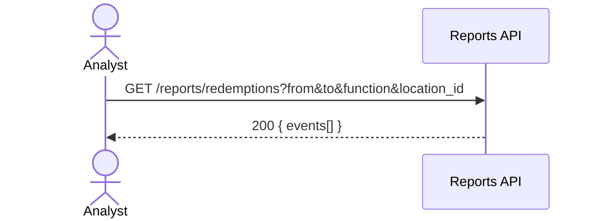

## Status & Telemetry
- Status: Ready
- Readiness: prototype
- Spec Paths: /reports/redemptions
- Migrations: db/migrations/0007_redemptions_indexes.sql
- Newman: 0/0 • reports/newman/reports-redemptions.json
- Last Update: 2025-10-20T00:12:44+0800

## 0) Prerequisites
- `redemption_events` table exists (from scan implementation).

## 1) API Sequence (Context)


## 2) Contract (OAS 3.0.3 fragment)
```yaml
paths:
  /reports/redemptions:
    get:
      tags: [Reports]
      summary: List redemption events for reporting
      parameters:
        - in: query
          name: from
          schema: { type: string, format: date-time }
        - in: query
          name: to
          schema: { type: string, format: date-time }
        - in: query
          name: function
          schema: { type: string }
        - in: query
          name: location_id
          schema: { type: integer }
      responses:
        "200":
          description: OK
          content:
            application/json:
              schema:
                type: object
                properties:
                  events:
                    type: array
                    items:
                      type: object
                      properties:
                        ticket_id: { type: integer }
                        function_code: { type: string }
                        operator_id: { type: integer }
                        location_id: { type: integer }
                        result: { type: string, enum: [success, reject] }
                        ts: { type: string, format: date-time }
```

## 3) Invariants
- Response only includes events filtered by the query window and parameters.

## 4) Validations & Behavior
- If `from` > `to`, return 400.  
- If no filters provided, default to last 24 hours (optional for MVP).

## 5) Rules & Reads
1) Build WHERE with optional filters on `ts`, `function_code`, `location_id`.  
2) Return rows sorted by `ts DESC`.

## 6) Data Impact & Migration
Read-only. Optional indexes for performance.

**Migration** `db/migrations/0007_redemptions_indexes.sql`
```sql
CREATE INDEX IF NOT EXISTS idx_redemptions_ts ON redemption_events (ts);
CREATE INDEX IF NOT EXISTS idx_redemptions_func ON redemption_events (function_code);
CREATE INDEX IF NOT EXISTS idx_redemptions_loc ON redemption_events (location_id);
```

## 7) Observability
- Log `reports.redemptions.query {count}`.

## 8) Acceptance — Given / When / Then
**Given** redemption events exist in the last 24h.  
**When** GET `/reports/redemptions?from=...&to=...`.  
**Then** `200` with only events in the window.  
**And** adding `function=ferry&location_id=52` further filters results.

## 9) Postman Coverage
```js
pm.test('200', ()=> pm.response.to.have.status(200));
const j = pm.response.json();
pm.expect(j.events).to.be.an('array');
```