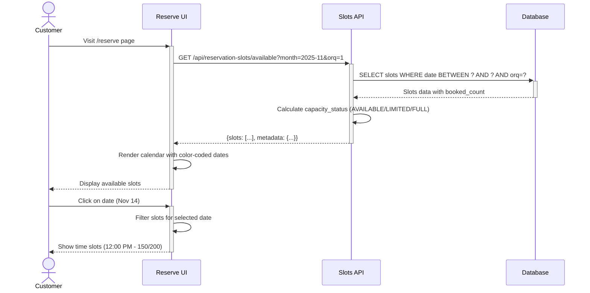

# Reservation Slot Management — Dev Notes

## Status & Telemetry
- Status: Ready
- Readiness: mvp
- Spec Paths: /api/reservation-slots/available, /api/reservation-slots/create (admin)
- Migrations: db/migrations/0020_reservation_slots.sql
- Newman: 0/0 • reports/newman/reservation-slot-management.xml
- Last Update: 2025-11-14T12:00:00+08:00

## 0) Prerequisites
- Database supports computed columns (MySQL 5.7+)
- tickets table exists (US-001 implementation)
- Organization (orq) context available in API requests
- Date/time utility functions for calendar calculations

## 1) API Sequence (Context)


## 2) Contract (OAS 3.0.3)
```yaml
paths:
  /api/reservation-slots/available:
    get:
      tags: ["Reservation Management"]
      summary: Get available reservation slots for calendar display
      description: |
        Returns slots for specified month with real-time capacity data.
        Used by customer reservation UI to display calendar and time slots.
      parameters:
        - name: month
          in: query
          required: false
          schema:
            type: string
            format: YYYY-MM
            example: "2025-11"
            description: "Month to query (default: current month)"
        - name: orq
          in: query
          required: true
          schema:
            type: integer
            example: 1
            description: "Organization ID"
        - name: date
          in: query
          required: false
          schema:
            type: string
            format: date
            example: "2025-11-14"
            description: "Specific date filter (returns only slots for that date)"
      responses:
        200:
          description: Available slots retrieved successfully
          content:
            application/json:
              schema:
                type: object
                properties:
                  success:
                    type: boolean
                    example: true
                  data:
                    type: array
                    items:
                      $ref: '#/components/schemas/ReservationSlot'
                  metadata:
                    type: object
                    properties:
                      month:
                        type: string
                        example: "2025-11"
                      total_slots:
                        type: integer
                        example: 120
                      unique_dates:
                        type: integer
                        example: 30
        400:
          description: Bad request - invalid month format
        401:
          description: Unauthorized

  /api/reservation-slots/create:
    post:
      tags: ["Reservation Management", "Admin"]
      summary: Create new reservation slot (Admin only - Future phase)
      description: |
        Admin endpoint to create custom time slots.
        MVP: Use database seeds instead.
      security:
        - BearerAuth: []
      requestBody:
        required: true
        content:
          application/json:
            schema:
              type: object
              required: [date, start_time, end_time, total_capacity, orq]
              properties:
                date:
                  type: string
                  format: date
                  example: "2025-11-14"
                start_time:
                  type: string
                  format: time
                  example: "12:00:00"
                end_time:
                  type: string
                  format: time
                  example: "14:00:00"
                venue_id:
                  type: integer
                  nullable: true
                  example: null
                total_capacity:
                  type: integer
                  example: 200
                orq:
                  type: integer
                  example: 1
      responses:
        201:
          description: Slot created successfully
          content:
            application/json:
              schema:
                type: object
                properties:
                  success:
                    type: boolean
                  data:
                    $ref: '#/components/schemas/ReservationSlot'
        400:
          description: Validation error
        409:
          description: Conflict - slot already exists for this date/time

components:
  schemas:
    ReservationSlot:
      type: object
      properties:
        id:
          type: integer
          example: 10
        date:
          type: string
          format: date
          example: "2025-11-14"
        start_time:
          type: string
          format: time
          example: "12:00:00"
        end_time:
          type: string
          format: time
          example: "14:00:00"
        venue_id:
          type: integer
          nullable: true
          example: null
        total_capacity:
          type: integer
          example: 200
          description: "Maximum reservations allowed"
        booked_count:
          type: integer
          example: 150
          description: "Current number of reservations"
        available_count:
          type: integer
          example: 50
          description: "Remaining capacity (computed)"
        status:
          type: string
          enum: [ACTIVE, FULL, CLOSED]
          example: "ACTIVE"
        capacity_status:
          type: string
          enum: [AVAILABLE, LIMITED, FULL]
          example: "LIMITED"
          description: "UI indicator: AVAILABLE (>50%), LIMITED (10-50%), FULL (0%)"
        orq:
          type: integer
          example: 1
        created_at:
          type: string
          format: date-time
        updated_at:
          type: string
          format: date-time
```

## 3) Invariants
- Each slot has unique (date, start_time, orq) combination
- `booked_count` ≤ `total_capacity` always
- `available_count` = `total_capacity - booked_count` (computed column)
- When `booked_count >= total_capacity`, status auto-updates to FULL
- Past dates/times can exist but marked as inactive or expired
- Slots are org-specific (`orq` field for multi-tenant support)

## 4) Validations, Idempotency & Concurrency
**Input Validation:**
- `month` parameter: Valid YYYY-MM format
- `date` parameter: Valid YYYY-MM-DD format, not past date
- `orq` required and must be valid organization ID
- `start_time < end_time` (slot creation)

**Capacity Status Calculation:**
```javascript
capacity_status = (slot) => {
  const utilization = slot.booked_count / slot.total_capacity;
  if (utilization >= 1.0) return 'FULL';
  if (utilization > 0.5) return 'LIMITED';
  return 'AVAILABLE';
}
```

**Concurrency:**
- `booked_count` updated via transactions in reservation creation
- Row-level locking when checking capacity during reservation
- No direct user updates to `booked_count` (managed by system)

**Idempotency:**
- GET requests naturally idempotent
- Slot creation: Unique constraint prevents duplicates

## 5) Rules & Writes (TX)

**GET /api/reservation-slots/available**:
```
1) Parse query parameters: month, orq, date (optional)
2) Validate inputs:
   - month format: YYYY-MM
   - orq is integer
3) Calculate date range:
   - IF month provided:
     start_date = YYYY-MM-01
     end_date = last day of month
   - ELSE:
     start_date = current month start
     end_date = current month end
   - IF date provided: Override to single date
4) Query database:
   SELECT id, date, start_time, end_time, venue_id,
          total_capacity, booked_count, available_count,
          status, orq, created_at, updated_at
   FROM reservation_slots
   WHERE date BETWEEN ? AND ?
     AND orq = ?
     AND status IN ('ACTIVE', 'FULL')
   ORDER BY date ASC, start_time ASC
5) For each slot, calculate capacity_status:
   - utilization = booked_count / total_capacity
   - IF utilization >= 1.0: capacity_status = 'FULL'
   - ELSIF utilization > 0.5: capacity_status = 'LIMITED'
   - ELSE: capacity_status = 'AVAILABLE'
6) Aggregate metadata:
   - total_slots = COUNT(*)
   - unique_dates = COUNT(DISTINCT date)
7) Return response: {success: true, data: slots[], metadata: {...}}
```

**POST /api/reservation-slots/create (Admin - Future)**:
```
1) Authenticate admin user
2) Validate role has permission to create slots
3) Parse request body: date, start_time, end_time, total_capacity, venue_id, orq
4) Validate inputs:
   - date is future date (>= today)
   - start_time < end_time
   - total_capacity > 0
5) BEGIN TRANSACTION
6) Check unique constraint:
   SELECT id FROM reservation_slots
   WHERE date = ? AND start_time = ? AND orq = ?
   - IF exists: Return 409 Conflict "Slot already exists"
7) Insert new slot:
   INSERT INTO reservation_slots
     (date, start_time, end_time, venue_id, total_capacity, booked_count, status, orq)
   VALUES (?, ?, ?, ?, ?, 0, 'ACTIVE', ?)
8) COMMIT TRANSACTION
9) Return created slot: {success: true, data: {...}}
```

## 6) Data Impact & Transactions

**Migration: db/migrations/0020_reservation_slots.sql**

```sql
-- Create reservation_slots table
CREATE TABLE reservation_slots (
  id INT AUTO_INCREMENT PRIMARY KEY,
  date DATE NOT NULL COMMENT 'Slot date (YYYY-MM-DD)',
  start_time TIME NOT NULL COMMENT 'Slot start time (HH:MM:SS)',
  end_time TIME NOT NULL COMMENT 'Slot end time (HH:MM:SS)',
  venue_id INT NULL COMMENT 'Future: multi-venue support',
  total_capacity INT NOT NULL DEFAULT 200 COMMENT 'Maximum reservations allowed',
  booked_count INT NOT NULL DEFAULT 0 COMMENT 'Current number of reservations',
  available_count INT AS (total_capacity - booked_count) STORED COMMENT 'Computed: remaining capacity',
  status ENUM('ACTIVE', 'FULL', 'CLOSED') NOT NULL DEFAULT 'ACTIVE',
  orq INT NOT NULL COMMENT 'Organization ID for multi-tenant',
  created_at TIMESTAMP DEFAULT CURRENT_TIMESTAMP,
  updated_at TIMESTAMP DEFAULT CURRENT_TIMESTAMP ON UPDATE CURRENT_TIMESTAMP,
  INDEX idx_date (date),
  INDEX idx_orq (orq),
  INDEX idx_status (status),
  INDEX idx_date_orq (date, orq),
  UNIQUE KEY unique_slot (date, start_time, orq)
) ENGINE=InnoDB DEFAULT CHARSET=utf8mb4;

-- Create trigger to auto-update status to FULL when capacity reached
DELIMITER //
CREATE TRIGGER update_slot_status_after_booking
AFTER UPDATE ON reservation_slots
FOR EACH ROW
BEGIN
  IF NEW.booked_count >= NEW.total_capacity AND NEW.status = 'ACTIVE' THEN
    UPDATE reservation_slots
    SET status = 'FULL'
    WHERE id = NEW.id;
  END IF;
END//
DELIMITER ;

-- Seed initial slots (example: 90 days, 4 slots per day)
-- Run via separate seeding script:
-- INSERT INTO reservation_slots (date, start_time, end_time, total_capacity, orq)
-- VALUES
--   ('2025-11-14', '09:00:00', '11:00:00', 200, 1),
--   ('2025-11-14', '12:00:00', '14:00:00', 200, 1),
--   ('2025-11-14', '15:00:00', '17:00:00', 200, 1),
--   ('2025-11-14', '18:00:00', '20:00:00', 200, 1);
-- ... repeat for each date
```

**Table: reservation_slots**
- `id`: Primary key
- `date`: Slot date (indexed for range queries)
- `start_time`, `end_time`: Time range for slot
- `venue_id`: Nullable foreign key for future multi-venue support
- `total_capacity`: Maximum reservations (default 200)
- `booked_count`: Current reservations (incremented by reservation creation)
- `available_count`: Computed column (total - booked)
- `status`: ACTIVE (bookable), FULL (at capacity), CLOSED (admin disabled)
- `orq`: Organization ID for multi-tenant isolation

**Indexes:**
- `idx_date`: Fast date range queries
- `idx_orq`: Organization filtering
- `idx_date_orq`: Composite index for common query pattern
- `unique_slot`: Prevents duplicate slots for same date/time/org

**Trigger:**
- Auto-updates `status` to FULL when `booked_count >= total_capacity`

## 7) Observability

**Logging Events:**
- `slots.availability.queried` - {month, orq, slot_count}
- `slots.created` - {slot_id, date, start_time, capacity} (admin action)
- `slots.capacity.warning` - {slot_id, date, utilization} (when >90%)

**Metrics:**
- `slots.query.latency` - P50/P95/P99 response times for availability API
- `slots.utilization.avg` - Average utilization across all slots (%)
- `slots.full.count` - Gauge of slots with status=FULL
- `slots.available.count` - Gauge of slots with status=ACTIVE

**Alerts:**
- Slot utilization >90% for popular dates (capacity planning)
- API response time >500ms P95 (performance degradation)
- No available slots for next 7 days (inventory shortage)

**Dashboard Metrics:**
- Slot utilization heatmap (date × time)
- Top 10 most booked slots
- Capacity trends over time

## 8) Acceptance — Given / When / Then

**Given** slots exist for November 2025 with varying capacity
**When** GET /api/reservation-slots/available?month=2025-11&orq=1
**Then** API returns all slots for November with booked_count and capacity_status

**Given** a slot with 150/200 bookings (75% utilization)
**When** capacity_status is calculated
**Then** capacity_status = 'LIMITED' (>50%, <100%)

**Given** a slot with 200/200 bookings (100% utilization)
**When** capacity_status is calculated
**Then** capacity_status = 'FULL' and status auto-updates to 'FULL'

**Given** a customer viewing November calendar
**When** they load /reserve page
**Then** calendar shows dates color-coded: GREEN (available), YELLOW (limited), GRAY (full)

**Given** admin wants to create slot for Nov 20 at 12:00 PM
**When** POST /api/reservation-slots/create with date, start_time, end_time, capacity
**Then** slot is created with booked_count=0, status=ACTIVE

**Given** slot already exists for Nov 14 at 12:00 PM, orq=1
**When** admin tries to create duplicate slot
**Then** API returns 409 Conflict due to unique constraint

## 9) Postman Coverage

**Happy Path Tests:**
- Get available slots for current month → 200 with slots[]
- Get available slots for specific date → 200 with filtered slots
- Get available slots for future month → 200 with empty array (no seeds yet)
- Create slot (admin) → 201 with slot details

**Validation Tests:**
- Get slots with invalid month format → 400 Bad Request
- Get slots without orq parameter → 400 Bad Request
- Create slot with past date → 400 Validation Error
- Create slot with start_time > end_time → 400 Validation Error

**Capacity Status Tests:**
- Slot with 10/200 bookings → capacity_status = 'AVAILABLE'
- Slot with 120/200 bookings → capacity_status = 'LIMITED'
- Slot with 200/200 bookings → capacity_status = 'FULL', status = 'FULL'

**Authorization Tests:**
- Get slots without auth → 401 Unauthorized (if auth required)
- Create slot without admin role → 403 Forbidden

**Performance Tests:**
- Get slots for 90-day range → Response time <500ms
- Get slots with 1000+ slots → Response time <1s

**Edge Cases:**
- Get slots for month with no data → 200 with empty array
- Create slot with duplicate date/time/orq → 409 Conflict
- Query slots across multiple orqs → Only return slots for specified orq
