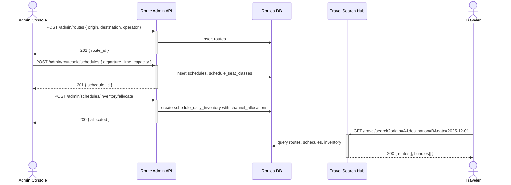

## Status & Telemetry
- Status: Ready for implementation
- Readiness: mvp（路线预订系统基础）
- Spec Paths: /admin/routes, /admin/schedules, /schedules/availability
- Migrations: db/migrations/0020_routes_schedules.sql（routes, schedules, schedule_inventory tables）
- Newman: 待实现 • reports/newman/route-schedule-management.json
- Last Update: 2025-11-21T10:00:00+08:00

## 0) Prerequisites
- Admin 身份认证与 RBAC 中间件可用（admin-package-config 已提供）
- travel-search-hub 将消费路线和时刻表数据返回给前端
- Multi-channel inventory 模型已存在（复用 product_inventory 的 channel_allocations 模式）
- Complex pricing engine 或 schedule-pricing-rules 提供时刻表定价逻辑

## 1) API Sequence (Context)


## 2) Contract (OAS 3.0.3)
```yaml
paths:
  /admin/routes:
    post:
      tags: [Admin - Routes]
      summary: Create a new route
      requestBody:
        required: true
        content:
          application/json:
            schema:
              type: object
              required: [name, origin, destination, route_type, operator_id]
              properties:
                name:
                  type: string
                  example: "Central to Cheung Chau Ferry"
                origin:
                  type: string
                  example: "Central Pier 5"
                destination:
                  type: string
                  example: "Cheung Chau Ferry Pier"
                route_type:
                  type: string
                  enum: [ferry, bus, train]
                operator_id:
                  type: string
                  example: "cheung_chau_ferry_co"
                description:
                  type: string
                duration_minutes:
                  type: integer
                  example: 50
                distance_km:
                  type: number
                  example: 18.5
      responses:
        "201":
          description: Route created
          content:
            application/json:
              schema:
                type: object
                properties:
                  route_id:
                    type: integer
                  name:
                    type: string
                  status:
                    type: string
                    enum: [active, inactive]
        "400":
          description: Invalid input
        "409":
          description: Route already exists
    get:
      tags: [Admin - Routes]
      summary: List all routes
      parameters:
        - name: status
          in: query
          schema:
            type: string
            enum: [active, inactive, all]
            default: active
        - name: route_type
          in: query
          schema:
            type: string
            enum: [ferry, bus, train]
        - name: page
          in: query
          schema:
            type: integer
            default: 1
        - name: limit
          in: query
          schema:
            type: integer
            default: 20
      responses:
        "200":
          description: Routes list
          content:
            application/json:
              schema:
                type: object
                properties:
                  total:
                    type: integer
                  page:
                    type: integer
                  page_size:
                    type: integer
                  routes:
                    type: array
                    items:
                      $ref: '#/components/schemas/Route'

  /admin/routes/{routeId}:
    get:
      tags: [Admin - Routes]
      summary: Get route details
      parameters:
        - name: routeId
          in: path
          required: true
          schema:
            type: integer
      responses:
        "200":
          description: Route details
        "404":
          description: Route not found
    put:
      tags: [Admin - Routes]
      summary: Update route
      parameters:
        - name: routeId
          in: path
          required: true
          schema:
            type: integer
      requestBody:
        required: true
        content:
          application/json:
            schema:
              type: object
              properties:
                name:
                  type: string
                status:
                  type: string
                  enum: [active, inactive]
                description:
                  type: string
                duration_minutes:
                  type: integer
      responses:
        "200":
          description: Route updated
        "404":
          description: Route not found
    delete:
      tags: [Admin - Routes]
      summary: Delete route (soft delete)
      parameters:
        - name: routeId
          in: path
          required: true
          schema:
            type: integer
      responses:
        "204":
          description: Route deleted
        "404":
          description: Route not found
        "409":
          description: Cannot delete - has active schedules

  /admin/routes/{routeId}/schedules:
    post:
      tags: [Admin - Schedules]
      summary: Create schedule for a route
      parameters:
        - name: routeId
          in: path
          required: true
          schema:
            type: integer
      requestBody:
        required: true
        content:
          application/json:
            schema:
              type: object
              required: [departure_time, arrival_time, weekdays, seat_classes]
              properties:
                departure_time:
                  type: string
                  format: time
                  example: "08:00:00"
                arrival_time:
                  type: string
                  format: time
                  example: "08:50:00"
                weekdays:
                  type: array
                  items:
                    type: integer
                    minimum: 0
                    maximum: 6
                  example: [1, 2, 3, 4, 5]
                  description: "0=Sunday, 6=Saturday"
                seat_classes:
                  type: array
                  items:
                    type: object
                    required: [class_type, capacity]
                    properties:
                      class_type:
                        type: string
                        enum: [standard, vip]
                      capacity:
                        type: integer
                        example: 300
                      base_price:
                        type: number
                        example: 50.00
                status:
                  type: string
                  enum: [active, suspended]
                  default: active
      responses:
        "201":
          description: Schedule created
          content:
            application/json:
              schema:
                type: object
                properties:
                  schedule_id:
                    type: integer
                  route_id:
                    type: integer
                  departure_time:
                    type: string
        "400":
          description: Invalid input
        "404":
          description: Route not found
    get:
      tags: [Admin - Schedules]
      summary: List schedules for a route
      parameters:
        - name: routeId
          in: path
          required: true
          schema:
            type: integer
        - name: status
          in: query
          schema:
            type: string
            enum: [active, suspended, all]
            default: active
      responses:
        "200":
          description: Schedules list
          content:
            application/json:
              schema:
                type: object
                properties:
                  route_id:
                    type: integer
                  schedules:
                    type: array
                    items:
                      $ref: '#/components/schemas/Schedule'

  /admin/schedules/{scheduleId}:
    put:
      tags: [Admin - Schedules]
      summary: Update schedule
      parameters:
        - name: scheduleId
          in: path
          required: true
          schema:
            type: integer
      requestBody:
        required: true
        content:
          application/json:
            schema:
              type: object
              properties:
                departure_time:
                  type: string
                  format: time
                arrival_time:
                  type: string
                  format: time
                weekdays:
                  type: array
                  items:
                    type: integer
                status:
                  type: string
                  enum: [active, suspended]
      responses:
        "200":
          description: Schedule updated
        "404":
          description: Schedule not found
    delete:
      tags: [Admin - Schedules]
      summary: Delete schedule (soft delete)
      parameters:
        - name: scheduleId
          in: path
          required: true
          schema:
            type: integer
      responses:
        "204":
          description: Schedule deleted
        "404":
          description: Schedule not found

  /admin/schedules/inventory/allocate:
    post:
      tags: [Admin - Inventory]
      summary: Allocate inventory for schedule across channels
      requestBody:
        required: true
        content:
          application/json:
            schema:
              type: object
              required: [schedule_id, date, seat_class, channel_allocations]
              properties:
                schedule_id:
                  type: integer
                date:
                  type: string
                  format: date
                  example: "2025-12-01"
                seat_class:
                  type: string
                  enum: [standard, vip]
                channel_allocations:
                  type: object
                  properties:
                    direct:
                      type: object
                      properties:
                        allocated:
                          type: integer
                          example: 200
                    ota:
                      type: object
                      properties:
                        allocated:
                          type: integer
                          example: 80
                    reseller:
                      type: object
                      properties:
                        allocated:
                          type: integer
                          example: 20
      responses:
        "200":
          description: Inventory allocated
          content:
            application/json:
              schema:
                type: object
                properties:
                  schedule_id:
                    type: integer
                  date:
                    type: string
                  total_allocated:
                    type: integer
        "400":
          description: Invalid allocation (exceeds capacity)
        "404":
          description: Schedule not found

  /schedules/{scheduleId}/availability:
    get:
      tags: [Public - Schedules]
      summary: Check schedule availability for a specific date
      parameters:
        - name: scheduleId
          in: path
          required: true
          schema:
            type: integer
        - name: date
          in: query
          required: true
          schema:
            type: string
            format: date
        - name: channel
          in: query
          required: false
          schema:
            type: string
            enum: [direct, ota, reseller]
            default: direct
        - name: seat_class
          in: query
          required: false
          schema:
            type: string
            enum: [standard, vip]
      responses:
        "200":
          description: Availability information
          content:
            application/json:
              schema:
                type: object
                properties:
                  schedule_id:
                    type: integer
                  date:
                    type: string
                  availability:
                    type: array
                    items:
                      type: object
                      properties:
                        seat_class:
                          type: string
                        channel:
                          type: string
                        available:
                          type: integer
                        allocated:
                          type: integer
                        reserved:
                          type: integer
                        sold:
                          type: integer
        "404":
          description: Schedule not found or no inventory for date

components:
  schemas:
    Route:
      type: object
      properties:
        id:
          type: integer
        name:
          type: string
        origin:
          type: string
        destination:
          type: string
        route_type:
          type: string
          enum: [ferry, bus, train]
        operator_id:
          type: string
        description:
          type: string
        duration_minutes:
          type: integer
        distance_km:
          type: number
        status:
          type: string
          enum: [active, inactive]
        created_at:
          type: string
          format: date-time
        updated_at:
          type: string
          format: date-time

    Schedule:
      type: object
      properties:
        id:
          type: integer
        route_id:
          type: integer
        departure_time:
          type: string
          format: time
        arrival_time:
          type: string
          format: time
        weekdays:
          type: array
          items:
            type: integer
        seat_classes:
          type: array
          items:
            type: object
            properties:
              class_type:
                type: string
              capacity:
                type: integer
              base_price:
                type: number
        status:
          type: string
          enum: [active, suspended]
        created_at:
          type: string
          format: date-time
```

## 3) Invariants
- 路线的 origin 和 destination 组合必须唯一（同一运营商、同一类型）
- 时刻表的 departure_time 必须早于 arrival_time
- 同一路线的时刻表 departure_time 不能重复（同一 weekdays）
- 库存分配总量不能超过座位容量（all channels.allocated <= seat_capacity）
- 只有 status='active' 的路线和时刻表可被搜索和预订
- 库存分配必须按 schedule_id + date + seat_class 维度隔离

## 4) Validations, Idempotency & Concurrency
- 创建路线时验证 origin/destination 有效性（城市代码库）
- 创建时刻表时验证时间格式和 weekdays 范围 (0-6)
- 库存分配时检查总量不超过 seat_capacity
- 使用唯一索引防止重复路线：UNIQUE(origin, destination, route_type, operator_id)
- 使用唯一索引防止重复时刻表：UNIQUE(route_id, departure_time, weekdays)
- 库存分配使用 UPSERT 模式（INSERT ON CONFLICT UPDATE）确保幂等性
- 库存查询和预订需要事务隔离，防止超卖

## 5) Rules & Writes (TX)

### 创建路线流程
1. 验证 origin/destination 城市代码有效性
2. 检查路线是否已存在（origin + destination + route_type + operator_id）
3. 插入 routes 表（status='active'）
4. 返回 route_id

### 创建时刻表流程
1. 验证 route_id 存在且状态为 active
2. 验证 departure_time < arrival_time
3. 验证 weekdays 格式正确
4. 插入 schedules 表
5. 批量插入 schedule_seat_classes 表（每个 seat_class 一行）
6. 返回 schedule_id

### 分配库存流程（关键事务）
1. 启动事务
2. 验证 schedule_id 存在且状态为 active
3. 查询 schedule_seat_classes 获取 seat_capacity
4. 验证 SUM(channel_allocations.*.allocated) <= seat_capacity
5. UPSERT schedule_daily_inventory 表：
   - INSERT (schedule_id, date, seat_class, channel_allocations)
   - ON CONFLICT (schedule_id, date, seat_class) DO UPDATE
6. 提交事务
7. 返回分配结果

### 查询可用性流程
1. 查询 schedule_daily_inventory 表（schedule_id + date + seat_class）
2. 计算每个 channel 的 available = allocated - reserved - sold
3. 返回可用性数据

## 6) Data Impact & Transactions

### 新增数据表

#### routes
```sql
CREATE TABLE routes (
  id INT PRIMARY KEY AUTO_INCREMENT,
  name VARCHAR(255) NOT NULL,
  origin VARCHAR(100) NOT NULL,
  destination VARCHAR(100) NOT NULL,
  route_type ENUM('ferry', 'bus', 'train') NOT NULL,
  operator_id VARCHAR(100) NOT NULL,
  description TEXT,
  duration_minutes INT,
  distance_km DECIMAL(10, 2),
  status ENUM('active', 'inactive') DEFAULT 'active',
  created_at TIMESTAMP DEFAULT CURRENT_TIMESTAMP,
  updated_at TIMESTAMP DEFAULT CURRENT_TIMESTAMP ON UPDATE CURRENT_TIMESTAMP,
  UNIQUE KEY uk_route (origin, destination, route_type, operator_id),
  INDEX idx_origin_destination (origin, destination),
  INDEX idx_status (status)
);
```

#### schedules
```sql
CREATE TABLE schedules (
  id INT PRIMARY KEY AUTO_INCREMENT,
  route_id INT NOT NULL,
  departure_time TIME NOT NULL,
  arrival_time TIME NOT NULL,
  weekdays JSON NOT NULL COMMENT 'Array of weekday numbers: 0=Sunday, 6=Saturday',
  status ENUM('active', 'suspended') DEFAULT 'active',
  created_at TIMESTAMP DEFAULT CURRENT_TIMESTAMP,
  updated_at TIMESTAMP DEFAULT CURRENT_TIMESTAMP ON UPDATE CURRENT_TIMESTAMP,
  FOREIGN KEY (route_id) REFERENCES routes(id),
  UNIQUE KEY uk_schedule (route_id, departure_time),
  INDEX idx_route_status (route_id, status)
);
```

#### schedule_seat_classes
```sql
CREATE TABLE schedule_seat_classes (
  id INT PRIMARY KEY AUTO_INCREMENT,
  schedule_id INT NOT NULL,
  class_type ENUM('standard', 'vip') NOT NULL,
  capacity INT NOT NULL,
  base_price DECIMAL(10, 2),
  created_at TIMESTAMP DEFAULT CURRENT_TIMESTAMP,
  FOREIGN KEY (schedule_id) REFERENCES schedules(id) ON DELETE CASCADE,
  UNIQUE KEY uk_schedule_class (schedule_id, class_type)
);
```

#### schedule_daily_inventory
```sql
CREATE TABLE schedule_daily_inventory (
  id INT PRIMARY KEY AUTO_INCREMENT,
  schedule_id INT NOT NULL,
  date DATE NOT NULL,
  seat_class ENUM('standard', 'vip') NOT NULL,
  channel_allocations JSON NOT NULL COMMENT 'Multi-channel allocation: { "direct": {allocated, reserved, sold}, "ota": {...}, "reseller": {...} }',
  created_at TIMESTAMP DEFAULT CURRENT_TIMESTAMP,
  updated_at TIMESTAMP DEFAULT CURRENT_TIMESTAMP ON UPDATE CURRENT_TIMESTAMP,
  FOREIGN KEY (schedule_id) REFERENCES schedules(id),
  UNIQUE KEY uk_schedule_date_class (schedule_id, date, seat_class),
  INDEX idx_date (date),
  INDEX idx_schedule_date (schedule_id, date)
);
```

### 数据完整性约束
- routes 软删除：status='inactive'（不物理删除，保留历史记录）
- schedules 软删除：status='suspended'
- 删除路线时检查是否有 active schedules
- channel_allocations JSON 格式验证在应用层完成

## 7) Observability
- Metrics:
  - `routes.created.count` - 路线创建数量
  - `schedules.created.count` - 时刻表创建数量
  - `inventory.allocation.count` - 库存分配操作数量
  - `inventory.availability.query.latency` - 可用性查询延迟
- Logs:
  - 记录路线和时刻表的创建、更新、删除操作（admin_id, action, resource_id）
  - 记录库存分配失败（超出容量、schedule 不存在等）
  - 记录可用性查询（schedule_id, date, channel）
- Traces:
  - 对库存分配事务添加 `inventory_allocation` span
  - 对可用性查询添加 `availability_check` span

## 8) Acceptance — Given / When / Then
- Given 管理员已登录，When 创建路线（origin, destination, route_type），Then 返回 201 和 route_id
- Given 路线已存在，When 创建重复路线，Then 返回 409 冲突
- Given 路线已创建，When 创建时刻表（departure_time, arrival_time, weekdays），Then 返回 201 和 schedule_id
- Given 时刻表已创建，When 分配库存（schedule_id, date, channel_allocations），Then 返回 200 且总分配量 <= 座位容量
- Given 库存分配超出容量，When 尝试分配，Then 返回 400 错误
- Given 库存已分配，When 查询可用性（schedule_id, date），Then 返回各 channel 的 available 数量
- Given 时刻表已有预订，When 尝试删除时刻表，Then 返回 409 冲突
- Given 路线 status='inactive'，When 搜索该路线，Then 不返回此路线

## 9) Postman Coverage
- 场景：创建路线（成功、重复）
- 场景：创建时刻表（成功、时间格式错误、route_id 不存在）
- 场景：分配库存（成功、超出容量、幂等性验证）
- 场景：查询可用性（成功、schedule 不存在、未分配库存）
- 场景：更新路线状态（active → inactive）
- 场景：删除时刻表（成功、有活跃预订时失败）

## Validation Evidence
- Newman 测试集合：`reports/newman/route-schedule-management.json`
- 覆盖所有 CRUD 操作和边界条件
- 验证库存分配的事务完整性和并发安全性

## Integration Points
- **travel-search-hub** 消费 routes 和 schedules 数据返回搜索结果
- **schedule-pricing-rules** 使用 schedule_seat_classes.base_price 作为定价基础
- **order-create** 需要扩展支持 schedule 订单（order_items 包含 schedule_id + date）
- **seat-lock-service** 需要扩展支持 schedule-based 座位锁定
- **tickets-issuance** 需要扩展支持 route ticket 格式（包含 schedule 信息）

## Notes
- 库存模型复用了 product_inventory 的 channel_allocations 模式，但增加了 date 和 seat_class 维度
- weekdays 使用 JSON 存储数组以支持灵活的运营日历（如仅工作日、仅周末等）
- base_price 存储在 schedule_seat_classes，具体定价规则由 schedule-pricing-rules 卡片处理
- 此卡片专注于数据管理（CRUD），预订流程由 order-create 扩展实现
