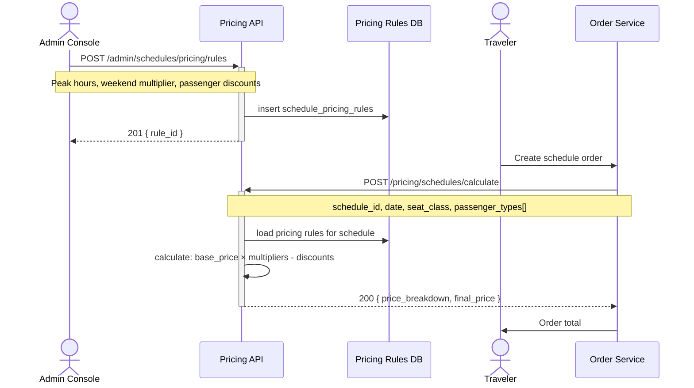

## Status & Telemetry
- Status: Ready for implementation
- Readiness: mvp（时刻表动态定价）
- Spec Paths: /admin/schedules/pricing/rules, /pricing/schedules/calculate
- Migrations: db/migrations/0021_schedule_pricing_rules.sql
- Newman: 待实现 • reports/newman/schedule-pricing-rules.json
- Last Update: 2025-11-21T10:00:00+08:00

## 0) Prerequisites
- route-schedule-management 已创建 schedules 和 schedule_seat_classes 表
- complex-pricing-engine 提供定价计算框架参考
- order-create 将调用定价 API 计算最终票价
- travel-search-hub 可能需要展示预估价格

## 1) API Sequence (Context)


## 2) Contract (OAS 3.0.3)
```yaml
paths:
  /admin/schedules/pricing/rules:
    post:
      tags: [Admin - Pricing]
      summary: Create or update pricing rule for schedule(s)
      requestBody:
        required: true
        content:
          application/json:
            schema:
              type: object
              required: [rule_name, rule_type, conditions, adjustments]
              properties:
                rule_name:
                  type: string
                  example: "Weekend Premium Pricing"
                rule_type:
                  type: string
                  enum: [time_based, date_based, passenger_based, seat_class_based]
                applies_to:
                  type: object
                  properties:
                    schedule_ids:
                      type: array
                      items:
                        type: integer
                      description: "Specific schedules (empty = all schedules)"
                    route_ids:
                      type: array
                      items:
                        type: integer
                      description: "All schedules on these routes"
                    route_types:
                      type: array
                      items:
                        type: string
                        enum: [ferry, bus, train]
                conditions:
                  type: object
                  properties:
                    time_range:
                      type: object
                      properties:
                        start:
                          type: string
                          format: time
                          example: "07:00:00"
                        end:
                          type: string
                          format: time
                          example: "09:00:00"
                      description: "Peak hours"
                    weekdays:
                      type: array
                      items:
                        type: integer
                      example: [0, 6]
                      description: "0=Sunday, 6=Saturday"
                    date_range:
                      type: object
                      properties:
                        start:
                          type: string
                          format: date
                        end:
                          type: string
                          format: date
                      description: "Seasonal pricing"
                    seat_class:
                      type: string
                      enum: [standard, vip]
                    passenger_type:
                      type: string
                      enum: [adult, child, senior, student]
                adjustments:
                  type: object
                  properties:
                    type:
                      type: string
                      enum: [multiplier, fixed_amount, percentage_discount]
                    value:
                      type: number
                      example: 1.3
                      description: "For multiplier: 1.3 = 30% increase. For fixed: absolute amount. For percentage: 0.2 = 20% discount"
                priority:
                  type: integer
                  default: 0
                  description: "Higher priority rules apply first (for conflicting rules)"
                status:
                  type: string
                  enum: [active, inactive]
                  default: active
                effective_from:
                  type: string
                  format: date-time
                effective_until:
                  type: string
                  format: date-time
                  description: "Optional expiration date"
      responses:
        "201":
          description: Pricing rule created
          content:
            application/json:
              schema:
                type: object
                properties:
                  rule_id:
                    type: integer
                  rule_name:
                    type: string
        "400":
          description: Invalid rule configuration
    get:
      tags: [Admin - Pricing]
      summary: List all pricing rules
      parameters:
        - name: status
          in: query
          schema:
            type: string
            enum: [active, inactive, all]
            default: active
        - name: rule_type
          in: query
          schema:
            type: string
            enum: [time_based, date_based, passenger_based, seat_class_based]
        - name: schedule_id
          in: query
          schema:
            type: integer
          description: "Filter rules applicable to specific schedule"
      responses:
        "200":
          description: Pricing rules list
          content:
            application/json:
              schema:
                type: object
                properties:
                  total:
                    type: integer
                  rules:
                    type: array
                    items:
                      $ref: '#/components/schemas/PricingRule'

  /admin/schedules/pricing/rules/{ruleId}:
    get:
      tags: [Admin - Pricing]
      summary: Get pricing rule details
      parameters:
        - name: ruleId
          in: path
          required: true
          schema:
            type: integer
      responses:
        "200":
          description: Rule details
        "404":
          description: Rule not found
    put:
      tags: [Admin - Pricing]
      summary: Update pricing rule
      parameters:
        - name: ruleId
          in: path
          required: true
          schema:
            type: integer
      requestBody:
        required: true
        content:
          application/json:
            schema:
              type: object
              properties:
                rule_name:
                  type: string
                conditions:
                  type: object
                adjustments:
                  type: object
                priority:
                  type: integer
                status:
                  type: string
                  enum: [active, inactive]
      responses:
        "200":
          description: Rule updated
        "404":
          description: Rule not found
    delete:
      tags: [Admin - Pricing]
      summary: Delete pricing rule
      parameters:
        - name: ruleId
          in: path
          required: true
          schema:
            type: integer
      responses:
        "204":
          description: Rule deleted
        "404":
          description: Rule not found

  /pricing/schedules/calculate:
    post:
      tags: [Public - Pricing]
      summary: Calculate price for schedule ticket(s)
      requestBody:
        required: true
        content:
          application/json:
            schema:
              type: object
              required: [schedule_id, travel_date, passengers]
              properties:
                schedule_id:
                  type: integer
                travel_date:
                  type: string
                  format: date
                  example: "2025-12-01"
                seat_class:
                  type: string
                  enum: [standard, vip]
                  default: standard
                passengers:
                  type: array
                  items:
                    type: object
                    required: [passenger_type, quantity]
                    properties:
                      passenger_type:
                        type: string
                        enum: [adult, child, senior, student]
                      quantity:
                        type: integer
                        minimum: 1
                  example:
                    - passenger_type: adult
                      quantity: 2
                    - passenger_type: child
                      quantity: 1
      responses:
        "200":
          description: Price calculated
          content:
            application/json:
              schema:
                type: object
                properties:
                  schedule_id:
                    type: integer
                  travel_date:
                    type: string
                  seat_class:
                    type: string
                  price_breakdown:
                    type: array
                    items:
                      type: object
                      properties:
                        passenger_type:
                          type: string
                        quantity:
                          type: integer
                        base_price:
                          type: number
                        applied_rules:
                          type: array
                          items:
                            type: object
                            properties:
                              rule_name:
                                type: string
                              adjustment_type:
                                type: string
                              adjustment_value:
                                type: number
                              price_impact:
                                type: number
                        unit_price:
                          type: number
                        subtotal:
                          type: number
                  total_price:
                    type: number
                  currency:
                    type: string
                    default: "HKD"
        "404":
          description: Schedule not found or no pricing configured

components:
  schemas:
    PricingRule:
      type: object
      properties:
        id:
          type: integer
        rule_name:
          type: string
        rule_type:
          type: string
        applies_to:
          type: object
        conditions:
          type: object
        adjustments:
          type: object
        priority:
          type: integer
        status:
          type: string
        effective_from:
          type: string
          format: date-time
        effective_until:
          type: string
          format: date-time
        created_at:
          type: string
          format: date-time
        updated_at:
          type: string
          format: date-time
```

## 3) Invariants
- 定价规则的 effective_from 必须早于 effective_until
- 基础价格 (base_price) 从 schedule_seat_classes 表获取，规则只提供调整
- 同一条件下多个规则按 priority 排序应用（高优先级先执行）
- multiplier 类型的调整值必须 > 0（1.0 = 无变化，1.3 = 30% 增加）
- percentage_discount 类型的调整值范围 0-1（0.2 = 20% 折扣）
- 最终价格不能为负数（应用所有规则后 >= 0）
- 只有 status='active' 且在有效期内的规则才被应用

## 4) Validations, Idempotency & Concurrency
- 创建规则时验证 conditions 和 adjustments 的格式正确性
- 验证 schedule_ids 或 route_ids 存在于数据库
- 验证 time_range.start < time_range.end
- 验证 weekdays 范围 0-6
- 定价计算时按 priority 降序排序规则，依次应用
- 使用缓存减少定价规则查询（TTL: 5分钟）
- 定价计算是幂等的（相同输入总是返回相同结果）
- 规则更新后需清除缓存

## 5) Rules & Writes (TX)

### 创建定价规则流程
1. 验证 applies_to 中的 schedule_ids/route_ids 存在
2. 验证 conditions 和 adjustments 格式
3. 验证时间范围逻辑正确性
4. 插入 schedule_pricing_rules 表
5. 清除定价缓存
6. 返回 rule_id

### 定价计算流程（核心逻辑）
```
For each passenger:
  1. 获取 base_price from schedule_seat_classes
  2. 查询所有适用的规则：
     - applies_to 匹配 schedule_id
     - conditions 匹配 travel_date, weekday, time
     - status = 'active'
     - 在有效期内 (effective_from <= now <= effective_until)
  3. 按 priority 降序排序规则
  4. 依次应用规则：
     - multiplier: price = price × value
     - fixed_amount: price = price + value
     - percentage_discount: price = price × (1 - value)
  5. 确保 price >= 0
  6. 计算 subtotal = price × quantity
  7. 记录 applied_rules 用于透明展示
Return: price_breakdown + total_price
```

### 规则优先级示例
```
Priority 100: Peak hour surcharge (7-9am, multiplier 1.3)
Priority 50: Weekend premium (Sat/Sun, multiplier 1.2)
Priority 10: Child discount (child type, percentage 0.5)
Priority 0: Senior discount (senior type, percentage 0.3)

Calculation order: 100 → 50 → 10 → 0
Example: Adult peak weekend ticket
  Base: $50
  After peak (×1.3): $65
  After weekend (×1.2): $78
  Final: $78
```

## 6) Data Impact & Transactions

### 新增数据表

#### schedule_pricing_rules
```sql
CREATE TABLE schedule_pricing_rules (
  id INT PRIMARY KEY AUTO_INCREMENT,
  rule_name VARCHAR(255) NOT NULL,
  rule_type ENUM('time_based', 'date_based', 'passenger_based', 'seat_class_based') NOT NULL,
  applies_to JSON COMMENT '{ "schedule_ids": [], "route_ids": [], "route_types": [] }',
  conditions JSON NOT NULL COMMENT '{ "time_range": {}, "weekdays": [], "date_range": {}, "seat_class": "", "passenger_type": "" }',
  adjustments JSON NOT NULL COMMENT '{ "type": "multiplier|fixed_amount|percentage_discount", "value": number }',
  priority INT DEFAULT 0,
  status ENUM('active', 'inactive') DEFAULT 'active',
  effective_from TIMESTAMP DEFAULT CURRENT_TIMESTAMP,
  effective_until TIMESTAMP NULL,
  created_at TIMESTAMP DEFAULT CURRENT_TIMESTAMP,
  updated_at TIMESTAMP DEFAULT CURRENT_TIMESTAMP ON UPDATE CURRENT_TIMESTAMP,
  INDEX idx_status_priority (status, priority),
  INDEX idx_rule_type (rule_type),
  INDEX idx_effective (effective_from, effective_until)
);
```

### 缓存策略
- 缓存键：`pricing_rules:schedule:{schedule_id}` 或 `pricing_rules:route:{route_id}`
- TTL: 5 分钟
- 规则更新/删除时主动清除相关缓存
- 定价计算结果不缓存（实时计算确保准确性）

## 7) Observability
- Metrics:
  - `pricing.rules.created.count` - 规则创建数量
  - `pricing.calculate.count` - 定价计算次数
  - `pricing.calculate.latency` - 定价计算延迟
  - `pricing.rules.applied.count` - 规则应用次数（按 rule_id 分组）
  - `pricing.cache.hit_rate` - 规则缓存命中率
- Logs:
  - 记录定价规则创建、更新、删除（admin_id, rule_id, action）
  - 记录定价计算请求（schedule_id, date, passengers, final_price）
  - 记录规则应用失败（invalid conditions, missing base_price）
- Traces:
  - 对定价计算添加 `pricing_calculate` span
  - 记录每个规则的应用耗时

## 8) Acceptance — Given / When / Then
- Given 管理员创建高峰时段规则（7-9am, multiplier 1.3），When 计算 8:00 班次价格，Then 价格 = base_price × 1.3
- Given 周末加价规则（Sat/Sun, multiplier 1.2）和儿童折扣规则（child, 50% discount），When 计算周六儿童票，Then 先应用加价再应用折扣（按 priority）
- Given 基础价格 $50，高峰规则 ×1.3，周末规则 ×1.2，When 计算高峰周末成人票，Then 最终价格 = $50 × 1.3 × 1.2 = $78
- Given 规则设置为 inactive，When 计算价格，Then 该规则不被应用
- Given 规则有效期已过（effective_until < now），When 计算价格，Then 该规则不被应用
- Given 多个规则 priority 相同，When 计算价格，Then 按 id 排序应用（确定性结果）
- Given 未配置任何规则，When 计算价格，Then 返回 base_price
- Given 规则配置错误（如 schedule_id 不存在），When 创建规则，Then 返回 400 错误

## 9) Postman Coverage
- 场景：创建定价规则（成功、schedule_id 不存在、条件格式错误）
- 场景：计算价格（无规则、单一规则、多规则叠加、不同乘客类型）
- 场景：高峰时段定价（时间匹配、时间不匹配）
- 场景：周末加价（weekdays 匹配、weekdays 不匹配）
- 场景：乘客折扣（儿童、老人、学生）
- 场景：座位等级差异（standard vs vip）
- 场景：规则优先级验证（高 priority 先应用）
- 场景：规则有效期验证（未生效、已过期）
- 场景：更新规则状态（active → inactive）

## Validation Evidence
- Newman 测试集合：`reports/newman/schedule-pricing-rules.json`
- 覆盖所有规则类型和计算场景
- 验证规则优先级和叠加逻辑正确性
- 性能测试：单次计算延迟 < 100ms（含规则查询和应用）

## Integration Points
- **schedule_seat_classes** 提供 base_price
- **order-create** 调用 `/pricing/schedules/calculate` 获取最终价格
- **travel-search-hub** 可能调用定价 API 展示预估价格
- **complex-pricing-engine** 可参考本卡片的定价框架（但针对不同产品类型）

## Design Decisions

### 为什么使用规则引擎而不是硬编码？
- **灵活性**：运营团队可通过 Admin API 动态配置定价策略，无需代码变更
- **可扩展性**：支持多种规则类型（时间、日期、乘客、座位等级）
- **可审计性**：所有规则变更有记录，applied_rules 展示定价透明度

### 为什么使用 priority 而不是规则类型顺序？
- **明确性**：避免隐式规则应用顺序的歧义
- **控制力**：运营人员可明确控制哪些规则优先应用
- **冲突解决**：当多个规则冲突时，高优先级规则决定最终价格

### 为什么不缓存计算结果？
- **准确性优先**：规则可能随时变更，缓存可能导致价格不一致
- **计算成本低**：规则应用是简单的数学运算，< 100ms 可接受
- **缓存规则已足够**：缓存规则查询结果已大幅减少数据库压力

## Examples

### 示例 1：创建高峰时段规则
```json
POST /admin/schedules/pricing/rules
{
  "rule_name": "Morning Peak Surcharge",
  "rule_type": "time_based",
  "applies_to": {
    "route_types": ["ferry"]
  },
  "conditions": {
    "time_range": {
      "start": "07:00:00",
      "end": "09:00:00"
    }
  },
  "adjustments": {
    "type": "multiplier",
    "value": 1.3
  },
  "priority": 100,
  "status": "active"
}
```

### 示例 2：计算周末儿童票价格
```json
POST /pricing/schedules/calculate
{
  "schedule_id": 101,
  "travel_date": "2025-12-06",
  "seat_class": "standard",
  "passengers": [
    {
      "passenger_type": "child",
      "quantity": 2
    }
  ]
}

Response:
{
  "schedule_id": 101,
  "travel_date": "2025-12-06",
  "seat_class": "standard",
  "price_breakdown": [
    {
      "passenger_type": "child",
      "quantity": 2,
      "base_price": 50.00,
      "applied_rules": [
        {
          "rule_name": "Weekend Premium",
          "adjustment_type": "multiplier",
          "adjustment_value": 1.2,
          "price_impact": 10.00
        },
        {
          "rule_name": "Child Discount",
          "adjustment_type": "percentage_discount",
          "adjustment_value": 0.5,
          "price_impact": -30.00
        }
      ],
      "unit_price": 30.00,
      "subtotal": 60.00
    }
  ],
  "total_price": 60.00,
  "currency": "HKD"
}
```

## Notes
- 此卡片专注于定价规则管理和计算，不处理库存或预订逻辑
- 定价规则是声明式的（declarative），方便未来扩展新的规则类型
- applied_rules 字段提供定价透明度，用户可理解价格构成
- 规则引擎设计考虑了扩展性，未来可支持更复杂的条件（如季节、节假日、促销活动等）
