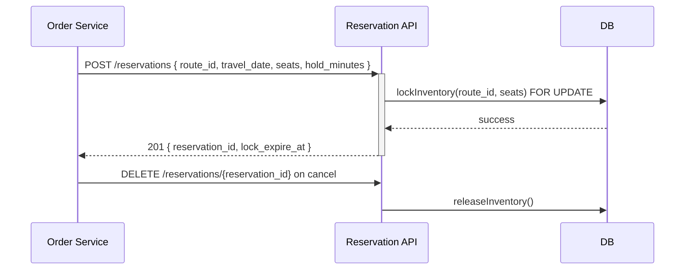

## Status & Telemetry
- Status: Ready
- Readiness: prototype（首次支持锁座 & 自动释放）
- Spec Paths: /reservations, /reservations/{reservationId}
- Migrations: db/migrations/0011_reservations_table.sql
- Newman: 未实现 • reports/newman/seat-lock-service.json
- Last Update: 2025-10-24T18:28:44+08:00

## 0) Prerequisites
- travel-search-hub 提供的班次、库存、座位等级信息。
- order-create-idempotent 需集成锁座创建。
- 分布式锁或数据库行锁策略明确，避免重复锁定。
- 任务调度器可每分钟扫描过期锁。

## 1) API Sequence (Context)


## 2) Contract (OAS 3.0.3)
```yaml
paths:
  /reservations:
    post:
      tags: [Reservations]
      summary: Lock seats for an order
      requestBody:
        required: true
        content:
          application/json:
            schema:
              type: object
              required: [route_id, travel_date, seats]
              properties:
                route_id:
                  type: string
                travel_date:
                  type: string
                  format: date
                seat_class:
                  type: string
                seats:
                  type: integer
                  minimum: 1
                passengers:
                  type: array
                  items:
                    type: object
                    properties:
                      passenger_type:
                        type: string
                        enum: [adult, child, senior]
                hold_minutes:
                  type: integer
                  default: 10
      responses:
        "201":
          description: Reservation created
          content:
            application/json:
              schema:
                type: object
                properties:
                  reservation_id:
                    type: string
                  lock_expire_at:
                    type: string
                    format: date-time
        "409":
          description: Insufficient seats or overlapping lock
        "422":
          description: Invalid payload
  /reservations/{reservationId}:
    delete:
      tags: [Reservations]
      summary: Release reservation after cancel/timeout
      parameters:
        - name: reservationId
          in: path
          required: true
          schema:
            type: string
      responses:
        "204":
          description: Released
        "404":
          description: Reservation not found or already released
```

## 3) Invariants
- 同一路线同时间段锁座必须遵守库存不为负。
- 默认锁座 10 分钟，可由 hold_minutes 配置但不超过 30。
- 订单取消、支付失败、超时必须释放锁座。
- 持有状态下不可重复创建相同订单锁座（幂等 based on (user_id, route_id, travel_date)）。

## 4) Validations, Idempotency & Concurrency
- 对 (route_id, travel_date, seat_class) 采用 `SELECT ... FOR UPDATE` 确保并发安全。
- 支持客户端携带 `idempotency_key`；若检测到重复，返回已有 reservation。
- 超时检测任务使用 `NOW() > lock_expire_at` 处理释放动作，并通过事件告知订单服务。
- 校验 seats > 0 且乘客数与 seats 对齐，不匹配返回 422。

## 5) Rules & Writes (TX)
1. 校验 payload -> 生成 idempotency key。
2. 开启事务，查询库存行并加锁。
3. 判断 `available - reserved >= seats`；不足抛 409。
4. 更新 `reserved` 计数，加写 `reservations` 行（status=held, lock_expire_at）。
5. 提交事务，返回 reservation。
6. 监听订单状态变化释放或确认座位。

## 6) Data Impact & Transactions
- 新表 `reservations`：id, route_id, seat_class, seat_count, lock_expire_at, status, order_id?, created_at。
- 在 `inventory` 表增加 `reserved_count` 字段与索引。
- 定时任务/消息队列释放逻辑（外部 worker）。

## 7) Observability
- Metrics：`reservations.create.success`, `reservations.create.conflict`, `reservations.release.expired`。
- Logs：记录冲突原因、释放结果、订单联动失败。
- Audit：保留 reservation 历史 90 天以供对账。

## 8) Acceptance — Given / When / Then
- Given 库存充足，When 创建锁座，Then 返回 201 且库存 reserved 增加。
- Given 库存不足，When 创建锁座，Then 返回 409。
- Given 订单取消，When 调用 DELETE，Then 库存 reserved 减少。
- Given 锁座超时，When 定时任务运行，Then 自动释放并通知订单服务。

## 9) Postman Coverage
- Happy path 创建锁座。
- 重复 idempotency key -> 返回相同 reservation。
- 库存不足 -> 409。
- DELETE 释放、重复删除 -> 404。
- 模拟超时释放（通过测试钩子缩短 lock_expire_at）。
