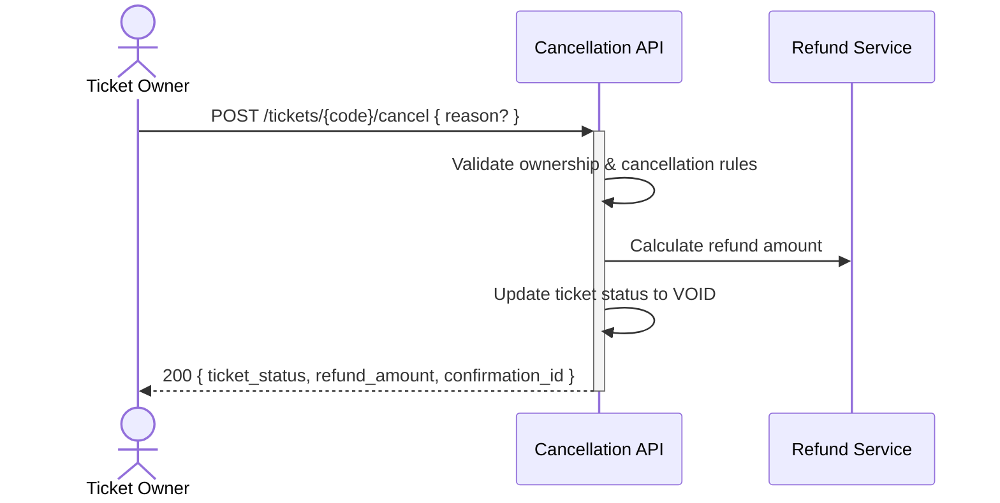

## Status & Telemetry
- Status: Ready
- Readiness: mvp
- Spec Paths: /tickets/{code}/cancel
- Migrations: db/migrations/0008_ticket_cancellations.sql
- Newman: 0/0 • reports/newman/ticket-cancellation.json
- Last Update: 2025-10-20T16:30:00+0800

## 0) Prerequisites
- User authentication available (Bearer token)
- my-tickets card implemented (user owns ticket validation)
- Cancellation policy rules defined
- Refund processing service available

## 1) API Sequence (Context)


## 2) Contract (OAS 3.0.3 fragment)
```yaml
paths:
  /tickets/{code}/cancel:
    post:
      tags: [Tickets]
      summary: Cancel ticket and initiate refund
      security: [{ bearerAuth: [] }]
      parameters:
        - name: code
          in: path
          required: true
          schema:
            type: string
      requestBody:
        required: false
        content:
          application/json:
            schema:
              type: object
              properties:
                reason:
                  type: string
                  description: Optional cancellation reason
      responses:
        "200":
          description: Ticket cancelled successfully
          content:
            application/json:
              schema:
                type: object
                properties:
                  ticket_status:
                    type: string
                    enum: [void]
                  refund_amount:
                    type: number
                    format: decimal
                  refund_id:
                    type: string
                  cancelled_at:
                    type: string
                    format: date-time
        "401":
          description: Unauthorized
        "404":
          description: Ticket not found or not owned by user
        "409":
          description: Ticket cannot be cancelled (already used/expired)
```

## 3) Invariants
- Only ticket owner can cancel their tickets
- Only ACTIVE or PARTIALLY_REDEEMED tickets can be cancelled
- Refund amount = original_amount * (1 - redemption_percentage)
- Cancelled tickets transition to VOID status
- Cancellation is idempotent

## 4) Validations, Idempotency & Concurrency
- Verify ticket ownership via JWT user_id
- Check ticket status allows cancellation (not REDEEMED, EXPIRED, VOID)
- Calculate refund based on remaining entitlements
- Return 200 with same data if already cancelled (idempotent)

## 5) Rules & Writes (TX)
1) Authenticate user and extract user_id from JWT
2) Begin transaction
3) Load ticket with user_id verification and FOR UPDATE lock
4) Validate ticket status is cancellable (ACTIVE or PARTIALLY_REDEEMED)
5) Calculate refund amount based on remaining entitlements
6) Update ticket status to VOID, set cancelled_at timestamp
7) Insert cancellation record for audit trail
8) Call refund processing service with refund details
9) Commit transaction
10) Return success response with refund info

## 6) Data Impact & Transactions
**Migration:** `db/migrations/0008_ticket_cancellations.sql`
- Add `cancelled_at` DATETIME NULL to `tickets` table
- Add `cancellation_reason` TEXT NULL to `tickets` table
- Create `cancellations` table:
  - id (PK), ticket_id (FK), user_id, refund_amount, refund_id, reason, created_at
- Add index on (user_id, created_at) for user cancellation history

## 7) Observability
- Log `ticket.cancellation.requested {ticket_code, user_id, reason}`
- Log `ticket.cancellation.success {ticket_id, refund_amount, refund_id}`
- Log `ticket.cancellation.failed {ticket_code, reason, error_code}`
- Metric `ticket.cancellations.count`
- Metric `ticket.cancellations.refund_total`

## 8) Acceptance — Given / When / Then
**Given** a user owns an active ticket with unused entitlements
**When** they POST to `/tickets/{code}/cancel`
**Then** ticket status becomes VOID and refund is calculated for unused portions

**Given** a ticket has been fully redeemed
**When** user attempts cancellation
**Then** 409 Conflict returned with "Cannot cancel fully used ticket"

**Given** user attempts to cancel someone else's ticket
**When** they POST with valid code but wrong ownership
**Then** 404 Not Found returned

## 9) Postman Coverage
```js
// Happy path: Cancel active ticket
pm.test('Cancel active ticket returns 200', () => {
  pm.response.to.have.status(200);
  const resp = pm.response.json();
  pm.expect(resp.ticket_status).to.equal('void');
  pm.expect(resp.refund_amount).to.be.a('number');
  pm.expect(resp.refund_id).to.be.a('string');
});

// Edge case: Already cancelled ticket (idempotent)
pm.test('Already cancelled ticket returns same result', () => {
  pm.response.to.have.status(200);
});

// Error case: Fully redeemed ticket
pm.test('Cannot cancel redeemed ticket', () => {
  pm.response.to.have.status(409);
});
```