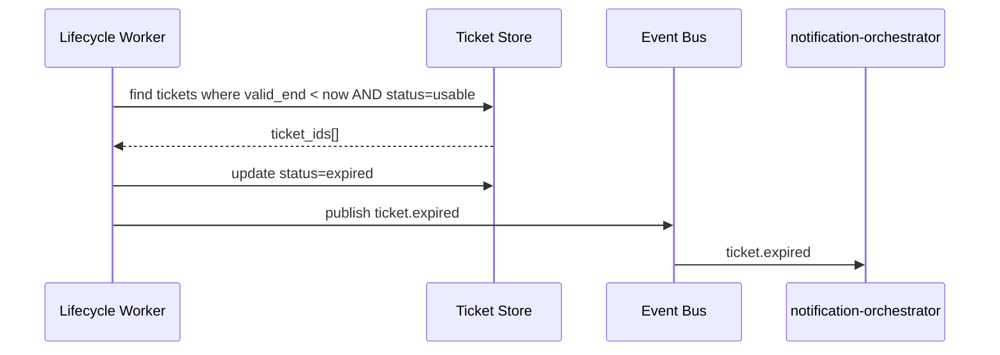

## Status & Telemetry
- Status: Ready
- Readiness: mvp（首次提供票券状态机 & 定时任务）
- Spec Paths: 内部 cron/worker
- Migrations: db/migrations/0013_ticket_status_audit.sql
- Newman: 待实现 • reports/newman/ticket-lifecycle-daemon.json
- Last Update: 2025-10-24T18:28:44+08:00

## 0) Prerequisites
- bundle-ticket-engine 已生成票券及权益快照。
- refund-processing、ticket-cancellation 提供退改接口。
- notification-orchestrator 已接入事件队列。
- Scheduler/队列基础设施可运行每分钟任务。

## 1) API Sequence (Context)


## 2) Contract (OAS 3.0.3)
```yaml
# Worker configuration (YAML)
lifecycle_daemon:
  expire_job:
    schedule: "*/5 * * * *"
    batch_size: 200
  refund_job:
    schedule: "* * * * *"
    consumer: "refund_queue"
```

## 3) Invariants
- 票券状态机允许以下转换：usable → used/refunded/changing/expired；changing → changed；changed → usable（重新出票）；任何终态不可回退到 usable。
- 单票券状态更新必须写审计日志，保持顺序一致。
- 订单终态取决于票券集合：全部终态 → completed；全部退票 → cancelled。
- 状态机需幂等；重复处理同一事件不得造成额外写入。

## 4) Validations, Idempotency & Concurrency
- 使用 `ticket_status_audit` 表 + `(ticket_id, new_status, event_id)` 唯一键保证幂等。
- 采用 `SELECT ... FOR UPDATE SKIP LOCKED` 拉取待处理票券，避免多 worker 冲突。
- 退改任务校验退改规则输出的目标状态；不符合时标记失败并告警。
- 确保通知发送失败时任务可重试（事件保留）。

## 5) Rules & Writes (TX)
1. 定时任务 `expire_job`：批量查询 `valid_end < now` 且 `status=usable`；逐条更新 status=expired，写审计并发布事件。
2. 退改/改签处理：消费 `ticket.refund.requested`、`ticket.change.requested` 队列，调用 refund-processing / change service，写状态。
3. 订单状态同步：在事务内统计订单票券状态，更新 `orders.status`（completed/cancelled）。
4. 核销后 1 小时检查订单是否终态。

## 6) Data Impact & Transactions
- 新增表 `ticket_status_audit`（id, ticket_id, prev_status, new_status, event, meta JSON, created_at）。
- `orders` 表增加 `completed_at`, `cancelled_at` 字段。
- 建立索引 `(ticket_id, created_at)`、`(order_id, status)`。

## 7) Observability
- Metrics：`tickets.expired.count`, `tickets.refund.success`, `tickets.change.failed`, `orders.completed.count`。
- Logs：状态转换失败、审计写入失败、通知发送失败。
- Alerts：expire_job 连续失败三次触发告警。

## 8) Acceptance — Given / When / Then
- Given 票券过期，When expire_job 运行，Then 票券标记为 expired 且通知触发。
- Given 所有票券核销完成，When daemon 汇总，Then 订单状态更新为 completed。
- Given 退票申请通过，When 消费 refund 事件，Then 状态更新为 refunded 并记录审计。
- Given 重复消费同一事件，Then 状态与审计保持幂等不重复。

## 9) Postman Coverage
- 通过 worker 集成测试：模拟过期、退票、改签、重复事件、失败重试。
