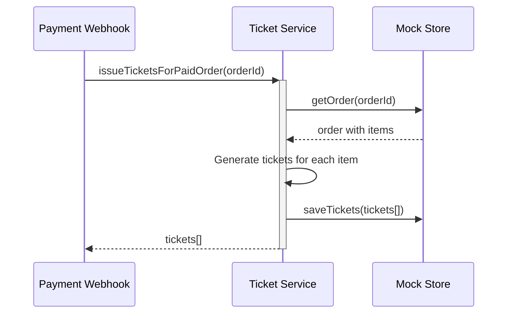

# Tickets issuance (sync) — Dev Notes

## Status & Telemetry
- Status: Done
- Readiness: mvp
- Spec Paths: Internal service (no direct API endpoints)
- Migrations: db/migrations/0005_tickets_table.sql
- Newman: Internal service • reports/newman/tickets-issuance.json
- Last Update: 2025-10-24T17:30:00+08:00

## 0) Prerequisites
- order-create card implemented (orders must exist)
- payment-webhook card calls this service
- Product catalog with function definitions available
- Mock data store with ticket storage capability

## 1) API Sequence (Context)


## 2) Contract (OAS 3.0.3)
```yaml
# Internal TypeScript service interface - no REST API
interface TicketService {
  issueTicketsForPaidOrder(orderId: number): Promise<Ticket[]>
}

# Ticket entity schema
components:
  schemas:
    Ticket:
      type: object
      properties:
        ticket_code:
          type: string
          description: Unique ticket identifier
          example: "TKT-123-1-1"
        order_id:
          type: integer
          description: Order that generated this ticket
        user_id:
          type: integer
          description: Ticket owner
        product_id:
          type: integer
          description: Product this ticket represents
        status:
          type: string
          enum: [valid, used, void]
          description: Current ticket status
        valid_from:
          type: string
          format: date-time
          description: When ticket becomes valid
        valid_until:
          type: string
          format: date-time
          description: When ticket expires
        issued_at:
          type: string
          format: date-time
          description: When ticket was created
        functions:
          type: array
          items:
            type: object
            properties:
              function_code:
                type: string
                example: "bus"
              label:
                type: string
                example: "Bus Ride"
              quantity:
                type: integer
                example: 2
          description: Entitlements included with this ticket
```

## 3) Invariants
- Only PAID orders can have tickets issued
- Ticket codes must be globally unique across all tickets
- Each product function becomes a ticket entitlement
- One ticket per quantity unit (qty=2 → 2 separate tickets)
- Idempotent: Multiple calls with same orderId return same tickets
- Tickets inherit validity period from product configuration

## 4) Validations, Idempotency & Concurrency
- Validate order exists and status is PAID
- Validate all products in order exist and are active
- Generate unique ticket codes using format: `TKT-{orderId}-{itemIndex}-{ticketIndex}`
- Check for existing tickets for orderId (idempotency)
- Use transaction boundaries to ensure atomicity
- Handle concurrent issuance attempts gracefully

## 5) Rules & Writes (TX)
**issueTicketsForPaidOrder(orderId):**
1) Begin transaction
2) Load order with FOR UPDATE lock
3) Verify order status is PAID (throw if not)
4) Check if tickets already exist for this order (return existing if found)
5) For each order item:
   - Load product details and functions
   - Create qty number of individual tickets
   - Generate unique ticket code for each
   - Set validity dates based on product configuration
   - Copy product functions as ticket entitlements
6) Save all tickets to store atomically
7) Update order with ticket count
8) Commit transaction
9) Log issuance completion
10) Return created tickets array

## 6) Data Impact & Transactions
**Migration:** `db/migrations/0005_tickets_table.sql`
```sql
CREATE TABLE tickets (
  ticket_code VARCHAR(50) PRIMARY KEY,
  order_id INT NOT NULL,
  user_id INT NOT NULL,
  product_id INT NOT NULL,
  status ENUM('valid', 'used', 'void') DEFAULT 'valid',
  valid_from TIMESTAMP NULL,
  valid_until TIMESTAMP NULL,
  issued_at TIMESTAMP DEFAULT CURRENT_TIMESTAMP,
  functions JSON NOT NULL,
  INDEX idx_tickets_order (order_id),
  INDEX idx_tickets_user (user_id),
  INDEX idx_tickets_status (status),
  FOREIGN KEY (order_id) REFERENCES orders(order_id) ON DELETE CASCADE
);
```

**Data Flow:**
- Input: Order ID (from payment webhook)
- Processing: Generate individual tickets based on order items
- Output: Array of created ticket entities
- Storage: Tickets stored in mock data store

## 7) Observability
- Log `tickets.issuance.started` with `{order_id, item_count}`
- Log `tickets.issuance.completed` with `{order_id, tickets_created}`
- Log `tickets.issuance.failed` with `{order_id, error_reason}`
- Log `tickets.issuance.idempotent` with `{order_id, existing_count}`
- Metric `tickets.issued.count` - Total tickets created
- Metric `tickets.issuance.duration_ms` - Performance tracking
- Alert on issuance failures or unusual delays

## 8) Acceptance — Given / When / Then
**Given** a PAID order with 2x Transport Pass (product 101)
**When** issueTicketsForPaidOrder is called
**Then** 2 individual tickets are created with unique codes and bus/ferry/metro entitlements

**Given** an order with mixed products (1x Transport Pass, 1x Day Pass)
**When** tickets are issued
**Then** 2 tickets created with different entitlements based on their respective products

**Given** issueTicketsForPaidOrder called twice with same order ID
**When** second call is made
**Then** same tickets are returned (idempotent behavior), no duplicates created

**Given** an order with status PENDING (not yet paid)
**When** ticket issuance is attempted
**Then** error is thrown and no tickets are created

**Given** an order references a non-existent product
**When** ticket issuance is attempted
**Then** error is thrown with clear product validation message

## 9) Postman Coverage
- Internal service testing via ticket-dependent endpoints:
- POST /payments/notify → triggers ticket issuance → verify tickets created
- GET /my/tickets → verify issued tickets appear for user
- POST /tickets/{code}/qr-token → verify issued tickets can generate QR codes
- Idempotency test: Multiple payment webhooks for same order
- Error handling: Invalid order IDs, unpaid orders, missing products
- Load test: Bulk ticket issuance performance