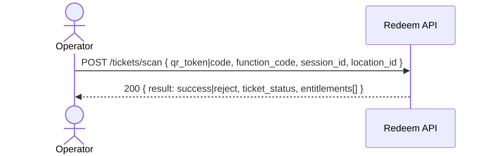

## ⚠️ DEPRECATED

**This API endpoint has been removed as of 2025-11-13.**

**Reason**: Replaced by unified venue scanning API with better separation of concerns (decrypt → display → redeem workflow).

**Migration Path**:
- **Old**: POST `/tickets/scan` (single-step validate + redeem with JWT token)
- **New**:
  1. POST `/qr/decrypt` (decrypt and verify QR code)
  2. POST `/venue/scan` (validate and redeem ticket)

**Benefits of New Flow**:
- Supports both encrypted QR (AES-256-GCM) and legacy JWT formats
- Frontend can display ticket info before redemption
- Better operator confirmation workflow
- Optimized QR data structure (56.8% smaller)

**See**: [venue-enhanced-scanning.md](venue-enhanced-scanning.md) for the replacement API.

---

## Status & Telemetry
- Status: Ready
- Readiness: production
- Spec Paths: /tickets/scan
- Migrations: db/migrations/0004_redemption_events_jti.sql, db/migrations/0007_redemptions_indexes.sql
- Newman: 0/0 • reports/newman/tickets-scan.json
- Last Update: 2025-10-20T09:56:51+0800

## 0) Prerequisites
- Operator login & validator session creation available.
- QR token issuance includes `jti` and `exp`.
- Secret for verifying tokens available to Redeem API.

## 1) API Sequence (Context)


## 2) Contract (OAS 3.0.3)
```yaml
paths:
  /tickets/scan:
    post:
      tags: [Redemption]
      summary: Validate + redeem in one atomic call
      requestBody:
        required: true
        content:
          application/json:
            schema:
              $ref: '#/components/schemas/ScanRequest'
      responses:
        "200":
          description: OK
          content:
            application/json:
              schema:
                $ref: '#/components/schemas/ScanResponse'
        "409":
          description: Ambiguous or conflict
          content:
            application/json:
              schema: { $ref: '#/components/schemas/Error' }
```

## 3) Invariants
- A single scan **never** decrements more than once.  
- `remaining_uses` cannot go below zero.  
- Ticket status transitions are one-way (e.g., assigned→active→partially_redeemed→redeemed).

## 4) Validations, Idempotency & Concurrency
- Verify token signature and `exp`; reject if expired (`TOKEN_EXPIRED`).  
- Idempotency: prevent replay using `jti` (unique) → `409` on replay.  
- Lock entitlement row: `SELECT ... FOR UPDATE` and decrement on success.  
- Errors:
  - **422** `NO_REMAINING`: no remaining uses
  - **422** `WRONG_FUNCTION`: function not on ticket
  - **422** `TICKET_INVALID`: ticket status/expiry invalid
  - **409** `IDEMPOTENCY_CONFLICT` or `REPLAY` (jti already processed)

## 5) Rules & Writes (TX)
1) Parse and verify token (or code fallback). Extract `{tid, jti}`.  
2) Begin TX.  
3) If `jti` exists in `redemption_events` (unique), **409**.  
4) Load entitlement for `tid,function_code` **FOR UPDATE**.  
5) Validate remaining > 0 and ticket status.  
6) Insert `redemption_events(ticket_id,function_code,operator_id,session_id,location_id,result='success',reason=NULL,jti,ts=NOW())`.  
7) Decrement `remaining_uses`. Update ticket status if now zero across all entitlements.  
8) Commit and return `200 {result:'success', ticket_status, entitlements[]}`.  
9) On rule fail: insert `redemption_events(..., result='reject', reason=CODE)` and return with reason or 422.

## 6) Data Impact & Transactions
**Migration:** `db/migrations/0004_redemption_events_jti.sql` + `0007_redemptions_indexes.sql`

## 7) Observability
- Logs: `scan.attempt {ticket_id,function_code}`, `scan.success`, `scan.reject {reason}`.  
- Metrics: `scan.success.count`, `scan.reject.count`.

## 8) Acceptance — Given / When / Then
**Given** a ticket `T` with entitlements `{ferry:1, bus:2}` and a valid QR token with `jti`.  
**When** POST `/tickets/scan` with `function_code='ferry'`.  
**Then** `200 { result:'success' }`, remaining for `ferry` becomes `0`.  
**And** a repeated scan with the **same token** returns **409**.

## 9) Postman Coverage
- Happy path: success once.  
- Replay: same token → 409.  
- Exhaustion: scan until remaining=0 → next returns 422 `NO_REMAINING`.