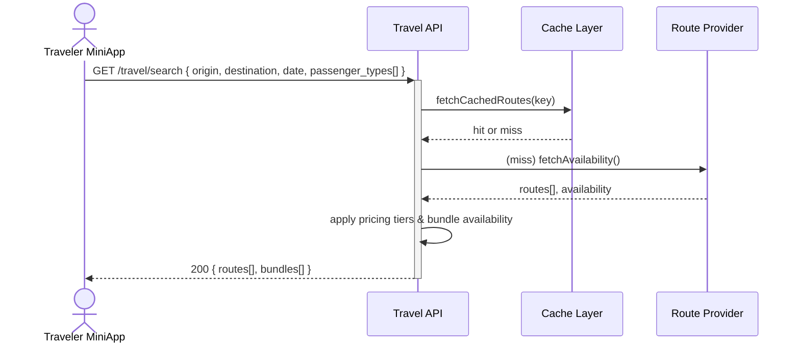

## Status & Telemetry
- Status: Ready for implementation
- Readiness: prototype（首版支持核心查询链路）
- Spec Paths: /travel/search, /travel/hot-cities, /travel/blackout-dates, /packages/templates
- Migrations: db/migrations/0010_travel_search_cache.sql（缓存表、索引）
- Newman: 已覆盖 • reports/collections/us-010a-traveler-loop.json
- Last Update: 2025-10-24T18:28:44+08:00

## 0) Prerequisites
- Catalog 产品与线路基础数据已建模。
- Redis 或内置缓存中间件可用，提供 24 小时/年度 TTL。
- 外部线路/班次数据源、套票模板数据同步任务正常。
- API 网关已配置速率限制（防刷）。

## 1) API Sequence (Context)


## 2) Contract (OAS 3.0.3)
```yaml
paths:
  /travel/hot-cities:
    get:
      tags: [Travel]
      summary: List hot origins/destinations with 24h cache
      responses:
        "200":
          description: Hot cities
          content:
            application/json:
              schema:
                type: object
                properties:
                  cities:
                    type: array
                    items:
                      type: object
                      properties:
                        code:
                          type: string
                        name:
                          type: string
                        weight:
                          type: integer
  /travel/blackout-dates:
    get:
      tags: [Travel]
      summary: Return blackout dates (cached by year)
      responses:
        "200":
          description: Blackout calendar
          content:
            application/json:
              schema:
                type: object
                properties:
                  year:
                    type: integer
                  blackout_dates:
                    type: array
                    items:
                      type: string
                      format: date
  /travel/search:
    get:
      tags: [Travel]
      summary: Search multi-modal routes and bundle packages
      parameters:
        - name: origin
          in: query
          required: true
          schema:
            type: string
        - name: destination
          in: query
          required: true
          schema:
            type: string
        - name: travel_date
          in: query
          required: true
          schema:
            type: string
            format: date
        - name: passenger_types
          in: query
          required: false
          schema:
            type: array
            items:
              type: string
              enum: [adult, child, senior]
        - name: passenger_count
          in: query
          required: false
          schema:
            type: integer
      responses:
        "200":
          description: Available routes and bundles
          content:
            application/json:
              schema:
                type: object
                properties:
                  routes:
                    type: array
                    items:
                      $ref: '#/components/schemas/RouteOption'
                  bundles:
                    type: array
                    items:
                      $ref: '#/components/schemas/BundleOption'
        "400":
          description: Invalid search parameters
        "503":
          description: Downstream provider unavailable
```

## 3) Invariants
- 热门城市与禁售日 API 必须遵守缓存 TTL（24h / 1y），命中率记录 metrics。
- 查询结果仅包含 `status=onsale` 且库存 > 0 的路线与套票。
- 套票权益展示需拉取最新模板版本 snapshot。
- 库存对齐：对同一请求多次调用需保持价格与余票一致（直到锁座）。

## 4) Validations, Idempotency & Concurrency
- 校验 origin/destination 是否在支持列表；不合法返回 422。
- 旅客类型与人数上限（<=10）违规返回 400。
- 对外部线路 API 设置 3 秒超时与熔断策略；缓存 fallback。
- 同一线路查询结果按班次 ID 去重，防止重复条目。

## 5) Rules & Writes (TX)
1. 计算缓存键（origin-destination-date-passengerHash）。
2. 命中缓存直接返回（并刷新 TTL）。
3. 未命中则并行拉取：线路班次、套票模板、库存/价格。
4. 合并旅客类型计算阶梯定价，组装响应。
5. 写入缓存表 `travel_search_cache`（JSON、expires_at）。

## 6) Data Impact & Transactions
- 新增表 `travel_search_cache`（key, payload, expires_at, created_at）。
- 新增索引 `(key)` 与 `(expires_at)` 以便清理任务。
- 无破坏性变更；缓存清理 cron 每小时运行。

## 7) Observability
- Metrics：`travel.search.cache_hit`, `travel.search.cache_miss`, `travel.search.latency`。
- Logs：记录外部源错误、熔断触发、payload 大小 > 1MB 警告。
- Traces：对外部 SOURCE 调用加入 `route_provider` span。

## 8) Acceptance — Given / When / Then
- Given 存在缓存，When 查询同一路线，Then 返回缓存数据且命中计数 +1。
- Given 缓存 miss 且外部接口可用，When 查询，Then 返回包含 routes[] 和 bundles[]。
- Given 外部接口超时，When 查询，Then 返回 503 并记录降级。
- Given 禁售日命中，When 查询禁售日期，Then `availability=false`。

## 9) Postman Coverage
- 场景：热点城市获取、禁售日获取、常规查询、查询参数缺失、外部源不可用（mock 503）。

## Validation Evidence
- ✅ 2025-10-28 旅客闭环集合 `reports/newman/us-010a-traveler-loop.json` 实际调用远端环境（baseUrl=https://express-jdpny.ondigitalocean.app），覆盖热门查询、锁座、下单、微信预支付、支付回调与锁座释放，生成报告 `reports/newman/e2e.xml`。
- ✅ 运营支撑集合 `reports/newman/us-010b-operations-backbone.json` 验证后台模板与路线票价工作流。
