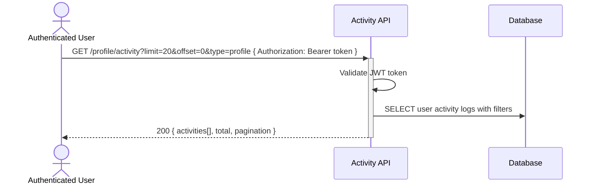

# User activity history and audit trail — Dev Notes

## Status & Telemetry
- Status: Ready
- Readiness: mvp
- Spec Paths: /profile/activity
- Migrations: db/migrations/0010_user_activity_log.sql
- Newman: 0/0 • reports/newman/user-activity-endpoint.json
- Last Update: 2025-10-21T00:00:00+00:00

## 0) Prerequisites
- User authentication system available (Bearer token)
- user-profile-endpoint card implemented
- Activity logging system in place for user actions
- Pagination utilities available

## 1) API Sequence (Context)


## 2) Contract (OAS 3.0.3)
```yaml
paths:
  /profile/activity:
    get:
      tags: [ProfileManagement]
      summary: Get user activity history
      description: Retrieve authenticated user's activity history with filtering and pagination
      security:
        - BearerAuth: []
      parameters:
        - name: limit
          in: query
          description: Number of activities to return (max 100)
          required: false
          schema:
            type: integer
            minimum: 1
            maximum: 100
            default: 20
        - name: offset
          in: query
          description: Number of activities to skip for pagination
          required: false
          schema:
            type: integer
            minimum: 0
            default: 0
        - name: type
          in: query
          description: Filter by activity type
          required: false
          schema:
            type: string
            enum: [profile, order, ticket, login, settings, all]
            default: all
        - name: from_date
          in: query
          description: Filter activities from this date (ISO 8601)
          required: false
          schema:
            type: string
            format: date-time
        - name: to_date
          in: query
          description: Filter activities to this date (ISO 8601)
          required: false
          schema:
            type: string
            format: date-time
      responses:
        "200":
          description: Activity history retrieved successfully
          content:
            application/json:
              schema:
                $ref: '#/components/schemas/ActivityHistory'
        "400":
          description: Bad request - invalid query parameters
        "401":
          description: Unauthorized - invalid or missing token
        "422":
          description: Validation failed - invalid date format or parameters

components:
  schemas:
    ActivityHistory:
      type: object
      properties:
        activities:
          type: array
          items:
            $ref: '#/components/schemas/ActivityEntry'
        total:
          type: integer
          description: Total number of activities matching filters
        pagination:
          type: object
          properties:
            limit:
              type: integer
            offset:
              type: integer
            has_more:
              type: boolean

    ActivityEntry:
      type: object
      properties:
        activity_id:
          type: string
        type:
          type: string
          enum: [profile, order, ticket, login, settings]
        action:
          type: string
          description: Specific action taken (e.g., profile_updated, order_created)
        description:
          type: string
          description: Human-readable description of the activity
        timestamp:
          type: string
          format: date-time
        metadata:
          type: object
          description: Additional context data for the activity
          properties:
            ip_address:
              type: string
            user_agent:
              type: string
            resource_id:
              type: string
            changes:
              type: object
        severity:
          type: string
          enum: [info, warning, critical]
          description: Importance level of the activity
```

## 3) Invariants
- Only authenticated users can access their own activity history
- Activity logs are immutable once created
- All user actions must be logged with proper context
- Activity entries include sufficient audit trail information
- Sensitive data is not stored in activity logs

## 4) Validations, Idempotency & Concurrency
- Verify JWT token authenticity and extract user_id
- Validate query parameters (limit, offset, date ranges)
- Ensure date ranges are logical (from_date < to_date)
- Filter activities to only show user's own records
- Pagination prevents large result sets

## 5) Rules & Writes (TX)
**GET /profile/activity:**
1) Validate JWT token and extract user_id
2) Parse and validate query parameters
3) Build database query with filters:
   - user_id = authenticated user
   - activity type filter if specified
   - date range filter if specified
   - LIMIT and OFFSET for pagination
4) Execute query with proper indexes
5) Count total matching records for pagination
6) Format response with activities and pagination metadata
7) Return activity history

## 6) Data Impact & Transactions
**Migration:** `db/migrations/0010_user_activity_log.sql`

```sql
CREATE TABLE user_activity_log (
  activity_id VARCHAR(36) PRIMARY KEY,
  user_id VARCHAR(36) NOT NULL,
  type ENUM('profile', 'order', 'ticket', 'login', 'settings') NOT NULL,
  action VARCHAR(100) NOT NULL,
  description TEXT,
  timestamp TIMESTAMP DEFAULT CURRENT_TIMESTAMP,
  metadata JSON,
  severity ENUM('info', 'warning', 'critical') DEFAULT 'info',
  ip_address VARCHAR(45),
  user_agent TEXT,
  resource_id VARCHAR(36),
  INDEX idx_user_activity_user_timestamp (user_id, timestamp DESC),
  INDEX idx_user_activity_type (user_id, type, timestamp DESC),
  INDEX idx_user_activity_timestamp (timestamp),
  FOREIGN KEY (user_id) REFERENCES users(user_id) ON DELETE CASCADE
);
```

**Activity Types and Actions:**
- `profile`: profile_created, profile_updated, profile_viewed
- `order`: order_created, order_updated, order_cancelled
- `ticket`: ticket_issued, ticket_scanned, ticket_cancelled
- `login`: login_success, login_failed, logout
- `settings`: settings_updated, password_changed, preferences_updated

## 7) Observability
- Log `activity.history.accessed {user_id, filters_applied}`
- Log `activity.history.filtered {user_id, result_count, filter_type}`
- Log `activity.history.pagination {user_id, offset, limit}`
- Metric `activity.history.requests.count`
- Metric `activity.history.response_size.histogram`
- Monitor query performance for large activity logs

## 8) Acceptance — Given / When / Then
**Given** an authenticated user with activity history
**When** they GET `/profile/activity`
**Then** their activity entries are returned in reverse chronological order

**Given** a user wants to see only profile-related activities
**When** they GET `/profile/activity?type=profile`
**Then** only profile activities are returned

**Given** a user requests activities from a specific date range
**When** they GET `/profile/activity?from_date=2025-01-01&to_date=2025-01-31`
**Then** only activities within that date range are returned

**Given** a user requests pagination with limit and offset
**When** they GET `/profile/activity?limit=10&offset=20`
**Then** 10 activities are returned starting from the 21st record

**Given** an unauthenticated request
**When** they access `/profile/activity` without valid token
**Then** 401 Unauthorized is returned

**Given** invalid query parameters
**When** they GET `/profile/activity?limit=200` (exceeds max)
**Then** 422 Validation Error is returned

## 9) Postman Coverage
- Happy path: GET activity returns paginated results
- Filtering: GET with type filter returns only matching activities
- Date filtering: GET with date range returns activities in range
- Pagination: GET with limit/offset returns correct subset
- Validation: GET with invalid limit → 422
- Validation: GET with invalid date format → 422
- Security: Access without token → 401
- Performance: Large activity log handles pagination correctly
- Empty result: User with no activities returns empty array