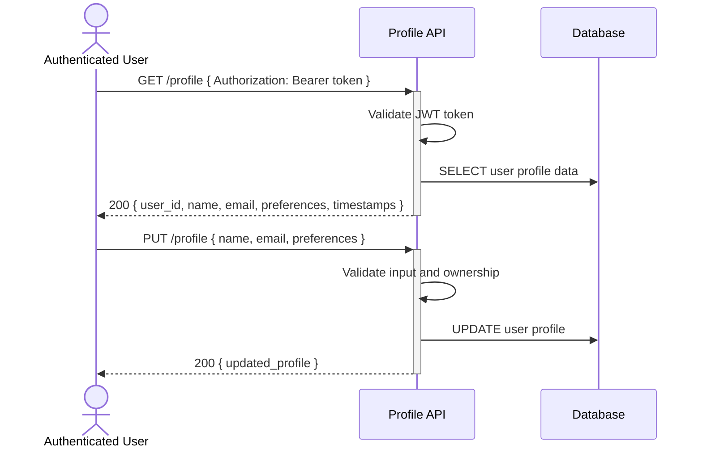

# User profile information access and management — Dev Notes

## Status & Telemetry
- Status: Ready
- Readiness: mvp
- Spec Paths: /profile
- Migrations: db/migrations/0009_user_profile_fields.sql
- Newman: 0/0 • reports/newman/user-profile-endpoint.json
- Last Update: 2025-10-21T00:00:00+00:00

## 0) Prerequisites
- User authentication system available (Bearer token)
- User entity exists in database
- Input validation middleware

## 1) API Sequence (Context)


## 2) Contract (OAS 3.0.3)
```yaml
paths:
  /profile:
    get:
      tags: [ProfileManagement]
      summary: Get current user's profile information
      description: Retrieve authenticated user's profile data including personal information and preferences
      security:
        - BearerAuth: []
      responses:
        "200":
          description: Profile information retrieved successfully
          content:
            application/json:
              schema:
                $ref: '#/components/schemas/UserProfile'
        "401":
          description: Unauthorized - invalid or missing token
        "404":
          description: User profile not found
    put:
      tags: [ProfileManagement]
      summary: Update user profile information
      description: Update authenticated user's profile details
      security:
        - BearerAuth: []
      requestBody:
        required: true
        content:
          application/json:
            schema:
              type: object
              properties:
                name:
                  type: string
                  minLength: 1
                  maxLength: 100
                email:
                  type: string
                  format: email
                preferences:
                  type: object
                  properties:
                    language:
                      type: string
                      enum: [en, es, fr]
                    timezone:
                      type: string
                    notification_email:
                      type: boolean
      responses:
        "200":
          description: Profile updated successfully
          content:
            application/json:
              schema:
                $ref: '#/components/schemas/UserProfile'
        "400":
          description: Bad request - invalid input format
        "401":
          description: Unauthorized - invalid or missing token
        "422":
          description: Validation failed
          content:
            application/json:
              schema:
                $ref: '#/components/schemas/ValidationError'

components:
  schemas:
    UserProfile:
      type: object
      properties:
        user_id:
          type: string
        name:
          type: string
        email:
          type: string
          format: email
        preferences:
          type: object
          properties:
            language:
              type: string
            timezone:
              type: string
            notification_email:
              type: boolean
        created_at:
          type: string
          format: date-time
        updated_at:
          type: string
          format: date-time
```

## 3) Invariants
- Only authenticated users can access their own profile
- Email addresses must be unique across the system
- Profile updates preserve user_id and created_at timestamp
- All profile modifications must be validated before saving

## 4) Validations, Idempotency & Concurrency
- Verify JWT token authenticity and extract user_id
- Validate email format and uniqueness (excluding current user)
- Sanitize name input (strip whitespace, prevent XSS)
- PUT operations are idempotent (same input produces same result)
- Use optimistic locking to prevent concurrent modification conflicts

## 5) Rules & Writes (TX)
**GET /profile:**
1) Validate JWT token and extract user_id
2) Query user profile from database
3) Return profile data or 404 if not found

**PUT /profile:**
1) Begin transaction
2) Validate JWT token and extract user_id
3) Load current user record with FOR UPDATE lock
4) Validate input data (email uniqueness, format validation)
5) Update user record with new values
6) Set updated_at timestamp
7) Commit transaction
8) Return updated profile data

## 6) Data Impact & Transactions
**Migration:** `db/migrations/0009_user_profile_fields.sql`
- Add `preferences` JSON field to users table
- Add `last_profile_update` timestamp field
- Add unique index on email field
- Add index on updated_at for performance

```sql
ALTER TABLE users
ADD COLUMN preferences JSON DEFAULT '{}',
ADD COLUMN last_profile_update TIMESTAMP DEFAULT CURRENT_TIMESTAMP;

CREATE UNIQUE INDEX idx_users_email_unique ON users(email);
CREATE INDEX idx_users_updated_at ON users(updated_at);
```

## 7) Observability
- Log `profile.access.success {user_id}`
- Log `profile.update.success {user_id, fields_changed}`
- Log `profile.update.validation_failed {user_id, validation_errors}`
- Log `profile.access.unauthorized {ip_address, token_status}`
- Metric `profile.updates.count`
- Metric `profile.access.count`

## 8) Acceptance — Given / When / Then
**Given** an authenticated user with valid JWT token
**When** they GET `/profile`
**Then** their profile information is returned with 200 status

**Given** an authenticated user wants to update their name
**When** they PUT `/profile` with new name data
**Then** their profile is updated and returns 200 with updated data

**Given** a user attempts to set an email already used by another user
**When** they PUT `/profile` with duplicate email
**Then** 422 Validation Error is returned with appropriate message

**Given** an unauthenticated request
**When** they access `/profile` without valid token
**Then** 401 Unauthorized is returned

## 9) Postman Coverage
- Happy path: GET profile returns user data
- Happy path: PUT profile updates name and email successfully
- Validation: PUT with invalid email format → 422
- Validation: PUT with duplicate email → 422
- Security: Access without token → 401
- Security: Access with invalid token → 401
- Idempotency: Multiple identical PUT requests produce same result