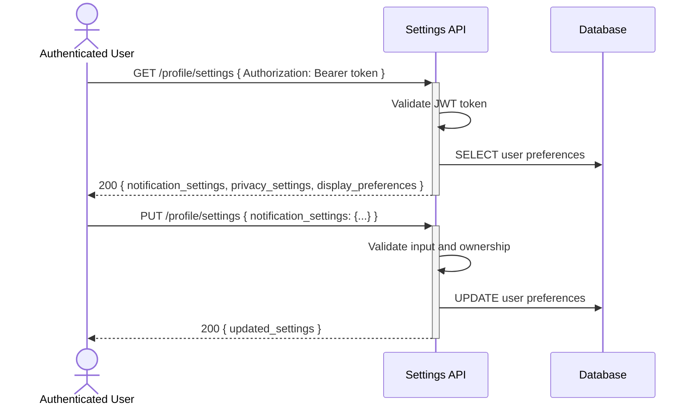

# User settings and preferences management — Dev Notes

## Status & Telemetry
- Status: Ready
- Readiness: mvp
- Spec Paths: /profile/settings
- Migrations: None (uses existing user preferences field)
- Newman: 0/0 • reports/newman/user-settings-endpoint.json
- Last Update: 2025-10-21T00:00:00+00:00

## 0) Prerequisites
- User authentication system available (Bearer token)
- user-profile-endpoint card implemented (provides preferences storage)
- User entity has preferences JSON field

## 1) API Sequence (Context)


## 2) Contract (OAS 3.0.3)
```yaml
paths:
  /profile/settings:
    get:
      tags: [ProfileManagement]
      summary: Get user settings and preferences
      description: Retrieve authenticated user's settings including notifications, privacy, and display preferences
      security:
        - BearerAuth: []
      responses:
        "200":
          description: User settings retrieved successfully
          content:
            application/json:
              schema:
                $ref: '#/components/schemas/UserSettings'
        "401":
          description: Unauthorized - invalid or missing token
    put:
      tags: [ProfileManagement]
      summary: Update user settings and preferences
      description: Update authenticated user's settings and preferences
      security:
        - BearerAuth: []
      requestBody:
        required: true
        content:
          application/json:
            schema:
              type: object
              properties:
                notification_settings:
                  type: object
                  properties:
                    email_notifications:
                      type: boolean
                    sms_notifications:
                      type: boolean
                    push_notifications:
                      type: boolean
                    order_updates:
                      type: boolean
                    promotional_emails:
                      type: boolean
                privacy_settings:
                  type: object
                  properties:
                    profile_visibility:
                      type: string
                      enum: [public, private]
                    show_purchase_history:
                      type: boolean
                    data_sharing_consent:
                      type: boolean
                display_preferences:
                  type: object
                  properties:
                    language:
                      type: string
                      enum: [en, es, fr, de]
                    timezone:
                      type: string
                    date_format:
                      type: string
                      enum: [MM/DD/YYYY, DD/MM/YYYY, YYYY-MM-DD]
                    currency_display:
                      type: string
                      enum: [USD, EUR, GBP, CAD]
      responses:
        "200":
          description: Settings updated successfully
          content:
            application/json:
              schema:
                $ref: '#/components/schemas/UserSettings'
        "400":
          description: Bad request - invalid input format
        "401":
          description: Unauthorized - invalid or missing token
        "422":
          description: Validation failed
          content:
            application/json:
              schema:
                $ref: '#/components/schemas/ValidationError'

components:
  schemas:
    UserSettings:
      type: object
      properties:
        notification_settings:
          type: object
          properties:
            email_notifications:
              type: boolean
            sms_notifications:
              type: boolean
            push_notifications:
              type: boolean
            order_updates:
              type: boolean
            promotional_emails:
              type: boolean
        privacy_settings:
          type: object
          properties:
            profile_visibility:
              type: string
              enum: [public, private]
            show_purchase_history:
              type: boolean
            data_sharing_consent:
              type: boolean
        display_preferences:
          type: object
          properties:
            language:
              type: string
              enum: [en, es, fr, de]
            timezone:
              type: string
            date_format:
              type: string
              enum: [MM/DD/YYYY, DD/MM/YYYY, YYYY-MM-DD]
            currency_display:
              type: string
              enum: [USD, EUR, GBP, CAD]
        updated_at:
          type: string
          format: date-time
```

## 3) Invariants
- Only authenticated users can access their own settings
- Settings updates preserve user identity and audit trail
- Default settings are provided for new users
- Privacy settings override display preferences for sensitive data

## 4) Validations, Idempotency & Concurrency
- Verify JWT token authenticity and extract user_id
- Validate enum values for language, timezone, date format
- Validate boolean values for notification preferences
- PUT operations are idempotent (same input produces same result)
- Merge new settings with existing ones (partial updates allowed)

## 5) Rules & Writes (TX)
**GET /profile/settings:**
1) Validate JWT token and extract user_id
2) Query user preferences from database
3) Return structured settings with defaults for missing values
4) Apply privacy settings to mask sensitive defaults

**PUT /profile/settings:**
1) Begin transaction
2) Validate JWT token and extract user_id
3) Load current user preferences with FOR UPDATE lock
4) Validate input data (enum values, data types)
5) Merge new settings with existing preferences
6) Update user preferences field
7) Set updated_at timestamp
8) Commit transaction
9) Return updated settings data

## 6) Data Impact & Transactions
**No Migration Required** - Uses existing `preferences` JSON field from user-profile-endpoint

**Settings Structure in Database:**
```json
{
  "notification_settings": {
    "email_notifications": true,
    "sms_notifications": false,
    "push_notifications": true,
    "order_updates": true,
    "promotional_emails": false
  },
  "privacy_settings": {
    "profile_visibility": "private",
    "show_purchase_history": false,
    "data_sharing_consent": false
  },
  "display_preferences": {
    "language": "en",
    "timezone": "UTC",
    "date_format": "MM/DD/YYYY",
    "currency_display": "USD"
  }
}
```

## 7) Observability
- Log `settings.access.success {user_id}`
- Log `settings.update.success {user_id, settings_changed}`
- Log `settings.update.validation_failed {user_id, validation_errors}`
- Log `settings.privacy.changed {user_id, privacy_level}`
- Metric `settings.updates.count`
- Metric `settings.notification_opt_outs.count`

## 8) Acceptance — Given / When / Then
**Given** an authenticated user with existing preferences
**When** they GET `/profile/settings`
**Then** their settings are returned with defaults for missing values

**Given** an authenticated user wants to disable email notifications
**When** they PUT `/profile/settings` with `{"notification_settings": {"email_notifications": false}}`
**Then** only email notifications are disabled, other settings remain unchanged

**Given** a user updates their language preference
**When** they PUT `/profile/settings` with `{"display_preferences": {"language": "es"}}`
**Then** language is updated to Spanish and returns 200 with updated settings

**Given** an invalid enum value for timezone
**When** they PUT `/profile/settings` with invalid timezone
**Then** 422 Validation Error is returned with specific field error

**Given** an unauthenticated request
**When** they access `/profile/settings` without valid token
**Then** 401 Unauthorized is returned

## 9) Postman Coverage
- Happy path: GET settings returns structured preferences
- Happy path: PUT partial settings updates only specified fields
- Happy path: PUT complete settings overwrites all values
- Validation: PUT with invalid language enum → 422
- Validation: PUT with invalid boolean values → 422
- Security: Access without token → 401
- Default handling: New user gets default settings structure
- Merge behavior: Partial updates preserve existing values