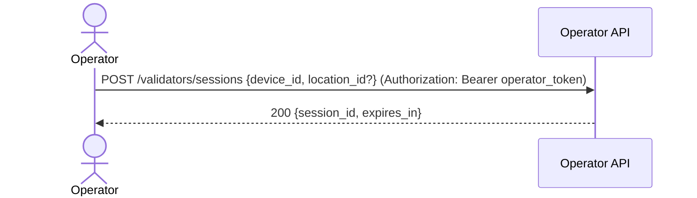

## ⚠️ DEPRECATED

**This API endpoint has been removed as of 2025-11-14.**

**Reason**: Sessions add unnecessary complexity. Operator JWT token is sufficient for authentication.

**Migration Path**:
- **Old**: POST `/operators/login` → POST `/validators/sessions` → use session_id
- **New**: POST `/operators/login` → use operator_token directly in Authorization header

**Benefits**:
- Simpler architecture (no session state management)
- Fewer database tables
- Operator authentication via standard JWT token

---

## Status & Telemetry
- Status: Ready
- Readiness: production
- Spec Paths: /validators/sessions
- Migrations: db/migrations/0005_validator_sessions.sql
- Newman: 0/0 • reports/newman/validators-sessions.json
- Last Update: 2025-10-20T00:12:44+0800

## 0) Prerequisites
- `/operators/login` returns a valid `operator_token`.
- Session TTL policy decided (e.g., 4h).

## 1) API Sequence (Context)


## 2) Contract (OAS 3.0.3 fragment)
```yaml
paths:
  /validators/sessions:
    post:
      tags: [Operators]
      summary: Start validator session (bind device/location)
      security: [{ bearerAuth: [] }]
      requestBody:
        required: true
        content:
          application/json:
            schema:
              type: object
              required: [device_id]
              properties:
                device_id: { type: string }
                location_id: { type: integer, nullable: true }
      responses:
        "200":
          description: OK
          content:
            application/json:
              schema:
                type: object
                properties:
                  session_id: { type: string }
                  expires_in: { type: integer }
        "401":
          description: invalid or missing operator token
```

## 3) Invariants
- `session_id` belongs to the `operator_id` from the token.
- Only active (unexpired) sessions are accepted at `/venue/scan` (previously `/tickets/scan`).

## 4) Validations, Idempotency & Concurrency
- 401 if bearer token invalid/expired.
- Idempotent creation per `(operator_id, device_id)` in last N minutes may return the same session (optional).

## 5) Rules & Writes (TX)
1) Parse `operator_token` → `operator_id`.  
2) Create session row with `{session_id, operator_id, device_id, location_id?, expires_at}`.  
3) Return `{session_id, expires_in}`.

## 6) Data Impact & Migration
**Migration** `db/migrations/0005_validator_sessions.sql`
```sql
CREATE TABLE IF NOT EXISTS validator_sessions (
  session_id VARCHAR(64) PRIMARY KEY,
  operator_id BIGINT NOT NULL,
  device_id VARCHAR(128) NOT NULL,
  location_id BIGINT NULL,
  created_at TIMESTAMP NOT NULL DEFAULT CURRENT_TIMESTAMP,
  expires_at TIMESTAMP NOT NULL,
  INDEX idx_op_exp (operator_id, expires_at)
);
```

## 7) Observability
- Log `validators.session.start {operator_id, device_id, location_id}`.  
- Metric `validators.session.start.count`.

## 8) Acceptance — Given / When / Then
**Given** a valid `operator_token`.  
**When** `POST /validators/sessions {device_id:"gate-01", location_id:52}`.  
**Then** `200 {session_id, expires_in}` and the row exists with `operator_id` and `expires_at` in the future.  
**And** using an invalid token returns `401`.

## 9) Postman Coverage
```js
pm.test('200', ()=> pm.response.to.have.status(200));
const j = pm.response.json();
pm.expect(j).to.have.property('session_id');
pm.expect(j).to.have.property('expires_in');
```