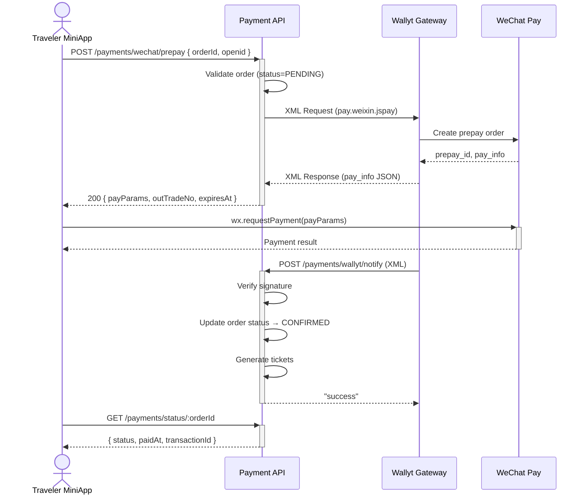

# Wallyt WeChat Mini-Program Payment

## Status & Telemetry
- Status: Done
- Readiness: mvp（小程序调起微信支付 - Wallyt 集成）
- Spec Paths: `/payments/wechat/prepay`, `/payments/wallyt/notify`, `/payments/status/:orderId`
- Migrations: 无（复用 order_payments 表）
- Last Update: 2025-12-06

## 0) Prerequisites
- 用户已通过微信授权登录（PRD-004 wechat-auth-login）
- 订单已创建且状态为 `PENDING`（miniprogram-order）
- Wallyt 商户账号已配置（环境变量）
- 回调 URL 已配置且可外网访问

## 1) API Sequence (Context)


## 2) Contract (OAS 3.0.3)

### POST /payments/wechat/prepay
创建预支付订单，返回小程序支付参数

```yaml
paths:
  /payments/wechat/prepay:
    post:
      tags: [Payments]
      summary: Create WeChat mini-program prepay order via Wallyt
      security:
        - bearerAuth: []
      requestBody:
        required: true
        content:
          application/json:
            schema:
              type: object
              required: [orderId, openid]
              properties:
                orderId:
                  type: integer
                  description: 订单 ID
                openid:
                  type: string
                  description: 用户在小程序的 OpenID
      responses:
        "200":
          description: 预支付成功
          content:
            application/json:
              schema:
                type: object
                properties:
                  success: { type: boolean }
                  data:
                    type: object
                    properties:
                      orderId: { type: integer }
                      outTradeNo: { type: string, description: 商户订单号 }
                      payParams:
                        type: object
                        description: 小程序 wx.requestPayment 参数
                        properties:
                          appId: { type: string }
                          timeStamp: { type: string }
                          nonceStr: { type: string }
                          package: { type: string }
                          signType: { type: string }
                          paySign: { type: string }
                      paymentId: { type: integer }
                      expiresAt: { type: string, format: date-time }
        "401":
          description: 未认证
        "404":
          description: 订单不存在
        "400":
          description: 订单状态不允许支付
        "503":
          description: 支付服务未配置
```

### POST /payments/wallyt/notify
Wallyt 支付回调（XML 格式）

```yaml
paths:
  /payments/wallyt/notify:
    post:
      tags: [Payments]
      summary: Wallyt payment notification callback
      description: |
        Wallyt 服务器回调，XML 格式请求体。
        必须在 5 秒内返回 "success" 字符串。
        回调重试间隔: 0/15/15/30/180/1800/1800/1800/1800/3600 秒
      requestBody:
        content:
          application/xml:
            schema:
              type: string
      responses:
        "200":
          description: 处理成功返回 "success"，失败返回 "fail"
          content:
            text/plain:
              schema:
                type: string
                enum: ["success", "fail"]
```

### GET /payments/status/:orderId
查询订单支付状态

```yaml
paths:
  /payments/status/{orderId}:
    get:
      tags: [Payments]
      summary: Query payment status
      security:
        - bearerAuth: []
      parameters:
        - name: orderId
          in: path
          required: true
          schema:
            type: integer
      responses:
        "200":
          description: 支付状态
          content:
            application/json:
              schema:
                type: object
                properties:
                  success: { type: boolean }
                  data:
                    type: object
                    properties:
                      status:
                        type: string
                        enum: [PENDING, CONFIRMED, CANCELLED, REFUNDED]
                      paidAt:
                        type: string
                        format: date-time
                      transactionId:
                        type: string
                        description: Wallyt 交易号
        "404":
          description: 订单不存在
```

### POST /payments/refund
申请退款

```yaml
paths:
  /payments/refund:
    post:
      tags: [Payments]
      summary: Apply for refund
      security:
        - bearerAuth: []
      requestBody:
        required: true
        content:
          application/json:
            schema:
              type: object
              required: [orderId]
              properties:
                orderId:
                  type: integer
                  description: 订单 ID
                refundAmount:
                  type: number
                  description: 退款金额 (元)，不传则全额退款
                reason:
                  type: string
                  description: 退款原因
      responses:
        "200":
          description: 退款成功
          content:
            application/json:
              schema:
                type: object
                properties:
                  success: { type: boolean }
                  data:
                    type: object
                    properties:
                      orderId: { type: integer }
                      outRefundNo: { type: string, description: 商户退款单号 }
                      refundId: { type: string, description: Wallyt 退款单号 }
                      refundAmount: { type: number }
                      status:
                        type: string
                        enum: [SUCCESS, PROCESSING, FAILED]
                      errorMessage: { type: string }
        "400":
          description: 订单状态不允许退款 / 退款金额超限
        "404":
          description: 订单不存在 / 支付记录不存在
        "500":
          description: 退款失败
```

## 3) Invariants
- 仅 `status=PENDING` 的订单允许创建预支付
- 商户订单号 `out_trade_no` 直接使用订单的 `order_no` 字段
- 支付回调必须验证签名（MD5/SHA256/RSA_1_256）
- 支付成功后原子性更新：订单状态、库存、支付记录、生成票券
- 幂等性：已支付订单重复回调直接返回成功
- 仅 `status=CONFIRMED` 的订单允许退款
- 退款金额不能超过已支付金额减去已退款金额
- 全额退款后订单状态变为 `CANCELLED`，相关票券状态变为 `CANCELLED`

## 4) Validations, Idempotency & Concurrency
- 校验 orderId 为数字且存在
- 校验 openid 不为空
- 订单加行锁防止并发支付
- 支付记录表记录 `out_trade_no` 实现幂等
- 回调处理使用数据库事务

## 5) Rules & Writes (TX)

### 预支付流程
1. 验证用户认证和订单归属
2. 检查订单状态为 PENDING
3. 查找/创建支付记录 (OrderPaymentEntity)
4. 使用订单的 `order_no` 作为商户订单号 `out_trade_no`
5. 调用 Wallyt `pay.weixin.jspay` API
6. 保存 `prepay_id` 到支付记录
7. 返回小程序支付参数

### 回调处理流程 (事务)
1. 解析 XML 请求体
2. 验证签名（MD5/SHA256/RSA_1_256）
3. 检查 status=0, result_code=0, pay_result=0
4. 通过 `out_trade_no` (即 `order_no`) 查找订单
5. 加锁查询订单
6. 幂等检查：已 CONFIRMED 直接返回成功
7. 验证金额一致
8. 更新支付记录状态为 SUCCESS
9. 更新库存 (reserved → sold)
10. 更新订单状态为 CONFIRMED
11. 生成票券 (TicketEntity)
12. 返回 "success"

## 6) Data Impact & Transactions
- `order_payments.prepay_id` - 存储 Wallyt token_id
- `order_payments.transaction_id` - 存储 Wallyt 交易号
- `order_payments.callback_raw` - 存储回调原始数据
- `orders.status` - PENDING → CONFIRMED
- `orders.paid_at` - 支付时间
- `product_inventory.channel_allocations.direct` - reserved--, sold++
- `tickets` - 生成新票券

## 7) Observability
- Metrics: `wallyt.prepay.created`, `wallyt.notify.success`, `wallyt.notify.failed`
- Logs:
  - `wallyt.jspay.request` - 预支付请求
  - `wallyt.jspay.response` - 预支付响应
  - `wallyt.notify.received` - 回调接收
  - `wallyt.notify.invalid_signature` - 签名验证失败
  - `wallyt.tickets.generated` - 票券生成
- Audit: `order_payments.callback_raw` 保留完整回调数据

## 8) Acceptance — Given / When / Then
- Given PENDING 订单，When 请求 prepay，Then 返回小程序支付参数
- Given 非 PENDING 订单，When 请求 prepay，Then 返回 400
- Given 有效回调，When 签名验证通过，Then 更新订单为 CONFIRMED 并生成票券
- Given 无效签名回调，When 处理回调，Then 返回 "fail"
- Given 已支付订单，When 重复回调，Then 返回 "success"（幂等）
- Given 支付成功，When 查询状态，Then 返回 CONFIRMED 和交易号

## 9) Postman Coverage
待创建测试集合：
- 预支付成功流程
- 订单状态不允许支付
- 回调签名验证
- 支付状态查询
- 幂等性测试

## 10) Implementation Files

```
src/modules/payments/
├── wallyt.types.ts           # 类型定义
├── wallyt-signature.util.ts  # 签名工具 (MD5/SHA256/RSA_1_256)
├── xml.util.ts               # XML 转换工具
├── wallyt.client.ts          # Wallyt API 客户端
├── wallyt-payment.service.ts # 支付业务服务
└── router.ts                 # 路由 (已更新)
```

## 11) Environment Variables

```bash
# WeChat Mini Program (用于登录和支付)
WECHAT_APPID=wx39a36fbaaefacd42
WECHAT_APP_SECRET=your_app_secret

# Wallyt/SwiftPass Payment
WALLYT_API_URL=https://gateway.wepayez.com/pay/gateway
WALLYT_MCH_ID=119540000342
WALLYT_SECRET_KEY=your_secret_key
WALLYT_SIGN_TYPE=MD5  # MD5 | SHA256
WALLYT_NOTIFY_URL=https://your-domain.com/payments/wallyt/notify
```

配置说明:
- `WECHAT_APPID` - 小程序 AppID，登录和支付共用
- `WALLYT_API_URL` - SwiftPass 网关地址
- `WALLYT_MCH_ID` - 商户号
- `WALLYT_SECRET_KEY` - API 密钥
- `WALLYT_NOTIFY_URL` - 支付回调地址（需要外网可访问）

## 12) Wallyt API Reference

| API | Service | 用途 |
|-----|---------|------|
| 小程序支付 | `pay.weixin.jspay` | 创建预支付订单 |
| 订单查询 | `unified.trade.query` | 主动查询支付状态 |
| 申请退款 | `unified.trade.refund` | 发起退款 |
| 关闭订单 | `unified.trade.close` | 关闭未支付订单 |

文档参考: https://openapi.wallyt.com/openapi?code=wallyt

## Deprecation Notice

此卡片替代原有的 `wechat-payment-session` 卡片（Mock 实现）。
原有 Mock 端点 `/payments/wechat/session` 和 `/payments/notify` 保留向后兼容，但新代码应使用 Wallyt 集成端点。
