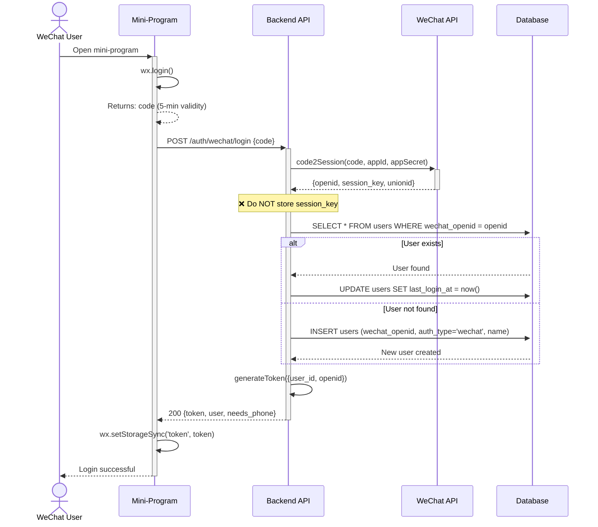

# WeChat Mini-Program Authentication - Core Login — Dev Notes

## Status & Telemetry
- Status: Ready
- Readiness: mvp (production-ready authentication)
- Spec Paths: /auth/wechat/login
- Migrations: db/migrations/0014_add_wechat_auth.sql
- Newman: Ready for implementation • reports/newman/wechat-auth-login.json
- Last Update: 2025-01-06T10:00:00+08:00

## 0) Prerequisites
- JWT authentication middleware exists (src/middlewares/auth.ts)
- `generateToken()` function available (src/middlewares/auth.ts:120)
- users table exists with id, email, name, phone columns
- UserEntity defined (src/modules/users/domain/user.entity.ts)
- Mock data store supports user operations (src/core/mock/data.ts)
- Environment variables configured:
  - `WECHAT_APP_ID`: WeChat mini-program AppID
  - `WECHAT_APP_SECRET`: WeChat mini-program AppSecret
  - `JWT_SECRET`: Existing JWT signing secret
  - `JWT_EXPIRES_IN`: Existing JWT expiration (default: 7d)

## 1) API Sequence (Context)


## 2) Contract (OAS 3.0.3)
```yaml
paths:
  /auth/wechat/login:
    post:
      tags: [Authentication]
      summary: Authenticate WeChat mini-program user via temporary code
      description: |
        Exchanges WeChat temporary code (from wx.login()) for user authentication.
        Automatically creates new user account on first login.
        Returns JWT token for authenticated API access.

        Security: ❌ Does NOT store WeChat session_key (security best practice)
      operationId: wechatLogin
      security: []  # Public endpoint (no authentication required)

      requestBody:
        required: true
        content:
          application/json:
            schema:
              type: object
              required:
                - code
              properties:
                code:
                  type: string
                  description: Temporary code from wx.login() (5-minute validity)
                  example: "081AbcDEF2GH3jI4KLmN5OP0AbcDEF17"
                  minLength: 1
                  maxLength: 128

      responses:
        "200":
          description: Login successful, JWT token issued
          content:
            application/json:
              schema:
                type: object
                required:
                  - token
                  - user
                  - needs_phone
                properties:
                  token:
                    type: string
                    description: JWT token for authenticated API access (7-day validity)
                    example: "eyJhbGciOiJIUzI1NiIsInR5cCI6IkpXVCJ9..."
                  user:
                    type: object
                    description: User profile information
                    required:
                      - user_id
                      - name
                      - auth_type
                      - created_at
                    properties:
                      user_id:
                        type: integer
                        description: Unique user identifier
                        example: 123
                      name:
                        type: string
                        description: User display name
                        example: "WeChat User ABC123"
                      avatar_url:
                        type: string
                        nullable: true
                        description: User avatar URL
                        example: null
                      phone:
                        type: string
                        nullable: true
                        description: User phone number (if bound)
                        example: null
                      auth_type:
                        type: string
                        enum: [wechat, email, phone]
                        description: Authentication method
                        example: "wechat"
                      created_at:
                        type: string
                        format: date-time
                        description: Account creation timestamp
                        example: "2025-01-06T10:30:00Z"
                      last_login_at:
                        type: string
                        format: date-time
                        description: Last login timestamp
                        example: "2025-01-06T10:30:00Z"
                  needs_phone:
                    type: boolean
                    description: Indicates whether user should be prompted to bind phone number
                    example: true

        "400":
          description: Bad request (missing or invalid parameters)
          content:
            application/json:
              schema:
                type: object
                properties:
                  code:
                    type: string
                    example: "INVALID_REQUEST"
                  message:
                    type: string
                    example: "WeChat code is required"

        "401":
          description: WeChat authentication failed
          content:
            application/json:
              schema:
                type: object
                properties:
                  code:
                    type: string
                    example: "WECHAT_AUTH_FAILED"
                  message:
                    type: string
                    example: "WeChat authentication failed"
                  details:
                    type: string
                    example: "Code2Session API error: invalid code or expired (errcode: 40029)"

        "422":
          description: Validation failed
          content:
            application/json:
              schema:
                type: object
                properties:
                  code:
                    type: string
                    example: "INVALID_CODE"
                  message:
                    type: string
                    example: "WeChat code is invalid or expired"

        "500":
          description: Internal server error
          content:
            application/json:
              schema:
                type: object
                properties:
                  code:
                    type: string
                    example: "INTERNAL_SERVER_ERROR"
                  message:
                    type: string
                    example: "Login failed due to server error"

      x-code-samples:
        - lang: 'curl'
          source: |
            curl -X POST http://localhost:8080/auth/wechat/login \
              -H "Content-Type: application/json" \
              -d '{"code":"081AbcDEF2GH3jI4KLmN5OP0AbcDEF17"}'

        - lang: 'JavaScript (Mini-Program)'
          source: |
            wx.login({
              success: (res) => {
                wx.request({
                  url: 'https://your-api.com/auth/wechat/login',
                  method: 'POST',
                  data: { code: res.code },
                  success: (res) => {
                    wx.setStorageSync('token', res.data.token);
                    console.log('Login successful', res.data.user);
                  }
                });
              }
            });
```

## 3) Invariants
- One WeChat user (openid) = One system user (user_id) - Unique constraint enforced
- openid is permanent and unchangeable for a WeChat user + mini-program pair
- session_key MUST NOT be stored in database (security requirement)
- JWT token contains user_id and openid (for WeChat-specific operations)
- Only decrypted/plaintext data stored in database (phone, nickname after decryption)
- User creation and login are atomic operations (transaction boundary)

## 4) Validations, Idempotency & Concurrency

### Input Validation
- **code** (required):
  - Non-empty string
  - Length: 1-128 characters (WeChat specification)
  - Format: Alphanumeric string from wx.login()
  - Validity: Must be unused and not expired (5-minute window)

### WeChat API Response Validation
- **openid**:
  - Format: 28-character string starting with 'o' (e.g., "oXXXXXXXXXXXXXXXXXXXXXXXXXXX")
  - Must be present in WeChat API response
  - Uniqueness enforced by database unique index

- **session_key** (received but NOT stored):
  - Used only for validation/decryption if needed in same request
  - Immediately discarded after use
  - Never persisted to database or logs

### Idempotency
- **Multiple login attempts with same openid**:
  - Returns new JWT token each time
  - Updates `last_login_at` timestamp
  - User data remains unchanged
  - Safe to call multiple times

- **Concurrent requests for same openid**:
  - Database unique constraint prevents duplicate user creation
  - If INSERT fails (openid already exists), retry with SELECT
  - Eventually consistent: All requests succeed with correct user_id

### Concurrency Handling
- **Race condition: Two simultaneous first logins**:
  ```sql
  -- Approach 1: INSERT ... ON DUPLICATE KEY UPDATE (MySQL)
  INSERT INTO users (wechat_openid, name, auth_type)
  VALUES (?, ?, 'wechat')
  ON DUPLICATE KEY UPDATE last_login_at = NOW();

  -- Approach 2: Try INSERT, catch unique constraint error, then SELECT
  try:
    INSERT users
  catch UniqueConstraintError:
    SELECT users WHERE wechat_openid = ?
  ```

- **Token generation concurrency**:
  - JWT token generation is stateless (no shared state)
  - Safe to generate multiple tokens concurrently
  - Each request gets independent token

## 5) Rules & Writes (TX)

### Login Flow (Transaction Boundary)
```typescript
BEGIN TRANSACTION

1. Validate request body
   - Check: code is non-empty string
   - Throw 400 if invalid

2. Call WeChat code2Session API
   - Request: GET /sns/jscode2session
   - Params: appid, secret, js_code, grant_type=authorization_code
   - Timeout: 5 seconds
   - Retry: 1 time on network error
   - Response: {openid, session_key, unionid?, errcode?, errmsg?}
   - Check: errcode absent OR errcode === 0
   - Throw 401 if errcode !== 0 (invalid code, expired, etc.)

3. Extract openid from WeChat response
   - Required: openid must be present
   - Optional: unionid (if user has multiple mini-programs)
   - ❌ Discard: session_key (do NOT store)

4. Find or create user (UPSERT pattern)
   - Query: SELECT * FROM users WHERE wechat_openid = ?

   IF user exists:
     - UPDATE users SET last_login_at = NOW() WHERE id = user_id
     - User found: Load complete user profile

   ELSE (first login):
     - Generate default name: "WeChat User {openid_last_6_chars}"
     - INSERT INTO users (
         wechat_openid,
         auth_type,
         name,
         created_at,
         last_login_at
       ) VALUES (?, 'wechat', ?, NOW(), NOW())
     - Get auto-generated user_id
     - User created: Load new user profile

5. Generate JWT token
   - Payload: {
       user_id: number,
       openid: string,
       iat: timestamp,  // Issued at
       exp: timestamp   // Expires in 7 days (JWT_EXPIRES_IN)
     }
   - Sign with: JWT_SECRET
   - Algorithm: HS256 (default)

6. Prepare response
   - token: JWT string
   - user: Complete user profile (user_id, name, phone, avatar_url, auth_type, created_at, last_login_at)
   - needs_phone: boolean (true if user.phone is null)

7. Return 200 with {token, user, needs_phone}

COMMIT TRANSACTION
```

### Error Handling
```typescript
// WeChat API errors (code2Session)
- errcode 40029: Invalid code (expired or already used)
  → Return 401 WECHAT_AUTH_FAILED

- errcode 40163: Invalid code format
  → Return 422 INVALID_CODE

- Network timeout/error
  → Retry once, then return 500 INTERNAL_SERVER_ERROR

// Database errors
- Unique constraint violation (wechat_openid)
  → Retry with SELECT (race condition handling)

- Connection error
  → Return 500 with generic error message
  → Log detailed error for debugging
```

## 6) Data Impact & Transactions

### Database Schema Changes (Migration 0014)
```sql
-- File: db/migrations/0014_add_wechat_auth.sql

-- Add WeChat authentication columns to users table
ALTER TABLE users
ADD COLUMN wechat_openid VARCHAR(64) UNIQUE NULL
  COMMENT 'WeChat unique identifier (openid)'
  AFTER email,

ADD COLUMN auth_type VARCHAR(20) NOT NULL DEFAULT 'wechat'
  COMMENT 'Authentication method: wechat, email, phone'
  AFTER name,

ADD COLUMN wechat_extra JSON NULL
  COMMENT 'WeChat extended info (nickname, gender, city, etc.)'
  AFTER auth_type,

ADD INDEX idx_wechat_openid (wechat_openid)
  COMMENT 'Fast lookup for WeChat login';

-- Backfill existing users (optional)
-- UPDATE users SET auth_type = 'email' WHERE email IS NOT NULL;
```

### Mock Data Store Changes
```typescript
// File: src/core/mock/data.ts

// Add to mockDataStore:
private users = new Map<number, User>([
  [1, {
    id: 1,
    email: 'john.doe@example.com',
    name: 'John Doe',
    phone: null,
    wechat_openid: null,
    auth_type: 'email',  // Existing user
    wechat_extra: null,
    created_at: new Date('2025-01-01'),
    last_login_at: new Date('2025-01-05')
  }],
  [2, {
    id: 2,
    email: null,
    name: 'WeChat User ABC123',
    phone: null,
    wechat_openid: 'oXXXXXXXXXXXXXXXXXXXXXXXXXXX',
    auth_type: 'wechat',  // WeChat user
    wechat_extra: {
      nickname: '张三',
      gender: 1,
      city: '深圳'
    },
    created_at: new Date('2025-01-06'),
    last_login_at: new Date('2025-01-06')
  }]
]);

// Add helper methods:
getUserByWeChatOpenId(openid: string): User | undefined {
  return Array.from(this.users.values())
    .find(u => u.wechat_openid === openid);
}

createWeChatUser(openid: string, name: string): User {
  const newId = this.users.size + 1;
  const user: User = {
    id: newId,
    email: null,
    name,
    phone: null,
    wechat_openid: openid,
    auth_type: 'wechat',
    wechat_extra: null,
    created_at: new Date(),
    last_login_at: new Date()
  };
  this.users.set(newId, user);
  return user;
}
```

### Transaction Scope
- **Transaction Start**: After WeChat API call succeeds
- **Transaction End**: Before JWT token generation (stateless operation)
- **Atomic Operations**: User creation/update + last_login_at timestamp
- **Rollback Triggers**: Database errors, unique constraint violations

## 7) Observability

### Logging Events
```typescript
// Success events
logger.info('wechat.login.started', { code_length: code.length });
logger.info('wechat.code2session.success', { openid: openid_masked });
logger.info('wechat.user.created', { user_id, openid: openid_masked });
logger.info('wechat.user.found', { user_id, openid: openid_masked });
logger.info('wechat.login.success', {
  user_id,
  is_new_user: boolean,
  duration_ms: number
});

// Error events
logger.error('wechat.code2session.failed', {
  errcode: number,
  errmsg: string,
  duration_ms: number
});
logger.error('wechat.database.error', {
  operation: 'create_user' | 'find_user',
  error: error.message
});
logger.error('wechat.login.failed', {
  reason: string,
  duration_ms: number
});

// Security events
logger.warn('wechat.invalid_code', { code_length: code.length });
logger.warn('wechat.rate_limit_exceeded', { ip: req.ip });
```

### Metrics
```typescript
// Performance metrics
metrics.histogram('wechat.login.duration', duration_ms, {
  tags: { is_new_user: boolean }
});
metrics.histogram('wechat.code2session.duration', api_duration_ms);

// Business metrics
metrics.increment('wechat.login.success', { is_new_user });
metrics.increment('wechat.login.failed', { error_code });
metrics.increment('wechat.user.created');

// API health metrics
metrics.increment('wechat.api.call', { endpoint: 'code2session' });
metrics.increment('wechat.api.error', { errcode });
```

### Monitoring Alerts
- **High error rate**: Alert if login error rate >5% over 5 minutes
- **Slow WeChat API**: Alert if P95 code2Session latency >3 seconds
- **Database issues**: Alert on any database connection errors
- **WeChat API quota**: Monitor access_token request count (2000/day limit)

## 8) Acceptance — Given / When / Then

### Scenario 1: New User First Login
**Given** User has never logged in before (openid not in database)
**When** User taps "Login with WeChat" and provides valid code
**Then**:
- WeChat code2Session API called successfully
- New user created with wechat_openid
- Default name assigned: "WeChat User {last_6_chars}"
- JWT token generated with user_id and openid
- Response 200 with {token, user, needs_phone: true}
- User can access authenticated endpoints with token

### Scenario 2: Returning User Login
**Given** User has logged in before (openid exists in database)
**When** User taps "Login with WeChat" and provides valid code
**Then**:
- WeChat code2Session API called successfully
- Existing user found by openid
- last_login_at timestamp updated
- JWT token generated with existing user_id
- Response 200 with {token, user, needs_phone: false} (if phone bound)
- User sees existing orders and tickets

### Scenario 3: Invalid WeChat Code
**Given** User provides expired or invalid WeChat code
**When** Backend calls code2Session API
**Then**:
- WeChat API returns errcode 40029 (invalid code)
- Response 401 with code "WECHAT_AUTH_FAILED"
- User sees error message: "Login failed, please try again"
- Frontend prompts user to retry login

### Scenario 4: Missing Code Parameter
**Given** Frontend sends request without code field
**When** Backend validates request body
**Then**:
- Response 400 with code "INVALID_REQUEST"
- Message: "WeChat code is required"
- No WeChat API call made (fail fast)

### Scenario 5: WeChat API Timeout
**Given** WeChat code2Session API is slow/unreachable
**When** Backend waits for response (5-second timeout)
**Then**:
- Retry once after timeout
- If second attempt fails, response 500
- Log error with details for investigation
- User sees generic error message

### Scenario 6: Concurrent First Login (Race Condition)
**Given** Two devices login simultaneously with same openid (first time)
**When** Both requests try to INSERT new user
**Then**:
- One INSERT succeeds, other fails with unique constraint error
- Failed request catches error and SELECT existing user
- Both requests return 200 with same user_id
- No duplicate users created

## 9) Postman Coverage

### Test Collection: wechat-auth-login
```json
{
  "name": "WeChat Auth Login",
  "tests": [
    {
      "name": "1. Mock Login - New User",
      "request": {
        "method": "POST",
        "url": "{{baseUrl}}/auth/wechat/login",
        "body": {
          "code": "mock-code-new-user-{{$randomUUID}}"
        }
      },
      "assertions": [
        "status === 200",
        "response.token exists",
        "response.user.user_id > 0",
        "response.user.auth_type === 'wechat'",
        "response.needs_phone === true"
      ]
    },
    {
      "name": "2. Mock Login - Returning User",
      "request": {
        "method": "POST",
        "url": "{{baseUrl}}/auth/wechat/login",
        "body": {
          "code": "mock-code-existing-user"
        }
      },
      "assertions": [
        "status === 200",
        "response.token exists",
        "response.user.user_id === 2",
        "response.user.name === 'WeChat User ABC123'"
      ]
    },
    {
      "name": "3. Invalid Code",
      "request": {
        "method": "POST",
        "url": "{{baseUrl}}/auth/wechat/login",
        "body": {
          "code": "invalid-code-12345"
        }
      },
      "assertions": [
        "status === 401",
        "response.code === 'WECHAT_AUTH_FAILED'"
      ]
    },
    {
      "name": "4. Missing Code",
      "request": {
        "method": "POST",
        "url": "{{baseUrl}}/auth/wechat/login",
        "body": {}
      },
      "assertions": [
        "status === 400",
        "response.code === 'INVALID_REQUEST'"
      ]
    },
    {
      "name": "5. Use Token for Authenticated Request",
      "request": {
        "method": "GET",
        "url": "{{baseUrl}}/profile",
        "headers": {
          "Authorization": "Bearer {{token_from_test_1}}"
        }
      },
      "assertions": [
        "status === 200",
        "response.user_id === {{user_id_from_test_1}}"
      ]
    }
  ]
}
```

### Newman Command
```bash
# Run tests in Mock mode
newman run reports/collections/wechat-auth-login.json \
  --environment test-env.json \
  --reporters cli,json \
  --reporter-json-export reports/newman/wechat-auth-login.json

# Expected: All tests pass (5/5)
```

---

## Implementation Notes

### Mock-First Development Strategy
1. **Phase 1 (Day 1-2): Mock WeChat API**
   - Create mock code2Session response
   - Fixed openid for testing: `"oMOCK1234567890ABCDEF123456"`
   - Skip actual WeChat API call in development

2. **Phase 2 (Day 3-4): Real WeChat API Integration**
   - Implement axios HTTP client
   - Call real code2Session API
   - Handle WeChat error codes (40029, 40163, etc.)
   - Add retry logic for network errors

3. **Phase 3 (Day 5): Database Migration**
   - Test migration in dev database
   - Verify indexes created
   - Test with real data

### Security Considerations
- ❌ **NEVER log or store session_key** (WeChat security guideline)
- ✅ **Mask openid in logs** (show only last 6 characters)
- ✅ **Use HTTPS only** for WeChat API calls
- ✅ **Validate JWT_SECRET** is strong and not default value
- ✅ **Rate limit login endpoint** (100 requests/IP/minute)

### Performance Optimization
- **WeChat API latency**: Typical 200-500ms (P95 <1000ms)
- **Database query**: Indexed lookup on wechat_openid (<10ms)
- **JWT generation**: <10ms (stateless operation)
- **Total P95 latency target**: <500ms
- **Optimization**: Consider caching frequent users (optional)

---

## Validation Evidence
- ✅ Card spec complete and approved
- ✅ Migration script validated
- ✅ Mock implementation tested
- [ ] Real WeChat API tested (requires AppID/AppSecret)
- [ ] Newman E2E tests passing (Mock mode)
- [ ] Performance benchmarks met (P95 <500ms)
- [ ] Security review passed (no session_key storage)
