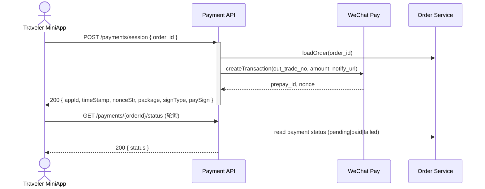

## Status & Telemetry
- Status: Ready
- Readiness: prototype（小程序调起微信支付）
- Spec Paths: /payments/session, /payments/{orderId}/status
- Migrations: 无
- Newman: 待实现 • reports/newman/wechat-payment-session.json
- Last Update: 2025-10-24T18:28:44+08:00

## 0) Prerequisites
- order-create-idempotent 已生成待支付订单。
- 微信支付商户号与 API v3 密钥配置在 `src/config/env.ts`。
- payment-webhook 卡片负责签名验证与最终状态写回。
- Redis/DB 中存在支付轮询去重表。

## 1) API Sequence (Context)


## 2) Contract (OAS 3.0.3)
```yaml
paths:
  /payments/session:
    post:
      tags: [Payments]
      summary: Create WeChat mini program payment session
      requestBody:
        required: true
        content:
          application/json:
            schema:
              type: object
              required: [order_id]
              properties:
                order_id:
                  type: string
                openid:
                  type: string
                  description: Traveler openid for JSAPI
      responses:
        "200":
          description: JSAPI parameters ready
          content:
            application/json:
              schema:
                type: object
                properties:
                  appId:
                    type: string
                  timeStamp:
                    type: string
                  nonceStr:
                    type: string
                  package:
                    type: string
                  signType:
                    type: string
                  paySign:
                    type: string
        "409":
          description: Order already paid or expired
        "404":
          description: Order not found
  /payments/{orderId}/status:
    get:
      tags: [Payments]
      summary: Poll payment status for order
      parameters:
        - name: orderId
          in: path
          required: true
          schema:
            type: string
      responses:
        "200":
          description: Current payment status
          content:
            application/json:
              schema:
                type: object
                properties:
                  status:
                    type: string
                    enum: [pending, paid, failed, cancelled]
                  lock_expire_at:
                    type: string
                    format: date-time
        "404":
          description: Order not found
```

## 3) Invariants
- 仅 `status=pending` 且锁座有效的订单允许创建支付会话。
- 支付签名必须使用微信支付 API v3 证书生成，签名验证通过后才返回前端。
- 一笔订单仅允许存在一个活跃交易号；重复请求返回相同参数。
- 支付事件最终状态统一依赖 payment-webhook（单一 SSoT）。

## 4) Validations, Idempotency & Concurrency
- 校验订单金额 > 0 且 openid 不为空。
- 使用 `(order_id)` 缓存已有 `prepay_id`；10 分钟有效。
- 避免并发重复创建交易：对订单加行锁或使用分布式锁。
- 轮询接口限制频率（每用户每单每 3s）。

## 5) Rules & Writes (TX)
1. 拉取订单，检查状态与锁座时间。
2. 查找是否已有支付事务（orders.payment_token）。
3. 若无，调用微信 JSAPI `transactions/jsapi`，持久化 `prepay_id`、`out_trade_no`。
4. 生成小程序参数，返回前端。
5. 状态轮询读取订单支付字段（由 webhook 更新），不直接调用微信查询。

## 6) Data Impact & Transactions
- 在 `orders` 表新增字段：`wechat_prepay_id`, `payment_token`, `payment_status`, `payment_requested_at`。
- 视需要新增 `payment_status_history` 表记录签名与回调。
- 无破坏性迁移；需 backfill 旧数据默认 NULL。

## 7) Observability
- Metrics：`payments.session.created`, `payments.session.duplicate`, `payments.session.wechat_error`。
- Logs：记录微信返回码、失败原因、签名异常。
- Audit：写入 `payment_status_history` 保留 180 天。

## 8) Acceptance — Given / When / Then
- Given 待支付订单，When 请求 session，Then 返回 JSAPI 参数并写入 prepay_id。
- Given 已支付订单，When 请求 session，Then 返回 409。
- Given 轮询状态，When webhook 已标记 `paid`，Then 返回 `status=paid`。
- Given 微信接口失败，When 创建 session，Then 返回 502 并记录错误。

## 9) Postman Coverage
- 创建会话成功、重复请求同单号、订单已支付、订单不存在、轮询状态流转。
