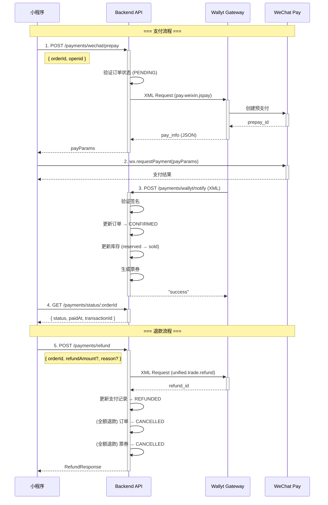

# Wallyt WeChat Mini-Program Payment Runbook

端到端验证微信小程序支付流程，从创建预支付到支付回调处理、退款的完整链路。

## 前置条件

- **Base URL**: `http://localhost:8080` (本地) 或生产环境
- 已配置 Wallyt 环境变量 (见下方)
- 用户已通过微信授权登录获取 JWT Token 和 OpenID
- 订单已创建且状态为 `PENDING`

### 环境变量配置

```bash
# .env
WECHAT_MINI_APPID=your_mini_program_appid
WECHAT_MINI_SECRET=your_mini_program_secret

# Wallyt UAT 环境
WALLYT_API_URL=https://payuat.wepayez.com/pay/gateway
WALLYT_MCH_ID=your_merchant_id
WALLYT_SECRET_KEY=your_secret_key
WALLYT_SIGN_TYPE=MD5
WALLYT_NOTIFY_URL=https://your-domain.com/payments/wallyt/notify
```

## API 序列图



## 流程步骤

### 0. 获取认证 Token

```bash
# 微信授权登录获取 Token
TOKEN=$(curl -s -X POST http://localhost:8080/auth/wechat/login \
  -H 'Content-Type: application/json' \
  -d '{"code": "wx_auth_code_from_miniprogram"}' | jq -r '.token')

# 获取用户 OpenID (从登录响应或用户信息中获取)
OPENID="user_openid_from_wechat"
```

### 1. 创建订单 (前置步骤)

```bash
# 假设已有订单，获取订单 ID
ORDER_ID=123
```

### 2. 创建预支付订单

```bash
curl -s -X POST http://localhost:8080/payments/wechat/prepay \
  -H "Authorization: Bearer $TOKEN" \
  -H 'Content-Type: application/json' \
  -d "{
    \"orderId\": $ORDER_ID,
    \"openid\": \"$OPENID\"
  }" | tee /tmp/prepay.json | jq '.'
```

**期望响应**:
```json
{
  "success": true,
  "data": {
    "orderId": 123,
    "outTradeNo": "MP123_1701849600000",
    "payParams": {
      "appId": "wx1234567890",
      "timeStamp": "1701849600",
      "nonceStr": "abc123def456",
      "package": "prepay_id=wx1234567890",
      "signType": "MD5",
      "paySign": "ABCDEF1234567890"
    },
    "paymentId": 1,
    "expiresAt": "2024-12-06T12:05:00.000Z"
  }
}
```

### 3. 小程序调起支付

```javascript
// 小程序端代码
const payParams = response.data.payParams;
wx.requestPayment({
  timeStamp: payParams.timeStamp,
  nonceStr: payParams.nonceStr,
  package: payParams.package,
  signType: payParams.signType,
  paySign: payParams.paySign,
  success: (res) => {
    console.log('支付成功', res);
    // 轮询查询支付状态
  },
  fail: (err) => {
    console.log('支付失败', err);
  }
});
```

### 4. 模拟支付回调 (测试用)

> 注意: 生产环境由 Wallyt 服务器调用，此步骤仅用于本地测试

```bash
# 模拟 Wallyt 回调 (XML 格式)
curl -s -X POST http://localhost:8080/payments/wallyt/notify \
  -H 'Content-Type: application/xml' \
  -d '<?xml version="1.0" encoding="UTF-8"?>
<xml>
  <version>2.0</version>
  <charset>UTF-8</charset>
  <sign_type>MD5</sign_type>
  <status>0</status>
  <result_code>0</result_code>
  <mch_id>your_mch_id</mch_id>
  <nonce_str>abc123</nonce_str>
  <sign>VALID_SIGNATURE</sign>
  <pay_result>0</pay_result>
  <out_trade_no>MP123_1701849600000</out_trade_no>
  <transaction_id>WX1234567890</transaction_id>
  <total_fee>10000</total_fee>
  <time_end>20241206120500</time_end>
  <attach>{"orderId":123,"userId":1}</attach>
</xml>'
```

**期望响应**: `success`

### 5. 查询支付状态

```bash
curl -s http://localhost:8080/payments/status/$ORDER_ID \
  -H "Authorization: Bearer $TOKEN" | jq '.'
```

**期望响应**:
```json
{
  "success": true,
  "data": {
    "status": "CONFIRMED",
    "paidAt": "2024-12-06T12:05:00.000Z",
    "transactionId": "WX1234567890"
  }
}
```

### 6. 申请退款 (全额)

```bash
curl -s -X POST http://localhost:8080/payments/refund \
  -H "Authorization: Bearer $TOKEN" \
  -H 'Content-Type: application/json' \
  -d "{
    \"orderId\": $ORDER_ID,
    \"reason\": \"用户申请退款\"
  }" | jq '.'
```

**期望响应**:
```json
{
  "success": true,
  "data": {
    "orderId": 123,
    "outRefundNo": "RF123_1701849700000",
    "refundId": "WALLYT_REFUND_123",
    "refundAmount": 100.00,
    "status": "SUCCESS"
  }
}
```

### 7. 申请退款 (部分)

```bash
curl -s -X POST http://localhost:8080/payments/refund \
  -H "Authorization: Bearer $TOKEN" \
  -H 'Content-Type: application/json' \
  -d "{
    \"orderId\": $ORDER_ID,
    \"refundAmount\": 50.00,
    \"reason\": \"部分退款\"
  }" | jq '.'
```

## 验证清单

### 支付流程
- [ ] 预支付创建成功，返回 payParams
- [ ] payParams 包含所有必要字段 (appId, timeStamp, nonceStr, package, signType, paySign)
- [ ] 支付回调签名验证通过
- [ ] 订单状态更新为 CONFIRMED
- [ ] 库存从 reserved 转为 sold
- [ ] 票券自动生成

### 退款流程
- [ ] 只有 CONFIRMED 状态的订单可退款
- [ ] 退款金额不超过可退金额
- [ ] 退款成功后支付记录状态更新为 REFUNDED
- [ ] 全额退款后订单状态更新为 CANCELLED
- [ ] 全额退款后票券状态更新为 CANCELLED

### 错误场景
- [ ] 未认证请求返回 401
- [ ] 订单不存在返回 404
- [ ] 订单状态不允许支付返回 400
- [ ] 退款金额超限返回 400
- [ ] Wallyt 未配置返回 503

## 相关资产

| 资产 | 路径 |
|------|------|
| Card 文档 | `docs/cards/wallyt-payment.md` |
| 类型定义 | `src/modules/payments/wallyt.types.ts` |
| API 客户端 | `src/modules/payments/wallyt.client.ts` |
| 支付服务 | `src/modules/payments/wallyt-payment.service.ts` |
| 路由 | `src/modules/payments/router.ts` |
| OpenAPI | `openapi/openapi.json` |

## Wallyt API 参考

| 服务 | Service Code | 用途 |
|------|--------------|------|
| 小程序支付 | `pay.weixin.jspay` | 创建预支付订单 |
| 订单查询 | `unified.trade.query` | 主动查询支付状态 |
| 申请退款 | `unified.trade.refund` | 发起退款 |
| 关闭订单 | `unified.trade.close` | 关闭未支付订单 |

官方文档: https://openapi.wallyt.com/openapi?code=wallyt

## 故障排查

### 预支付失败
1. 检查 Wallyt 环境变量是否配置正确
2. 检查 `WALLYT_MCH_ID` 和 `WALLYT_SECRET_KEY`
3. 检查订单状态是否为 PENDING
4. 查看日志 `wallyt.jspay.error`

### 回调处理失败
1. 检查签名验证 (`wallyt.notify.invalid_signature`)
2. 检查订单 ID 解析 (`wallyt.notify.missing_order_id`)
3. 确认回调 URL 可外网访问
4. 查看日志 `wallyt.notify.*`

### 退款失败
1. 检查订单状态是否为 CONFIRMED
2. 检查退款金额是否超限
3. 检查原支付的 `out_trade_no` 是否存在
4. 查看日志 `wallyt.refund.*`
