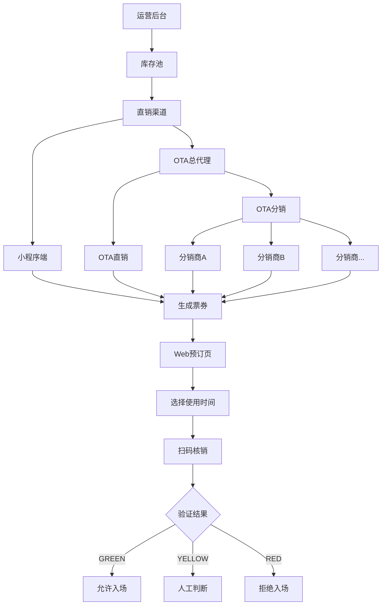
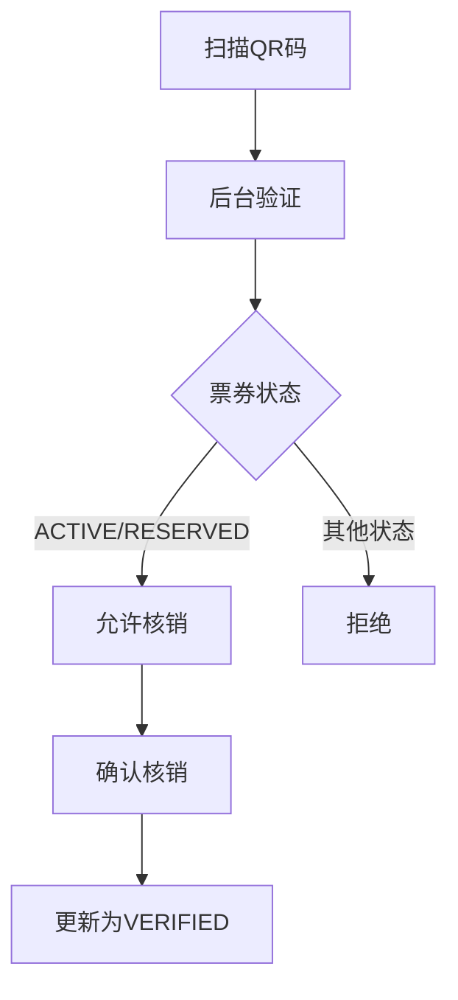
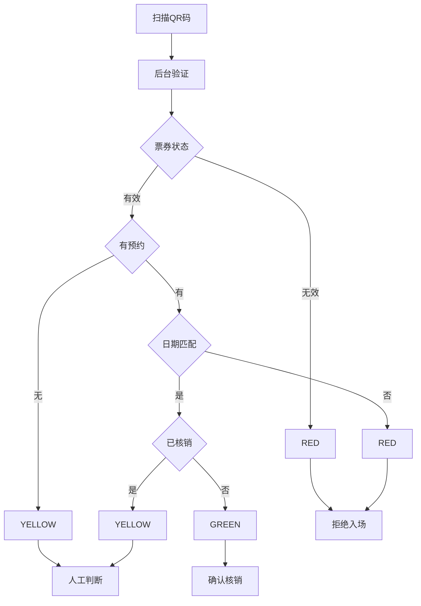
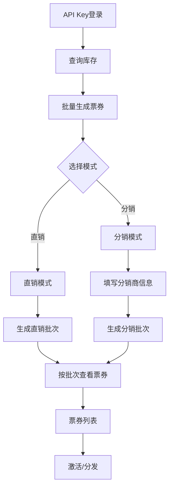
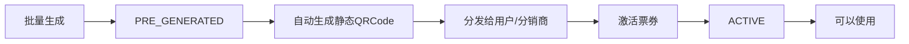
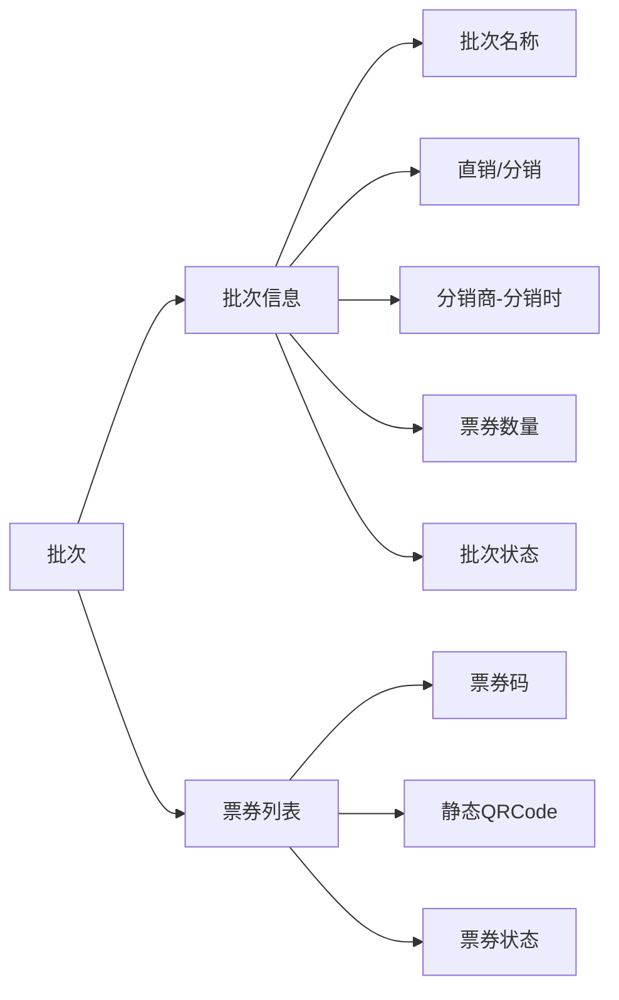
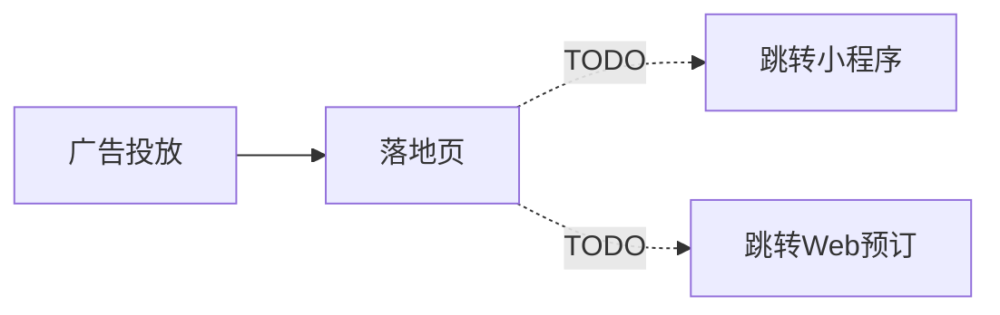
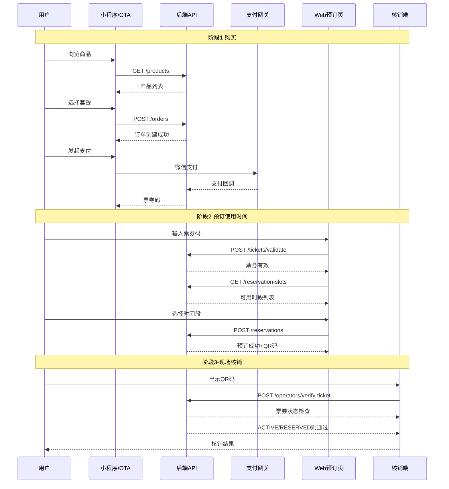
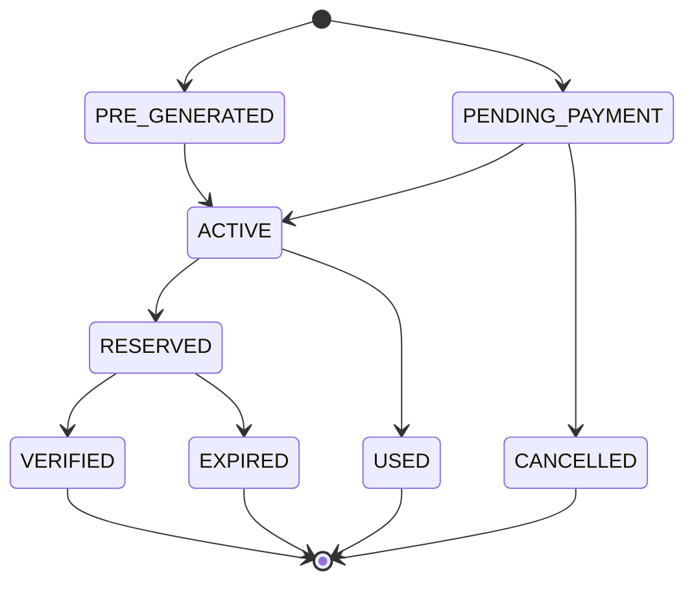
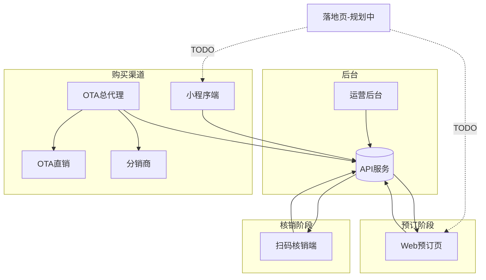

# 产品架构流程图

本文档描述 DeepTravel 票务系统的多端产品架构和业务流程。

---

## 1. 系统架构总览



**渠道与流程说明**：

| 阶段 | 渠道/页面 | 说明 |
|------|----------|------|
| 购买 | 小程序端 | 自有渠道直接销售给C端用户 |
| 购买 | OTA总代理 | OTA平台作为总代理 |
| 购买 | OTA直销 | OTA平台自己销售给C端用户 |
| 购买 | OTA分销 | OTA下级分销商代售 |
| 预订 | Web预订页 | 购票后选择具体使用时间 |
| 核销 | 扫码核销端 | 现场验票入场 |

---

## 2. 各端功能定义

### 2.1 小程序端


| 功能模块 | PRD | 状态 |
|---------|-----|------|
| 套餐商品购买 | PRD-008 | 已实现 |
| 航线班次预订 | PRD-008 | Phase 2 |
| 统一搜索入口 | PRD-008 | Phase 3 |
| 微信一键登录 | PRD-004 | 已实现 |
| 我的票券 | PRD-008 | 已实现 |
| 手机号绑定 | PRD-004 | 已实现 |

---

### 2.2 扫码核销端

#### 当前实现



**当前逻辑**: 只检查票券状态，不验证预约时间

| 票券状态 | 核销结果 |
|---------|---------|
| ACTIVE | 允许核销 |
| RESERVED | 允许核销 |
| 其他 | 拒绝 |

---

#### 规划中: 颜色编码验证 (TODO)



**规划中的颜色编码规则**:

| 颜色 | 含义 | 场景 | 操作 |
|------|------|------|------|
| GREEN | 有效 | 预约日期等于今天且未核销 | 允许入场 |
| YELLOW | 警告 | 无预约或已核销过 | 人工判断 |
| RED | 无效 | 日期不符或票券无效或过期 | 拒绝入场 |

> **注意**: 颜色编码验证逻辑已在 `src/modules/operatorValidation/service.enhanced.ts` 中实现，但尚未在生产环境启用。

---

### 2.3 OTA管理后台（总代理）

OTA作为总代理，通过API Key认证后批量生成票券：



**批量生成票券时的模式选择**：

| 模式 | 必填信息 | 票券归属 | 适用场景 |
|------|---------|---------|---------|
| 直销 | 批次名称、数量 | OTA自营 | OTA直接销售给C端 |
| 分销 | 批次名称、数量、分销商信息 | 指定分销商 | 分销商代售 |

**票券生成与激活流程**：



| 阶段 | 票券状态 | QRCode | 能否使用 |
|------|---------|--------|---------|
| 生成后 | PRE_GENERATED | 已生成（静态） | 不能 |
| 激活后 | ACTIVE | 同一个QRCode | 可以 |

> **说明**: 批量生成时自动创建静态QRCode，但票券需要激活后才能在核销端使用

**批次管理**：



| 功能模块 | PRD | 状态 |
|---------|-----|------|
| API Key认证 | PRD-002 | 已实现 |
| 库存查询 | PRD-002 | 已实现 |
| 批量生成票券 | PRD-002 | 已实现 |
| 直销/分销模式 | PRD-002 | 已实现 |
| 批次管理 | PRD-002 | 已实现 |
| 分销商计费分析 | PRD-005 | 部分实现 |

---

### 2.4 Web预订页（预订使用时间）

用户通过小程序或OTA购票后，访问Web预订页选择具体使用时间：


| 功能模块 | PRD | 状态 |
|---------|-----|------|
| 票券验证 | PRD-007 | 已实现 |
| 时段查询 | PRD-007 | 已实现 |
| 预订时间 | PRD-007 | 已实现 |
| QR码展示 | PRD-007 | 已实现 |

---

### 2.5 落地页 (规划中)

> **状态**: 暂未实现



| 功能 | 状态 |
|------|------|
| 落地页展示 | 规划中 |
| 跳转小程序 | 规划中 |
| 跳转Web预订页 | 规划中 |

---

## 3. 完整业务流程



---

## 4. 票券状态流转



| 状态 | 说明 |
|------|------|
| PRE_GENERATED | OTA批量生成 |
| PENDING_PAYMENT | 用户下单待支付 |
| ACTIVE | 已激活可用 |
| RESERVED | 已预约日期 |
| VERIFIED | 已核销 |
| USED | 已使用 |
| EXPIRED | 已过期 |
| CANCELLED | 已取消 |

---

## 5. 各端关系图



**完整用户旅程**：

```
购买 → 出票 → 预订时间 → 现场核销
```

---

## 6. API端点汇总

### 小程序端

| 端点 | 方法 | 描述 |
|------|------|------|
| /miniprogram/products | GET | 产品列表 |
| /miniprogram/products/:id | GET | 产品详情 |
| /miniprogram/orders | POST | 创建订单 |
| /miniprogram/orders | GET | 订单列表 |
| /auth/wechat/login | POST | 微信登录 |
| /auth/wechat/phone | POST | 手机号绑定 |

### 扫码核销端

| 端点 | 方法 | 描述 |
|------|------|------|
| /operators/login | POST | 操作员登录 |
| /operators/validate-ticket | POST | 验证票券 |
| /operators/verify-ticket | POST | 确认核销 |

### OTA管理后台

| 端点 | 方法 | 描述 |
|------|------|------|
| /api/ota/inventory | GET | 查询库存 |
| /api/ota/reserve | POST | 创建预约 |
| /api/ota/reservations/:id/activate | POST | 激活预约 |
| /api/ota/tickets/bulk-generate | POST | 批量生成票 |
| /api/ota/tickets | GET | 票券列表 |

### Web预订页（预订使用时间）

| 端点 | 方法 | 描述 |
|------|------|------|
| /api/tickets/validate | POST | 验证票券 |
| /api/reservation-slots/available | GET | 查询可用时段 |
| /api/reservations | POST | 创建预订 |
| /api/reservations/:id | GET | 查看预订详情 |
| /qr/:code | GET | 获取入场QR码 |

---

## 7. 技术实现参考

| 功能 | 文件路径 |
|------|----------|
| 颜色编码验证 | src/modules/operatorValidation/service.enhanced.ts |
| 票券状态管理 | src/modules/ticket-reservation/service.ts |
| OTA接口 | src/modules/ota/router.ts |
| 小程序接口 | src/modules/miniprogram/router.ts |

---

## 更新记录

| 日期 | 版本 | 描述 |
|------|------|------|
| 2025-12-12 | v1.0 | 初始版本 |
